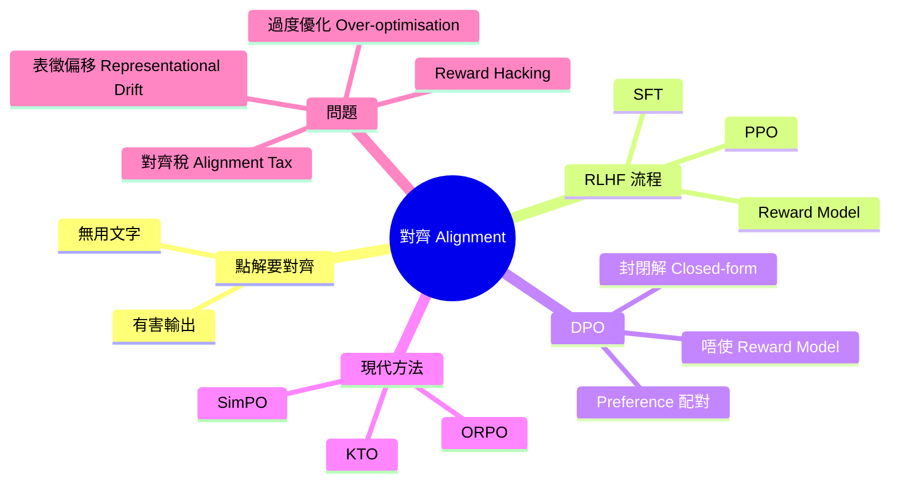
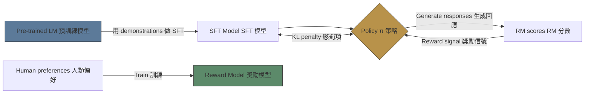
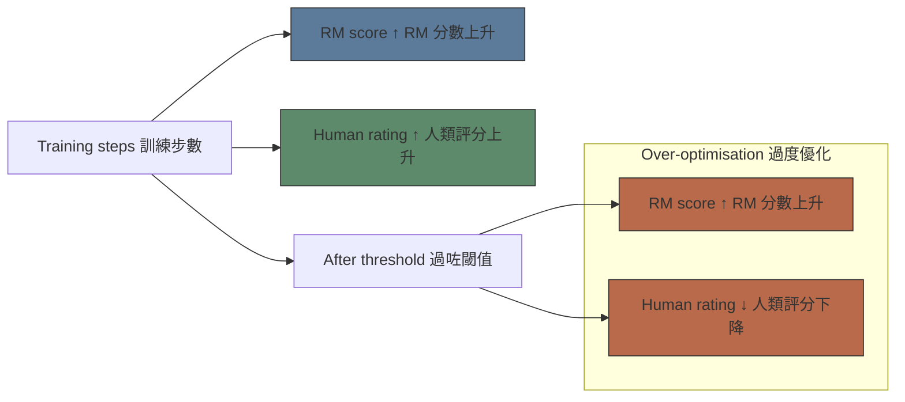

# Module 14: Alignment、RLHF 同 DPO

Est. study time: 2.5h
Language: yue



## 學習目標
- 解釋點解 pre-training 之後仲需要 alignment
- 描述 RLHF 流程：SFT → RM → PPO
- 由 RLHF objective 推導出 DPO
- 比較 alignment 方法：RLHF vs DPO vs KTO
- 辨識 failure modes：reward hacking、alignment tax

---

## 1. Alignment 問題

Pre-trained LLM：predict 下一個 token 喺 internet text 上面。包含 toxic、有害、無用嘅文字。

> **真實例子**：「我點樣整炸彈？」— pre-trained LM 可能會畀詳細 instructions（因為訓練數據入面出現過）。Alignment 係需要用嚟拒絕有害請求，同時保持 helpful。

**三個 alignment 目標**：
- Helpful：幫用戶完成任務
- Harmless：拒絕危險請求
- Honest：避免虛假陳述

> **填充題**：「Alignment 將一個 \{helpful 但不受約束\} 嘅 pre-trained model 轉變成一個 \{helpful、harmless 同 honest\} 嘅模型。」

---

## 2. RLHF 流程

三個階段：

### 階段 1：Supervised Fine-Tuning (SFT)

用高質素 demonstrations（人類寫嘅理想回應）做 fine-tune。確立想要嘅輸出格式。

```text
θ_SFT = argmin E_(x,y~D_demo)[-log P_θ(y|x)]
```

簡單但有限制：人類 demonstrations 好少（~10K 例子）。模型唔會學識避開差嘅輸出 — 只係重複好嘅回應。

### 階段 2：Reward Model (RM)

訓練獨立模型嚟預測人類偏好：

1. 對同一個 prompt 生成多個 responses
2. 人類標注員排序佢哋
3. RM 學：r(x, y_i) > r(x, y_j) 當 y_i 被 prefer 過 y_j

Loss：Bradley-Terry model（pairwise preference）：

```text
L_RM = -E[log(σ(r(x, y_w) - r(x, y_l)))]
```

當中 y_w = 被偏好回應，y_l = 唔被偏好。

> **預測**：如果 RM 用 100K 比較嚟訓練，當佢見到同訓練分佈好唔同嘅 responses 會點？*答案：RM 泛化得好差。佢對 OOD responses 嘅分數 unpredictable → 引致 PPO 裏面嘅 reward hacking。*

### 階段 3：PPO 微調

優化 policy π_θ 對住 RM reward，加上 KL penalty 對住 π_SFT：

```text
max_π E[r(x, y)] - β·KL(π(y|x) || π_SFT(y|x))
```

KL penalty 防止 policy 利用 RM（搵到高分但無意義嘅 responses）。



---

## 3. Direct Preference Optimisation (DPO)

DPO（Rafailov 2023）：唔使訓練 RM。直接由 preference pairs 推導 policy update。

關鍵 insight：RLHF 之下嘅 optimal policy 有封閉解 closed form：

```text
π_star(y|x) ∝ π_SFT(y|x) · exp(r(x, y)/β)
```

重組 → 用 policy 表達 reward：

```text
r(x, y) = β · log(π(y|x) / π_SFT(y|x)) + β · log(Z(x))
```

代入 Bradley-Terry loss → DPO loss：

```text
L_DPO = -E[log σ(β · log(π(y_w|x)/π_SFT(y_w|x)) - β · log(π(y_l|x)/π_SFT(y_l|x)))]
```

> **填充題**：「DPO 透過用 \{policy ratio π/π_SFT\} 嚟表達 reward function，從而 eliminate 咗 \{reward model\}。訓練淨係用 \{preference pairs\}，唔使用 scalar rewards。」

**優點**：
- 唔使獨立 RM — 少啲 params，訓練更簡單
- 唔使 PPO — 穩定嘅 single-stage optimisation
- Preference pairs 自然容易收集

**缺點**：
- 冇 iterative improvement 嚟自 reward（一次過用固定 dataset）
- 訓練期間冇 online exploration

---

## 4. 現代變體

| 方法 | 關鍵概念 | Feedback 類型 | 額外模型？ |
|--------|----------|---------------|-------------|
| **RLHF (PPO)** | RM + policy gradient | Pairwise | 要 — RM |
| **DPO** | 從 pairs 嘅封閉解 | Pairwise | 唔使 |
| **KTO** | Kahneman-Tversky：用 binary（好/差）唔用 pairs | Binary（like/dislike） | 唔使 |
| **ORPO** | Odds Ratio：喺 SFT 期間懲罰唔好嘅生成 | Pairwise | 唔使（單階段） |
| **SimPO** | Simple：用平均 log-prob 做 implicit reward | Pairwise | 唔使 |

**KTO**（Ethayarajh 2024）：靈感嚟自 prospect theory。唔用 pairwise comparisons，改用個別 feedback：「呢個回應好 / 差」。Loss：

```text
L_KTO = -E[w(x,y) · (λ - δ(x,y) · β · log(π(y|x)/π_ref(y|x)))]
```

更實際 — thumbs up/down 比 ranked pairs 更容易收集。

> **思考**：點解 binary feedback（KTO）嘅泛化會同 pairwise（DPO）唔同？*答案：Binary feedback 捕捉絕對質素（「呢個好唔好？」）。Pairwise 捕捉相對質素（「呢個好過嗰個？」）。對於分明嘅 pairs 佢哋一致，但近邊界嘅 cases 會有分別 — binary 可能兩個都接受，pairwise 強制排序。*

---

## 5. Failure Modes 失敗模式

| 問題 | 描述 | 緩解方法 |
|---------|-------------|------------|
| **Reward hacking** | Policy 利用 RM 漏洞，生成高分但無意義嘅內容 | KL penalty、RM ensemble |
| **Over-optimisation** | 過咗某個點，RM score↑ 但人類評分↓ | Early stopping、held-out RM |
| **Alignment tax** | Alignment 降低咗唔相關任務嘅能力 | 細 β、繼續 pre-training mix |
| **Representational drift** | 過度 alignment 消除咗細緻嘅 representations | Activation steering、representation math |
| **Mode collapse** | Policy 產出一致但安全嘅 responses | Entropy bonus、多樣化 preference data |

**Reward over-optimisation**：Gao（2023）顯示 KL penalty 推遲但唔會防止 degradation。RM score 對真實質素嘅圖表呈 U 形 — 過咗最佳點之後，質素下降但 RM score 繼續上升。



> **搵錯處**：「DPO 永遠好過 RLHF，因为佢唔需要 reward model 或者 PPO。」*錯喺邊？DPO 更簡單但欠缺 online exploration。如果訓練期間唔生成新 responses，DPO 冇辦法從當前 policy distribution 收集 preference data。RLHF 嘅 PPO 階段探索 response space，有可能發現更高 reward 嘅區域。單階段唔等於永遠更好。*

---

## 6. Alignment 同 Safety 嘅分別

Alignment ≠ safety。Alignment 令模型跟從意圖。Safety 係防止傷害。

- 模型可以 alignment 得好但 unsafe（用戶想要危險嘢 → aligned model 拒絕 → 好）
- 模型可以 safe 但 misaligned（模型乜都拒絕 — harmless 但無用）

---

## Feynman 解釋

向非 ML 工程師解釋 alignment：

1. Pre-trained model 係互聯網文字生成器 — 包含 Wikipedia 同 4chan
2. SFT 畀佢睇理想回應（好似示範畀學徒睇大師嘅作品）
3. RLHF 加個 critic（RM）加 reinforcement（PPO）
4. DPO 跳過 critic — 直接用「呢個好過嗰個」
5. 現代方法（KTO）用 thumbs up/down 代替 ranked pairs

寫完之後檢查：我識唔識解釋點解 RLHF 唔穩定？我識唔識比較 DPO vs KTO？我識唔識描述 reward hacking？

> **Predict**: Commit to an answer: does alignment、rlhf 同 dpo get simpler or harder once supervised fine enters the picture?
>
> *Answer: Harder locally, simpler globally: individual pieces carry more rules, but the overall system needs fewer special cases.*
> **Think**: Could you implement alignment、rlhf 同 dpo without **Supervised Fine**? What would the cost be?
>
> *Answer: Yes, but you'd hand-roll what **Supervised Fine** already handles — more code, more edge cases, fewer guarantees.*
> **Spot the Mistake**: Code review note: someone applies tuning everywhere "to be safe" in a alignment、rlhf 同 dpo codebase. Spot the mistake.
>
> *Answer: Blanket application hides which spots actually need tuning. Apply it where the semantics demand it, and document why.*

