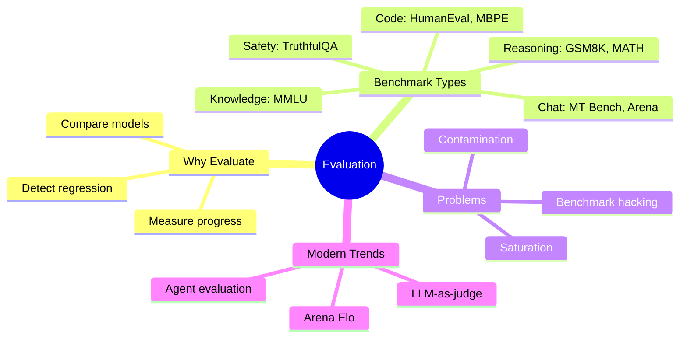
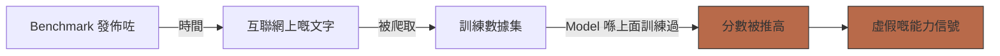
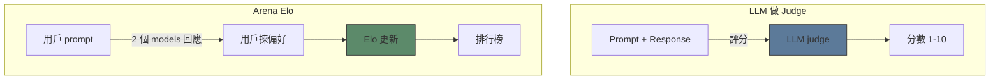

# Module 15: Evaluation & Benchmarks

Est. study time: 1.5h
Language: yue



## 學習目標

- 分辨 benchmark 類型同佢哋嘅設計目的
- 解釋 contamination：檢測方法、對 validity 嘅影響
- 分析 saturation 同 benchmark lifecycle
- 比較 LLM-as-judge 同人類 evaluation

---

## 1. 點解要 Evaluate？

Benchmarks 有三個用途：
- **進度測量**：「呢個 model 係咪好過 GPT-4？」
- **回歸檢測**：「呢次訓練改動會唔會傷害 reasoning？」
- **能力配圖**：「呢個 model 做到啲乜？」

> **Cloze**：「如果無標準化 benchmarks，model 嘅聲稱就係 \{anecdotal\} 同 \{unreliable\} 嘅。」

每個 benchmark 都要取捨：coverage vs cost、difficulty vs realism、reproducibility vs novelty。

---

## 2. 主要 Benchmark 類別

| 類別 | Benchmark | 量度啲乜 | 格式 |
|----------|-----------|-----------------|--------|
| Knowledge | MMLU, MMLU-Pro | 橫跨 57 科嘅世界知識 | 4 選 1 MCQ |
| Reasoning | GSM8K, MATH | 數學文字題 | Free-form 答案 |
| Code | HumanEval, MBPP | 從 docstring 寫 function | Python 函數 |
| Chat | MT-Bench, AlpacaEval | 多輪指令跟隨 | LLM-as-judge |
| Safety | TruthfulQA, BBQ | 事實準確度、偏見 | MCQ |
| General | BIG-Bench, HELM | 200+ 多樣任務 | 混合 |

### MMLU 深入解構

Massive Multitask Language Understanding (Hendrycks 2021)：
- 57 科（STEM、人文、社會科學）
- ~14K 條問題，4 選 1 格式
- 每科達到專家級覆蓋
- Random baseline：25%。人類專家：~90%

**問題**：Saturation。好多 model 而家已超過 85% on MMLU。MMLU-Pro 加咗更難嘅 distractors 同更多選項（10）。

> **Think**：如果兩個 models 都拎 88% on MMLU，佢哋係咪同樣有能力？*答案：唔一定。佢哋可能擅長唔同科目。每科 breakdown（MMLU-Redux）可以 reveal 返 subject-level 嘅強弱。總分會隱藏咗個分佈。*

---

## 3. Contamination

**Contamination** = benchmark 數據漏咗入訓練集 → 分數被推高。



檢測方法：
- **n-gram overlap**：數 benchmark 同訓練數據之間 verbatim 8-13 gram 匹配
- **Perplexity check**：如果 benchmark perplexity 低到可疑，好大可能 contamination
- **Temporal separation**：用 cutoff 日期前嘅數據訓練，評估 cutoff 後嘅問題

**影響**：GPT-3 MMLU 43% → GPT-4 86%。幾多係真正進步 vs  contamination？GPT-4 嘅訓練數據包含咗流出嘅 benchmark sets。

> **Cloze**：「Contamination 檢測用 \{n-gram overlap\}、\{perplexity checks\} 同 \{temporal separation\}。」

**緩解方法**：Dynamic benchmarks（每次出新問題）、private held-out sets、CANARY string watermarking。

---

## 4. Saturation 同 Benchmark Lifecycle

Benchmarks 跟住一個 lifecycle：

```text
發佈 → 人類 baseline → Model 進步 → Saturation → 被取代
```

**Saturation**：當 models 全部擠喺天花板附近。Benchmark 再無分辨能力。

| Benchmark | 天花板 | 最好嘅 model | 狀態 |
|-----------|---------|------------|--------|
| MMLU | ~90%（專家） | ~88%（GPT-4, Claude 3） | 接近飽和 |
| GSM8K | ~98%（數學老師） | ~95% | 接近飽和 |
| HumanEval | 100% | ~92% | 未飽和 |
| MATH | 100% | ~76% | 活躍中 |

> **Predict**：當一個 benchmark 飽和咗會點？*答案：Models 分數高到分唔到高低。Benchmark 再無 signal。研究人員一係整更難嘅版本（MMLU-Pro），一係放棄轉去新 benchmark。*

---

## 5. Calibration

Calibration = model 信心同實際準確度之間嘅 alignment。

**校準良好**：當 model 話 80% 信心，確實大約 80% 時間係啱嘅。

LLMs 傾向過度自信。GPT-4 表達出嚟嘅 confidence 比實際準確度高 ~10-15%。

```text
校準良好：  ECE (Expected Calibration Error) ≈ 0
過度自信：   Confidence > Accuracy
自信不足：   Confidence < Accuracy
```

**ECE** = Σ |accuracy(bin) - confidence(bin)| / N_bins

> **Cloze**：「Calibration 量度 \{model confidence\} 同 \{actual accuracy\} 之間嘅 alignment。LLMs 傾向 \{overconfident\}。」

---

## 6. LLM-as-Judge Evaluation

傳統 evaluation 對開放式生成搞唔掂。解決方法：

**LLM-as-Judge**（MT-Bench, AlpacaEval）：用強 LLM（GPT-4, Claude）嚟評分。
- Pairwise 比較：「邊個 response 好啲？」
- 單一評分：「俾 1-10 分 on helpfulness」

**Arena Elo**（LMSYS）：匿名人類喺兩個 models 之間揀偏好。Elo rating 嚟自 pairwise battles。
- 每個 model 有 100K+ 人類投票
- 真用戶 prompts，唔係人工造出嚟
- Gold standard 但昂貴同慢



| 方法 | 成本 | 速度 | 偏差 | 可靠度 |
|--------|------|-------|------|-------------|
| 人類 | 高 | 慢 | - | Gold standard |
| LLM-as-judge | 低 | 快 | 位置、冗長度、自我偏好 | 中等 |
| Arena Elo | 中 | 中 | 用戶人口分佈 | 高 |

---

## 7. Benchmark 限制

1. **Benchmark hacking**：Models 專登 fine-tune 喺 benchmark 格式上 → 分數被推高但無真正能力增長
2. **焦點狹窄**：MMLU 高份唔等於好 chatbot。唔同技能。
3. **靜態數據集**：有 contamination、saturation 風險
4. **多輪盲點**：大部份 benchmarks 只評估單輪。真實使用係多輪。
5. **Safety evaluation 係 adversarial**：Red-teaming 搵漏洞快過 benchmarks 改進

> **Error-spotting**：「有個模型拎 90% on MMLU，所以佢同人類專家一樣有能力。」*錯喺邊？1) MMLU 係 multiple-choice — 比開放式容易。2) 每科 breakdown 可能顯示知識唔平均。3) MMLU 只量度知識回憶，唔係 reasoning、creativity 或者 safety。4) 有可能 contamination。Benchmarks 量度特定能力，唔係 general intelligence。*

---

## Feynman 解釋

同 product manager 解釋 LLM evaluation：

1. 點解要 benchmarks：客觀比較 models
2. MMLU 量度啲乜：知識闊度（57 科）
3. Contamination 問題：如果 benchmark 數據喺訓練期間見過，分數會被推高
4. 現代挑戰：saturation、benchmark hacking、LLM-as-judge bias
5. Arena Elo：俾人類喺真實對話入面投票

寫完之後檢查：我可唔可以解釋 contamination detection？我可唔可以描述 saturation lifecycle？我可唔可以比較 LLM-as-judge 同 Arena Elo？

> **Spot the Mistake**: Code review note: someone applies mmlu everywhere "to be safe" in a evaluation & benchmarks codebase. Spot the mistake.
>
> *Answer: Blanket application hides which spots actually need mmlu. Apply it where the semantics demand it, and document why.*


