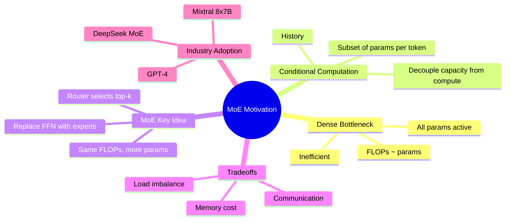
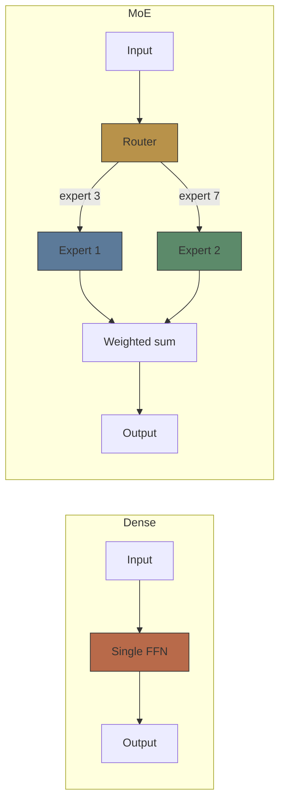
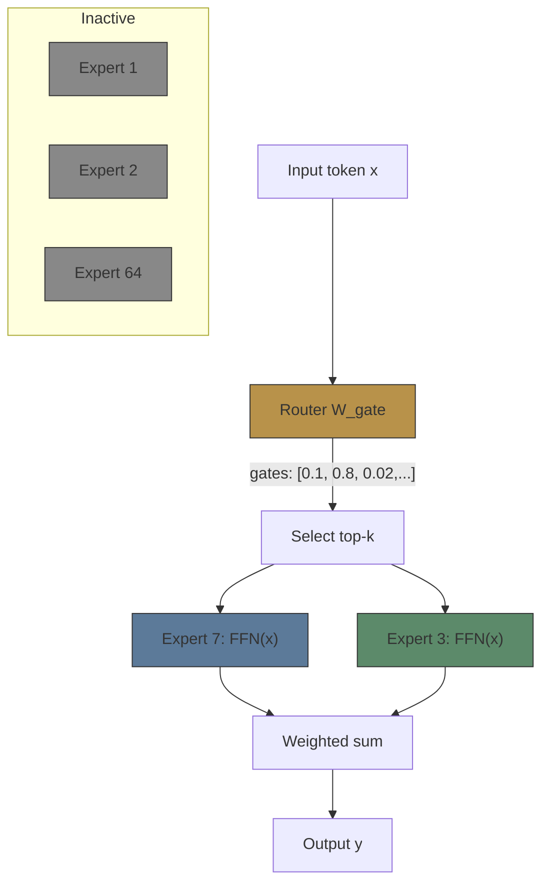

# Module 16: MoE Motivation — Why Sparse?

Est. study time: 2.0h
Language: yue



## 學習目標

- 解釋點解 dense 模型運算上唔有效率
- 定義 conditional computation 同 sparse MoE
- 比較 dense 同 sparse 模型喺相同 FLOPs 下嘅表現
- 分析 MoE 取捨：memory、communication、load balance

---

## 1. Dense 模型嘅問題

每次 forward pass 都會為每個 token **啟動所有 parameters**。

> **Cloze**: 「喺 dense transformer 入面，每個 token 都會啟動 \{所有 parameters\}，即係 FLOPs 同 \{parameter 數量\} 成線性關係。」

**含義**：Compute budget 直接限制咗模型容量。

| 模型                 | Params | 每 token 啟動 | 每 token FLOPs |
| -------------------- | ------ | ------------- | -------------- |
| 7B dense             | 7B     | 7B            | ~7B            |
| 70B dense            | 70B    | 70B           | ~70B           |
| 7B dense (2× tokens) | 7B     | 7B            | ~7B            |

要將容量由 7B 增加到 70B，每 token 運算要畀 10 倍。無辦法解耦。

> **Think**: 有冇方法可以增加 parameters 但唔使按比例增加運算？*答案：Conditional computation — 對唔同輸入啟動唔同 parameters。就好似人類大腦唔會啟動所有神經元一樣。*

---

## 2. Conditional Computation 概念

唔係所有輸入都需要相同嘅「知識」。物理問題用嘅 circuit 同煮食問題唔同。

**MoE** = 令模型可以為每個 token 自行揀選用邊啲 parameters。



> **Cloze**: 「MoE 用 \{router\} 嚟揀選邊個 subset 嘅 parameters（experts）要為每個 token 啟動。呢個就係 \{conditional computation\}。」

**歷史根源**：
- Jacobs 1991：「Adaptive Mixture of Local Experts」— 神經網絡嘅分治法
- Jordan 1994：Hierarchical MoE
- Eigen 2013：第一個將 MoE 用喺 deep learning（但係 per-example 唔係 per-token）
- **Shazeer 2017**：「Outrageously Large Neural Networks」— 將 MoE 引入 LSTM，per-token routing，137B params

---

## 3. Transformer 入面嘅 Sparse MoE

核心設計：將每個 FFN sublayer 替換成 MoE layer。

```text
Dense FFN:             y = W_down(GELU(W_up(x)))
MoE layer:             y = Σ_i g_i · FFN_i(x)
                       g = softmax(top-k(W_gate(x)))
```

其中：
- N 個 experts，每個係標準 FFN
- Router（W_gate）計算 expert scores（gates）
- 每個 token 揀選 top-k（通常係 2）experts
- 輸出 = 被揀選 expert 輸出嘅加權總和

**關鍵性質**：大部分 experts 每個 token 都唔使運算。每 token FLOPs ≈ k/N × 同等 N experts 嘅 dense FLOPs。

> **Predict**：如果你有 64 個 experts、top-2 routing，而每個 expert 嘅開銷同原本嘅 dense FFN 一樣，咁 FLOPs 比率同相同 expert size 嘅 dense 模型相比係幾多？*答案：2/64 = ~3%。MoE layer 只用咗 ~3% 嘅 total expert compute。但 parameters 係 64 倍大。*



---

## 4. Dense vs Sparse：擴展優勢

**Dense 擴展**：
- N params → 每 token N FLOPs
- 容量加倍 = 運算加倍

**Sparse（MoE）擴展**：
- N 個 experts × M params per expert = N×M params
- k 個 experts 啟動 → 每 token k×M FLOPs
- 增加 experts（N↑）→ 更多容量而唔使增加每 token 運算

| 方面        | Dense    | MoE Sparse      |
| ----------- | -------- | --------------- |
| Params      | P        | E × P_expert    |
| FLOPs/token | O(P)     | O(k × P_expert) |
| 擴展方式    | 兩者線性 | 解耦            |
| Memory      | O(P)     | O(E × P_expert) |
| 運算量      | 100%     | ~k/E %          |

> **Cloze**：「MoE \{將 parameter 數量同每 token 運算解耦\}。加入更多 experts 可以增加容量而唔會增加每 token 嘅 FLOPs。」

---

## 5. 取捨

MoE 唔係免費嘅。三個主要成本：

**1. Memory**：所有 E 個 experts 都要載入 memory。Mixtral 8x7B = 47B params（8×7B 減重疊）。更多 memory = 需要更大嘅 inference cluster。

**2. Communication**：Expert 輸出需要跨 devices 收集。All-to-all communication 好昂貴。需要 expert parallelism。

**3. Load imbalance**：Router 可能將大部分 tokens 路由到同一小撮 experts。部分 experts 超載，其他餓死。

> **Think**：點解 load imbalance 除咗浪費容量之外仲係問題？*答案：唔平衡嘅 routing 會造成運算瓶頸 — 超載嘅 experts 會變成 critical path。另外，未充分利用嘅 experts 晒 memory 而且學唔到有意義嘅 representations。*

| 成本           | 緩解方法                                     |
| -------------- | -------------------------------------------- |
| Memory         | Model parallelism, expert sharding           |
| Communication  | All-reduce 優化，MoE-specific parallelism    |
| Load imbalance | Auxiliary load-balancing loss（下個 module） |

---

## 6. 業界採用

點解 MoE 用喺生產環境：

| 模型               | Params | 活躍量              | Experts     | 架構             |
| ------------------ | ------ | ------------------- | ----------- | ---------------- |
| Mixtral 8x7B       | 47B    | 13B                 | 8, top-2    | Decoder, MoE FFN |
| GPT-4（傳聞）      | ~1.8T  | ~280B               | 16, top-2   | 8×MoE blocks     |
| DeepSeek MoE       | 16B    | ~2B（ultra-sparse） | 64, top-2   | Fine-grained MoE |
| Switch Transformer | 1.6T   | ~13B（top-1）       | 2048, top-1 | 簡化 routing     |

> **Error-spotting**：「MoE 模型比相同總 parameter 數量嘅 dense 模型更快。」*唔一定。MoE 模型嘅總 params 多過 dense，但每 token 用嘅 FLOPs 差唔多。一個 47B MoE 用 ~13B FLOPs/token（同 13B dense 差唔多）。但 MoE 嘅額外 memory 同 communication 可能會增加 latency。推論速度取決於 batch size、parallelism 策略，以及樽頸係 memory bandwidth 定係 compute。*

---

## Feynman 解釋

向 ML engineer 解釋 MoE motivation：

1. Dense = 所有 params 每個 token 啟動 = 運算隨容量擴展
2. Conditional computation = 每個 token 啟動一個 subset
3. 將 FFN 替換成 router + expert pool
4. 將容量同運算解耦
5. 取捨：memory、communication、load balancing

檢查：我能否解釋點解 8×7B MoE 用 ~13B FLOPs 但係有 47B params？我能否描述 MoE 幾時比 dense 差？

> **Spot the Mistake**: A developer treats moe motivation — why sparse? as optional because "it works without it." Where is the mistake?
>
> *Answer: It works only until the assumptions behind moe motivation — why sparse? are violated. The fix: treat it as part of the contract of moe motivation — why sparse?, not an optimization.*

