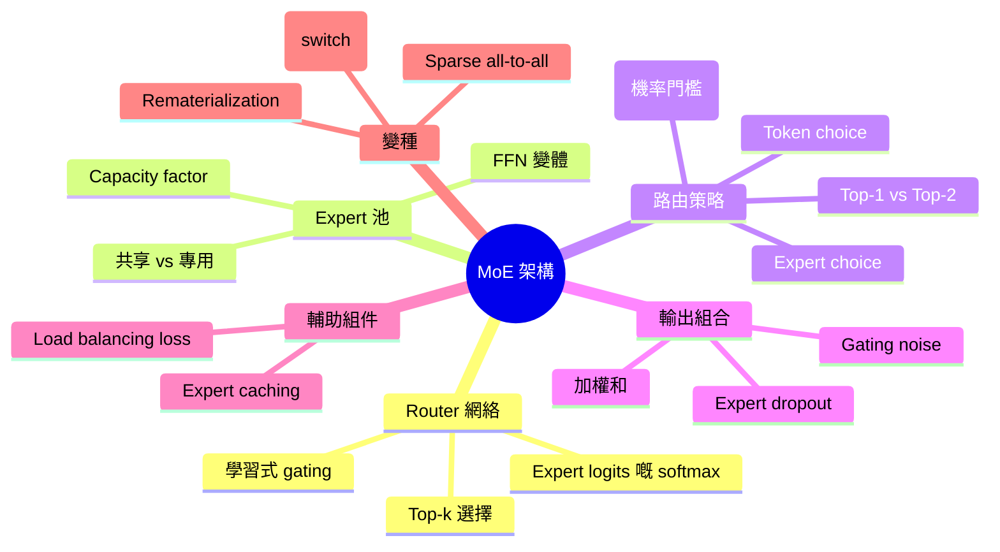
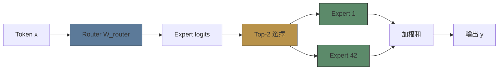
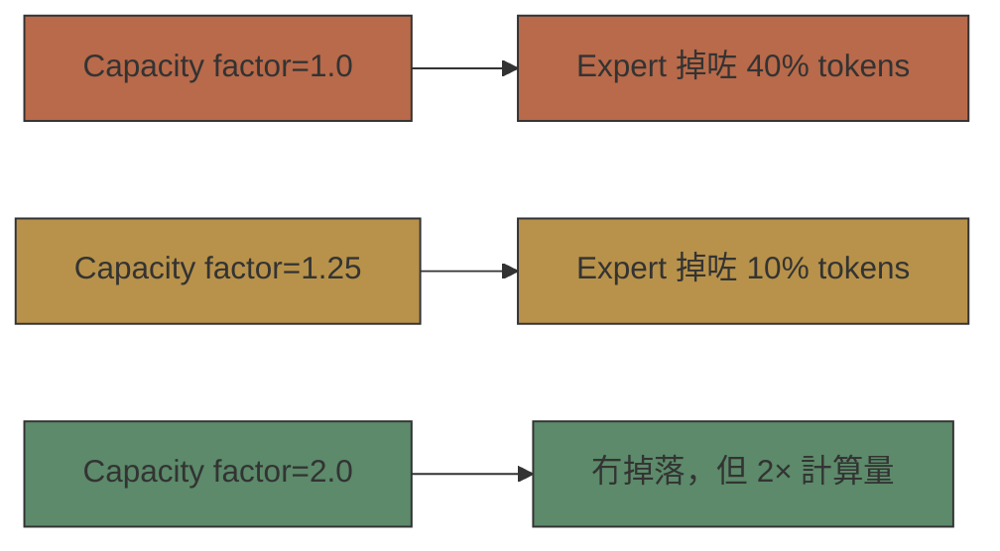
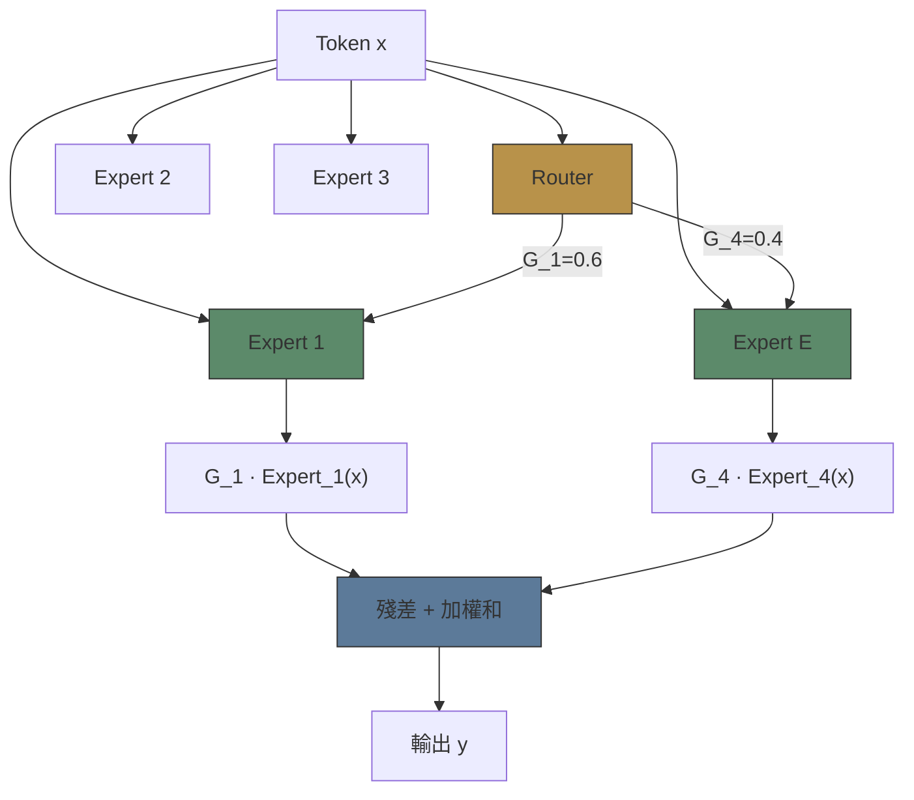

# Module 17: MoE 架構

Est. study time: 2.5h
Language: yue



## 學習目標
- 解釋 router 網絡設計同 top-k gating
- 分辨 token-choice 同 expert-choice 路由
- 推導 capacity factor 公式同佢對 load balance 嘅影響
- 建立 MoE FFN layer 嘅 mental model

---

## 1. MoE Layer 架構

Sparse MoE layer 取代單一 FFN，用 expert pool + router。

**標準 FFN layer**：
```text
y = W_down · σ(W_up · x)
```

**MoE FFN layer**：
```text
For each token x:
  scores = W_router · x                         # Router logits
  top_k_indices = TopK(softmax(scores), k)       # 揀 k 個 experts
  y = Σ_{i in top_k} G_i · Expert_i(x)          # 加權和
```

其中 G_i = softmax(scores)_i（淨係揀咗嘅 experts 嘅 gating weight）。



> **Cloze**: "MoE layer 取代單一 FFN，用 \{expert pool\} 同 \{router network\}。Router 計出 \{expert logits\} 並揀 top-k experts，用 \{TopK(softmax(scores), k)\}。"

---

## 2. Router (Gating 網絡)

Router = 細 linear layer。輸入：token representation（d_model）。輸出：over E 個 experts 嘅 logits（E 維度）。

**Softmax routing**（標準）：
```text
G_i = exp(s_i) / Σ_j exp(s_j)    # s_i = W_router[i] · x
```

**Noisy top-k routing**（Shazeer 2017）：
```text
s_i = W_router[i] · x + ε · StandardNormal()    # Noise 用嚟平衡 load
G_i = softmax(s_i) · TopK_mask(s_i, k)          # 非揀選嘅設零
```

Noise 鼓勵探索——喺 decision boundary 附近嘅 tokens 喺訓練期間會被分配去唔同 experts。

> **Think**: 點解要喺 router logits 加 noise？*答案：如果冇 noise，router 可能會不斷將模糊嘅 tokens 分配俾同一個「最好」嘅 expert，永遠唔探索其他選擇。Noise 喺 decision boundaries 引入隨機性，改善 load balance 同 expert 專門化。*

---

## 3. Token Choice vs Expert Choice

兩個完全唔同嘅路由範式。

**Token Choice**：每個 token 揀自己嘅 top-k experts。最常見（Mixtral、DeepSeek、Switch）。

```text
For each token:
  scores = router(x)
  top_k = TopK(scores, k)
  output = Σ G_i · Expert_i(x)
```

**Expert Choice**：每個 expert 揀 top-k tokens。由 Zhou 2022 提出。

```text
For each expert j:
  scores_j = router(x) for all tokens in batch
  top_k_tokens = TopK(scores_j, capacity)
  output_tokens = Expert_j(top_k_tokens)
```

| Aspect                 | Token Choice               | Expert Choice                             |
| ---------------------- | -------------------------- | ----------------------------------------- |
| 每個 expert 嘅固定容量 | 唔係——可能會掉 tokens      | 係——剛好 capacity 咁多 tokens             |
| Load imbalance 風險    | 高                         | 零（每個 expert 有 capacity 咁多 tokens） |
| Token dropping         | 當 expert 超 capacity 嗰陣 | 永遠唔會                                  |
| All-to-all 通訊        | 按 token，唔平衡           | 按 expert，平衡                           |
| 硬件效率               | 較低（有 gaps）            | 較高（均勻）                              |

> **Predict**: 邊種路由喺異質硬件上表現更好？*答案：Expert choice，因為每個 expert 處理剛好 capacity 咁多 tokens——計算負載均勻。Token choice 會造成 expert 負載唔平衡，令到有啲 devices idle 而另外啲 overloaded。*

---

## 4. Capacity Factor

Capacity factor 控制每個 expert 處理幾多 tokens。

```text
expert_capacity = ceil(capacity_factor × tokens_per_expert_ideal)

其中 tokens_per_expert_ideal = total_tokens / E
```

- capacity_factor = 1.0：完全平衡（好少可達到）
- capacity_factor = 1.25：25% 鬆動容許唔平衡
- capacity_factor = 2.0：好鬆（效率較低）



當 expert 超過 capacity → 額外 tokens 會被 **drop**（佢哋嘅輸出淨係經 residual connection 傳遞，跳過 FFN）。被 drop 嘅 tokens 冇咗 expert 計算——影響質素。

> **Cloze**: "Capacity factor 控制 \{expert capacity\} = ceil(capacity_factor × tokens_per_expert_ideal)。被 drop 嘅 tokens \{跳過 expert 計算\} 並淨係經 \{residual connection\} 傳遞。"

---

## 5. Top-1 vs Top-2 vs Top-k

**Top-1（Switch Transformer）**：每個 token → 單一 expert。

- 好處：最少計算開銷（一個 FFN）
- 壞處：Router 必須好有信心；路由錯誤會損失晒所有 expert 計算
- 局限：Switch 用 2048 個 experts，top-1 令計算量可控

**Top-2（Mixtral、DeepSeek）**：每個 token → 兩個 experts。

- 好處：平均化降低路由錯誤影響；更好 gradient signal
- 壞處：每個 token 要 2× expert 計算
- 大部份 MoE 模型嘅標準選擇

**Top-k（一般）**：
- k 越大 → expert 計算越多但輸出質素越好
- k=1 用於最大 sparsity
- k=2 處於質素-效率 Pareto 前沿

> **Think**: Top-2 係唔係永遠好過 top-1？*答案：唔係。Top-2 質素更好但每個 token 成本 2× expert FLOPs。Switch 用 top-1 配 2048 個 experts，因為 top-2 會 prohibitive——每個 token 要計兩個昂貴嘅 expert passes。取捨取決於 expert 規模同總預算。*

---

## 6. Expert 網絡設計

Experts = FFN layers。通常同一個架構。

**標準 expert**（SwiGLU，跟現代 dense models）：
```text
Expert(x) = (σ(x · W_gate) ⊙ (x · W_up)) · W_down
```

**Expert capacity**（每個 expert 嘅參數）：
```text
params_per_expert = 2 × d_model × d_ff（SwiGLU：3 × d_model × d_ff）
```

Total MoE params = params_per_expert × E + router_params

**共享 experts**（DeepSeekMoE）：有啲 experts 永遠啟動（類似 dense compute）加上 routed experts。共享 expert 捕捉 common knowledge；routed experts 專門化。

---

## 7. 輸出組合

最終 token 輸出 = expert 輸出嘅加權和：

```text
y = x + Σ_{i in top_k} G_i · Expert_i(x)
```

Gating weight G_i 影響 gradient 去 router 同 expert 兩個方向。如果 G_i 好細，gradient 就弱——expert 可能訓練得唔好（「expert 死亡」）。

**Expert dropout**（正則化）：訓練期間，隨機掉落揀選咗嘅 expert 輸出，概率 p_expert_drop。剩低嘅 expert 輸出按 1/(1-p) 縮放。防止 expert 共同適應。



---

## 8. 實際配置例子

| 模型         | Experts | Top-k | Capacity | Router           | 共享 Expert    |
| ------------ | ------- | ----- | -------- | ---------------- | -------------- |
| Mixtral 8x7B | 8       | 2     | 1.25     | Softmax          | 冇             |
| Switch-L     | 2048    | 1     | 1.0      | Softmax + noise  | 冇             |
| DeepSeek-R1  | 256     | 8     | 1.0      | Softmax          | 有（1 個共享） |
| GLaM         | 64      | 2     | 1.25     | Softmax          | 冇             |
| ST-MoE       | 128     | 2     | 1.0      | Softmax + Jitter | 冇             |

---

## 捉錯處

「喺 MoE 入面，router 輸出概率分佈 over experts。Forward pass 做 softmax，揀 top-2 嘅 index，然後計加權和。唔需要其他機制。」

*錯喺邊？*（1）訓練期間冇 noise 做 load balance 探索。（2）冇 capacity factor——冇咗佢，experts 會 overflow 並靜靜雞掉 tokens。（3）冇 auxiliary load balancing loss——router 冇 balance loss 會 collapse 到淨係用 2-3 個 experts。（4）Expert dropout 或 jitter noise 經常有助正則化。

---

## Feynman 提示

向同事解釋 MoE 架構：

1. Router 點樣為每個 token 揀 experts
2. Expert 輸出嘅加權和
3. Token choice vs expert choice
4. 點解 capacity factor 重要
5. Top-1 同 top-2 之間嘅取捨

檢查：你識唔識解釋點解 Switch 用 top-1 配 2048 個 experts，但 Mixtral 用 top-2 配 8 個？你識唔識描述當 expert overflow 嗰陣發生乜嘢？

> **Spot the Mistake**: Code review note: someone applies moe 架構 everywhere "to be safe" in a moe 架構 codebase. Spot the mistake.
>
> *Answer: Blanket application hides which spots actually need moe 架構. Apply it where the semantics demand it, and document why.*

