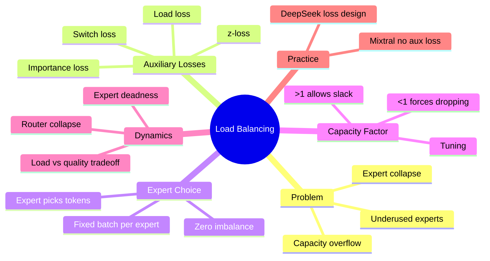
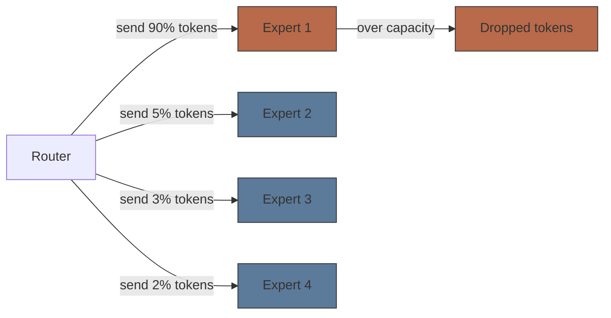
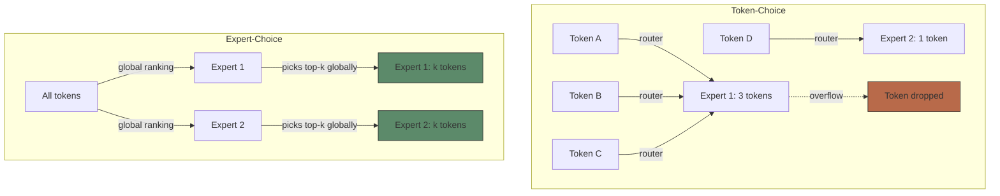
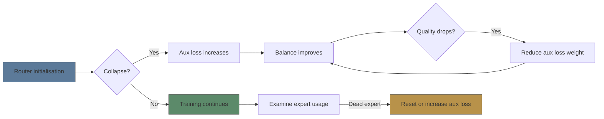

# Module 18: MoE Load Balancing

Est. study time: 2.0h
Language: yue



## 學習目標

- 解釋點解 load balancing 對 MoE 訓練咁重要
- 描述 auxiliary loss 類型（importance loss, load loss, z-loss）
- 比較 token-choice 同 expert-choice load balancing
- 分析 capacity factor 調校同佢對模型質素嘅影響

---

## 1. Load Balancing 問題

MoE router 將 token 送去 top-k experts。冇限制 → router 學識將所有 token 送去同一個 expert（collapse）。其他 experts 冇用 → 浪費 capacity。

**Router collapse**: Router gate 值對某個 expert 主導曬所有 token。Expert 超載（掉 token），其他 experts 餓死。

> **Cloze**: 「Router collapse 發生喺 \{所有 token 都被送去同一個 expert\}。餓死嘅 experts \{永遠學唔到有用嘅 representations\}。」

**後果**：
- 浪費參數（unused experts）
- Capacity overflow（expert 超過 capacity factor → token 被掉）
- 唔平衡嘅計算（部分 device 閒置，部分忙碌）
- 模型質素下降（effective capacity < nominal capacity）



---

## 2. Auxiliary Loss 函數

Auxiliary loss 加落 main LM loss 度。鼓勵平衡 routing。

### Importance Loss（Shazeer 2017）

懲罰唔平均嘅 router probability 分佈。

```text
L_importance = α · N · Σ_i [CV(batch_i)]²
```

batch_i = 對 expert i 嘅 router probabilities 總和 across batch，CV = coefficient of variation (σ/μ)。

### Load Loss（Shazeer 2017）

懲罰分配俾每個 expert 嘅 token 數量唔平均。用 Gaussian noise 做 differentiable approximation：

```text
L_load = α · N · Σ_i [CV(count_i)]²
```

count_i ≈ Σ_t P(noisy_gate_i > threshold)。

> **Cloze**: 「Importance loss 懲罰 \{唔平均嘅 router probabilities\}。Load loss 懲罰 \{每個 expert 嘅 token 數量唔平均\}。兩個都俾 α 同 expert 數量 N 縮放。」

### Switch Loss（Fedus 2022）

更簡單：每個 expert 收到嘅 token 比例應該均勻（1/E）。

```text
L_switch = α · E · Σ_i f_i · P_i
```

f_i = 路由去 expert i 嘅 token 比例，P_i = 對 expert i 嘅平均 router probability。

取捨：α 太高 → routing 質素下降（router 忽略 token）。α 太低 → collapse。

**典型 α**：0.01（Switch），0.01-0.1（常見）。

---

## 3. z-Loss（DeepSeek）

DeepSeekMoE 提出 **z-loss** — 穩定 router logits，防止佢哋無限增長：

```text
L_z = α_z · Σ_i (logits_i)² · mean_i
```

令 router logits 保持細數值。防止 experts 之間出現過大 magnitude 差距。提升訓練穩定性。

> **Predict**: 如果 router logits 無限增長會點？*答案：Softmax 變得極度 peaky — router 每個 token 差唔多 assign probability ~1 俾一個 expert。Collapse。z-loss 做 logit regulariser。*

---

## 4. Expert-Choice Routing（零不平衡）

Token-choice：token 揀 experts → 一定唔平衡（power-law token 分佈）。

Expert-choice（Zhou 2022）：每個 expert 揀全球 top-k tokens。每個 expert 固定 capacity。Zero imbalance 必然。



**缺點**：部分 token 可能冇任何 expert 揀到（尤其係排名最尾嗰啲）。緩解：用 residual connection 確保就算 token 冇被路由都有資訊流動。

---

## 5. Capacity Factor

Capacity factor 控制每個 expert 每 batch 處理幾多個 token：

```text
expert_capacity = ceil(capacity_factor × total_tokens / num_experts)
```

| CF | 效果 |
|----|------|
| 1.0 | 完美均勻分配。Token-choice 可能會掉好多 token |
| 1.25 | 25% 鬆動。吸收大部分唔平衡 |
| 2.0 | 2 倍容量。好少掉 token。運算更多 |
| <1.0 | 強制掉 token。用嚟提升效率 |

**Token dropping**：冇被任何 expert 處理嘅 token 只經 residual connection 傳遞（冇 expert output）。犧牲質素換速度。

> **Cloze**: 「Capacity factor = \{expert_capacity / ideal_uniform_split\}。CF 越高 → \{越少 token 被掉但運算越多\}。CF 越低 → \{越多人掉 token但越快\}。」

---

## 6. 訓練動態



**Expert deadness**：Expert 長期 get 好低 router probability → 永遠冇被訓練 → 繼續冇用。用 sliding window 監察 expert gate 數量發現。

**緩解方法**：
- 用合適 α 嘅 auxiliary loss
- Expert dropout（訓練期間隨機熄 experts）
- Expert-choice routing
- z-loss（logit regularisation）
- Router 初始化（細權重，平衡初始分配）

---

## 7. 實際筆記

- **Mixtral 8x7B**：冇 auxiliary loss！用 top-2 gating 加足夠 capacity（CF=1.25）。Experts 自然平衡。
- **Switch Transformer**：Top-1。Switch loss α=0.01。CF=1.0（進取）。
- **DeepSeekMoE**：結合 importance + load + z-loss。α=0.01，α_z=0.001。
- **ST-MoE**：只有訓練前半段做 load balancing，之後 freeze。幫到後期質素。

> **Error-spotting**: 「Increasing capacity factor 一定會提升模型質素，因為少咗 token 被掉。」*問題：更高 CF 增加每個 token 嘅 compute cost（更多 FFN 運算）。超過 1.25-1.5 之後回報遞減。仲影響 batch size 同 memory。取捨係 Pareto-optimal — quality vs compute。*

---

## Feynman Prompt

向 ML engineer 解釋 MoE load balancing：

1. 點解 router 傾向 collapse（冇限制 → greedy 分配）
2. 三種 auxiliary loss 類型同各自嘅適用時機
3. Token-choice 同 expert-choice 嘅取捨
4. Capacity factor 嘅直覺同調校

寫完之後檢查：能唔能夠解釋點解 Mixtral 可以冇 aux loss 訓練？能唔能夠推導 expert-choice 點解零不平衡但可能會掉 token？

> **Think**: How does **Importance Loss（Shazeer 2017）** relate to **Load Loss（Shazeer 2017）** within moe load balancing?
>
> *Answer: They address adjacent failure modes: importance loss（shazeer 2017） governs the primary behavior, while load loss（shazeer 2017） constrains how far you can push it.*
> **Spot the Mistake**: A developer treats importance loss as optional because "it works without it." Where is the mistake?
>
> *Answer: It works only until the assumptions behind importance loss are violated. The fix: treat it as part of the contract of moe load balancing, not an optimization.*

