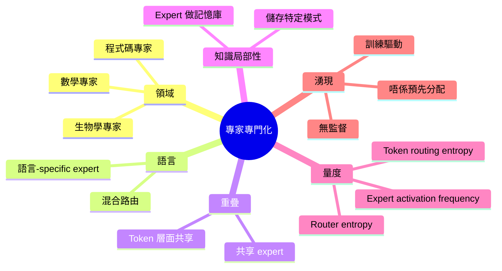
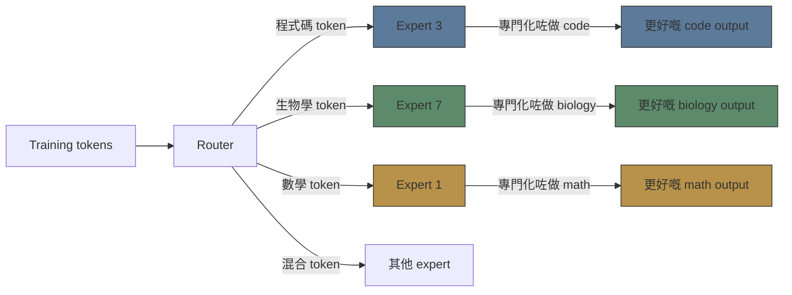
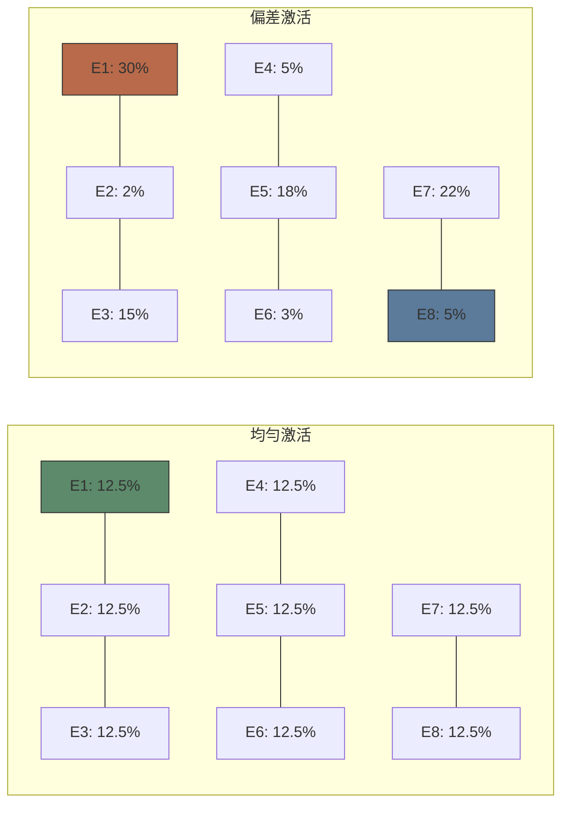

# Module 19: MoE 入面嘅專家專門化

Est. study time: 2.0h
Language: yue



## 學習目標
- 描述專家點樣唔使明確監督就自動專門化
- 區分 domain、linguistic 同 overlapping specialisation 模式
- 解釋 MoE 嘅 knowledge locality 假說
- 用 router entropy 同 activation statistics 去量度 specialisation

---

## 1. Emergent Specialisation

MoE expert 唔係預先分配好 domain 嘅。Specialisation 係由 gradient pressure 自然浮現出嚟：router 學識將類似 token 送去同一個 expert。

**關鍵 insight**: Expert 專門化係因為咁做有效率。一個專門嘅 expert 喺自己 domain 入面比 generalist 做得更好 — router 學識利用呢點。

> **Cloze**: 「MoE 嘅 expert specialisation 係 \{emergent，唔係 pre-assigned\}。Router 學識將 \{類似 token\} 送去同一個 expert，因為咁樣會產生 \{更準確嘅 output\}。」



---

## 2. Specialisation 嘅類型

### Domain Specialisation

Expert 可靠地分配到唔同知識 domain。Mixtral 8x7B 例子：

| Expert | 被咩觸發 | 角色 |
|--------|-------------|------|
| Expert 0 | 程式碼 token | 程式碼生成 |
| Expert 2 | 數學符號 | 算術 |
| Expert 5 | 自然語言 | 一般文字 |

**唔係完美乾淨**：Token 會路由去 2 個 expert。如果 code 同 math 嘅計算模式相似，同一個 expert 可以同時處理兩者。

### Linguistic Specialisation

喺 multilingual MoE 入面，expert 成日按語言專門化：
- Expert A：主要英文
- Expert B：主要中文
- Expert C：主要 code（語言無關）

**DeepSeekMoE**（64 個 expert）：發現語言集群 — 有啲 expert 處理 Romance 語言，有啲處理 CJK。

> **Think**：點解會出現語言-specific expert 而唔係跨 domain 嘅 expert？*答案：唔同語言有唔同嘅句法結構同 token 分佈。一個用英文 token 訓練嘅 expert 學到英文模式；將英文 token 路由去嗰個 expert 比送去中文專門嘅 expert 更有效率。*

### Overlapping Specialisation

Expert specialisation **唔係獨佔**。一個 token 會路由去 2 個 expert（top-2）。兩個都有貢獻。

Overlap 模式：
- **Token sharing**：兩個 expert 都處理 code，但係從唔同句法角度（例如一個處理 syntax，一個處理 semantics）
- **Shared experts**：有啲 expert 保持 generalist，處理多種 token。常見於較大嘅 expert pool。
- **Residual experts**：專門化 expert + 共享「catch-all」expert（DeepSeekMoE 設計）

---

## 3. Knowledge Locality

假說（Geva 2021 延伸）：**FFN 層以 key-value pair 儲存知識。MoE expert 係分區咗嘅 knowledge base。**

每個 expert 嘅第一個 FFN projection（up-proj）做 **keys**：要匹配嘅模式。
每個 expert 嘅第二個 FFN projection（down-proj）做 **values**：要輸出嘅知識。

Specialisation 意思係：expert X 儲存 domain X 嘅知識。Router 查詢 domain X → expert X 回應。

> **Cloze**：「喺 knowledge locality 觀點入面，expert 嘅 up-projection 做 \{keys\}（要匹配嘅模式），down-projection 做 \{values\}（要輸出嘅知識）。Specialisation 將呢個 \{knowledge base\} 按 domain 分區。」

證據：
- 探測 expert 內部會顯示 topic-specific 特徵
- 剪走一個 expert 會移除佢 domain 嘅知識
- Fine-tune 一個 expert 只會影響佢嘅 domain

---

## 4. 量度 Specialisation

### Router Entropy

Router 嘅 expert 分佈嘅平均 entropy。低 entropy → 強 specialisation（router 好確定揀邊個 expert）。

```text
Entropy = -Σ p(expert_i) · log p(expert_i)
```

- **低 entropy**：Router 持續為同一 token 類型揀同一個 expert
- **高 entropy**：Router 平均分佈 → 差嘅 specialisation 或者 router 崩潰咗

### Expert Activation Frequency

追蹤每個 expert 被揀中嘅頻率。預期：均勻分佈（因為 load balancing loss）。

**偏差**：如果一個 expert 對 30% token 激活，但另一個得 2%，specialisation 可能唔平衡（或者 expert 質素有分別）。



### Token Routing Entropy

畀咗同一份文件/句子嘅 token：佢哋被路由去幾多個唔同 expert？

- **低 routing entropy**：句子入面大部分 token 去同一 2-3 個 expert — 連貫嘅專門化路由
- **高 routing entropy**：Token 散落去唔同 expert — 可能表示 overfitting 或者缺乏 specialisation

> **Predict**：如果一個模型有高 expert activation skew 但低 routing entropy，咁係好定唔好？*答案：混合。低 routing entropy 係好（連貫路由）。高 activation skew 表示有啲 expert 未被充分利用 — 可能浪費 capacity。需要更好嘅 load balancing。*

---

## 5. 實際應用

- **Expert fine-tuning**：淨係 fine-tune domain 相關嘅 expert。比 full model fine-tune 平。
- **Expert pruning**：掉走低激活嘅 expert 可以慳計算，質量損失好細（如果 specialisation 乾淨嘅話）。
- **Expert merging**：新 domain 可以合併多個相關 expert 嘅 output，而唔係路由去單一個。
- **Knowledge locality debugging**：如果 domain X 嘅 output 質量下降，檢查 expert X 嘅 routing pattern — 可能訓練不足。

> **Error-spotting**：「Experts specialise 係因為我哋喺訓練初始化嗰陣將佢哋分配到唔同 domain。」*錯。Specialisation 係自然浮現，唔係分配出嚟。Router 透過數百萬步嘅 gradient descent 學識將相似 token 分組去 expert。Expert 係冇 domain label 㗎。*

---

## Feynman 提示

解釋 MoE expert specialisation：

1. 點解 expert 會專門化：效率梯度
2. 類型：domain、linguistic、overlapping
3. Knowledge locality：expert 係 domain-specific 嘅記憶庫
4. 量度：router entropy、activation frequency、routing entropy
5. 實際：fine-tuning、pruning、merging

檢查：我能唔能夠解釋點解 specialisation 係 emergent？我能唔能夠預測如果 expert 數量加倍會發生咩事？

> **Spot the Mistake**: Code review note: someone applies linguistic specialisation everywhere "to be safe" in a moe 入面嘅專家專門化 codebase. Spot the mistake.
>
> *Answer: Blanket application hides which spots actually need linguistic specialisation. Apply it where the semantics demand it, and document why.*

