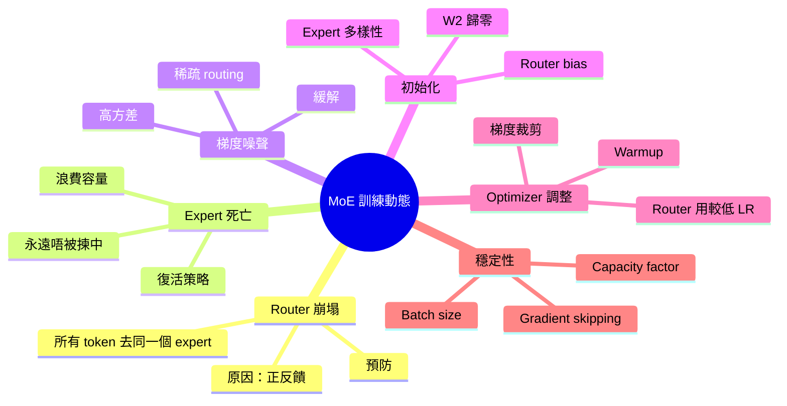
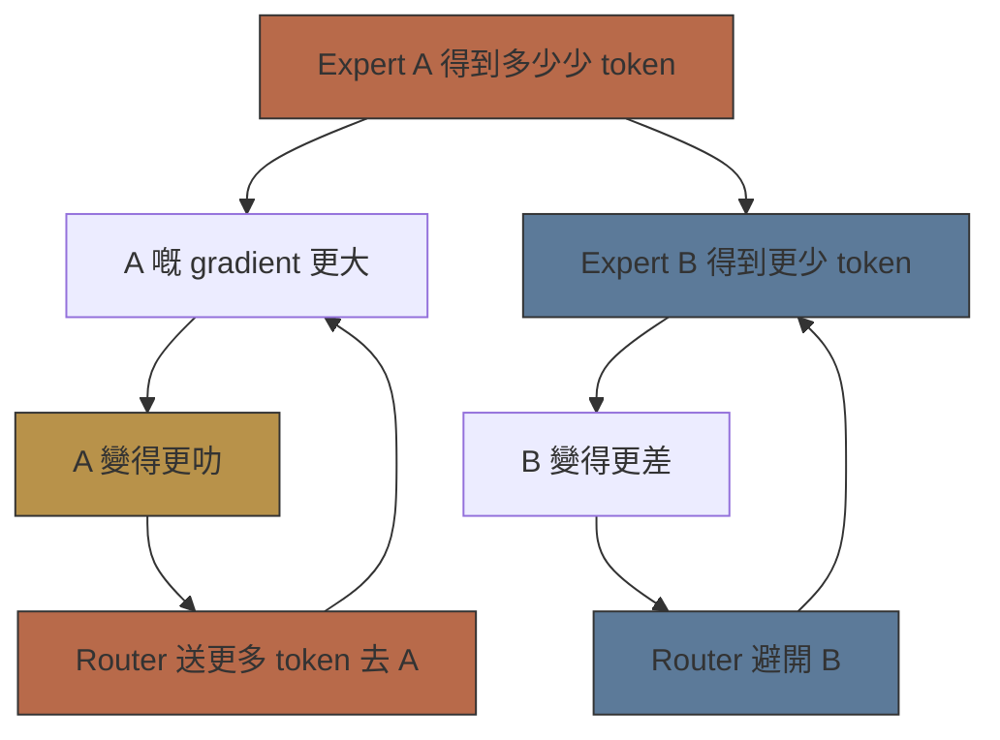
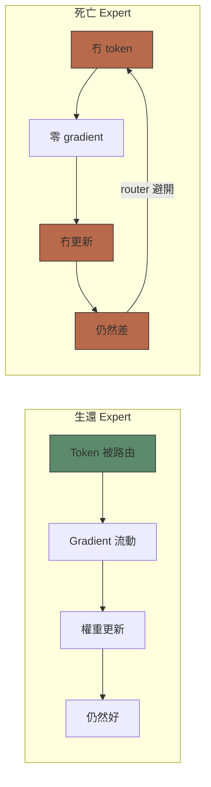

# Module 20: MoE 訓練動態

Est. study time: 2.5h
Language: yue



## 學習目標

- 解釋 router collapse 機制同預防方法
- 描述 expert deadness 成因同復活策略
- 分析稀疏 routing 帶來嘅 gradient noise 挑戰
- 設計 MoE 專用初始化同 optimizer 調整

---

## 1. Router 崩塌

MoE 訓練嘅基本不穩定性：**所有 token 路由到同一少數 expert**。

**機制**：正反饋循環。
1. Expert A 初期啱啱好收多咗 token
2. Expert A 嘅 gradient 更大（更多 token → 更多更新）
3. Expert A 變得更叻 → router 送更多 token 去 A
4. 其他 expert 冇得食 → 變得更差 → router 更加避開佢哋

呢個就係點解 MoE 訓練出名比 dense 模型更加唔穩定。

> **Cloze**: "Router 崩塌通過一個 \{正反饋循環\} 發生：更多 token → 更多更新 → expert 更叻 → \{更多 token 路由去佢度\}。其他 expert 會 \{餓死\}。"



**預防**：
- Auxiliary load balancing loss（mod18）
- Expert-choice routing（消除唔平衡）
- Router dropout：訓練期間隨機 skip router
- Expert dropout：每個 batch 隨機 skip 部分 expert

---

## 2. Expert 死亡

**Expert deadness**：Expert 從來唔俾 router 揀中嚟處理任何 token。永久浪費。

### 成因
- **Router 崩塌**：部分 expert 永遠贏唔到競爭
- **初始化 lottery**：Expert 初始參數唔好彩，從此翻唔到身
- **Optimizer 分歧**：Expert 早期 diverged，router 學咗永遠避開佢
- **容量溢出**：Expert 到咗 capacity limit，多出嘅 token 被 drop → expert 得到更少更新 → 變得更差 → 被揀中更少

### 檢測
追蹤訓練期間 expert 激活次數。超過 10K+ steps 都係零（或接近零）激活嘅 expert 即係死咗。

### 復活策略
- **Expert dropout**：訓練期間隨機 skip top-k expert → 強迫 router 間中揀非 top expert
- **加重 Auxiliary loss**：提高 load balancing loss 權重，俾死 expert 有機會被揀中
- **Expert noise injection**：向 router logits 加入可學習噪聲（Shazeer 2017）——噪聲強迫訓練期間探索
- **Expert-wise learning rate**：使用率低嘅 expert 用較高 LR

> **思考**：點解死咗嘅 expert 唔可以通過 gradient descent 自然復活？*答案：Router 永遠唔揀死亡 expert → expert gradient 係零 → expert 權重永遠唔更新 → 死亡 expert 繼續死。正強化循環令佢一直死。*



---

## 3. MoE 嘅 Gradient Noise

MoE 嘅 gradient variance 高過 dense model。原因：

| 來源 | 解釋 |
|--------|------------|
| **Token routing 非確定性** | 同一輸入有少少唔同 → 揀咗唔同 expert → 唔同 gradient |
| **Expert capacity 截斷** | Token 喺容量爆嗰陣被 drop → gradient 唔連續 |
| **稀疏激活** | 多數 expert 每步拎到零 gradient → 每步噪聲高 |
| **Auxiliary loss 競爭** | Load balancing loss 同主 loss 可能衝突 |

### 緩解方法
- **加大 Batch size**：更多 token → routing 分佈更穩定 → variance 更低
- **Gradient clipping**：Router 嘅 gradient clip 得比 expert gradient 更進取
- **Gradient averaging across experts**：更新前按 expert 歸一化 gradient 幅度
- **動態 Capacity factor**：訓練初期提高 capacity factor（對唔平衡更容忍）→ 後期降低

> **Cloze**: "MoE 嘅 gradient \{variance\} 高過 dense model，因為 token routing 係 \{非確定性\}，而且多數 expert 每步得到 \{零 gradient\}。"

---

## 4. 初始化策略

### Router Bias 初始化
用細嘅負 bias 初始化 router → 所有 expert 初期同樣吸引。防止早期唔平衡。

常見做法：`W_router ~ N(0, 0.01)`，bias = -0.1 到 -0.5。

### Expert 多樣性初始化
Experts 應該一開始就唔一樣，促進專門化。

```text
W_expert_i ~ N(0, σ²)  其中 σ 大過標準 FFN init
```

較大 init variance → expert 初始更唔一樣 → 專門化更快。但太大 → 唔穩定。

### 零初始化 Down-Projection
對於有 residual connection 嘅 expert（例如 DeepSeekMoE）：將 expert 嘅 down-projection（W₂）初始化為零。

結果：expert 輸出 = 0 初始化 → 對主 loss 冇貢獻 → router 初期唔受 expert 輸出質素影響 → router 純粹靠後續更新學 routing。

### 共享 Expert 初始化
共享 expert（DeepSeekMoE）初始方式同專門 expert 一樣，但用更高 learning rate——目的係做通才。

> **Predict**：如果將所有 expert 初始化成完全一樣會點？*答案：Symmetry breaking 會好慢。Router 當所有 expert 可互換，延遲專門化。Expert 之間有明顯初始化差異先會加速湧現多樣化 routing 模式。*

---

## 5. Optimizer 調整

### 較低 Router Learning Rate
Router 參數嘅 LR 應該低過 expert 參數。

**點解**：Router 決定邊個 expert 要更新。Router 變得太快 → expert 訓練唔一致 → 永遠收唔到穩定 token 分佈。

典型比例：`lr_router = 0.1 × lr_expert`（但取決於模型）。

### Expert Momentum 歸一化
Expert 嘅 Adam momentum/variance buffer 按激活次數歸一化。收到少 token 嘅 expert 計數低 → 分母歸一化防止從稀疏數據做大更新。

### 逐漸 Capacity Warmup
初期用高 capacity factor（cf = 1.5-2.0）——每個 expert 多啲 token，gradient 更穩定。
逐漸降低到目標 cf = 1.0-1.25。

### Auxiliary Loss 退火
初期用高 aux loss 權重嚟穩定 → 隨住 router 穩定逐漸降低。


---

## 6. 穩定性檢查清單

| 風險 | 症狀 | 解決方法 |
|------|---------|-----|
| Router 崩塌 | 所有 token 去 1-2 個 expert | Aux loss, expert-choice, router dropout |
| Expert 死亡 | 零激活 expert | Expert noise, expert-wise LR, revive loss |
| Gradient 爆炸 | Loss spike | 降低 router LR, gradient clipping, 大 batch |
| 容量溢出 | Token dropout 高 | 提高 capacity factor, 減少有效 E |
| Router 震盪 | Routing 模式每個 batch  flip | 更大 batch, 更低 router LR, aux loss |
| 平台期 | Loss 停滯不前 | 降低 aux loss 權重, 提高 capacity factor |

> **捉錯處**：「要修復 router collapse，應該提高 router learning rate 等佢學 routing 學快啲。」*錯。更高 router LR 令 routing 更波動，反而強化 collapse 嘅反饋循環。應該降低 router LR、提高 aux loss、或者用 expert-choice routing。*

---

## 費曼提示

解釋 MoE 訓練動態：

1. Router 崩塌：正反饋循環，預防策略
2. Expert 死亡：點解會發生，點樣復活
3. Gradient noise：來源，緩解方法（batch size, clipping）
4. 初始化：router bias, expert 多樣性, zero down-projection
5. Optimizer 調整：降低 router LR, capacity warmup, aux loss annealing

檢查：我能唔能夠解釋點解 expert deadness 係自我強化？我能唔能夠設計一個避開晒五種風險嘅訓練計劃？

> **Think**: How does **成因** relate to **檢測** within moe 訓練動態?
>
> *Answer: They address adjacent failure modes: 成因 governs the primary behavior, while 檢測 constrains how far you can push it.*
> **Spot the Mistake**: A developer treats w_router ~ n(0, 0.01) as optional because "it works without it." Where is the mistake?
>
> *Answer: It works only until the assumptions behind w_router ~ n(0, 0.01) are violated. The fix: treat it as part of the contract of moe 訓練動態, not an optimization.*

