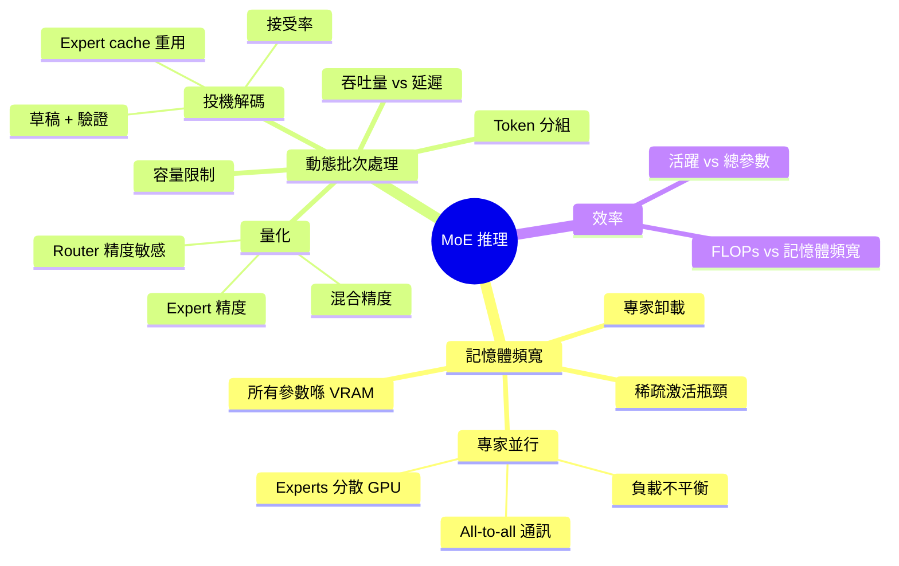
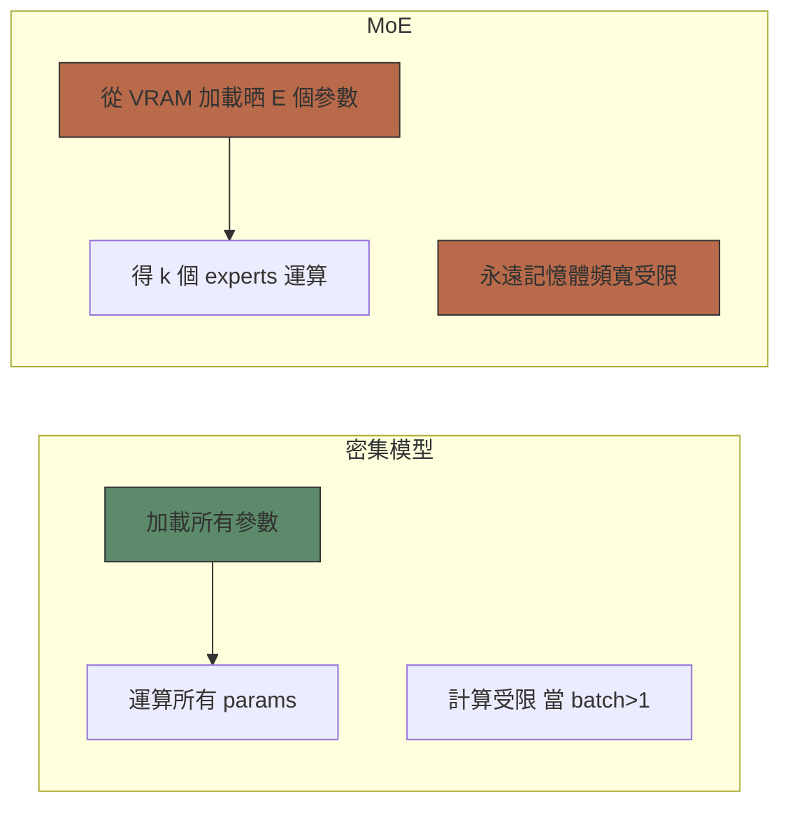
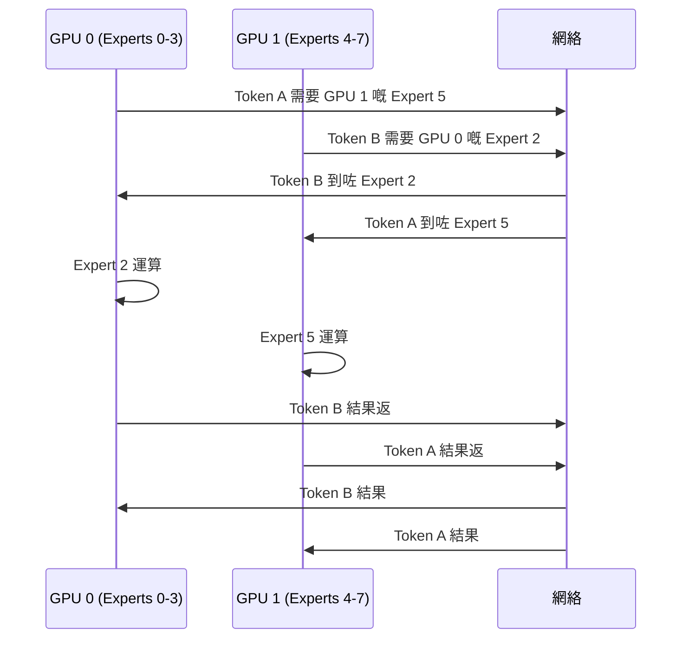
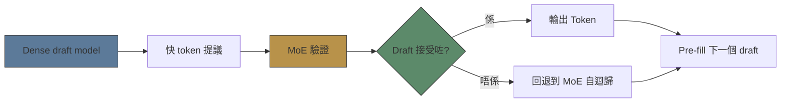

# Module 21: MoE 推理同部署

Est. study time: 2.0h
Language: yue



## 學習目標
- 分析 MoE 推理記憶體頻寬瓶頸
- 設計跨 GPU 嘅 expert parallelism 策略
- 評估量化對 router vs experts 嘅影響
- 將 speculative decoding 應用喺 MoE

---

## 1. 記憶體頻寬問題

Dense 模型推理：大 batch 係 compute-bound，細 batch 係 memory-bound。
MoE 推理：**永遠 memory-bound**，因為所有 E 個 experts 都要 fit 喺 VRAM，雖然得 k 個 active。

**重點**: Active params = k/E × total params。但 **所有** params 都要從 memory load 出嚟 per token。你畀 E 個 experts 嘅 memory cost，但只得 k 個 experts 嘅 compute benefit。

> **填充題**: MoE 推理永遠係 \{memory-bound\}，因為 \{所有 E 個 experts\} 都要從 VRAM load 出嚟 per token，雖然得 \{k\} 個 active。



**含義**: MoE 對 dense 嘅加速細過 k/E 比率所暗示嘅。Mixtral 8x7B：per token load 47B params，13B active。細 batch 記憶體 load 時間主導。

---

## 2. 專家並行

將 experts 分散到 GPU。每個 GPU 有 subset 嘅 experts。

### All-to-All 通訊模式

1. Router 決定每個 token 嘅 expert 喺邊個 GPU
2. Token embeddings 送去對應 GPU (all-to-all 通訊)
3. Expert 喺自己 GPU 運算
4. Output 送返 (all-to-all)

**瓶頸**: 通訊頻寬 at E×N_experts × all-to-all。



### 負載不平衡問題

如果 tokens 集中喺一個 GPU 嘅 experts：嗰個 GPU overloaded，其他 idle。Load balancing loss 對推理效率都好重要。

### Top-K 分組專家並行

將 experts 分組做 expert sets 放喺 GPU。如果可以就將 tokens 只係 route 去本地 GPU 嘅 set — 減少通訊。

> **思考題**: 點解 all-to-all 通訊對細 batch 更差？ *答案: 每個 token 嘅通訊開銷係固定 (message + expert index + result)。細 batch → 每個 token 開銷高。大 batch → 開銷攤分。呢個係 MoE 鍾意大 batch serving 嘅原因。*

---

## 3. 動態批次處理

MoE 推理需要同 dense 唔同嘅 batching 策略。

### Token 級別批次處理

Dense：batch sequences。MoE：batch tokens。因為每個 token 會 route 去唔同 expert，唔可以直接 batch expert 運算。

**每層 decoder 步驟**:
1. 對 batch 入面所有 tokens 行 router
2. 根據揀咗嘅 expert 將 tokens 分組
3. 每個 expert：將分配好嘅 tokens 放入 expert 做 forward
4. 用 router weights 加權輸出並合併

### 容量限制

每個 expert 每 batch 有固定容量 (c·B/E)。如果 route 去 expert 嘅 tokens 超過容量 → tokens 被 drop。

```text
Dropped tokens = max(0, assigned_tokens - capacity)
```

被 drop 嘅 tokens 呢層無 expert 運算 → 資訊損失。

**取捨**: 容量高 = 少 drop 但每個 expert 運算多。容量低 = 運算有效率但 drop 導致品質損失。

> **填充題**: 動態批次處理入面，routing 之後 tokens 會 \{按 expert 分組\}。每個 expert 最多處理 \{capacity\} 個 tokens per batch。超出嘅 tokens 會被 \{drop\}。

---

## 4. MoE 量化

### Router 量化敏感度

Router 好細 (單層 linear layer) 但 **好敏感** 對量化。點解？
- Router 計 softmax logits → 決定邊個 token 去邊個 expert
- 細微量化誤差 → 揀錯 expert → 級聯式品質損失

**建議**: Router 用 FP16/BF16。Expert weights 用 INT8/FP8。

### 專家量化

Expert FFN layers (up/down/gate projections) = 大部分參數。量化到 FP8/INT4。

FP8 for experts：最少品質損失，2× memory 減少。
INT4 for experts：明顯損失但用 calibration data 可接受。

### 混合精度策略

| 組件 | 精度 | 原因 |
|-----------|-----------|--------|
| Router | FP16/BF16 | 對選擇品質敏感 |
| Expert FFN | FP8/INT8 | 大部分運算，較唔敏感 |
| Embedding layers | FP16/BF16 | 對表示品質敏感 |
| Output norm | FP16/BF16 | 對最終分佈敏感 |

### KV Cache

MoE KV cache 大細取決於 attention layers，唔係 expert 數量。MoE 嘅 KV cache 同 equivalent-dense 模型一樣 (相同數量 attention layers)。

> **預測題**: 如果你將 router 量化到 INT4 會點？ *答案: Router logits 有少少改變 → borderline tokens 嘅 expert 選擇唔同 → token-expert assignment 唔同 → 品質下降可能大過 dense 對等版本，因為誤差級聯 (錯 expert → 錯 output)。*

---

## 5. 投機解碼與 MoE

投機解碼：draft model 提議 tokens，target model 並行驗證。

### MoE 優勢

Draft model 可以細啲 (dense) → 快 draft。
Verification model (MoE) 可以用完整模型。

### MoE 挑戰

MoE 嘅投機解碼需要 **expert cache 重用**。
- Draft tokens 可能 route 去同 verification tokens 唔同嘅 experts
- Expert cache (KV) 要 pre-fill 晒所有潛在 tokens
- 如果 routing patterns 分歧，接受率會降低



---

## 6. 實際部署取捨

| 策略 | 好處 | 成本 |
|----------|---------|------|
| Expert parallelism | 大型 MoE fit 到多 GPU | All-to-all 通訊 |
| Dynamic batching | 最大化 GPU 使用率 | Token dropping 品質損失 |
| Expert offloading | MoE fit 到較少 GPU | Memory bus 瓶頸 |
| Quantization | 2-4× memory 減少 | 少少品質損失 |
| Speculative decoding | 2-3× 加速 | 要 extra GPU 行 draft model |
| Expert pruning | 移除最弱 experts | 少少領域覆蓋損失 |

> **捉錯處**: MoE 推理比同等參數嘅 dense 快，因為只係計 k/E 嘅 params。 *部分啱但有誤導。MoE 每個 token 要從 VRAM load 晒 E 個 experts 嘅 params。細 batch 記憶體 load 時間主導。得大 batch 先有顯著加速，因為 compute/FLOPs 主導。*

---

## Feynman 提示

解釋 MoE 部署挑戰：

1. 記憶體頻寬：點解所有 params 都要 load 即使係稀疏激活
2. Expert parallelism：all-to-all 通訊模式
3. Dynamic batching：按 expert 分組 tokens，容量限制
4. Quantization：點解 router 對低精度敏感
5. Speculative decoding：MoE 嘅 draft + verify

檢查：我可唔可以解釋點解 MoE 推理做唔到 k/E 加速對比 dense？我可唔可以設計一個 64-expert MoE 嘅有效部署策略？

> **Predict**: Before reading deeper: what do you expect happens when all interacts with top in moe 推理同部署?
>
> *Answer: The system relies on all to keep top predictable — when both apply, the stricter rule wins.*
> **Think**: Why does **All-to-All 通訊模式** matter when working with moe 推理同部署?
>
> *Answer: Because it changes how you structure and reason about moe 推理同部署 — skipping it leads to fragile designs that break under real workloads.*
> **Spot the Mistake**: A developer treats all as optional because "it works without it." Where is the mistake?
>
> *Answer: It works only until the assumptions behind all are violated. The fix: treat it as part of the contract of moe 推理同部署, not an optimization.*

