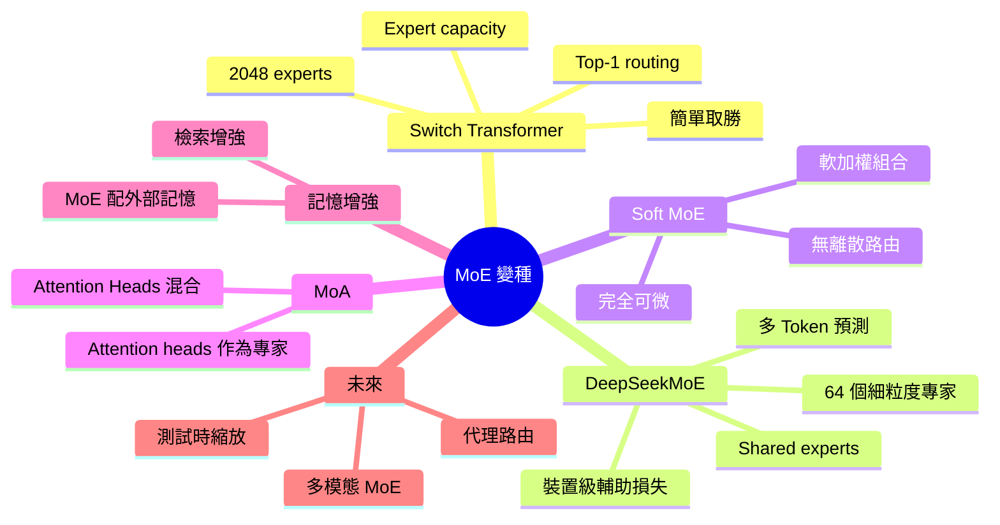
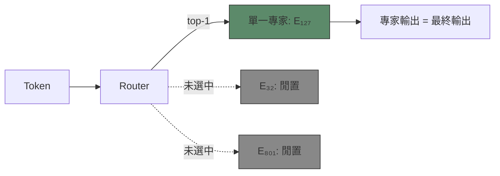
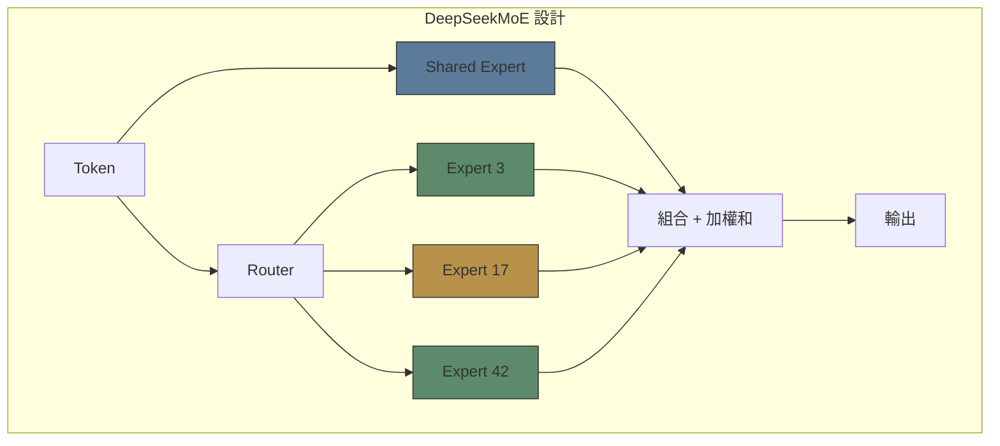
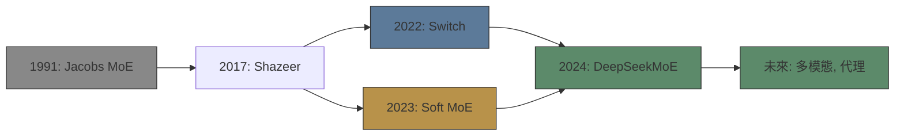

# Module 22: MoE 變種與稀疏模型

Est. study time: 2.0h
Language: yue



## 學習目標
- 比較主要 MoE variant 設計（Switch、DeepSeekMoE、soft MoE）
- 解釋 discrete 同 soft routing 之間嘅權衡
- 分析 DeepSeekMoE 嘅 fine-grained + shared expert 創新
- 辨識 MoE 研究緊嘅新方向

---

## 1. Switch Transformer（Fedus 2022）

**主要創新**: Top-1 routing（k=1）。每個 token 淨係 activate 一個 expert。

### 設計
- **Top-1 gating**: 比 top-2 簡單。冇 weighted combination — expert output 就係最終 output。
- **2048 experts**: 因為單一 expert activation，可以做到咁多 experts。
- **Expert capacity**: 每個 expert 有固定 capacity，防止 router collapse。
- **FP16 training**: 要小心處理 expert overflow 同 underflow。

### 權衡
- **好處**: 簡單、可以 scale 到幾千個 experts、throughput 好
- **壞處**: Top-1 routing 冇咗 expert 組合嘅資訊；難啲 train（容易 collapse）



> **填充**: "Switch Transformer 用 \{top-1\} routing，activate \{每個 token 一個 expert\}。呢個可以 scale 到 \{2048 experts\} 但係冇咗 \{多個 experts\} 組合嘅好處。"

---

## 2. DeepSeekMoE（Dai 2024）

**主要創新**: Fine-grained experts + shared experts + device-level aux loss。

### Fine-Grained Experts
唔用幾個大 experts，改用好多細 experts。
- 標準 MoE: 8-16 experts，每個 FFN size = d_ff
- DeepSeekMoE: 64 experts，每個 FFN size = d_ff / 4

**效果**: 知識分佈更平滑。Token activate 6/64 experts（對比 2/8）→ 組合更精細。

### Shared Experts
有啲 experts 係 **shared**（每個 token 都會 activate），同 routed experts 並存。

**目的**: 常見知識（syntax、簡單 pattern）由 shared experts 處理。Routed experts 處理專門知識。

```text
output = shared_expert(x) + Σ g_i × expert_i(x)
```

### Device-Level Aux Loss
唔用 global load balancing loss，改為每個 GPU device group 各自計 aux loss。防止 token 聚集喺同一個 device。

> **思考**: 點解 shared experts 可以幫 MoE 提高質素？*答案: Shared experts 捕捉每個 token 都需要嘅 universal patterns（基本 syntax、常見知識）。Routed experts 專門處理 niche 領域。如果冇 shared experts，universal patterns 就要喺每個 routed experts 入面重複，浪費 capacity。*

### Multi-Token Prediction（MTP）
DeepSeekMoE 仲引入 MTP：每個位置 predict D 個未來 token（唔止下一個）。令每個位置嘅 training signal 更密集。

**MoE+MTP 協同效應**: MTP 提供更強 gradient signal → 幫 router training → 更好嘅 specialisation。



---

## 3. Soft MoE（Puigcerver 2023）

**主要創新**: 完全冇 discrete routing。

### 點樣運作
Router 唔係每個 token 揀 k 個 experts，而係 **每個 expert slot 對所有 token 做 soft weighted combination**。

```text
For each expert slot s:
  slot_input[s] = Σ w[t,s] × x[t]   # weighted combination of all tokens
  where w[t,s] = softmax(score(x[t], slot_embedding[s]))
```

**效果**: 唔會掉 token。冇 router collapse。冇 expert 死咗。完全可微。

### 權衡
| 好處 | 壞處 |
|-----------|-------------|
| 唔需要 load balancing | 每個 slot 運算量更高（所有 token × 所有 slots） |
| 唔會掉 token | Routing 冇咁可解釋 |
| 完全可微 | Slot capacity 係固定 hyperparameter |
| 永遠平衡 | 可能唔會 specialize 得咁乾淨 |

> **預測**: Soft MoE 幾時會比 discrete MoE 差？*答案: 當需要乾淨嘅 domain separation 嘅時候。Soft MoE 將 token 混合入 experts — 一個多 code 嘅 token 會部分 routing 去 biology expert。Discrete MoE 迫出更乾淨嘅 separation，可能產生更 sharp 嘅 specialisation。*

---

## 4. Mixture of Attention Heads（MoA）

**主要諗法**: 唔係 FFN layers 用 MoE，而係將 MoE 用喺 **attention heads**。

標準 attention: 一個 head 處理所有 token pairs。
MoA: 多個細 attention experts，每個處理唔同嘅 attention patterns。

```text
AttentionExpert_i = Softmax(Q·Kᵀ/√d) · V_i
output = Σ g_i × AttentionExpert_i(x)
```

**動機**: 唔同 attention patterns（local、global、syntactic）可能由唔同 expert attention 運算處理會更好。

**現狀**: 比較 niche。FFN layers 做 MoE 仍然係主流。

---

## 5. Memory-Augmented MoE

將 MoE 結合外部記憶（retrieval）。

**設計**:
- 有啲 experts 係 retrieval experts：佢哋會查外部 memory bank（vector store）
- 其他 experts 係標準計算 experts
- Router 決定：呢個 token 應該 retrieve 定 compute？

**例子**: MoE 連接 Wikipedia 記憶。講「愛因斯坦」嘅 token routing 去 retrieval expert → 攞相關 context → 生成更好。講「隻貓坐咗」嘅 token routing 去標準 expert → 例行 FFN 計算。

---

## 6. 比較表

| 變種 | Routing | Experts | 主要優勢 | 主要弱點 |
|---------|---------|---------|---------------|--------------|
| Standard MoE | top-2 | 8-16 | 簡單、經實證 | Load balance 問題 |
| Switch | top-1 | 2048 | Scale 到好多 experts | 冇咗多 expert 組合 |
| DeepSeekMoE | top-6/64 | 64 | Fine-grained + shared | Aux loss tuning 複雜 |
| Soft MoE | Soft weighted | N slots | 冇 routing 失敗 | 每個 slot 運算量高 |
| MoA | Head-level | N heads | 專門化 attention | Niche、未喺大規模證實 |



---

## 7. 研究前沿

- **Multimodal MoE**: 唔同 modality 用唔同 experts（text、image、audio）
- **Agent MoE**: Experts 作為 agentic skills — 一個 expert 負責 tool use，另一個負責 planning
- **Test-time scaling**: Inference 時增加 expert 數量去提高質素
- **Dynamic depth MoE**: 唔同 layers → 根據 token 難度用唔同 expert 數量

> **捉錯處**: "Switch Transformer 嘅 top-1 routing 差過 top-2，因為每個 token 用嘅 experts 少啲。" *唔一定。Top-1 更簡單、可以 scale 到更多 experts（2048 vs 16）、training dynamics 更乾淨。權衡係冇咗多 expert 組合，但係好多任務單一 expert output 已經足夠（而且 2048 experts 比 16 experts 俾到更精細嘅 domain coverage）。*

---

## Feynman 提示

比較 MoE variants：

1. Switch: top-1、2048 experts、簡單就可以 scale
2. DeepSeekMoE: fine-grained 64 experts、shared experts、device-level aux
3. Soft MoE: 冇 discrete routing、完全可微
4. MoA: attention-level MoE
5. Memory-augmented: retrieval + 計算

檢查：我識唔識解釋幾時揀邊個 variant？我可唔可以預測下一個設計改進？

> **Predict**: Before reading deeper: what do you expect happens when fine interacts with grained experts in moe 變種與稀疏模型?
>
> *Answer: The system relies on fine to keep grained experts predictable — when both apply, the stricter rule wins.*
> **Think**: Why does **設計** matter when working with moe 變種與稀疏模型?
>
> *Answer: Because it changes how you structure and reason about moe 變種與稀疏模型 — skipping it leads to fragile designs that break under real workloads.*
> **Spot the Mistake**: A developer treats fine as optional because "it works without it." Where is the mistake?
>
> *Answer: It works only until the assumptions behind fine are violated. The fix: treat it as part of the contract of moe 變種與稀疏模型, not an optimization.*

