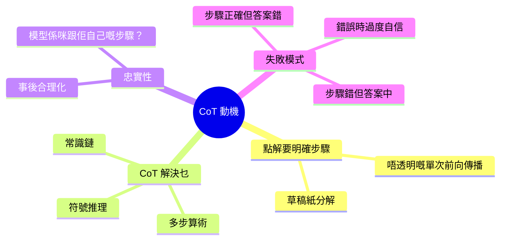
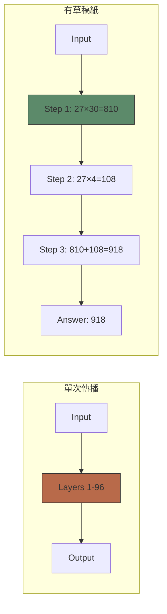
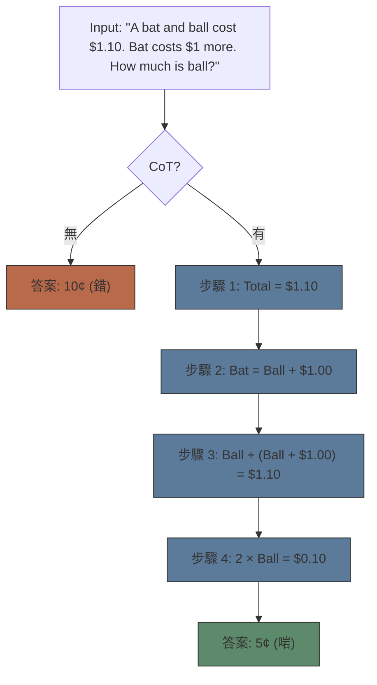
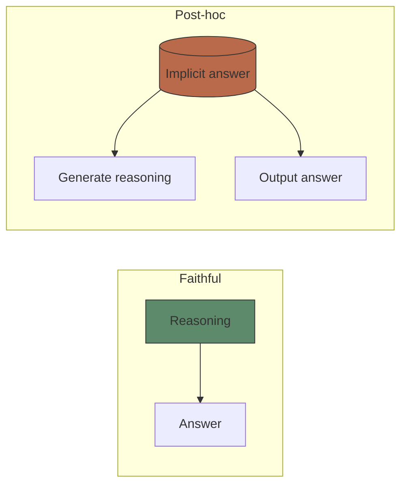

# Module 23: 思維鏈 — 動機

Est. study time: 2.0h
Language: yue

## 學習目標
- 解釋點解 single-pass 模型應付唔到多步推理
- 描述 chain-of-thought 點樣分解複雜問題
- 分析 faithfulness 問題：模型係咪真係用佢講嘅 reasoning？

---

## 1. 唔透明嘅 Forward Pass 問題

標準 LLM 推理：input → 單次 forward pass → prediction。簡單任務 OK。多步推理就唔得，因為：

- **Limited serial processing depth**：Transformer 層數固定（例如 Llama 2 70B 有 96 層）。每層同時處理所有 token。冇專用 "scratch space" 放中間結果。
- **Combinatorial explosion**：Reasoning 路徑隨步驟指數增長。單次 pass 要將所有中間推理壓縮入 hidden states。
- **Recursive composition**：如果 step 5 依賴 step 4 嘅 output，模型必須喺同一次 forward pass 計晒兩個。

> **Cloze**：「喺標準 forward pass 入面，模型得 \{fixed layers\} 去計晒所有 reasoning steps。冇 \{scratch space\} 放 intermediate results。」

**比喻**：叫人唔寫低直接計 27×34。細數字得。多步就冇可能。

---

## 2. CoT 做 Scratchpad

Chain-of-thought 解決呢個問題：將 **中間計算外置** 做 generated tokens。每個 reasoning step 寫出嚟，令到下個 step 可以 attend 到佢。

**點運作**：模型生成好似「等我逐個 step 計：...」嘅文字 — 生成嘅 token 當 working memory 用。後面嘅 token 可以透過 attention attend 返之前嘅 reasoning steps。

> **Predict**：如果逼個模型直接 output 答案（唔畀 steps），5 位數乘法準確度會點？*Answer：準確度大跌。冇 external scratchpad，模型冇辦法喺 fixed-depth layers 入面追蹤 intermediate carries 同 partial results。*

**實證結果**（Wei 2022）：
- 數學文字題：18% → 58%（直接 → CoT）
- GSM8K：~10% → ~60%
- Symbolic reasoning：接近零 → 80%+

---

## 3. Logical Decomposition

CoT 唔止用嚟計數。任何要 intermediate reasoning 嘅任務都得：

| 任務類型 | 例子 | 直接失敗 | CoT 解決方案 |
|-----------|---------|-------------|--------------|
| 算術 | "347 × 289" | 數字溢出 | 部分積 |
| 符號 | "A > B, B > C, C > D → A > D?" | 傳遞鏈 | 列舉配對 |
| 常識 | "Pour water on phone. What happens?" | 單一步驟 | 因果鏈 |
| 多跳問答 | "Where was Obama's first name used?" | 實體追蹤 | 解析追蹤 |

> **Think**：點解 CoT 對 symbolic reasoning 有幫助，即使模型係訓練做 next-token prediction 而唔係 logic？*Answer：CoT 將 implicit reasoning 轉做 explicit text。模型擅長 text generation（佢正係為呢樣嘢訓練出嚟）。通過生成 intermediate steps 做文字，模型用佢嘅 core strength（text completion）嚟做 reasoning。*

---

## 4. Faithfulness 問題

關鍵問題：**模型係咪真係跟佢自己講嘅 reasoning？**

兩個可能性：
1. **Faithful**：模型生成 reasoning steps，然後用嚟計答案 — reasoning 係 causal
2. **Post-hoc**：模型計咗答案先，之後先生成似樣嘅 reasoning — reasoning 係 rationalisation

證據好壞參半：
- **Anti-faithfulness**（Turpin 2023）：喺 prompt 插入無關資訊 → reasoning steps 變咗但答案照樣啱 → 模型答完先 rationalise
- **Pro-faithfulness**（Wang 2023）：改動 intermediate steps → 答案變咗 → 模型真係用啲 steps
- **Reality**：兩樣都有。模型有時跟 steps，有時走捷徑然後後補解釋。

> **Cloze**：「Faithfulness 問嘅係：模型嘅 \{reasoning steps\} 係咪真正導致 \{final answer\}，定係 \{post-hoc rationalisation\}。」

---

## 5. Failure Modes

CoT 強大但唔可靠：

**步驟正確但答案錯**：Reasoning 啱但最後計錯數。例如模型正確列式但加錯數。

**步驟錯但答案啱**：模型中間 reasoning 出錯但撞啱答案啱。對 evaluation 嚟講好危險。

**錯誤時過度自信**：模型生成似層層嘅 steps 但引向錯答案。人類評價者容易信 reasoning 而接受錯答案。

**長度偏見**：Reasoning 越長 → 越多機會出錯。好長嘅 chains 可能走偏。

> **Predict**：如果你喺 CoT prompt 加句「double-check your reasoning」，faithfulness 會唔會增加？*Answer：部分會。佢增加 deliberation 嘅 token 數量，但同時增加 rationalisation 嘅表面面積。Double-checking 幫到手捉 arithmetic errors，但未必 fix 到根本嘅 reasoning fallacies。*

---

## 6. CoT 幾時失效

- **拆唔到嘅任務**：創意、審美判斷、直覺
- **要外部知識嘅任務**：CoT 生成唔到佢唔知嘅事實
- **循環論證嘅任務**：「點解 X 係真？因為 Y。點解 Y 係真？因為 X。」
- **好長嘅 chains**：Error accumulation，attention dilution

> **Error-spotting**：「Chain-of-thought 通過用 attention 對 intermediate tokens 做 working memory 嚟解決 fixed-depth 問題。所以，層數越多嘅模型需要越少 CoT。」*錯喺邊？CoT 有效係因為佢將 computation 外置做 generated tokens，而唔係因為 attention depth 擴大咗。更深嘅模型仍然受惠於 CoT，因為 working memory 喺 generated text 入面，唔係喺 layer depth。兩個機制互補。*

---

## Feynman Prompt

向工程師同事解釋 chain-of-thought reasoning：

1. 問題：fixed-depth transformers 冇辦法一次 pass 做 multi-step reasoning
2. 解決方案：將 intermediate steps 外置做 generated text（scratchpad）
3. 點解有效：利用 text-generation 強項做 reasoning
4. 憂慮：faithfulness — 模型真係跟佢講嘅 reasoning？

解釋完之後，指出：邊啲 failure modes 喺 production 用你最擔心？

> **Spot the Mistake**: Code review note: someone applies 思維鏈 — 動機 everywhere "to be safe" in a 思維鏈 — 動機 codebase. Spot the mistake.
>
> *Answer: Blanket application hides which spots actually need 思維鏈 — 動機. Apply it where the semantics demand it, and document why.*

