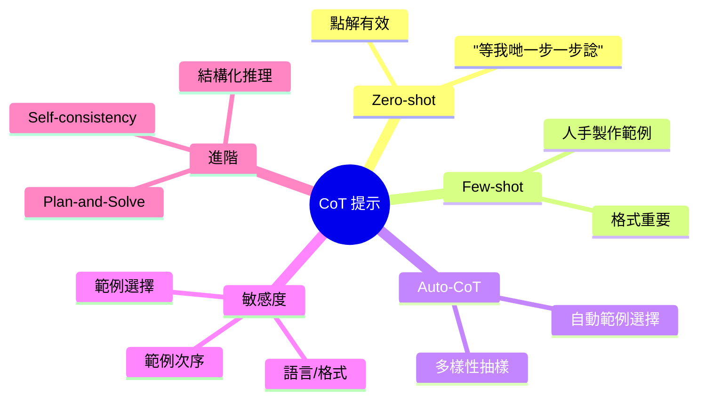
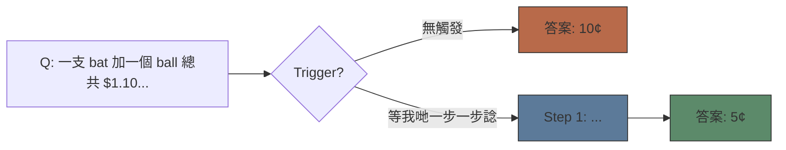
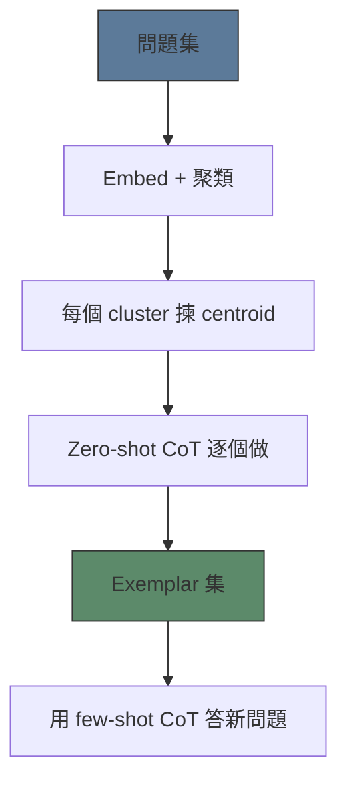

# Module 24: 思維鏈 — 提示策略

Est. study time: 1.5h
Language: yue



## 學習目標
- 應用 zero-shot 同 few-shot CoT prompting
- 為 few-shot CoT 設計有效 exemplars
- 分析 prompt sensitivity 同緩解策略

---

## 1. Zero-Shot CoT

最令人驚訝嘅發現：就咁加句"等我哋一步一步諗"就大幅改善 reasoning。

**Kojima 2022**: Zero-shot CoT 喺好多 benchmark 追到 few-shot CoT。
- GSM8K: ~40% (zero-shot CoT) vs ~10% (標準 zero-shot)
- MultiArith: ~78% vs ~17%
- StrategyQA: ~60% vs ~50%

**點解 work**："等我哋一步一步諗"觸發咗模型嘅 training distribution — 模型見過大量 step-by-step 解決問題嘅例子。呢句嘢啟動咗一個 **reasoning mode**，令生成傾向分解問題。

> **Cloze**: "Zero-shot CoT 靠 \{觸發模型嘅 training distribution\} 去引導 step-by-step reasoning，唔需要 \{exemplars\}。"



**變體**："等我哋小心啲做"、"首先，..."、"等我哋一步步解呢個問題。"效果差唔多。

---

## 2. Few-Shot CoT

俾 2-8 個 exemplars 展示 chain-of-thought reasoning → 模型照跟個 pattern。

**Exemplar 結構**：每個 exemplar = 問題 + reasoning steps + 最終答案。

```text
Q: Roger 有 5 個 tennis balls。佢買多 2 罐，每罐 3 個波。總共幾多個？
A: Roger 本來有 5 個波。2 罐 × 3 個波 = 6 個波。總數 = 5 + 6 = 11。答案: 11

Q: 飯堂有 23 個蘋果。用咗 20 個做午餐，再買多 6 個...
```

> **Predict**: 如果 8 個 exemplars 全部用同一個 template vs 8 個 exemplars 用唔同 reasoning styles，會發生咩事？ *答案：Same-template exemplars 對重複性任務準確率更高。Varied exemplars 對未見過嘅問題類型泛化更好。係 exploitation 同 exploration 之間取捨。*

**設計原則**：
- **Diverse exemplars**：涵蓋唔同 reasoning patterns（算術、符號、常識、multi-hop）
- **正確 reasoning**：每一步都要正確 — 錯咗會擴散
- **合適粒度**：唔好太詳細（浪費 tokens），又唔好太簡略（skip 咗 steps）
- **統一格式**：用相同 answer marker、step numbering、presentation

---

## 3. Auto-CoT

人手揀 exemplars 好麻煩。Auto-CoT (Zhang 2023) 自動化搞掂。

**流程**：
1. 將問題按 embedding similarity 聚類（k-means 做 sentence embeddings）
2. 每個 cluster 揀最接近中心點嘅問題
3. 用 zero-shot CoT 為每個 exemplar 生成 reasoning
4. 將呢啲做 few-shot exemplars

> **Cloze**: "Auto-CoT 揀 exemplars 係靠 \{按 embedding similarity 聚類問題\}，然後用 \{zero-shot CoT\} 生成 reasoning。"

**結果**：喺大多數 benchmark 追平甚至超越人手設計嘅 exemplars。



---

## 4. Prompt Sensitivity

CoT 好脆弱。少少 prompt 改動就令準確率大上大落。

| 因素 | 影響 | 例子 |
|--------|--------|---------|
| Exemplar 次序 | 10-20% 波動 | 同一組 exemplars，唔同次序 |
| Exemplar 選擇 | 20-40% 波動 | 揀邊 4 個例子 |
| Step 粒度 | 5-15% | "Step 1:" vs 點列 |
| 語言 | 10-30% | 英文 vs 其他語言 |
| 格式 | 5-10% | 換行 vs 段落 |
| 觸發詞 | 5-15% | "等我哋諗" vs "等我哋推理" |

**緩解方法**：
- **多組 exemplars**：試 3-5 組唔同組合，揀最好嗰組
- **隨機次序**：唔同 query shuffle exemplars
- **穩健 prompt**：用 delimiter 保持統一格式
- **Ensemble**：行多個 prompts，投票決定答案（睇 self-consistency）

> **Think**: 點解 exemplar 次序影響咁大？ *答案：Autoregressive generation 有 primacy/recency bias。前面嘅 exemplars 設定 pattern；後面嘅微調細節。模型特別注意第一個同最後一個 exemplars。重新排序會改變學到嘅 patterns。*

---

## 5. 進階策略

**Plan-and-Solve** (Wang 2023)：兩階段 CoT。
1. **Plan**：模型生成高層次計劃，唔計具體細節
2. **Solve**：執行每個 plan step

比單次 CoT 更適合複雜任務，因為 plan 提供結構。

**Structured reasoning**：用 JSON、縮排列表或正式符號。
```text
Reasoning:
  - Step 1: 提取變數
  - Step 2: 寫方程
  - Step 3: 求解
  - Step 4: 驗證
答案: 42
```

**Self-consistency** (Wang 2022)：生成多條 CoT paths → 多數投票。修正單條 path 嘅錯誤。喺 benchmarks 上提升 5-15% 準確率。

---

## 6. 實際指引

1. **由 zero-shot CoT 開始**："等我哋一步一步諗。"成本低，通常 work。
2. **唔夠再加 3-5 個 diverse exemplars**：人手做或者用 Auto-CoT。
3. **測試 prompt sensitivity**：Run 同一個 prompt 用唔同 exemplar 次序。
4. **用 self-consistency**：Sample 5-10 條 chains，多數投票。
5. **考慮兩階段**：複雜問題 Plan 咗先執行。

> **Error-spotting**: "Few-shot CoT 用 8 個 exemplars 一定好過 zero-shot CoT。" *有咩問題？多 exemplars 唔一定有用。如果 exemplars 揀得差（相同 pattern、無關領域），反而會 bias 個模型。Zero-shot CoT 有時仲好過用差 exemplars 嘅 few-shot。另外：prompt 太長浪費 tokens 同可能超過 context limits。*

---

## Feynman Prompt

同一個緊 build QA system 嘅 ML engineer 解釋 CoT prompting strategies：

Zero-shot CoT 點樣 work？幾時要轉用 few-shot？Prompt sensitivity 主要來源係咩？點樣緩解？

> **Spot the Mistake**: Code review note: someone applies 思維鏈 — 提示策略 everywhere "to be safe" in a 思維鏈 — 提示策略 codebase. Spot the mistake.
>
> *Answer: Blanket application hides which spots actually need 思維鏈 — 提示策略. Apply it where the semantics demand it, and document why.*

