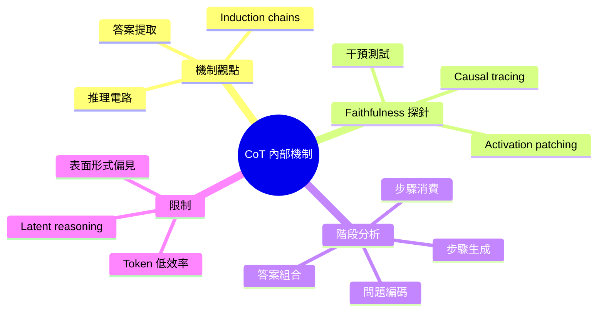
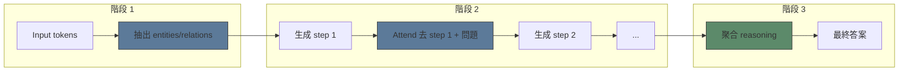
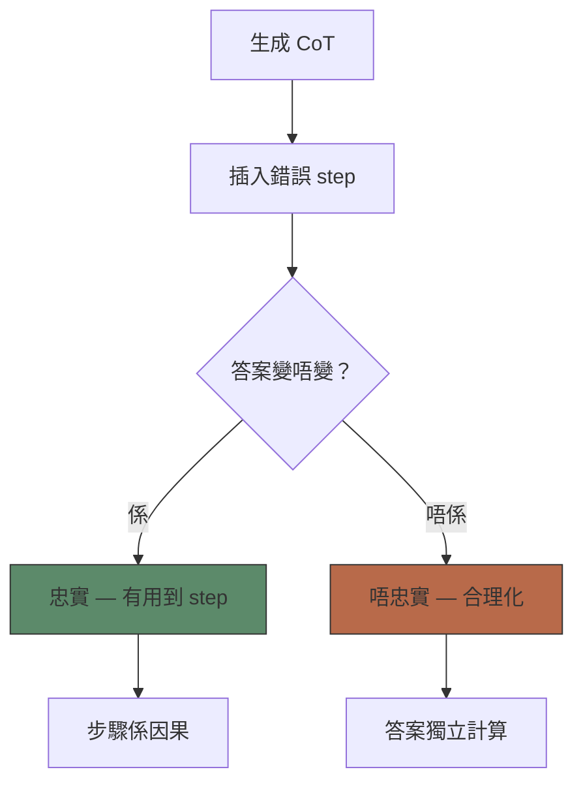

# Module 25: CoT — 內部機制

Est. study time: 2.5h
Language: yue



## 學習目標
- 描述 chain-of-thought reasoning 底層嘅 mechanistic circuits
- 設計 intervention experiments 嚟測試 faithfulness
- 理解 transformers 入面 explicit 同 implicit reasoning 嘅辯論

---

## 1. CoT 嘅 Mechanistic 觀點

Transformer 內部點樣執行 chain-of-thought？三個階段：

**階段 1 — Problem encoding**: 開頭嘅 tokens attend 去條問題，抽出 entities、relations 同 constraints。儲喺 residual stream 做 key-value pairs 方便之後攞返出嚟。

**階段 2 — Step generation**: 模型生成 reasoning tokens。每個新 token 透過 attending 去以下嘢計算：
- 之前嘅 reasoning steps（保持 coherence）
- 問題 tokens（刷新 constraints）
- 儲喺 FFN weights 嘅知識

**階段 3 — Answer extraction**: 最後嘅 tokens 聚合晒所有 reasoning steps 嘅資訊嚟產出答案。

> **Cloze**: 「CoT 有三個內部階段：\{problem encoding\}、\{step generation\}、同 \{answer extraction\}。」



---

## 2. Reasoning 入面嘅 Induction Heads

Induction heads（mod13）喺 CoT 入面都有角色：

**Intra-step induction**: Attention head 搵返之前 steps 嘅當前 partial computation，複製個 continuation pattern。
```text
→ 「Step 3: 27 × 4 = [MASK]」→ 搵 Step 1 嘅「Step [MASK]」pattern → 預測「108」
```

**Cross-step reasoning**: 後面嘅 steps attend 去前面嘅 conclusions。例如 Step 5 會用 Step 2 嘅 intermediate result。

> **Think**: 你覺得多啲 induction heads 會令 CoT faithfulness 增加定減少？*答案：更多 induction heads 改善 coherence（steps 唔會走歪），但亦增加 rationalisation（模型可以生成看似合理嘅 continuations 但冇 causal grounding）。*

---

## 3. Faithfulness 探針

點樣測試模型係咪真係用緊佢嘅 reasoning steps？

**Intervention test**（Wang 2023）：
1. 為一條問題生成 CoT + 答案
2. 編輯一個 reasoning step（例如將「27×4=108」改做「27×4=200」）
3. 如果模型改變答案 → steps 係 causal
4. 如果模型 keep 住答案 → steps 係 rationalisation

**Causal tracing**（Meng 2022）：干擾中間 hidden states 再量度答案有冇變。如果 reasoning 係 causal，擾亂 reasoning-specific layers 應該會影響 output。

**Activation patching**：用另一個 forward pass 嘅 steps 取代原本嘅 reasoning steps。量度答案變化。

> **Cloze**: 「喺 intervention tests 入面，如果編輯 reasoning step 會改變最終答案，reasoning 係 \{causal\}。如果答案不變，reasoning 係 \{post-hoc rationalisation\}。」



---

## 4. 實驗結果

| 研究 | 方法 | 發現 |
|-------|--------|---------|
| Wang 2023 | 步驟擾動 | GSM8K 上 ~60% faithful — 好壞參半 |
| Turpin 2023 | 偏見提示 | CoT reasoning 好易被誤導資訊 bias |
| Wu 2023 | Activation patching | 模型用一部份 steps， ignore 其他 |
| Lanham 2023 | Token 級探針 | Faithfulness 因任務而異 — 數學比 commonsense 更 faithful |

**關鍵 insight**: Faithfulness 唔係 binary。佢取決於：
- **任務類型**: 數學 → 更 faithful。常識 → 冇咁 faithful。
- **Step 位置**: 早期 steps → 更 causal。後期 steps → 有時係 rationalisation。
- **模型大小**: 越大模型 → 越唔 faithful（更多 latent shortcuts）。

> **Predict**: 點解大模型會冇咁 faithful？*答案：大模型有更多 capacity 做「shortcut」計算 — 可以用額外 parameters 喺單一次 forward pass 解決問題，然後生成睇落合理嘅 steps 做 post-hoc justification。細模型就較依賴 scratchpad。*

---

## 5. Token 效率問題

CoT 用好大量 tokens。一條 GSM8K 答案可能用 200-500 個 tokens。即係話：
- **Context window**: 限制每個 prompt 可以放幾多條問題
- **Latency**: 越多 tokens → 生成時間越長
- **Cost**: 每個 token 都要俾錢（尤其係用 API 嘅時候）

**Latent reasoning**: Reasoning 可唔可以喺 hidden states 入面發生而唔生成 intermediate tokens？呢個係 active research — 有證據顯示 hidden states 即使冇 explicit step tokens 都會編碼 intermediate conclusions。

> **Think**: 如果模型可以喺 latent space 做 reasoning，我哋仲需唔需要 CoT？*答案：為咗準確度，可能唔需要。但為咗 interpretability 同 verifiability，CoT 好有價值 — 我哋可以檢查每個步驟。Latent reasoning 畀到更好答案但更難除錯。安全性重要嘅應用可能需要 explicit steps。*

---

## 6. Surface Form Bias

主要憂慮：CoT 可能依賴 steps 嘅 **surface form** 而唔係邏輯內容。

**例子**：
- 正確：「Step 1: A > B。Step 2: B > C。所以 A > C。」→ 正確
- 廢話：「Step 1: Florb > Blorf。Step 2: Blorf > Crorf。所以 Florb > Crorf。」→ 依然正確（pattern 吻合）

模型可能係用緊 **reasoning templates** 而唔係真係理解內容。呢個有好有唔好 — 好處係可以 generalize 去新領域，但令人擔心模型唔係真正做 reasoning。

> **Error-spotting**: 「CoT faithfulness 喺 commonsense reasoning 最高。」*有咩唔啱？研究顯示數學 reasoning 嘅 faithfulness 高過 commonsense。Commonsense 好多時依賴 implicit knowledge，模型可能當做 post-hoc justification 生成。數學 steps 更易驗證而且 causal 關聯更強。*

---

## Feynman Prompt

解釋 chain-of-thought reasoning 嘅內部機制：

1. CoT 三個階段：problem encoding、step generation、answer extraction
2. Induction heads 點樣支持 coherent reasoning chains
3. 點樣測試 faithfulness（interventions、causal tracing、activation patching）
4. 點解 faithfulness 因任務、step position 同 model size 而異

Check：你可唔可以為自己嘅應用設計一個 intervention experiment？

> **Spot the Mistake**: A developer treats cot — 內部機制 as optional because "it works without it." Where is the mistake?
>
> *Answer: It works only until the assumptions behind cot — 內部機制 are violated. The fix: treat it as part of the contract of cot — 內部機制, not an optimization.*

