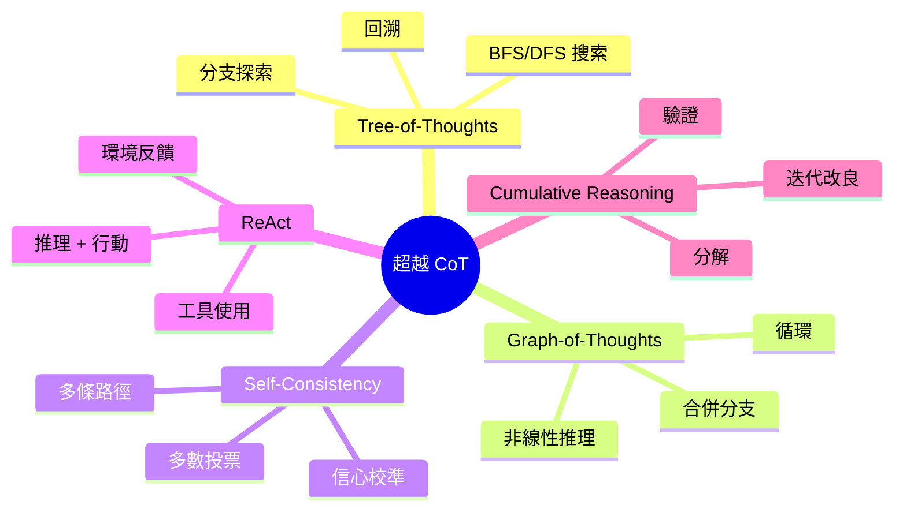
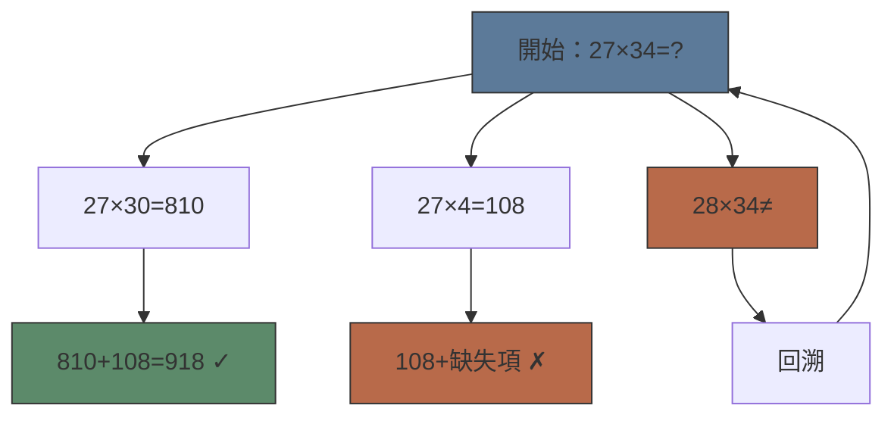
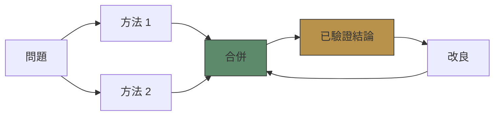

# Module 26: 超越 Chain-of-Thought

Est. study time: 2.5h
Language: yue



## 學習目標
- 比較對比 ToT、GoT 同 CoT 推理策略
- 解釋 self-consistency 同多數投票點樣提升準確度
- 設計結合推理同行動嘅 ReAct agent

---

## 1. Tree-of-Thoughts (ToT)

CoT 係線性。好多推理任務都需要**搜索**——探索多個分支，錯咗就回溯。

**ToT** (Yao 2023)：將推理表示成樹。每個節點 = 推理狀態。子節點 = 可能嘅下一步。

**搜索策略**：
- **BFS**：逐層探索所有路徑。適合短解決方案。
- **DFS**：探索一條路徑直到完成。卡住就回溯。適合長解決方案。
- **Best-first**：用啟發式評分節點。優先擴展最高分嘅。

> **Cloze**: "Tree-of-Thoughts 擴展 CoT 係通過 \{搜索多個推理分支\}，而唔係跟 \{單一線性路徑\}。"



**實證**：ToT 解決 Game of 24（用 4 個數字湊 24）達到 74%，CoT 得 4%。創意寫作方面，ToT 產生更連貫嘅計劃。

**成本**：貴好多。每個節點 = LLM 一次呼叫。BFS 深度 3、寬度 5 = 每條問題 15+ 次呼叫。

---

## 2. Graph-of-Thoughts (GoT)

ToT 局限於樹——邊只能由父到子。真實推理有時需要**合併分支**或者**循環**。

**GoT** (Besta 2023)：推理狀態嘅有向圖。可以：
- **收斂**：兩條推理路徑合併（唔同方法，同一結論）
- **循環**：重訪並改良之前嘅推理
- **驗證**：加「驗證節點」檢查多個分支

> **Predict**: 幾時合併推理路徑會有幫助？*答案：當唔同方法得出相同結果，結論更穩陣。當方法衝突，合併節點可以標記不一致並觸發重新評估。*



---

## 3. Self-Consistency

比 ToT/GoT 更簡單嘅替代方案：獨立生成多條 CoT 路徑，然後多數投票。

**Wang 2022**：Self-consistency 將數學、常識、符號推理嘅準確度提升 5-15%。

**運作方式**：
1. 抽樣 N 條 CoT 路徑（temperature > 0 確保多樣性）
2. 從每條路徑提取最終答案
3. 多數投票（或者按路徑信心加權）

> **Cloze**: "Self-consistency 提升準確度係通過 \{抽樣多條推理路徑\} 同 \{投票選出最常見答案\}。"

**點解有效**：個別路徑有隨機錯誤。錯誤通常跨樣本唔相關。多數投票抵消噪音。

**N 嘅選擇**：典型用 5-10。超過 10-20 後回報遞減。

| 路徑 | 推理 | 答案 |
|------|-----------|--------|
| 1 | 27×30=810, 27×4=108, 810+108 | 918 |
| 2 | 27×34=27×35-27=945-27 | 918 |
| 3 | 34×20=680, 34×7=238, 680+238 | 918 |
| 投票 | — | **918** ✓ |

---

## 4. ReAct

**ReAct** (Yao 2022)：結合推理同行動（工具使用、環境互動）。

**模式**：Reason → Act → Observe → Reason → Act → ...

```text
Thought: 我需要搵東京而家嘅天氣。
Action: search_weather(Tokyo)
Observation: 東京，28°C，多雲
Thought: 我而家可以答用戶問題。
Answer: 東京天氣係 28°C，多雲。
```

**關鍵優勢**：將推理紮根喺外部現實。減少幻覺，因為模型透過工具核查事實。

**組件**：
- **推理**：CoT 式步驟規劃做乜
- **行動**：函數呼叫（搜索、計數機、數據庫查詢）
- **觀察**：環境返回嘅結果
- **迭代**：用觀察結果改良下一步行動

> **Think**: ReAct 同冇推理嘅工具使用有咩分別？*答案：冇明確推理嘅話，工具使用只係反應式——需要嗰陣就 call function。有推理嘅話，模型會計劃叫邊個工具同點解。推理為行動選擇提供理由，令行為可解釋同可調試。*

---

## 5. Cumulative Reasoning

**Cumulative reasoning** (Cheng 2023)：Agent 將問題分解、解決子問題、驗證每一步、累積已驗證事實。

**流程**：
1. **分解**：將問題拆成子問題
2. **解決**：回答每個子問題（有需要可以用工具）
3. **驗證**：檢查每個子答案嘅一致性
4. **累積**：將已驗證事實加入知識庫
5. **綜合**：將所有事實組合成最終答案

**迭代改良**：模型生成答案 → 審查自己嘅答案 → 發現問題 → 重新生成。用喺 self-refine (Madaan 2023)。

---

## 6. 比較

| 策略 | 結構 | 成本 | 最適合 |
|----------|-----------|------|----------|
| CoT | 線性鏈 | 低 | 多步推理 |
| ToT | 樹搜索 | 高 | 創意任務、謎題 |
| GoT | 圖搜索 | 極高 | 複雜綜合 |
| Self-consistency | N 條並行鏈 | 中 | 提升準確度 |
| ReAct | 循環迴圈 | 中 | 有根有據嘅推理 |
| Cumulative | Pipeline + 驗證 | 高 | 需要驗證嘅應用 |

> **Error-spotting**: "Tree-of-Thoughts 永遠比 Chain-of-Thought 好。" *錯咩？ToT 唔係永遠更好。簡單問題用 CoT 就夠——ToT 會加無謂成本。ToT 嘅優勢係需要搜索嘅任務：回溯、探索替代方案。線性推理任務方面，ToT 同 CoT 表現差唔多，但 CoT 平啲。*

---

## Feynman Prompt

向你嘅 product manager 解釋呢個推理策略光譜：

由簡單 CoT → self-consistency → ToT/GoT → ReAct。幾時用邊種？成本效能取捨係點？

你會推薦邊種策略用喺：客戶支援 Q&A 系統？Code generation agent？醫療診斷助手？

> **Spot the Mistake**: A developer treats 超越 chain-of-thought as optional because "it works without it." Where is the mistake?
>
> *Answer: It works only until the assumptions behind 超越 chain-of-thought are violated. The fix: treat it as part of the contract of 超越 chain-of-thought, not an optimization.*

