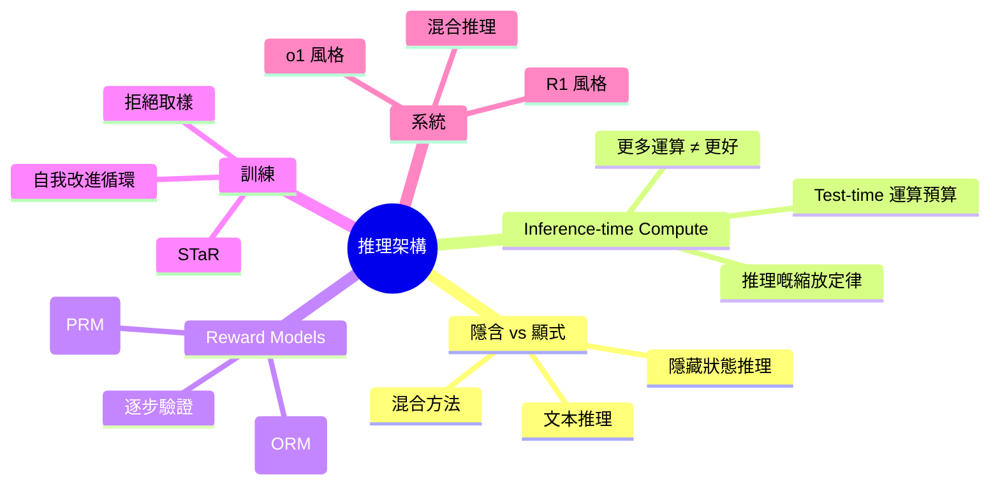
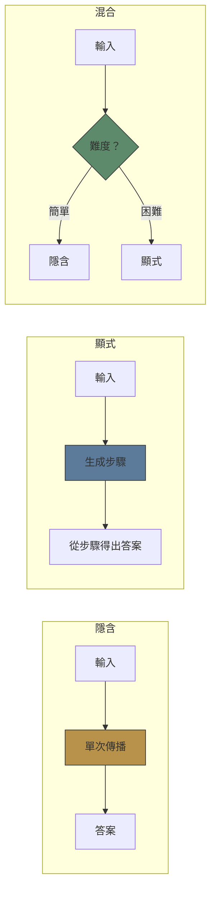
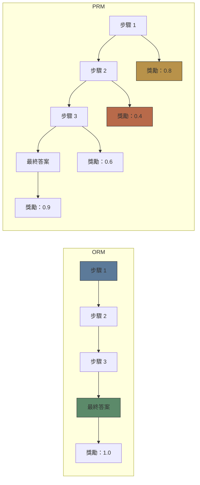

# Module 27: 推理架構

Est. study time: 2.0h
Language: yue

## 學習目標

- 對比 transformer 架構入面 implicit 同 explicit 推理
- 分析 inference-time compute 同 test-time scaling
- 了解 PRM 同 ORM 喺過程級別監督上嘅分別

---

## 1. Implicit vs Explicit 推理

**Implicit 推理**：模型喺單次前向傳播入面計出答案。冇中間 token。快、平，但唔透明。

**Explicit 推理**：模型生成中間 token (CoT)。慢啲、貴啲，但可解釋而且通常更準確。

**混合**：模型對簡單任務用 implicit 推理，對困難任務用 explicit 推理。檢測任務難度本身已經係一個難題。

> **Cloze**：「Implicit 推理喺 \{單次前向傳播\} 發生，冇中間 token。Explicit 推理 \{生成中間步驟\} 做文本。」

**邊個好啲？** 視乎情況。80% 日常查詢 implicit 就夠。複雜推理需要 explicit。條 threshold 隨模型大小改變——越大嘅模型可以 implicit 解決越難嘅任務。

---

## 2. Inference-Time Compute

更多 inference 運算 → 更好推理。但關係有 nuance。

**Test-time compute 縮放定律**：
- CoT 早期 token 帶嚟最大效益。大概 N 步之後回報遞減。
- 更闊路徑 (self-consistency、N 個樣本) 按 sqrt(N) 線性幫助。
- 更深路徑 (ToT、迭代改進) 有幫助但會 plateau。

> **Predict**：推理預算點用最好——10 條平行 CoT 路徑定 1 個有 10 個節點嘅 ToT？*答案：對定義明確嘅問題，self-consistency (10 條路徑) 通常 outperform ToT。ToT 喺需要搜尋（回溯）時贏。一般規則：對大多數任務，平行探索 > 順序搜尋。*

**Test-time 運算預算**：
- 固定預算 → 對多條路徑取樣 → 多數投票
- 彈性預算 → 早期驗證 → 有信心就停。冇信心就繼續。

---

## 3. Process Reward Models (PRM)

標準 RLHF 用 **outcome reward**——最後俾獎勵。對推理嚟講，**process reward**——逐步獎勵——更有信息量。

**ORM** (Outcome Reward Model)：只評分最終答案。簡單但冇中間信號。

**PRM** (Process Reward Model)：評分每個推理步驟。可以做到：
- **逐級驗證**：早期檢測錯誤
- **搜尋指導**：喺 ToT 剪走錯嘅分支
- **細粒度反饋**：就算最終答案錯，正確嘅子步驟照樣獎勵

> **Cloze**：「ORM 只獎勵 \{最終答案\}。PRM 獎勵每個 \{中間推理步驟\}。」

**PRM 訓練**：需要逐級標籤——收集成本高。近期研究用：
- **自動 PRM**：Monte Carlo 估算——從每個步驟取樣多個完成，估算步驟正確率等於達到正確最終答案嘅概率
- **Math-Shepherd** (Yu 2023)：透過最後一步驗證自動生成 PRM

---

## 4. 訓練推理模型

**STaR** (Zelikman 2022)：Self-Taught Reasoner。
1. 生成 few-shot CoT 示例
2. 為訓練問題生成推理
3. 過濾淨係要正確答案 + 推理
4. 喺過濾後嘅數據上微調
5. 重複 (bootstrapping)

**拒絕取樣**：每條問題生成好多 CoT 路徑。只訓練行得通到正確答案嘅路徑。簡單但有效——o1 都用。

**迭代自我改進**：
1. 模型生成推理 + 答案
2. 驗證器檢查正確性
3. 正確例子 → 訓練數據
4. 微調 → 改進咗嘅模型
5. 重複

> **Think**：如果驗證器都唔完美會引起咩問題？*答案：模型可以 exploit 驗證器盲點——生成似層層但錯嘅推理，驗證器照收。呢個係推理嘅「reward hacking」問題。需要高質量驗證器或者人類介入。*

---

## 5. 生產系統

**o1 風格 (OpenAI)**：Inference-time 運算縮放。模型內部生成好多 CoT 路徑，用 PRM 揀最好嗰條。用戶睇唔到——推理喺「模型腦入面」發生。

**R1 風格 (DeepSeek)**：為推理做強化學習。模型用基於規則嘅獎勵（格式 + 答案正確性）訓練。湧現出自動驗證、反思同長 CoT。

**混合推理**：
- 快速答案 (implicit, <1s) 俾簡單查詢
- 深度推理 (explicit, 5-60s) 俾困難查詢
- Agentic loops (ReAct, 分鐘至小時) 俾複雜任務

---

## 6. 開放問題

- **Test-time 運算分配**：每條查詢用幾多運算？
- **PRM 泛化**：喺數學上訓練嘅 PRM 能唔能夠轉移到其他領域？
- **大規模可信性**：點樣驗證好長鏈嘅推理？
- **推理 + 檢索**：檢索可唔可以輔助推理而又唔打斷條鏈？

> **Error-spotting**：「Process reward models 永遠 outperform outcome reward models 喺推理任務。」*有咩問題？PRM 需要逐級標籤，成本高。質量差嘅 PRM 可能俾出比簡單 ORM 更差嘅指導。PRM 亦假設推理係線性同可分解——有些問題需要整體判斷，PRM 會 miss 呢啲。實證結果顯示 PRM 喺數學贏 ORM，但唔係成日喺常識推理贏。*

---

## Feynman Prompt

向一個整緊推理 agent 嘅 ML engineer 解釋推理架構：

1. Implicit vs explicit 推理嘅取捨
2. 點解 inference-time compute 重要同點樣分配
3. PRM vs ORM——幾時用邊種
4. STaR、拒絕取樣、自我改進循環

如果要整一個需要可靠多步推理嘅系統，你會揀邊種架構？

> **Spot the Mistake**: A developer treats 推理架構 as optional because "it works without it." Where is the mistake?
>
> *Answer: It works only until the assumptions behind 推理架構 are violated. The fix: treat it as part of the contract of 推理架構, not an optimization.*

