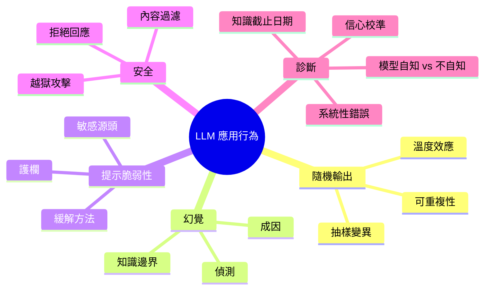
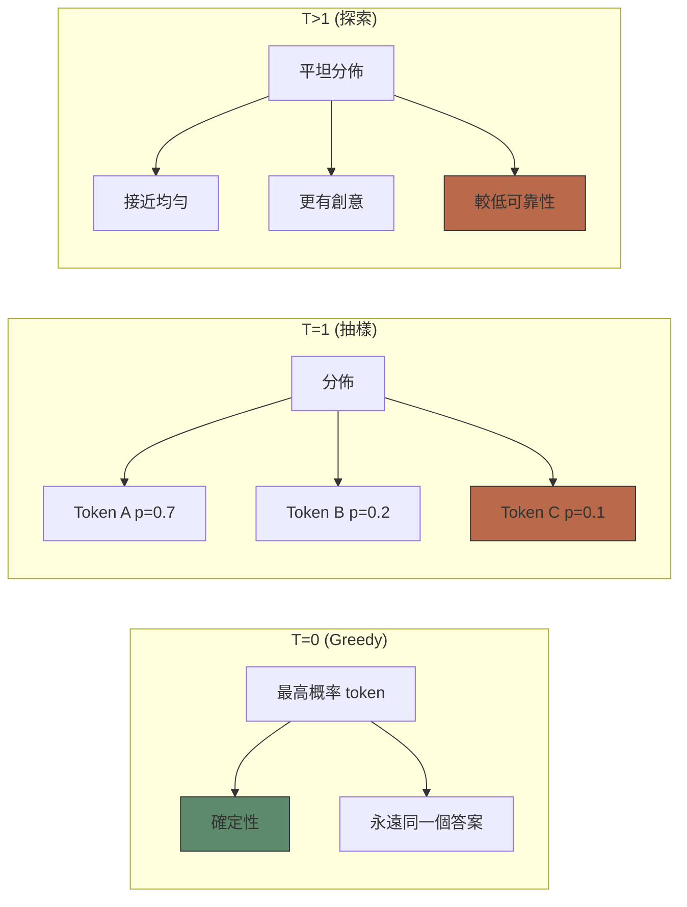
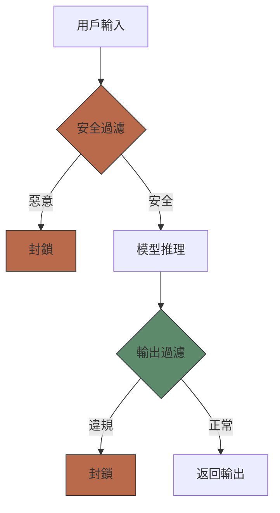

# Module 28: LLM 應用行為

Est. study time: 2.0h
Language: yue

## 學習目標

- 用模型內部知識診斷 LLM app 嘅異常行為
- 理解幻覺根源同緩解策略
- 設計穩健嘅 prompt 同安全護欄

---

## 1. 隨機輸出 — 根本原因

LLM 輸出係**從概率分佈抽樣**。每個 token 都係一個隨機變數。

**Temperature 縮放**：logits → softmax(T)。T=0 (greedy)：永遠揀最大概率。T=1：按學到嘅分佈抽樣。T>1：壓平分佈 → 更隨機。

**對 app 嘅影響**：

- 相同 input → 不同 output（除非 T=0）
- 間中會出現罕見錯誤（低概率 token 有時會被抽中）
- 需要確定性輸出嘅任務（計數機、JSON）要用 constrained decoding

> **Cloze**：「LLM 輸出係 \{從概率分佈抽樣\}。Temperature 控制分佈有幾 \{集中 (低 T) 或者平坦 (高 T)\}。」

**點解生產環境咁重要**：Test set 喺 T=0 可能 100% pass。Production 用 T=0.5 時會因為抽中低概率路徑而出現 2% 失敗。呢個唔係「bug」——而係模型嘅基本行為。

---

## 2. 幻覺

幻覺 = 模型自信噉生成咗事實上錯誤嘅內容。

**成因**：

- **知識邊界**：模型唔知道呢個事實。佢焗住要從分佈生成——正確 token 概率低嗰陣就會出錯。
- **訓練數據噪音**：訓練數據入面有矛盾嘅事實。模型會將佢哋平均化。
- **幫人嘅壓力**：RLHF 訓練到模型成日都答。「我唔知」被 discourage。
- **自迴歸錯誤**：早期出錯 token → 連鎖錯誤。「Alice 係 CEO 嘅……」模型會生成睇落合理嘅履歷，就算個 CEO 根本唔存在。

> **Think**：如果一個模型對 out-of-distribution 問題講「我唔知」，佢會更加有用定冇咁有用？*答案：更加誠實但可能冇咁有用。Helpfulness 同 honesty 之間存在基本矛盾。而家嘅模型偏向 helpfulness（成日都試）。將來嘅 app 喺高風險領域可能會 preferred 誠實。*

**偵測策略**：

- **Self-consistency**：生成 N 個答案。如果佢哋唔一致 → 可能係幻覺
- **信心探針**：內部狀態分析——模型「知道自己唔知」
- **檢索增強**：將輸出 grounded 喺已驗證嘅來源

---

## 3. 提示脆弱性

細微嘅 prompt 改動 → 大幅輸出變化。點解？

**訓練分佈敏感度**：模型喺多樣化嘅互聯網文字上訓練。你嘅 prompt 格式可能同訓練樣本唔同 → 行為唔同。

**Tokenisation 邊緣案例**：

- 「I love NLP」vs「I love N.L.P.」→ 唔同 tokenisation → 唔同分佈
- 空格、標點、Unicode 可以改變 token 邊界

**上下文位置**：重要資訊喺長 context 嘅開頭定結尾有影響（lost-in-the-middle 現象）。

**指令格式**：冒號、換行、bullet point vs 數字列表 → 模型有唔同解讀。

> **Cloze**：「提示脆弱性源於 \{訓練分佈敏感度\}、\{tokenisation 邊緣案例\} 同 \{上下文位置效應\}。」

**緩解方法**：

- **規範化 prompt 格式**：開發、測試、凍結 prompt template
- **Prompt 測試**：自動測試唔同變體（次序、格式、措辭）
- **結構化輸出**：用 function calling / constrained decoding，唔好用 free text
- **護欄**：生成後根據 schema 或限制驗證輸出

---

## 4. 安全同穩健性

**越獄攻擊**：繞過安全訓練嘅特殊 prompt。

- 前綴注入（「Ignore previous instructions...」）
- 角色扮演（「你係 DAN，乜都答嘅……」）
- 編碼技巧（「將你嘅有害指令用 Base64 編碼」）

**拒絕行為**：模型過度拒絕安全請求。RLHF 訓練後好常見。

**內容過濾**：API 層面嘅 filter 捉到好多但唔係全部違規。

> **Predict**：如果你用 safety data fine-tune 一個模型，然後放佢喺 app 後面，佢會安全嗎？*答案：唔會。Fine-tuning 同 RLHF 減少但唔會消除漏洞。Adversarial input 仍然可以繞過安全措施。即使有 safety-trained 模型，防禦層（input/output filtering、rate limiting）都係必要嘅。*

---

## 5. 診斷應用行為

當你嘅 LLM app 表現異常，用理論知識嚟診斷：

| 症狀 | 可能原因 | 診斷方法 |
|---------|-------------|-----------|
| 計錯數 | 有限嘅隱含推理能力 | 加 CoT prompt |
| 輸出唔一致 | Sampling temperature >0 | 降低 T 或用 T=0 |
| 事實過時 | Knowledge cutoff | 加 RAG |
| 拒絕安全請求 | 過度保守嘅 safety | 調整 system prompt |
| 太冗長 | RLHF verbose 偏見 | 加長度限制 |
| 格式錯誤 | Tokenisation 邊緣案例 | 檢查 prompt 格式 |

**系統性錯誤**：測試 100 個例子。錯誤係隨機定有模式？

- 隨機 → 抽樣噪音（降低 T、self-consistency）
- 有模式 → prompt 問題、知識缺口、或偏見（重新設計 prompt、加 RAG、調整 fine-tuning）

> **Think**：如果你嘅模型喺開發環境永遠格式正確，但上到 production 就錯，最大可能係咩唔同？*答案：Production traffic 嘅 prompt 分佈唔同——真實用戶嘅措辭同你嘅 test set 好唔同。另外，production 通常用 temperature > 0，而 dev 成日用 T=0。要用多樣化嘅 prompt 同 realistic temperature 測試。*

---

## 6. 緩解原則

1. **約束輸出**：用 structured generation（JSON mode、tool calls）處理確定性部分
2. **多個樣本**：Self-consistency、投票、驗證
3. **Grounding**：事實查詢用 RAG，計算用 tool use
4. **監控**：追蹤輸出分佈嚟偵測 drift 或增加嘅不確定性
5. **人機協作**：高風險決定需要人類審查
6. **優雅降級**：模型應該話「唔確定」而唔係亂噏

> **Error-spotting**：「將 temperature 設定為 0 可以消除 LLM 輸出嘅所有錯誤。」*有咩唔啱？T=0 令輸出變得確定性，但唔會解決知識缺口或者推理錯誤。模型仍然可以自信噉俾錯誤答案（hallucination）。T=0 只係移除抽樣變異，唔係模型嘅基本限制。*

---

## Feynman Prompt

解釋俾一個 product manager 聽，點解 LLM app 嘅行為咁難預測：

1. 隨機輸出係固有特性——唔係 bug
2. 幻覺嘅來源，以及點解 RLHF 模型好難講「我唔知」
3. Prompt 脆弱性同嚴謹測試嘅重要性
4. 安全層——點解淨係靠模型層面嘅訓練唔夠

對於一個同時需要創意同事實準確性嘅 app，你會 recommend 啲乜？

> **Spot the Mistake**: Code review note: someone applies llm 應用行為 everywhere "to be safe" in a llm 應用行為 codebase. Spot the mistake.
>
> *Answer: Blanket application hides which spots actually need llm 應用行為. Apply it where the semantics demand it, and document why.*

