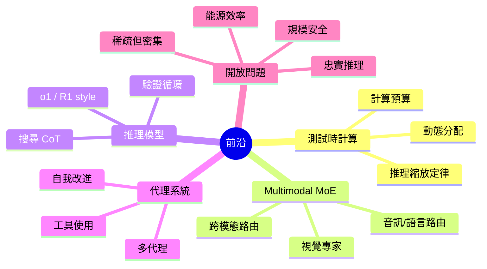
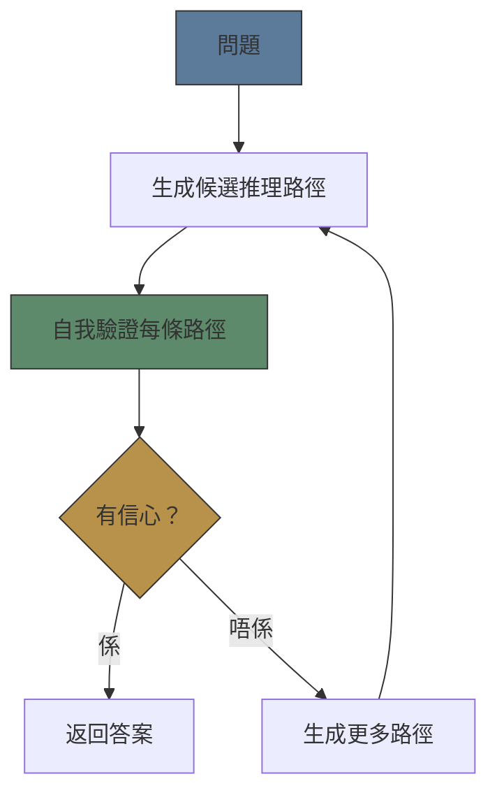

# Module 29: 前沿與未來方向

Est. study time: 1.5h
Language: yue

## 學習目標
- 辨識稀疏模型同推理方面嘅前沿研究方向
- 分析 test-time compute scaling 同佢嘅影響
- 理解結合 retrieval、reasoning 同 action 嘅 agentic systems

---

## 1. Test-Time Compute Scaling

傳統 scaling law 集中喺 **training compute**。新範式：**inference-time scaling**。

**關鍵洞察**：推理時畀模型更多 compute（更多 tokens、更多 samples、search）可以替代 training compute 嚟做推理任務。

**Scaling law 類比**：
- Training scaling：更多 data + params → 更好 base model
- Inference scaling：更多 inference compute → 更好 task performance
- 取捨：將 compute 用喺 training 嚟建立通用能力，定係用喺 inference 嚟解決難題

> **Cloze**：「Test-time compute scaling 提供咗一個 \{inference-time\} 替代方案去取代 \{training compute\}，用嚟改善 reasoning performance。」

**研究方向**：
- **Compute budgeting**：每條 query 要用幾多 inference compute？自適應：簡單 query → 便宜，難 query → 昂貴
- **Speculative reasoning**：快速生成候選答案，然後驗證
- **Inference-time fine-tuning**：推理期間短暫將模型適應到任務（few-shot、ICL 可以視為 inference-time adaptation）

---

## 2. Multimodal MoE

將 MoE 同 multimodal models（image、audio、video、text）結合。

**標準 MoE**：Router 根據 learned routing 將 tokens 送到 experts（shallow router，單一 modality）。

**Multimodal MoE**：Experts 可以按 modality 或者 cross-modal reasoning 專門化。

- **Vision experts**：細粒度圖像特徵
- **Audio experts**：語音模式、語氣分析
- **Text experts**：語言推理
- **Routing**：Cross-modal router 學習將 vision tokens 路由到 text experts 做 captioning，將 text tokens 路由到 vision experts 做圖像生成

> **Predict**：Multimodal MoE 會用 shared 定 modality-specific experts？*答案：兩者皆有。部分 experts 共享跨模态模式（compositionality、syntax）。其他係 modality-specific（pixel processing、phoneme recognition）。Router 要學識為每個 token 路由到合適嘅 experts。*

**DeepSeek-VL2**：MoE vision-language model。Sparse activation 用於 multimodal tasks。

---

## 3. Reasoning Models (o1 / R1)

OpenAI o1 同 DeepSeek R1 代表新範式：

**o1-style**：用 reinforcement learning 訓練到「諗過先答」。內部 chain-of-thought 具有：
- 搜尋 reasoning paths
- 自我驗證步驟
- 從死路 backtrack
- 信心感知答案選擇

**關鍵架構特徵**：
- **Inference-time search**：唔單止生成，仲要探索 reasoning space
- **Process-based rewards**：Reward model 檢查每一步
- **Compute budget**：更難嘅問題花更多 tokens

> **Cloze**：「o1-style models 使用 \{inference-time search\} 喺 reasoning paths 上，配合 \{process-based rewards\}。R1 使用 \{reinforcement learning with rule-based rewards\}。」

**R1 創新**：簡單 rule-based rewards（format + 答案正確性），唔使 PRM。涌現象：
- Self-verification（模型檢查自己嘅推理）
- Reflection（識別同修正錯誤）
- Long CoT（需要時生成超長推理鏈）

---

## 4. Agentic Systems

超越單次 LLM 調用：能夠觀察、規劃、執行同學習嘅 agents。

**Agent loop**：
1. **Observe**：接收輸入、查詢環境（search、DB、API）
2. **Plan**：分解任務、決定行動順序
3. **Execute**：調用工具、生成文字、互動
4. **Reflect**：評估結果、調整計劃、從反饋中學習

**Multi-agent**：多個 LLM agents 有唔同角色（planner、executor、critic）。辯論、協作、競爭。

**Self-improvement**：Agent 記錄成功/失敗，用佢哋改善未來表現（prompt tuning、few-shot example selection、tool selection）。

> **Think**：而家 agentic architecture 有咩根本限制？*答案：Error accumulation。規劃入面一個錯誤會傳播到成個 loop。現有 agents 自我修正能力有限。改善 verification 同 recovery mechanisms 係活躍研究領域。*

---

## 5. 開放問題

| 問題 | 難點 | 進展跡象 |
|---------|-------------|-------------------|
| 稀疏但密集模型 | MoE 仍然喺死 experts 上浪費 parameters | Dynamic expert creation, soft MoE |
| 忠實推理 | 模型合理化多過真正推理 | Intervention tests, mechanistic interpretability |
| 規模安全 | 越大模型越難對齊 | Constitutional AI, debate, scalable oversight |
| 能源效率 | Training + inference compute 指數增長 | Hardware improvements, 更細 active param models |
| 長上下文 | Quadratic attention, lost-in-middle | Linear attention, Mamba, RWKV |
| 真正組合 | 技能唔能夠可靠組合 | Task vectors, model arithmetic |

---

## 6. 總結：宏觀圖景

**28（而家 29）個 modules** 涵蓋咗：

1. **基礎** (mod1-5)：語言模型、神經網絡、attention、transformer
2. **LLM 深入探討** (mod6-15)：Tokenisation → scaling law → alignment → evaluation
3. **Mixture of Experts** (mod16-22)：動機 → 架構 → 訓練 → 部署
4. **Chain of Thought** (mod23-27)：點解有效 → prompting → mechanisms → beyond
5. **應用與前沿** (mod28-29)：App 行為、安全、未來方向

**核心主題**：理解形式機制 → 診斷同預測 LLM 行為。
- Probabilistic nature 解釋輸出變異
- Transformer architecture 解釋上下文限制
- MoE 解釋 compute-accuracy 取捨
- CoT 解釋推理成功同失敗
- Scaling laws 解釋涌現同平台期

> **Error-spotting**：「有足夠 MoE experts 同 CoT steps，LLMs 可以解決任何推理任務。」*有咩問題？存在根本限制：token context window（冇辦法一次過推理成部百科全書），knowledge cutoffs（唔知道非公開事件），computational budget（無限搜尋冇可能），同 data domain limitations（冇辦法推理訓練數據冇涵蓋嘅主題）。*

---

## Feynman 提示

回顧成個課程。揀一個 module，用簡單方式解釋俾 junior engineer 聽：

解釋關鍵直覺、形式機制、同一個實際含義。

如果你要從每部分（Foundations、LLM Deep Dive、MoE、CoT、Frontiers）記住一件事，你會記住咩？

> **Spot the Mistake**: A developer treats 前沿與未來方向 as optional because "it works without it." Where is the mistake?
>
> *Answer: It works only until the assumptions behind 前沿與未來方向 are violated. The fix: treat it as part of the contract of 前沿與未來方向, not an optimization.*

