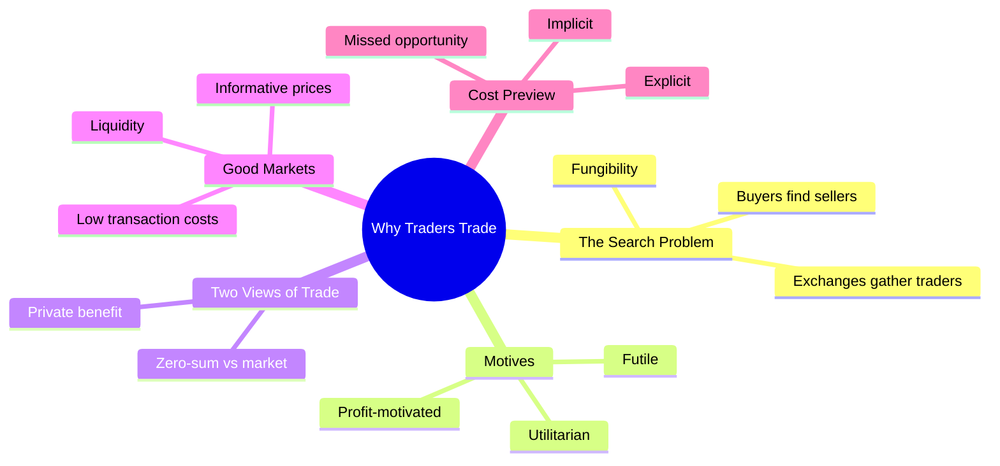
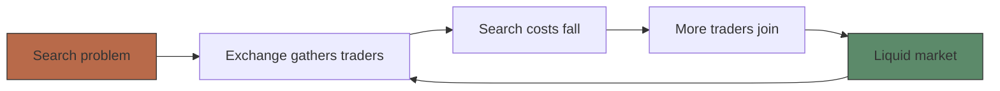
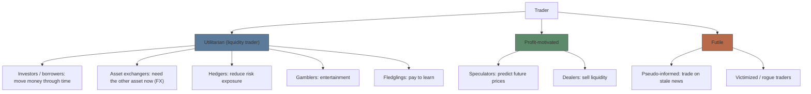
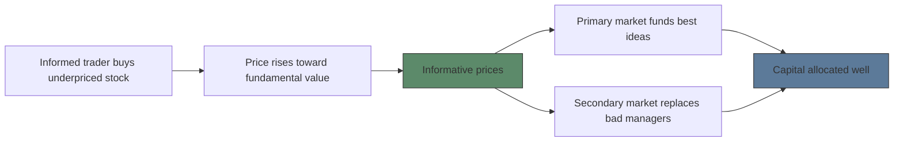

# Module 01: Why Traders Trade

Est. study time: 1.5h
Language: en
Description: Why voluntary trade happens, who trades and why, and what makes a market good — from Harris, Trading and Exchanges (ch. 1, 2, 8, 9).

## Knowledge Map

---

## Learning Objectives
- Explain why voluntary trade benefits both sides and how that squares with trading being zero-sum
- Classify traders by motive: utilitarian, profit-motivated, futile — with examples of each
- Identify the attributes of a good market: low transaction costs, liquidity, informative prices
- Break transaction costs into explicit, implicit, and missed-opportunity components

---

## Real-World Example

Jennifer wants to sell 200 AT&T shares. Quote on screen: bid 19.83 / offer 19.85. She submits a day limit order at 19.80. An hour later a large seller's market order crosses the book and her order fills at 19.80 — commission $15. Meanwhile a buyer somewhere thinks 19.80 is *cheap*.

> **Think**: If Jennifer thinks the stock is worth getting out of at 19.80 and the buyer thinks it's worth holding at 19.80, who is right? Why did both trade anyway?
>
> *Answer: Neither view needs to be "right." Jennifer sells because cash serves her better now (motive), the buyer buys because the share serves him better now. Voluntary trade means each side values what it receives more than what it gives up — at the moment of the trade. The disagreement about future price is exactly what makes trading possible.*

---

## Core Content

### Section 1: Trading is a search problem

"Trading is a search problem. Buyers must find sellers, and sellers must find buyers." Traders search on three dimensions: **price**, **size**, and **who the counterparty is**. Without a meeting place, a wheat farmer who wants to sell and a baker who wants to buy may simply never find each other — the classic double coincidence of wants (standard economics term for the problem Harris describes here).

Exchanges and brokerages exist to **minimize search costs**: they gather everyone who wants to trade in one place. Once traders gather, traders attract more traders — a self-reinforcing loop:

An instrument is **fungible** when "one unit is economically indistinguishable from all other units." Fungible instruments trade easily — you don't inspect the specific bond or share you receive. That's why trading concentrates in a few standardized contracts.

> **Think**: Why do new competing exchanges struggle even when their trading rules are better?
>
> *Answer: Liquidity is a network effect — traders go where the other traders are. An empty exchange with great rules fails the search problem it was built to solve.*

> **Cloze**: "Exchanges and brokerages design markets to minimize the {search costs} of trading by gathering everyone who wants to trade in one place."
>
> *Answer: search costs*

### Section 2: Both sides gain — and it's still zero-sum

Two facts hold at once, and beginners usually trip on this:

| View | Question asked | Result |
|------|----------------|--------|
| Private benefit | "Did I get what I wanted?" | Both sides gain: "In a voluntary trade, traders acquire assets that are of greater value to them than the ones they give up." |
| Zero-sum (vs market average) | "Who beat the market?" | Winners' gains = losers' losses. "The combined gains and losses of buyers and sellers always sum to zero." |

No contradiction: the pie each trader takes home in *utility* can be positive for both sides, while the pie of *trading profit relative to the market average* is fixed. If you sell and the stock jumps 20%, you still benefited from the sale — but you lost $20-per-share worth of upside to the buyer.

> **Think**: "If both sides gain from trade, how can trading be zero-sum?" Answer in one sentence.
>
> *Answer: Both gain in usefulness of what they acquired; measured against the market average, every dollar of outperformance is someone else's dollar of underperformance.*

> **Predict**: You sell at 19.80, stock closes at 21.00. Was your trade a mistake?
>
> *Answer: Not necessarily. If you needed cash or your reason for selling still holds, the trade did its job. Judging the trade only by post-sale price change confuses investment outcome with decision quality — and your counterparty's gain is exactly your forgone gain vs the market.*

### Section 3: Why people trade — the motive taxonomy

Every trader fits one motive box. Harris splits motives first, then informed vs uninformed:

- **Utilitarian traders** "trade because they expect to obtain some benefit from trading besides trading profits." Economists call them *liquidity traders* because they need liquidity to accomplish their goals.
- **Profit-motivated traders** "trade only because they rationally expect to profit" — speculators (informed) and dealers (sell liquidity).
- **Futile traders** "believe that they are profit-motivated traders" but have no rational advantage — they lose on average.

Why this taxonomy matters for your money: "To trade profitably, traders must trade with people who will lose. Profit-motivated traders therefore must understand why losers trade."

Frequencies straight from the book — how rare the extremes are:
- Pure investment-motivated trading ≈ **1.2%** of U.S. equity volume — and the book calls that estimate too high.
- "Fewer than **5 percent** of fledgling traders survive to trade profitably."

> **Think**: Your friend checks his paper portfolio daily, beat the market for 3 months, wants to quit his job and trade. Which box is he in — and what's the flaw?
>
> *Answer: He thinks he's profit-motivated; he's a fledgling. Paper success ≠ skill: real money changes risk aversion and biases. Book's rule: <5% of fledglings survive — enthusiasm without articulable reasons is the tell for gamblers.*

> **Cloze**: "________ traders trade because they expect to obtain some benefit from trading besides trading profits; economists also call them liquidity traders."
>
> *Answer: Utilitarian*

> **Cloze**: "Dealers ________ liquidity to impatient traders; the bid/ask spread is the price they charge for it."
>
> *Answer: sell (supply accepted)*

### Section 4: What makes a good market

Summary line from the book: "Most people believe that markets work best when transaction costs are low and prices are informative." A good market delivers **private** benefits and **public** benefits:

| Benefit type | What it is | Who gets it |
|---|---|---|
| Private | Low-cost, liquid trading that fits your needs | Traders who use the market |
| Public: informative prices | "Prices close to fundamental values" — aggregate information better than any one analyst | Everyone, even non-traders (capital + manager allocation) |
| Public: liquidity | Cheap risk transfer → specialization → lower costs economy-wide | Everyone |

The causal chain from one informed trade to a well-functioning economy:

> **Think**: Why is "informative prices" a *public* benefit rather than a trader's private edge?
>
> *Answer: Stock prices guide who gets capital and who runs companies — that affects everyone's job, prices, and retirement even if they never open a trading account. Informed traders pay for information, but the price signal is free to all — a positive externality.*

> **Cloze**: "Well-functioning markets produce ________ prices — prices close to fundamental values — which the whole economy relies on for allocation decisions."
>
> *Answer: informative*

### Section 5: Transaction costs — the toll on every trade

Book's simple definition (ch. 8): "Transaction costs are what people pay to move money from one point in time to another." The full three-part split (ch. 21) previews Module 5:

| Cost type | Definition | Example |
|---|---|---|
| **Explicit** | "All costs that a cost accountant would easily identify" | Commission $15, exchange fees, taxes |
| **Implicit** | Costs that "arise because traders generally have an impact upon prices" | Crossing the spread; your sell pushes the price down |
| **Missed trade opportunity** | Loss when orders don't fill or fill late | Limit at 64.95 never fills; price runs to 68 |

**Worked example.** BINC needs £5M. Its bank adds a margin and sells at 1.4477, having funded at the dealer's 1.4475. Bank's gross margin: £5,000,000 × $0.0002 = **$1,000**. The spread is someone's revenue — dealer intermediation is never free.

**Partial example — your turn.** Jennifer paid a $15 commission *plus* sold at 19.80 when the bid was 19.83. What is her total measured cost? (Commission + 3¢ × 200 shares = $15 + $6 = **$21**. The 3¢ is an implicit cost — she crossed the spread.)

**Independent.** You buy 100 shares with a market order, fill 5¢ above the bid, commission $10, and your order's size nudged the quote 2¢ before the rest filled. Sort each piece into explicit / implicit / missed-opportunity. (Answer in next module's quiz feedback — explicit: $10; implicit: 5¢ spread crossing + 2¢ impact; missed: none, you filled.)

> **Predict**: If transaction costs rise, what happens to trades where both sides would gain only slightly?
>
> *Answer: They stop happening: "People will not trade if the difference in values is less than the transaction cost." Dead trades waste gains — extreme case is autarky, economies where nobody trades, which are very poor.*

> **Spot the Mistake**: "My stock pick is up 30%, so my trading costs must have been worth it — costs don't really matter for retail investors."
>
> *What's wrong?*
>
> *Answer: Outcome doesn't validate cost level. Implicit costs are invisible — you never see the price you moved past. And per the book's central lesson, uninformed traders lose through spreads regardless of how carefully they pick orders. Measure costs (explicit + implicit) against a benchmark, not against your best trade's outcome.*

---

### Why This Matters

Every later module builds on this frame: dealers sell liquidity (Module 4), informed traders move prices (Module 3), costs measure whether your trading is worth doing (Module 5), market rules shape who wins (Module 6). If you take one habit from this module: before any trade, ask *why does my counterparty want this, and who is the fool in this deal?* — profit-motivated traders "must understand why losers trade."

---

## Key Takeaways
- Trading is a search problem; exchanges exist to cut search costs and create liquidity via network effects
- Voluntary trade gives both sides private benefit — yet zero-sum vs market average; both statements true
- Motives: utilitarian (trade for a non-profit benefit), profit-motivated (speculators, dealers), futile (no rational edge)
- A good market = low transaction costs + informative prices + liquidity; the last two are public benefits
- Transaction costs = explicit (fees) + implicit (spread, impact) + missed opportunity (no fill)
- Frequency anchors: ~1.2% of equity volume is pure investment; <5% of fledgling traders survive

---

## Common Misconception

**"Most stock trading comes from people saving for retirement."**
Wrong — the book estimates pure investment-motivated trading at roughly 1.2% of U.S. equity volume, probably an overstatement. Most volume is utilitarian liquidity needs, speculation, dealing, and yes, gamblers. Markets exist first and foremost because utilitarian traders will show up — profit-motivated traders can't profit trading only among themselves.

---

## Spot the Mistake

"Futures and forwards are the same thing — both are agreements to trade later at a price set now."

*Answer: A forward is a private contract: you must find a counterparty you trust and agree delivery terms — often illiquid. A futures contract is standardized and a clearinghouse interposes as buyer to every seller ("traders do not need to decide whether another trader is creditworthy"). That design is why futures trade in liquid pools and forwards often don't.*

---

## Feynman Explain
(Explain to a friend who has never traded: why does the stock market exist at all — not "to invest," but what actual human problems it solves? Cover search, moving money through time, risk, and why prices you see are useful even to people who never trade. No jargon until they ask.)

---

## Reframe
(Pause. Judge: Is a market with informed speculators and gamblers *good* for society, or exploitative? Harris defends gamblers as liquidity donors funding informative prices — do you buy it? When would you not? Write your evaluation in 5 sentences.)

---

## Drill
Run: `learn.sh quiz market-microstructure 01-why-trades-happen`
Run: `learn.sh cloze market-microstructure 01-why-trades-happen`
