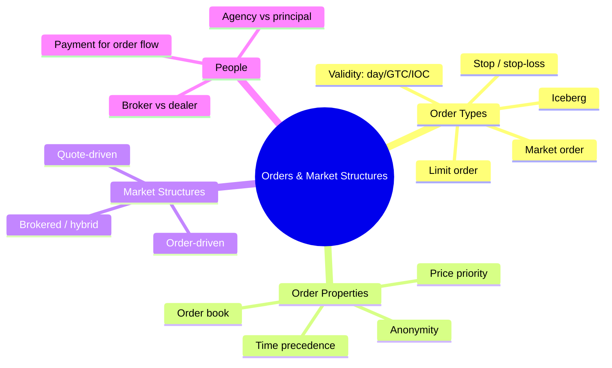
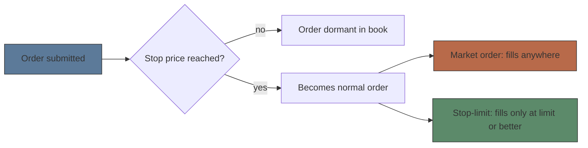
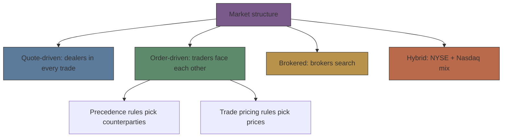
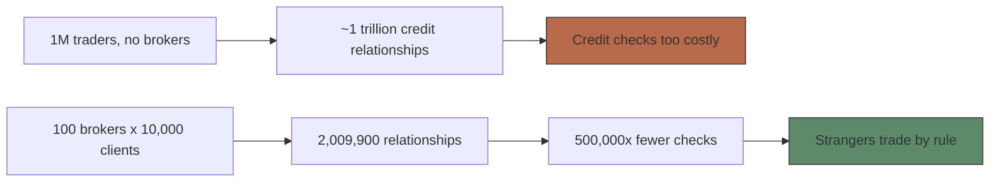

# Module 02: Orders & Market Structures

Est. study time: 1.5h
Language: en
Description: The order types traders use, the rules that match them, and the market structures (quote-driven, order-driven, brokered, hybrid) that decide who trades with whom — from Harris, Trading and Exchanges (ch. 3–7).

## Knowledge Map

---

## Learning Objectives
- Define orders and choose between market, limit, stop, and validity instructions by trade-off (price certainty vs execution certainty)
- Explain how precedence rules (price, time, display, public order) and the order book determine who trades at what price
- Distinguish quote-driven, order-driven, brokered, and hybrid markets — and the trade pricing rule each one uses
- Separate broker from dealer, agency from principal, and explain why payment for order flow creates a conflict

---

## Real-World Example

Amy wants to buy a bond right now. The market is quoted 100 bid / 102 offer. She sends a market order and buys at 102. Minutes later she sells with another market order and gets 100. Round-trip loss = 2 points — exactly the spread. Her transaction cost was half the spread each way (1 point), and the best estimate of the bond's value was the midpoint, 101: she paid 1 point over value on the way in.

> **Think**: Amy "just wanted to trade now." Who got paid for giving her that immediacy, and what did Amy receive in return?
>
> *Answer: The standing limit-order traders (liquidity suppliers) got paid — the spread is their compensation. Amy bought immediacy: certainty of trading now, at the cost of price certainty. Market order = pay the spread; that spread is "the price of immediacy."*

---

## Core Content

### Section 1: Orders are trade instructions

"Orders are trade instructions. They specify what traders want to trade, whether to buy or sell, how much, when and how to trade, and, most important, on what terms." Every order always names instrument, amount, and side (buy/sell) — the rest are conditions. Harris's blunt line: "Your order submission strategy is the most important determinant of your success as a trader."

Two prices frame everything: the **bid** (willingness to buy) and the **offer/ask** (willingness to sell). The **bid/ask spread** = best ask − best bid, also called the *inside spread*, the *touch*, or the bookies' *vigorish*.

| Order type | Harris's exact idea | Certainty you get | Certainty you lose |
|---|---|---|---|
| **Market order** | "An instruction to trade at the best price currently available" | You will trade | Price you trade at (execution price uncertainty) |
| **Limit order** | "Trade at the best price available, but only if it is no worse than the *limit price* specified" | Price cap (buy ≤ limit, sell ≥ limit) | Whether you trade (execution uncertainty) |

Placement ladder for limits: *marketable limit* (crosses the spread now) → *at the market / makes the market* (at the touch) → *behind / away from the market* (waits). Unfilled limits stand in the **limit order book**.

> **Think**: "Market order traders are uncertain about prices; limit order traders are uncertain about whether they will trade." Why does that mean limit orders *supply* liquidity while market orders *take* it?
>
> *Answer: A standing limit order sits in the book giving others an opportunity to trade — it offers/supplies liquidity. A market order seizes that opportunity by accepting a standing order — it takes liquidity. Immediacy flows from supplier to taker, and the taker pays the spread for it.*

> **Cloze**: "A {market} order trades at the best price currently available and pays the bid/ask spread; a limit order trades only at its limit price or better and supplies liquidity to the market."
>
> *Answer: market*

### Section 2: Stops, validity, and hidden size

A **stop** is a trigger, not a price cap: "A *stop instruction* stops an order from executing until price reaches a *stop price* specified by the trader." Once activated it becomes a normal order — and may fill far from the stop. Attach it to a market sell below your position and you have a **stop-loss** ("to stop their losses when prices move against their positions": buy 10 cotton @ 80¢, stop sell @ 70¢). A **stop-limit** pairs both: stop price activates, limit price governs terms ("Buy 100 ASTN, 10 stop, 10.37 limit").

Validity conditions say how long an order lives: **day** (default — "if it is not specified, most brokers assume... a day order"), **GTC** ("valid until the trader expressly cancels them"), **IOC/FOK** (unfilled portion cancelled immediately), plus good-until, market-on-open, market-on-close. Quantity/display: **AON** ("brokers must fill all-or-none orders all at once") and **iceberg** orders — "orders that are not fully displayed... *hidden*, *reserve*... or *iceberg orders* (because other traders can see only the top)."

> **Predict**: Overnight news knocks cotton from 72¢ straight down to 66¢. Where does Stan's stop-loss sell @ 70¢ actually fill?
>
> *Answer: Around 66.90 — not 70. Stops stop execution until the trigger, then trade at market; in a fast market the price gaps through. Book's lesson: only an option contract (a put @ 70 strike) guarantees a price. A stop-loss limits losses; it never fixes the exit price.*

> **Spot the Mistake**: "A sell limit @ 5 and a sell stop @ 5 are basically the same instruction — both say 'sell at 5.'"
>
> *Answer: Opposite directions. The stop @ 5 activates when price falls TO 5 (then sells at market, protecting gains below). The limit @ 5 fills only if price rises TO 5 or above (selling into strength). Stop price = activation trigger; limit price = execution cap. Beginners confuse them "because both specify price conditions."*

### Section 3: Precedence rules and the order book

An order-driven market needs two rule families: **order precedence rules** pick *who* trades with whom, **trade pricing rules** pick *at what price*. The hierarchy:

| Rule | What it grants | Self-enforcing? |
|---|---|---|
| **Price priority** (primary everywhere) | "precedence to the traders who bid and offer the best prices" | Yes — everyone wants best prices |
| **Time precedence** | earliest order at the best price trades first ("first improver" owns it) | No — "That's my bid!" needs policing |
| **Public order precedence** | public orders ahead of member orders at same price | No — rule enforced |
| **Display precedence** | shown orders ahead of hidden at same price | No |
| **Size precedence** | large-first or small-first varies by market; pro rata at parity | No |

Time precedence rewards the first improver, so rivals must **leapfrog** (to beat Guy at 103.10 you bid 103.15; he reclaims at 103.20). That works only if the **tick** (minimum price increment) isn't trivial: decimalization cut the U.S. equity tick from **6.25¢ to 1¢** (2000–2001), time precedence lost value, displayed order sizes shrank, and public order precedence weakened.

The **order book** = "standing limit orders are placed in a file called a *limit order book*"; it stores open orders — mostly standing limits plus untriggered stops and MITs. "Order books hold extremely valuable information. They reveal the conditions under which traders will trade." **Open book** markets display everything; **closed book** markets don't (Toronto: members see the whole book, public sees best five prices).

> **Cloze**: "The {price priority} rule gives precedence to best-priced orders and is self-enforcing; the secondary time precedence rule is not, because traders must defend their place in line."
>
> *Answer: price priority*

> **Think**: Why do some traders hide size in iceberg orders while others pay brokers to stay anonymous — if transparency is supposed to be good?
>
> *Answer: Book knowledge = trading power. "Those who know the most oppose transparency because they do not want to give up their informational advantages." Your standing orders reveal who will trade and when — so display only the top (iceberg), route through a broker, or use a closed/crossing venue to keep front-runners from picking you off.*

### Section 4: Market structures — who trades with whom

"Market structure" = "the trading rules and the trading systems used by a market." It decides who can trade, what, when, where, how — and **what information traders can see**. Structure → behavior → liquidity, efficiency, volatility, who profits.

| Structure | Harris's definition | Liquidity comes from | Example |
|---|---|---|---|
| **Quote-driven (dealer)** | "In pure quote-driven markets, dealers participate in every trade" — public can't trade with each other | Dealers quote buy/sell; they supply ALL liquidity | Nasdaq, London, bonds/FX, bookies |
| **Order-driven** | "buyers and sellers regularly trade with each other without the intermediation of dealers"; precedence + pricing rules decide | Public's standing orders (+ dealers forced to trade with anyone) | NYSE auction, open outcry, crossing nets |
| **Brokered** | "brokers actively search to match buyers and sellers" | Search, not a book — serves concealed and latent traders | Blocks, real estate, whole businesses |
| **Hybrid** | mixes quote-driven, order-driven, brokered features | Both sides | NYSE (specialists must supply liquidity), Nasdaq (dealers must display public limits) |

> **2026 reality check**: the NYSE specialist role was renumbered in 2005–06 — the exchange's Hybrid Market turned specialists into Designated Market Makers and moved almost all volume electronic (the floor now handles a sliver of trades). The *hybrid* idea survived: NYSE still mixes a central book with obligated liquidity suppliers, and Nasdaq's dealer-display rules still stand. Learn the structures as species — they persist even when the named incumbents don't.

Sessions split two ways: **continuous** ("traders may trade anytime the market is open") vs **call** ("all traders trade at the same time when the market is called"). Call markets focus all orders in one moment; continuous markets sell immediacy. The trend never reversed: exchanges moved rotation → continuous plus opening calls — single-price calls still open most continuous stock markets and restart after halts.

> **Predict**: In a pure quote-driven bond market, you and another investor both want to trade the same bond. Do your orders ever meet?
>
> *Answer: No — "anyone who wants to trade must trade with a dealer." You each face the dealer's quote; the dealer earns the spread, holds inventory, and takes the price risk. Your trades double-count volume too: one public-to-public trade = 100 shares on NYSE but 200 or 300 through one or two Nasdaq dealers.*

### Section 5: Trade pricing rules and the cost of immediacy

Three pricing rules, three market types:

| Rule | Where used | Price everyone gets |
|---|---|---|
| **Uniform** | Single-price (call) auctions | The market-clearing price — maximizes **total trader surplus** |
| **Discriminatory** | Oral outcry + continuous electronic auctions | Each fill at the standing/accepted order's price |
| **Derivative** | Crossing networks | "prices determined elsewhere" — midpoint of primary market, or closing print |

Harris's worked example, same 9-order flow both ways: the call auction's clearing price 20.0 yields total surplus **1.6**; the continuous auction yields **1.0** — lower because high-valuation sellers (Sam @20.1, Stu @20.2) sold early to impatient Bif. Volume ≠ surplus: matching closest valuations maximizes volume and *minimizes* surplus. Large impatient traders like discriminatory pricing (split the order: Sally's 100 soybean contracts — 40 @ 602 + 60 @ 601½ = avg 601.7, saving **$10,000** on 50,000-bushel contracts); standing limit-order traders prefer uniform. Continuous markets can't enforce uniform (traders just split orders), so **trading halt rules** temporarily restore the single price.

**Graduated example — cost of immediacy.**

*Worked:* Market is 100 bid / 102 offer, bond value ≈ midpoint 101. Market buy @ 102, market sell @ 100. Round trip = −2; per-way cost = 1 = half the spread.

*Partial:* Stock quoted 19.83 / 19.85. You market-sell 200 shares at 19.83, commission $15. Half-spread cost = (19.85 − 19.83) / 2 = 1¢. Total cost = $15 + 200 × 1¢ = *your turn: $15 + $2 = $17.*

*Independent:* Your market buy of 5,000 shares fills in three clips: 2,000 @ 50.05, 2,000 @ 50.15, 1,000 @ 50.30, while the touch started at 50.05/50.10. Separate half-spread paid from market impact. (Half-spread on first fill: 2,000 × 0.05 = $100; impact = the extra: 2,000 × (50.15−50.05) + 1,000 × (50.30−50.05) = $200 + $250 = **$450** — impact grew with size, the reason big traders use limit/working orders or market-not-held discretion.)

> **Cloze**: "Single-price auctions apply the {uniform} pricing rule and maximize total trader surplus; continuous auctions apply the discriminatory pricing rule, which favors large liquidity-demanding traders."
>
> *Answer: uniform*

> **Think**: Crossing networks charge 1–2¢/share and show zero market impact. Why aren't they free money?
>
> *Answer: They use derivative pricing — stale prices after news → adverse selection: informed traders pick the side that hurts you (after-hours crosses show more buys when prices rose), and <10% of submitted volume even fills. Manipulators can move the reference price cheaply (Bob: 1,000 shares ≈ $30 to shave $15,000 off a 500,000-share contract). Cheap commission, expensive counterparty risk.*

### Section 6: Brokers, dealers, and payment for order flow

One line each: **dealers** *trade with* you when you want to trade (principal — profit = buy low, sell high, hold inventory); **brokers** *find someone* to trade with you (agent — profit = commission, no position). Firms doing both are **broker-dealers**.

| Concept | Meaning | Money & risk |
|---|---|---|
| **Agency order** | "orders that brokers represent as agents for their clients" | Broker earns commission, no position risk |
| **Principal (proprietary) order** | "orders that traders represent for their own accounts" | Firm keeps inventory → earns spread, takes price risk |
| **Internalization** | dealer fills a client order itself | Structural conflict: client wants low buy, dealer wants high |
| **Payment for order flow** | dealer pays broker for right to execute its clients' orders | ~1¢/share typical for market orders; `E*TRADE` PFOF 24% (1997) → 15% (Q2 2001) of transaction revenue |

**2026 reality check:** PFOF never died — it financed the zero-commission era (Robinhood et al.), stayed around ~1¢/share for equities (more for options), and remains the live fight: SEC proposed order-competition and best-ex rules in 2022 that directly target internalized retail flow; the debate was still open through 2026. The conflict Harris describes is current-events material.

Why order-driven markets (trades among strangers) exist at all — the credit chain:

Brokers know clients, vouch for settlement, hold liquidatable assets — so relationship count collapses from 999,999,000,000 to 2,009,900 (**500,000×** reduction). That interposition of credit is *the* reason order-driven markets are viable. **2026 reality check:** the settlement window itself shrank — U.S. equities ran T+3 for decades, moved to **T+1 in May 2024**, and the industry is building toward round-the-clock (24x5) clearing in 2026 — the credit-vouching logic only got more load-bearing. Same logic for disclosure: **order preferencing** routes flow to a chosen dealer (often not price-based, looks like a kickback), and **front running** — trading ahead of your client's order to profit from its impact — is the cardinal sin; futures rules require agency orders before own orders. U.S. institutional commissions ran **5–6¢/share** (range 1–12¢) before May Day deregulation (May 1, 1975) blew up fixed rates.

> **Predict**: Your broker routes your market order to a dealer that pays it ~1¢/share for the flow. Whose interests might diverge from "best execution" — and what must the broker promise anyway?
>
> *Answer: The broker's (extra revenue) vs yours (price quality) — payment for order flow makes routing a conflict. But U.S. equities contracts require filling market orders at NBBO or better, and "best execution" is a legal duty with three readings: best price possible / what you paid for / what I can audit. The NBBO's teeth come from **Reg NMS (2005)** — its order-protection rule requires trades at the best displayed price across exchanges, which is why protected quotes govern routing today. You can't manage what you can't measure — audit fills against the NBBO.*

> **Spot the Mistake**: "A broker and a dealer are the same thing — both are Wall Street firms that handle my order."
>
> *Answer: Agent vs principal. The broker arranges your trade with someone else, takes no position, earns commission; the dealer trades WITH you out of its own inventory, earns the spread, and takes price risk. The line blurs at internalization (a dealer-broker filling your order itself) — exactly where conflicts live. "Brokers sell you credit and search; dealers sell you immediacy."*

---

### Why This Matters

Every later module runs on this vocabulary: Module 3 (informed traders) exploits the option limit orders grant; Module 4 (dealers, spreads) is the quote-driven half of this module priced out; Module 5 measures the half-spread and impact you computed here; Module 6 reads precedence and pricing rules as the source of who profits. Order submission strategy — market vs limit vs stop, displayed vs hidden, which venue — "is the most important determinant of your success as a trader."

---

## Key Takeaways
- Market order = certainty of trading, uncertainty of price (pays half-spread per way); limit order = price cap, uncertainty of filling (supplies liquidity)
- Standing limit orders are free, cancelable options to the market — that option value is why spreads widen when volatility rises
- Stops trigger at a price then trade at market: losses capped in direction, never guaranteed in price — gaps run through stop-losses
- Precedence: price priority first (self-enforcing), then time/display/size/public order; the order book stores open orders and is "extremely valuable information"
- Structures: quote-driven (dealers in every trade), order-driven (traders face each other under rules), brokered (search), hybrid (NYSE, Nasdaq)
- Brokers cut ~1 trillion potential credit relationships to ~2 million (500,000×) — credit interposition makes order-driven markets possible; PFOF and internalization are where agent duties conflict with principal profit

---

## Common Misconception

**"A stop-loss guarantees I'll get out at my stop price."**
Wrong. The stop price only activates the order; execution is then at market, and fast gaps fill far beyond the stop (Stan's 70¢ stop → 66.90 fill). A stop-loss caps how *badly* you lose in direction, not the price you exit at. "To guarantee a trade at a particular price, a trader must purchase an option contract."

---

## Spot the Mistake

"My limit buy at 48.05 is queued at the best price, so I'm next in line — the fill is basically guaranteed."

*Answer: Two errors. (1) At the same price, time precedence decides who is next — and public order precedence or display/size rules can reorder further; your limit only has priority if its price is best. (2) Nothing forces a fill: execution uncertainty means the price can rise away (Jill's GM order — price ran, she cancelled and market-bought at 48.20, paying 9¢ more than a market order from the start). Limit orders trade price certainty for fill uncertainty, and a fill can still bring ex post regret via adverse selection.*

---

## Feynman Explain
(Explain to a friend who has never traded: what happens to a "buy 100 shares" instruction after they click the button — market vs limit vs stop, where the order sits, who it trades with, and why their broker might route it somewhere that pays the broker. Use one concrete price example. No jargon until they ask.)

---

## Reframe
(Pause. Judge: Is payment for order flow a fair way to pay for "free" commissions, or a hidden kickback that lets brokers sell best execution? Harris notes order preferencing "looks like kickback" yet contracts promise NBBO-or-better fills. Where would you draw the disclosure line — and would you, if the 1¢/share kept your commissions at zero? Write your position in 5 sentences.)

---

## Drill
Run: `learn.sh quiz market-microstructure 02-orders-and-markets`
Run: `learn.sh cloze market-microstructure 02-orders-and-markets`
