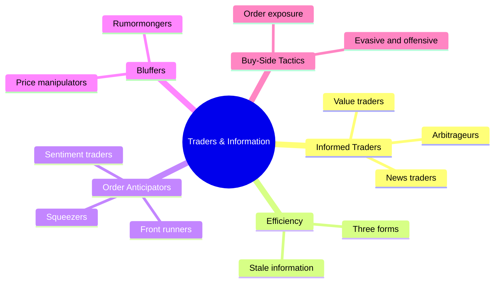
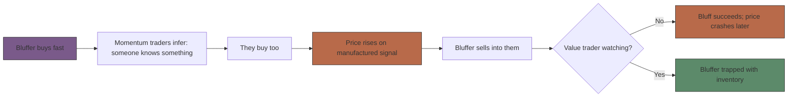

# Module 03: Traders & Information

Est. study time: 1.5h
Language: en
Description: Who trades on information, who trades on other people's orders, who bluffs, and how each type moves prices — informed traders, efficiency, adverse selection, front-running, manipulation, arbitrage, buy-side tactics from Harris (ch. 10, 11, 12, 16, 17, 18).

## Knowledge Map

---

## Learning Objectives
- Classify the four informed trader types and explain how their trading makes prices informative
- State the microstructure definition of market efficiency, its three traditional forms, and why trading on stale information loses money
- Explain adverse selection, winner's curse, and why value traders are "liquidity suppliers of last resort"
- Distinguish order anticipation (front-running, quote matching, squeezers) from bluffing and market manipulation — including which information trading is legal
- Describe arbitrage, LTCM's failure, and the buy-side order exposure decision with its defensive tactics

---

## Real-World Example

April 7, 1999. Mid-morning, a message appears on a Bloomberg-style bulletin board: PairGain Technologies in play, takeover at a fat premium. The stock (PAIR) jumps from $8½ to an intraday high of $11⅛ on 14 million shares — roughly 10× normal volume — before closing at $9⅜. Nobody actually bid for the company. The poster, Gary Dale Hoke, a 25-year-old PairGain employee, was arrested — and he never traded the stock at all. He spread false information; other people's money did the rest.

> **Think**: Hoke made no trades. How can that be market manipulation?
>
> *Answer: Harris's definition doesn't require the bluffer to trade — manipulation "occurs when bluffers or their victims cause prices to change from what they would be if the bluffers did not pursue their bluffing strategies." A rumormonger moves price through other traders' orders; the victims, not the bluffer, pay the pump-and-dump toll.*

---

## Core Content

### Section 1: Informed traders — who they are and why prices learn from them

Harris defines **informed traders** as "speculators who acquire and act on information about fundamental values. They buy when prices are below their estimates of fundamental value and sell when prices are above their estimates." Two values matter:

- **Market value** = "the price at which traders can buy or sell the instrument" — what you see on screen.
- **Fundamental value** = the "true value," the expected present value of all future benefits and costs of holding the instrument. It is an estimate from *currently available* information, not perfect foresight.
- **Noise** = the gap between the two.

Four informed species, sorted by where their money comes from:

| Type | What they estimate | Speed / style | Effect on prices |
|---|---|---|---|
| Value trader | Whole fundamental value from all info | Slow, disciplined | Push price back toward value; supply liquidity |
| News trader | *Changes* in value from fresh news | Fast, flat org; must beat everyone | Pull price to new value fast |
| Information-oriented technical trader | Systematic mistakes of the other two | Scavenger; edge decays as markets mature | Corrects mistakes → more accurate |
| Arbitrageur | *Relative* mispricing between related instruments | Fast or patient, two-legged | Enforces law of one price |

When many independent forecasters trade, the market price becomes the average of their forecasts — often more accurate than any single analyst (law of large numbers; markets as "statistical calculators"). Viagra story: Pfizer gets FDA approval Mar 27, 1998; stock climbs 95¾ → 102⅞ in a week → 113 7/16 by Apr 27 as analysis trickles out. First traders to work through the news won; the last ones to react were buying **stale information**.

**Legal flag:** almost all of this is legal. Value traders using public filings, news traders on headlines, arbitrageurs, even investigative work (inferring a contract win from a hiring spree) — legal. Only trading on *inside information* — material, non-public info obtained from company management — is illegal in the U.S. Information trading ≠ insider trading.

> **Think**: A friend says "insider trading just means trading on information — half of Wall Street does it." What's wrong?
>
> *Answer: Conflates information trading with illegal insider trading. Most informed trading uses public or independently gathered info and is not only legal but necessary — it's what makes prices informative. The illegal slice is narrow: material inside info from management, before it's public.*

> **Cloze**: "The gap between a stock's fundamental value and its market price is called {noise}; a price is informative when it is near its fundamental value."
>
> *Answer: noise*

### Section 2: Market efficiency and the pseudo-informed trap

Harris's microstructure definition: "In an *efficient market*, prices reflect all information that traders can acquire and profitably trade upon." Note the qualifier — information that is **profitable** to trade upon. Costly information can stay out of price.

The traditional three forms the book uses:

| Form | Prices reflect... | Everyday meaning |
|---|---|---|
| Weak-form efficient | All information in past prices | Chart patterns already exploited |
| Semistrong-form efficient | All publicly available info | Earnings releases priced in instantly |
| Strong-form efficient | All public *and* private info | Realistic only where value is common knowledge — a five-dollar bill market |

Two traps follow. **Stale information** is "information that is already in the price" — useless for forecasting future price changes. The **pseudo-informed trader** is "traders who trade on stale information" who "think that they are well informed, but in fact they are not." Harris calls this the most common trading mistake.

Occidental Petroleum, Dec 1990: Armand Hammer dies Dec 10, age 92, after long illness. OXY jumps **+10%** next day — then gives back the entire gain the following day. The death date itself carried no new material information; the market already reflected it. Pseudo-informed traders bought a fact everyone already knew, and value traders sold to them.

The market paradox worth holding in your head: informative prices → informed trading becomes unprofitable → informed traders quit → prices go uninformative. Resolution: prices are never *always* informative — values and prices keep moving, recreating opportunities.

> **Predict**: You buy a stock an hour after a "shocking" resignation headline; it pops 5%, then drifts all the way back within two days. Walk through who lost and why.
>
> *Answer: You're pseudo-informed — the market digested the news in minutes, so you paid a price already raised by better-informed traders. As value traders sell against the crowd, price reverts. Your loss is paid to those who traded first on fresh info; your edge was stale the moment you clicked buy.*

> **Cloze**: "In an {efficient} market, prices reflect all information that traders can acquire and profitably trade upon."
>
> *Answer: efficient*

### Section 3: Value traders, adverse selection, and the winner's curse

**Value traders** are "speculators who form opinions about instrument values by using all information available to them. They buy instruments that they believe are undervalued and sell instruments that they believe are overvalued" — and, Harris adds, they are "**liquidity suppliers of last resort**": they trade when nobody else will.

Why that matters hangs off **adverse selection**: the risk of supplying liquidity to a better-informed trader — you buy what you think is cheap and it turns out expensive because the other side knew something. The classic causal chain:

```mermaid
flowchart LR
    A["Informed trader takes liquidity"] --> B["Dealer faces adverse selection"]
    B --> C["Spreads widen"]
    C --> D["Uninformed traders find trading expensive"]
    D --> E["They avoid the market"]
    E --> F["Liquidity retreats"]
    F --> G["Value traders trade against uninformed flow"]
    G --> H["Price snaps back: resiliency"]
    style B fill:#b86a4a,stroke:#333
    style C fill:#b86a4a,stroke:#333
    style F fill:#b86a4a,stroke:#333
    style H fill:#5c8a6a,stroke:#333
```

**Market resiliency** = "when uninformed traders cannot change prices substantially, the market is *resilient* to their trading." Value traders create it by standing ready when uninformed flow pushes price off value. Bonus: because dealers know they can lay inventory off to value traders, dealers hold bigger inventories → more immediacy for everyone.

Second risk: the **winner's curse** — "traders... suffer the *winner's curse* when they win an auction and subsequently regret that they traded because they paid too much or sold for too little." In common-value settings (most securities), the highest bidders are systematically the *overestimators* — you learn your estimate was too high by winning. Oil and gas lease auctions: geologists were right on average, but their firms systematically overpaid for the tracts they *won*. Correct response: bid *below* your estimate, and shave more when there are more bidders and when value is hard to estimate. Harris: "better to lose than to win and pay too much."

Because of these risks, value traders quote an **outside spread** — the prices at which they are willing to trade — wider than dealer spreads: they hold bigger, longer positions, pay for research, trade when order flow is one-sided, and hope to earn only *half* the spread while a dealer earns the whole spread round-trip.

> **Think**: Auction with 20 bidders for an oil tract you value at $10M. Should you bid $10M?
>
> *Answer: No. With many bidders, the winner is usually the one who overestimated. Bid below your estimate — shave more as bidders multiply or valuation gets harder. "Better to lose than to win and pay too much."*

> **Cloze**: "Traders suffer the {winner's curse} when they win an auction and subsequently regret trading because they paid too much or sold for too little."
>
> *Answer: winner's curse*

### Section 4: Order anticipators — trading on other people's orders

**Order anticipators** are "speculators who try to profit by trading before other traders trade." They trade on information about *others' orders*, not about fundamental values. Harris calls them **parasitic traders**: "they do not make prices more informative, and they do not make markets more liquid... they do not bring anything new to the table."

| Kind | What they know | Tactic | Signature example |
|---|---|---|---|
| Front runner | What others have already decided to do | Trade ahead of incoming market orders to capture their price impact; **quote matching** (penny jumping) jumps in front of large standing limit orders and extracts their free option — option-like returns: unbounded gain, 1-cent loss | "Rifka and Jon" floor traders reading a broker's behavior |
| Sentiment-oriented technical trader | What uninformed traders *haven't done yet* (cash flows, hedges, gambling) | Predict the future orders and trade first | January effect: 1926–2000, January returns beat other months by **0.85 pp** on average over 75 years |
| Squeezer | Who *must* trade | Monopolize one side so forced traders can only deal with you (corner); **gunning** pushes price to trigger stop orders, then sells to the stoppers | Great Wheat Corner of 1888: wheat ≈ **$1 → $2** between Sept 22–30; gunning silver: buy 4.96 → 5.00, avg cost 4.98, 0.4% nominal return magnified by futures margin |

**Legal vs. illegal front running:** illegal when order info comes from a confidentiality breach — broker leak, eavesdropping. Legal when inferred from *observable* behavior: a floor trader who notices a broker repeatedly bidding and reads the pattern is front running but breaking no law. Quote matching against standing orders is legal too — just unpopular.

Liquidity suppliers defend with time precedence and a **large minimum price increment** (makes front running costly); large traders defend by hiding and splitting orders.

> **Predict**: Quote matchers keep jumping ahead of your large standing limit order. What do liquidity suppliers start doing — and what does display in the market look like afterward?
>
> *Answer: They hide or split orders, or switch to market orders, to stop being harvested. Displayed size falls, transparency drops, and trading costs rise for everyone — front-running profits are other traders' transaction costs.*

> **Spot the Mistake**: "Front running is always illegal — it's the classic Wall Street crime."
>
> *What's wrong?*
>
> *Answer: Illegality depends on how the order info was obtained. Breaching confidentiality (broker leaking a client's order) is illegal; observing public broker behavior and trading ahead is legal front running — the book's "Rifka and Jon" example. Quote matching (penny jumping) against standing limit orders is also legal. Unpopular ≠ illegal.*

### Section 5: Bluffers and market manipulation

**Bluffers** are "profit-motivated traders who try to fool other traders into trading unwisely." Two techniques: **rumormongers** (spread false info, or true info framed to be misread) and **price manipulators** (trades at chosen prices, volumes, or times — including wash trades with confederates — designed to change others' beliefs). Goal: look like a well-informed trader. **Market manipulation** = prices changed from what they would be absent the bluffing. Illegal in the U.S., but brutally hard to prosecute — bluffers always claim legitimate speculation, and a price reversal alone proves nothing.

Bill vs. BNB stock (running example): Bill buys 200,000 shares over 40 days at avg $6; posts bullish messages under fake usernames; then buys 50,000 more in 20 minutes, pushing $7 → $10, and sells into the momentum.

**Worked example — bluff math.** A liquidity supplier moves price 10¢ per 100 contracts for 1,000-lot orders but only 5¢ per 100 for 500-lot orders. The bluffer buys 4 × 1,000-lot orders (prices 11, 12, 13, 14 → **avg buy 12.5**), then sells 8 × 500-lot orders (**avg sell 12.875**). Edge = 12.875 − 12.5 = $0.375 per contract. Total: 4,000 contracts × $0.375 × 1,000 units = **$1.5 million profit** — round trip, same size, no new information.

**Partial example — your turn.** Now the supplier quotes a *uniform* impact: 10¢ per 100 contracts for every order size. Buys unchanged (avg 12.5). Each 500-lot sell now moves the price 50¢, so the eight sells walk down 13.5, 13, 12.5, 12, 11.5, 11, 10.5, 10. Compute the average sell price and the bluffer's P&L. (*Sell avg = 11.75; P&L = 4,000 × (11.75 − 12.5) × 1,000 = **−$3 million**. Same trades, opposite sign: when impact per unit is identical for buys and sells, the bluff becomes pure loss.*)

**Independent.** Your exchange suspects size-dependent impact is funding bluffers. What quote rule do you change, and what happens to honest large traders under it? (*Require the same price impact per unit for every order size and rate. Bluffers can no longer buy cheap on big lots and sell dear on small ones — the riskless-looking edge vanishes (the book's variant with 100-lot splits still loses ~$0.4M). Honest large traders pay fair, uniform costs, and the manipulation channel closes.*)

Real endings: PairGain (rumormonger, Real-World Example above) ended in arrest though Hoke never traded. In the Bill/BNB story, the *successful* ending pays Bill **$1,050,000** before price returns to $5 — SEC drops the case, unable to prove the postings were his; the *failed* ending has value trader Valerie shorting the bluff, leaving Bill stuck with 400,000 shares for a **$1.2 million** loss — SEC takes no action because the bluff simply failed. Most vulnerable to bluffs: momentum traders and liquidity suppliers, both of whom react to what they *see* — and bluffers control what they see.

> **Think**: Bill's bluff worked in one telling and failed in another. What single actor decided which ending happened?
>
> *Answer: A well-capitalized, patient value trader. Value traders foil bluffs by trading against manufactured price moves — when they show up, the bluffer is left holding inventory; when they don't, momentum traders carry the pump and the price crashes later.*

> **Spot the Mistake**: "The stock popped 8% on rumor, then fell back to the old price — that proves manipulation."
>
> *What's wrong?*
>
> *Answer: A reversal proves nothing. Even honest speculators misestimate, and prices revert after all kinds of non-fraud news. Prosecution requires false info, wash trades, or testimony about intent — not the price path. Converse holds too: a rising price doesn't prove informed buying.*

### Section 6: Arbitrageurs and the buy-side's big decision

**Arbitrageurs** are "speculators who trade on information about relative values. They buy instruments that seem relatively cheap and sell those which seem relatively expensive. Arbitrageurs profit when prices converge" — and they unwittingly enforce the **law of one price**: "identical instruments should have identical prices." Vocabulary: **basis** (price difference between legs of the hedge portfolio), **arbitrage spread** (basis − fair value of the basis), traded only outside the **arbitrage bounds**.

| Type | Basis behavior | Examples |
|---|---|---|
| Pure arbitrage | Strictly mean-reverting | Shipping (NY vs London crude), delivery (cash vs futures), conversion (soybean crush: beans/oil/meal) |
| Speculative (risk) arbitrage | Nonstationary — may never converge | Calendar/credit spreads, pairs trading, stat-arb, merger arb |

**Arbitrage is not free money.** LTCM, Jul 1998: **$125 billion assets on $4.1 billion equity**, >$500B futures notional, >$750B swaps. Russia defaults Aug 1998 → spreads widen → margin calls → forced liquidation exactly when the arbitrage looks best → rescued by a consortium for $3.6B on Sep 23, 1998. The positions were "still attractive"; the firm died for lack of **staying power** — extreme leverage, not bad analysis. Never max leverage; control basis risk with scale.

Then the buy-side's decision. Buy-side traders originate orders and decide how to execute — "the most important determinant of execution quality that traders control." Rule of thumb when you know nothing about value: **offer liquidity when spreads are expensive, buy it when spreads are cheap** (limit orders when wide, market orders when narrow) — but if you know value is 45 with market at 48/50, a market *sell* is the great trade regardless.

The big one is the **order exposure decision**: how much of your trading interest to display. Exposure attracts reactive traders (who only trade when shown an opportunity) — good — but reveals motives, invites front runners, and hands quote matchers free options on your standing orders.

| Strategy | Examples | Cost |
|---|---|---|
| Evasive | Multiple brokers, anonymous systems (POSIT, Liquidnet), split orders, order *indications* that aren't commitments, wait for others to expose first | Slower fills |
| Deceptive | Small opposite-side trades, lying about size or completion | Burns broker relationships — "the cost of lying" |
| Offensive | **Sting**: display a fake opposite order, trade against the front runner, then cancel | Can fail and leave you with 2–3× your intended position |

"The better you are, the harder it gets": once famous for block skill, competitors front-run or avoid you and counterparties demand worse prices — the best traders have the hardest time finding liquidity.

> **Predict**: Your fund gains a reputation as the best block trader in small caps. Predict what happens to your execution costs over the next year — and why.
>
> *Answer: They rise. Counterparties price-discriminate against known skill, front runners target your orders, and defensive liquidity suppliers step out of the way — reputation is a liability on both sides of every trade. Hence the evasive toolkit: hide, split, use intermediaries.*

> **Cloze**: "Arbitrageurs buy relatively cheap instruments and sell relatively expensive ones, unwittingly enforcing the {law of one price}: identical instruments should have identical prices."
>
> *Answer: law of one price*

---

### Why This Matters

Every trader you meet from here on fits one of these boxes, and each box answers the two module questions: *where does the money come from* and *does this trading make prices more or less accurate?* Informed traders and value traders make prices informative and supply liquidity; order anticipators and bluffers take both. The liquidity-vs-informativeness trade-off you saw in Section 2 returns in every policy debate: restrictions on informed trading (insider-trading bans, trading halts) raise liquidity but lower price informativeness; publishing public info raises both.

---

## Key Takeaways
- Informed traders (value, news, information-technical, arbitrageurs) buy below and sell above their estimate of fundamental value — their competition turns price into an average of forecasts, more accurate than any single analyst
- Efficient market = prices reflect all info traders *can acquire and profitably trade upon*; weak/semistrong/strong forms grade which info is in
- Pseudo-informed traders trade on stale info — the most common mistake (OXY +10% then full retrace)
- Adverse selection makes dealers widen spreads and liquidity retreat; value traders, liquidity suppliers of last resort, restore resiliency; winner's curse forces them to bid below estimate
- Order anticipators (front runners, sentiment traders, squeezers) are parasitic: profit from others' orders, add neither liquidity nor informativeness; bluffing adds manufactured information and usually ends in reversal
- Arbitrage enforces law of one price but needs staying power (LTCM: $125B on $4.1B equity, right analysis, dead firm); buy-side's core lever is the order exposure decision — evasive, deceptive, offensive tactics

---

## Common Misconception

**"All information trading is illegal insider trading."**
Wrong — most informed trading is perfectly legal. Value traders using public data, news traders on public headlines, arbitrageurs, investigative research like inferring contract wins from hiring — all legal, and all necessary for informative prices. Only trading on *inside information* — material info obtained directly or indirectly from company management and not yet public — is illegal in the U.S. The law restricts one source of information, not informed trading itself.

---

## Spot the Mistake

"An arbitrage is a risk-free profit: buy the cheap leg, sell the expensive leg, pocket the difference."

*Answer: Not in practice. Harris splits pure arbitrage (basis strictly mean-reverting) from speculative/risk arbitrage (basis nonstationary, may never converge), and even pure arb carries implementation risk (execution prices move), basis risk (instrument-specific residual), model risk (wrong fair value → wrong side), and carrying-cost risk (rates rise, convergence stalls). LTCM's spreads "still attractive" positions couldn't be held — $125B of assets on $4.1B of equity met a margin call it couldn't finance. Arbitrage is a business with costs and bankruptcy risk, not a coupon.*

---

## Feynman Explain
(Explain to a friend who has never traded: why do stock prices sometimes jump instantly on news and sometimes drift for weeks — and who are the different people trading around that news? Cover informed traders, pseudo-informed losers, value traders patching prices, front runners riding other people's orders, bluffers faking information, and arbitrageurs keeping related prices consistent. Say which of these help prices and which are just parasites. No jargon until they ask.)

---

## Reframe
(Pause. Judge: Harris frames markets as trading off liquidity against informative prices — rules that restrain informed traders (insider-trading bans, halts) make trading easier but prices dumber. Given that prices allocate capital for everyone, is the current legal line between legal information trading and illegal insider trading drawn in the right place? What would you change, and who would it hurt? Write your evaluation in 5 sentences.)

---

## Drill
Run: `learn.sh quiz market-microstructure 03-traders-and-information`
Run: `learn.sh cloze market-microstructure 03-traders-and-information`
