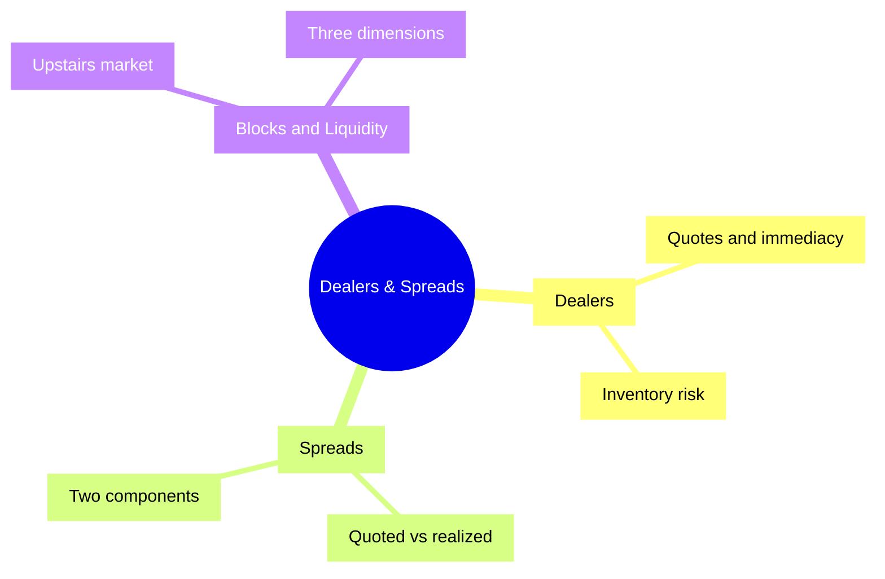
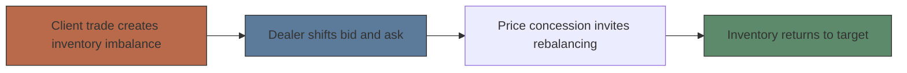
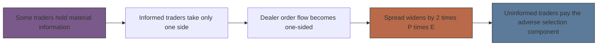

# Module 04: Dealers & Spreads

Est. study time: 1.5h
Language: en
Description: How dealers supply liquidity, how bid/ask spreads are priced and split, and how blocks and liquidity work — Harris, Trading and Exchanges (ch. 13, 14, 15, 19).

## Knowledge Map

---

## Learning Objectives
- Define dealer and market maker, and explain the bid/ask quotes they post
- Distinguish quoted, realized, and inside spreads — and compute each from a scenario
- Split the spread into its two components and use the Glosten–Milgrom 2·P·E formula
- Explain inventory risk and how an inventory imbalance forces price concessions
- Describe block trades, the upstairs market, and liquidity's three dimensions with their suppliers

---

## Real-World Example

A large trader wants out of XYZ. The specialist quotes 40 / 40.05 for small size. His sell order drains the book and floors the price at 37 — the specialist re-quotes 37 / 37.30 for moderate size. An options arbitrageur buys at 37.30 and hedges with a synthetic short; a value trader later buys at 38.25. Days later the price is back near 40, and the specialist's inventory is near target again.

> **Think**: The large seller was *uninformed* — he simply wanted cash. Why did he still lose?
>
> *Answer: His aggressive selling fooled the market into thinking he was informed. He demanded too much immediacy, the price ran away from him, and he paid for information he never had — the market punished him for looking like an insider.*

---

## Core Content

### Section 1: Dealers sell immediacy

"Dealers are profit-motivated traders who allow other traders to trade when they want to trade." They are merchants who buy from and sell to their clients, making money by buying low and selling high. The service they sell is **immediacy** — the ability to trade quickly when you want. A **market maker** is a dealer "who allows their impatient customers to trade at bid and ask prices that the market makers quote."

Dealers are **passive traders**: they trade when *others* want to trade, so they never control trade timing and must price carefully. Sellers "hit the bid," buyers "take the offer." Dealers set prices to attract a **two-sided order flow** — a mix of buyers and sellers in equal quantities — and "the search for prices that produce a two-sided order flow" is the **price discovery process**, which yields market values.

| Term | Meaning |
|---|---|
| Bid | Price the dealer buys at |
| Ask (offer) | Price the dealer sells at — "dealers always set their ask prices above their bid prices" |
| Quoted spread | Ask minus bid: "the price impatient traders pay for immediacy" |
| Firm quote | Dealer must trade at the quote up to a stated size; a soft quote is only an indication of interest |

> **Think**: Why must a dealer keep the ask above the bid, and why are dealers called "passive"?
>
> *Answer: The gap is the dealer's gross revenue per round trip — invert it and every trade locks in a loss. Dealers are passive because they cannot choose when to trade; clients initiate, so the dealer must quote defensively against bluffers and informed traders.*

### Section 2: Inventory, imbalance, and inventory risk

Dealers hold **inventory** (actual positions) and **target inventory** (desired positions). The difference is the **inventory imbalance**. Book's definition of the risk: "Large positions are expensive to finance. They also expose dealers to serious losses if prices move against them. Economists call this risk *inventory risk*."

Two kinds of inventory risk:

| Type | Nature | Dealer's view |
|---|---|---|
| Diversifiable | Price moves unpredictable, mean zero, offset across many instruments | Scary, but not a long-run money loser |
| Adverse selection | Losses to informed traders; imbalance inversely correlated with future price changes | Not benign — "the most important determinant of dealer profitability" |

> **Cloze**: "The difference between a dealer's actual inventory and the position the dealer wants to hold is the {inventory imbalance} — dealers move their quotes to close it."
>
> *Answer: inventory imbalance*

> **Think**: You are a dealer holding too much stock after a client sold to you. What do you do to your quotes?
>
> *Answer: Lower the ask (invite buyers to take inventory) and lower the bid (discourage more sellers), shrink ask size, grow bid size — clients rebalance you. If you rush by buying at the ask or selling at the bid, you demand liquidity yourself and earn a negative realized spread: the cost of speed.*

### Section 3: Quoted, realized, and inside spread

Three different numbers hide inside "the spread":

| Spread | What it measures | Book example |
|---|---|---|
| Quoted | Posted ask minus posted bid | 35.3 − 35.0 = **0.30** |
| Realized (effective) | Prices the dealer actually bought and sold at on a round trip — usually smaller than quoted | 34.9 − 35.0 = **−0.10** (Dell) |
| Inside | Highest bid minus lowest ask across all dealers — never wider than the narrowest single dealer quote | 100.4 − 100.3 = **0.10** when five dealers each quote 50 cents |

**Worked example (Dell's losing round trip).** Dealer posts bid 35.0 / ask 35.3 (quoted spread 0.3). A client sells at 35.0. Bad news arrives; the dealer cuts to 34.6 / 34.9 to dump inventory, and a buyer takes 34.9. Realized spread = 34.9 − 35.0 = **−0.1**.

**Partial example — your turn.** A dealer posts 50.00 / 50.40, buys 100 shares at 50.00, then sells them at 50.20 after the quote drifts. Quoted spread? Realized spread? Which is smaller? *(Quoted = 0.40; realized = 0.20 — realized is smaller, as usual.)*

**Independent.** Best bid 20.25, best ask 20.30 (from two different dealers); two other dealers each quote 60-cent spreads. You buy at the ask. Compute the inside spread and say whether it can be wider than any individual dealer's quote. *(Inside = 0.05; no — the inside spread uses the best bid and best ask in the market, so it is never wider than the narrowest single dealer spread.)*

> **Predict**: Quotes move constantly between trades, and dealers sometimes give price improvement. Should you expect a dealer's realized spread to equal its quoted spread?
>
> *Answer: No — realized spreads are usually smaller than quoted spreads, and the round trip can even lose money (Dell: quoted 0.3, realized −0.1). The quoted spread is an advertisement, not a guarantee.*

### Section 4: What the spread pays for — two components

This book splits the spread into **two** components (some other texts use three, adding an order-processing component — here two suffice):

1. **Transaction cost (transitory) component** — "the part of the bid/ask spread that compensates dealers for their normal costs of doing business" (financing, wages, systems, clearing, plus monopoly profit and the inventory-risk premium). It causes the **bid/ask bounce**: prices hopping between bid and ask.
2. **Adverse selection (permanent) component** — compensates "for the losses [dealers] suffer when trading with well-informed traders… allows dealers to earn from uninformed traders what they lose to informed traders." It produces permanent, random-walk price changes. Empirically, this component is usually the **larger** of the two.

**Glosten–Milgrom logic.** The information view (value conditional on the next trader being a buyer vs. a seller) and the accounting view (average loss to informed traders) give the *same* answer. With value *V*, informed signal ±*E*, and probability *P* that the next trader is informed, the component = **2·P·E**. The dealer's ask is set as if the next trader will be a buyer; the bid as if a seller.

Where does the spread settle? The **equilibrium spread** is the point where traders are indifferent between taking liquidity (market orders) and supplying it (limit orders); in a frictionless world it would be **0**. It widens when traders value their time, when risk aversion rises, when limit orders are slow to cancel, and when information is asymmetric. In the book's timing-option example, opportunistic trader Tim earns **2 cents** of expected profit — **1 cent** from the timing option against limit seller Lisbet and **1 cent** from quote matching ahead of dealer Dieter (Lisbet's expected price falls 1 cent; Dieter's expected profit falls from 3 to 2 cents).

> **Think**: Why does the adverse selection component blow out right before a stock reports earnings?
>
> *Answer: Both inputs of 2·P·E rise — more of the next traders may be informed (P up) and the value move they trade on is bigger (E up). Wide spreads on volatile, hard-to-name stocks are the dealer charging more because he expects to lose more, not pocketing fatter profit.*

> **Spot the Mistake**: "Informed traders can't hurt me — I only ever place limit orders."
>
> *What's wrong?*
>
> *Answer: The book's headline lesson: uninformed traders lose whether they use limit or market orders. A limit order fills when it shouldn't (you suffer adverse selection) or fails to fill when it should (regret); a market order pays a spread already widened by adverse selection. Switching order type does not fix it — the only defense is to trade less.*

### Section 5: Blocks and the upstairs market

A **block trade** is "any trade that results from an order that is too large to fill easily using normal trading procedures" — typically more than a day's normal volume; practitioners say a quarter of a day's average volume in an active stock; NYSE's statistical cutoff is **10,000 shares**. **Block traders** come in two kinds: **block dealers**, who fill clients' large orders from their own account (they risk capital; "block positioners"), and **block brokers**, who find other traders to fill the order (they risk reputation; "block assemblers"). They work the **upstairs block market** — an off-exchange market, mostly by telephone, because blocks need more than price-and-size matching.

| Block problem | What goes wrong |
|---|---|
| Latent demand | Willing counterparties haven't posted orders yet |
| Order exposure | Advertising the block lets front-runners, accelerators, and retarders spoil the price |
| Price discrimination | Suppliers fear you split the order and trade more later |
| Asymmetric information | Suppliers suspect the large trader is well informed |

The fix is credible self-disclosure backed by reputation: reveal you want to trade, expose only to trustworthy counterparties, prove your full size, prove you're uninformed. Reputation is the currency; anonymity invites lying. About **80%** of large U.S. block trades are **seller-initiated** — short-sale constraints let sellers credibly prove their full size, while large buyers cannot, and large buyers look more informed.

> **Predict**: To solve the exposure problem, you publicly announce your identity, your full order, and your motive — "sunshine trading." What happens?
>
> *Answer: You hand free options to front-runners and quote matchers: they buy ahead of you and raise their offers before you finish. Sunshine rarely works (LOR's portfolio-insurance announcements in S&P 500 futures are the famous attempt) — it is only credible for very large traders already known to be honest and uninformed.*

> **Cloze**: "Blocks that cannot be filled on-screen are negotiated in the {upstairs market}, a mostly-telephone market where reputation substitutes for anonymity."
>
> *Answer: upstairs market*

> **Think**: Why does a block dealer risk capital while a block broker risks reputation?
>
> *Answer: The dealer takes the block into his own account first, so a wrong call costs money immediately. The broker only matches counterparties — lying costs him future clients instead. Dual broker-dealers can trade alongside suppliers to signal alignment ("finger in the guillotine").*

### Section 6: Liquidity — what it is and who supplies it

"Liquidity is the ability to trade large size quickly, at low cost, when you want to trade. It is the most important characteristic of well-functioning markets." It has **three dimensions** — plus one looser fourth:

| Dimension | Question it answers |
|---|---|
| Immediacy | How fast can a given size trade at a given cost? |
| Width (breadth) | What does it cost to trade a given size? For small trades: spread plus commissions |
| Depth | How much size can trade at a given cost? |
| Resiliency (fourth, looser) | How fast do prices revert after uninformed order-flow shocks? |

Impatient traders **demand** liquidity (they search actively); patient traders **supply** it (they trade in response to orders others initiate). Five suppliers, five niches:

| Supplier | What they supply |
|---|---|
| Market makers (dealers) | Immediacy at narrow spreads for small size |
| Block dealers | Depth for large clients they know to be uninformed |
| Value traders | Depth for anyone — "the ultimate suppliers of liquidity," and the source of resiliency |
| Precommitted (limit order) traders | Immediacy, aggressively — they lack dealers' business costs and can drive dealers out |
| Arbitrageurs | "Porters of liquidity": they demand it where cheap, supply it where dear, connecting *different* markets at the same time (dealers connect the *same* market at different times) |

> **Cloze**: "Liquidity's three dimensions are {immediacy} (how fast), width (how cheap), and depth (how large); a looser fourth is resiliency."
>
> *Answer: immediacy*

> **Think**: A market shows a tight 2-cent quote but will only fill 100 shares. Is it liquid?
>
> *Answer: No — a tight quote is only width for small size. Liquidity needs all three dimensions at once: trade large size (depth), quickly (immediacy), at low cost (width). And if uninformed shocks knock prices off level, resiliency is what pulls them back — that job belongs to value traders, not to the quoting dealer.*

---

### Why This Matters

Everything downstream runs through the spread. Your market orders pay it; your limit orders live inside it; the adverse-selection component decides how much of it is a transfer to informed traders. Regulators fight over payment for order flow (now under 1 cent per share, historically up to 3 cents) because dealers compete for order flow the way retailers compete for foot traffic. **2026 reality check:** the "dealer" in most equities quotes today is a high-frequency market maker quoting thousands of stocks simultaneously from colocation — different species, same economics: inventory risk, adverse selection, spread as price of immediacy. Everything in this module is what those firms run on. Understanding who supplies liquidity — and what they fear — is the difference between paying the price of immediacy and being the one who charges it.

---

## Key Takeaways
- Dealers supply immediacy: they quote a bid (buy) and an ask (always higher) and earn the spread as gross revenue, not profit
- Quoted spread is the advertisement; realized spread is what the round trip actually earned — usually smaller, sometimes negative (Dell: 0.3 quoted, −0.1 realized)
- The spread has two parts: transaction-cost component (causes bid/ask bounce) and adverse-selection component (permanent, = 2·P·E, usually the larger part)
- Inventory imbalance drives quote moves: too much stock → lower both quotes → clients rebalance the dealer
- Blocks (NYSE stat: 10,000 shares; ~80% seller-initiated) trade upstairs by phone, where reputation replaces anonymity
- Liquidity = large size + low cost + speed (depth, width, immediacy), supplied by dealers, block dealers, value traders, precommitted traders, and arbitrageurs

---

## Common Misconception

**"Dealers always profit from the spread."**
The spread is gross revenue, not profit. Dell's quoted spread was 0.3 — the realized spread on that round trip was **−0.1**. The spread must cover financing, wages, systems, clearing, *and* expected losses to informed traders; in competitive markets entry drives dealers to **normal profit** (zero economic profit). A wide quoted spread usually flags heavy adverse selection (volatile, hard-to-value, pre-earnings names), not a fat wallet.

---

## Spot the Mistake

Blair calls block dealer Sawyer and claims he wants to buy 200,000 IBM shares, paying a 50-cent premium to get it done. Sawyer obliges — then sees Blair buy *another* 200,000 shares in the market, 50 cents higher. "See? Blocks work fine — I got the size done fast."

*Answer: Sawyer lost $100,000 on the second 200,000 shares (200,000 × $0.50), and Blair's lie about being done poisoned the relationship — Sawyer blacklisted him ("in the doghouse"). A block counterparty who splits an order and trades later is textbook price discrimination, the reason block traders demand motive audits and reputational currency before revealing latent demand.*

---

## Feynman Explain
(Explain to a friend who has never traded: what a dealer actually does for a living, where the bid/ask spread comes from, why the spread is not free money, and why the dealer sometimes loses on the very trade he just quoted. Use the Dell story. No jargon until they ask.)

---

## Reframe
(Pause. Judge: the book says uninformed traders lose *simply because they trade*, and the only defense is trading less. Is that a fair reading of markets, or an excuse for lazy market-making? What would a world with no spreads — frictionless liquidity — look like for ordinary investors? Write your take in 5 sentences.)

---

## Drill
Run: `learn.sh quiz market-microstructure 04-liquidity-suppliers`
Run: `learn.sh cloze market-microstructure 04-liquidity-suppliers`
