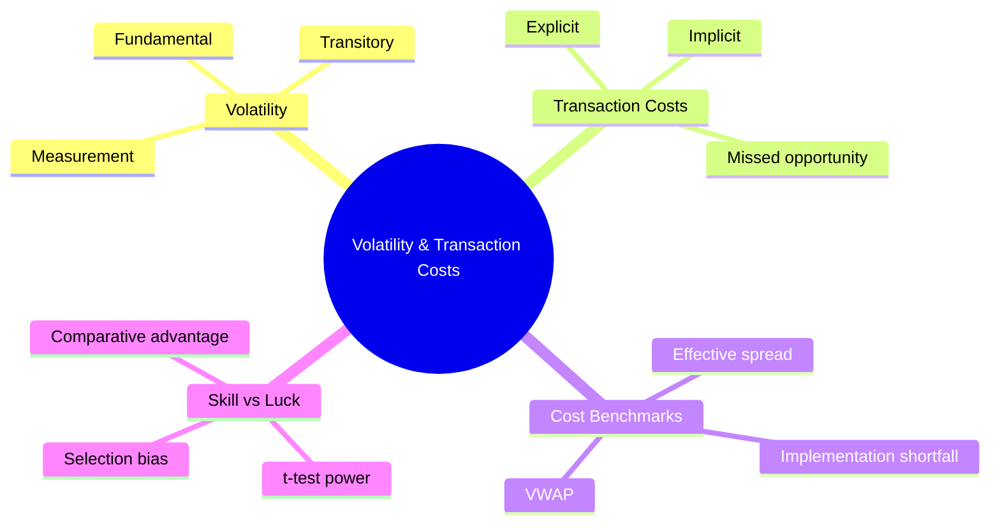
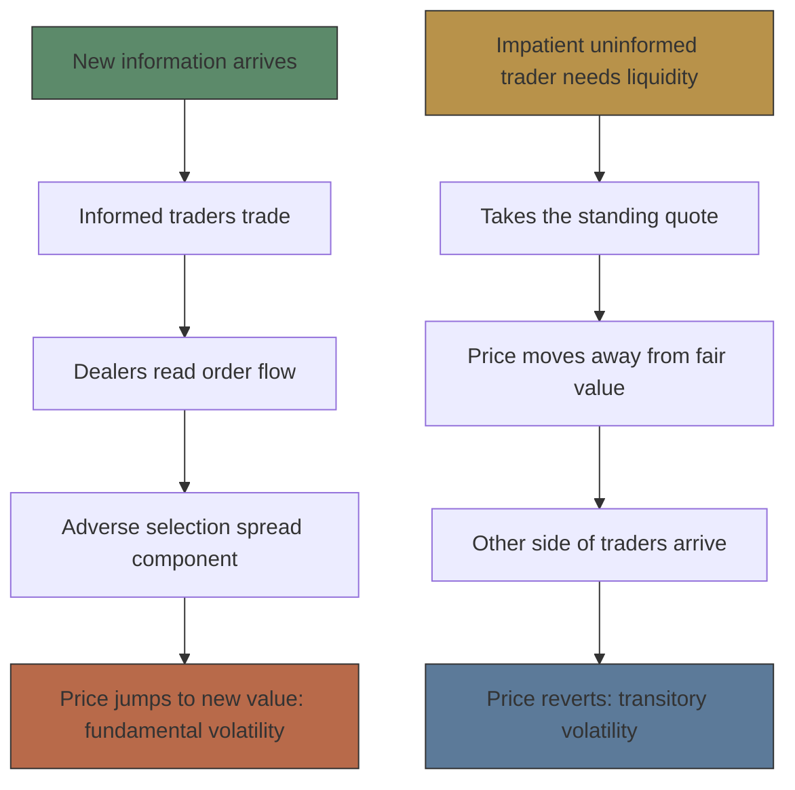
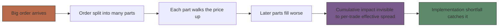
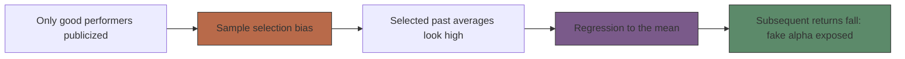

# Module 05: Volatility & Transaction Costs

Est. study time: 1.5h
Language: en
Description: What volatility is, what trading really costs, and how to tell skill from luck — from Harris, Trading and Exchanges (ch. 20, 21, 22).

## Knowledge Map

---

## Learning Objectives
- Distinguish fundamental volatility from transitory volatility, and name each one's source
- Split total transaction costs into explicit, implicit, and missed-opportunity components — with real numbers
- Compare the four cost benchmarks: effective spread, realized spread, implementation shortfall, and VWAP
- Explain why implementation shortfall is the only major benchmark a broker cannot game
- Separate skill from luck using market-adjusted and risk-adjusted returns, t-test power, and selection bias

---

## Real-World Example

The Beardstown Ladies were a famous investment club. They claimed **23.4%/yr** returns over the 10 years ending in 1993 — better than most Wall Street pros. Their newsletter had thousands of subscribers. Then Price Waterhouse audited the numbers: the real figure was **9.1%/yr**, while the S&P 500 returned **14.9%/yr**. The club had underperformed the market by roughly 6% a year — while believing they were beating it.

> **Think**: Why did smart, careful investors believe a track record that was actually ~6%/yr of underperformance?
>
> *Answer: They compared the return to the wrong yardstick (their memories, not the S&P 500) and trusted a self-reported number with no audit. Performance is always measured against a benchmark — pick the wrong benchmark or skip the math, and you cannot tell skill from luck, or even gain from loss.*

---

## Core Content

### Section 1: What volatility is — and its two types

Harris's definition: **volatility** is "the tendency for prices to change unexpectedly." Not "prices go up and down a lot" — *unexpected* change. A bond gliding predictably to par at maturity is not volatile; the day the central bank surprises everyone, it is.

Volatility comes in exactly two types:

| Type | Book definition | Source | Reverses? |
|------|-----------------|--------|-----------|
| **Fundamental volatility** | "due to unanticipated changes in instrument values" | New information about value | No — looks like a random walk |
| **Transitory volatility** | "due to trading activity by uninformed traders" | Impatient liquidity demands, bid/ask bounce | Yes — price reverts to fundamental value |

Why some instruments swing harder: **storage costs**. U.S. producers hold only about **9 days** of gasoline consumption and **18 days** of distillate fuels (heating oil and diesel) in storage. Thin inventories plus inelastic demand = price spikes. Electricity in California, 2000–2001, spiked violently — it is the "ultimate perishable commodity," nearly impossible to store. Other volatility factors: perishability, demand elasticity, fundamental uncertainty (tech stocks, high P/E ratios), political risk, and leverage.

Measuring it: **variance** (average squared difference from the mean price change), **standard deviation** (square root of variance), **mean absolute deviation** (average absolute difference). The tell for transitory volatility is **negative serial correlation** — reversals. If yesterday's rise is followed by today's fall more often than chance predicts, some of that movement is trading friction, not news.

> **Think**: A stock price rises every single day by exactly the same predictable amount. Is that fundamental volatility?
>
> *Answer: No. Only *unexpected* events move prices — expected moves are already in the price. A predictable drift is not volatility at all; genuine fundamental changes are unpredictable (a random walk), not a smooth glide path.*

> **Cloze**: "Price changes caused by uninformed traders taking liquidity — which eventually revert — are called {transitory} volatility."
>
> *Answer: transitory*

### Section 2: Where price changes come from — two causal chains

Same price chart, two completely different engines:

The two chains tie straight into the bid/ask spread: the **adverse selection component** of the spread feeds fundamental volatility, while the **transaction-cost (transitory) component** — the part that pays dealers for standing ready — feeds transitory volatility via the bid/ask bounce. Bounce: a market-order buyer lifts the ask, a market-order seller hits the bid, and the printed prices alternate even though nothing about the company changed.

Two practical consequences from the book:

- **Transitory volatility and transaction costs are two faces of the same coin** — both are high when a market is illiquid. Calm price action usually means cheap trading.
- **Regulators can affect transitory volatility but not fundamental volatility.** Rules can reduce manipulation and frictions; no rule can stop the world from changing.

One caution: for perishable commodities, negative serial correlation in *spot* prices may reflect fundamentals across delivery dates (Monday's fish is not Tuesday's fish), not trading noise. Futures on the same contract show much less of it.

> **Think**: A buyer lifts the ask at 30.10; seconds later a seller hits the bid at 30.00. Did the company's value change between those prints?
>
> *Answer: No. That is the bid/ask bounce — the transitory, friction-driven piece of the spread. The prints alternate as trade sides flip while fair value sits still; value traders eventually push price back, which is why transitory volatility reverses and fundamental volatility does not.*

> **Predict**: A company issues truly surprising news that every trader sees at the same moment. What happens to trading volume as the price jumps?
>
> *Answer: Volume can be very low. When information is common knowledge, everyone re-prices at once and few trades are needed. High volume is a sign of *private* information changing hands — so "high volume proves the move is real news" gets it backwards.*

### Section 3: The three-way split of transaction costs

"Transaction costs" = **all costs associated with trading**, and Harris insists on three buckets, not one:

| Component | Book definition | What lands here |
|-----------|-----------------|-----------------|
| **Explicit** | "all costs that a cost accountant would easily identify" | Commissions, exchange fees, taxes, trading-desk payroll |
| **Implicit** | costs "that arise because traders generally have an impact upon prices" | The bid/ask spread you pay; price impact of large orders |
| **Missed trade opportunity** | "arise when traders fail to fill their orders or fail to fill their orders in a timely manner" | Orders that never fill, or fill too late |

**Worked example — the cotton trade.** You want to buy 100 cotton futures at 65¢/lb. You place a limit at 64.95¢. Price runs to 68¢ — no fill. An aggressive order at 65.25¢ would have filled and earned 2.75¢/lb on each 50,000-lb contract: $1,375 per contract × 100 contracts = **$137,500** of missed trade opportunity cost. Zero commission paid. Largest cost of the trade.

**Partial example — your turn.** You decide to sell 100,000 DINE (Advantica/Denny's) shares at the $1.00 midpoint. Only 30,000 fill; the price falls to $0.82 and the rest of your order sits unfilled. Compute the missed trade opportunity cost.
*(Answer: 70,000 unfilled shares × ($1.00 − $0.82) = **$12,600**.)*

**Independent.** One week later, DINE trades back at $1.00. Your broker's system now reports your missed-opportunity cost as $0. Meanwhile another trader, trying the same sale with a wishful 4,000,000-share order (10% of shares outstanding, 50× the average daily volume of 80,000), gets an opportunity-cost number of **$714,600** on his unfilled 3,970,000 shares. Explain why both numbers are misleading. (Hint: what does the measurement date have to do with it — and could he ever have sold 4 million shares without moving the price himself?)

> **Think**: A friend says, "My trading costs are whatever Robinhood charges — basically zero." What is he missing?
>
> *Answer: Commission is only the explicit bucket. He still pays the spread on every market order (implicit) and risks non-fills (missed opportunity). Book's evidence: in the Plexus study, commissions were just 12 of every 100+ basis points measured — the invisible buckets were more than twice the visible ones.*

> **Cloze**: "Commissions, exchange fees, and taxes — the costs a cost accountant would easily identify — are {explicit} transaction costs."
>
> *Answer: explicit*

### Section 4: Measuring cost — four benchmarks, four answers

To measure implicit cost you need a **benchmark price** to compare your fill against. Different benchmarks, different verdicts on the identical trade:

| Benchmark | Compared against | Strength | Blind spot |
|-----------|------------------|----------|------------|
| **Effective spread** | Midpoint at time of trade | Least noisy; contemporaneous | Blind to cumulative impact of split orders |
| **Realized spread** | Midpoint 5/10/15/60 min *after* the trade | Shows what the dealer actually kept | Smaller than effective spread by design |
| **Implementation shortfall** | Midpoint at the moment you *decided* to trade | Captures spread + impact + missed fills in one number | Needs full order-level data |
| **VWAP** | The day's volume-weighted average price | "Did I beat the average trader today?" | Reports zero when you *are* the average trader |

Definitions: **effective spread** = 2 × (trade price − time-of-trade midpoint). **Realized spread** = 2 × (trade price − midpoint observed after the trade). The gap between them has meaning: *quoted − effective* = price improvement dealers gave you; *effective − realized* = dealers' losses to well-informed traders. **VWAP** = total dollar value of all trades ÷ total trading volume.

**The 4,000-share sequence.** One trader buys 4,000 shares in two clips:

- Trade 1: 2,000 @ 30.10, quote 30.00 / 30.10
- Trade 2: 2,000 @ 30.20, quote 30.10 / 30.20 — *trade 1 moved the market*

Naive per-trade liquidity premiums: 5¢ + 5¢ → **$400**. Implementation shortfall against the decision-time midpoint of 30.05: 5¢ on trade 1 + 15¢ on trade 2 = 10¢/share average → **$400**, and it correctly says trade 2 was expensive *because of trade 1*. VWAP estimate: **zero** — the trader was the only buyer, so his own average *is* the market's VWAP. Closing-price benchmark (close 30.20): −10¢ + 0 → **−$200**, reporting a *profit* on a trade that a round-trip reality check shows lost **$400**.

The causal chain that makes naive estimates fail:

> **Spot the Mistake**: "My broker's report shows a VWAP cost of zero for my buy order. I paid no transaction costs at all — trading is free."
>
> *What's wrong?*
>
> *Answer: VWAP can only see your average against the day's average. If you were the main buyer, your average equals the day's VWAP by construction — the metric is blind to yourself. You still paid the spread (implicit) on every clip and you moved the price you later filled at. Zero measured cost ≠ zero actual cost; that's exactly why the book calls implementation shortfall — benchmarked before the broker gets the order — the estimator that cannot be gamed.*

> **Cloze**: "The only major transaction-cost benchmark that cannot be gamed by a broker is {implementation shortfall}, because its benchmark price is fixed at the moment the manager decided to trade."
>
> *Answer: implementation shortfall*

> **Think**: Effective spread and realized spread are both "2 × signed difference from a midpoint." What does the gap between them tell you?
>
> *Answer: Effective spread prices the trade against the quote at execution; realized spread prices it against the quote minutes later. The difference — effective minus realized — is the dealer's loss on trades where the price moved against him, i.e. what he paid to well-informed traders. It's the adverse-selection bill, measured directly.*

### Section 5: The cost iceberg — visible vs hidden

Plexus Corporation's measurement of a real institutional portfolio, in **basis points** (1 bp = 0.01%, so 12 bps on a $10M trade = $12,000):

| Cost category | Basis points | Visible? |
|---------------|-------------|----------|
| Commissions | 12 | Visible |
| Market impact | 20 | Visible |
| Timing costs | 53 | Hidden |
| Missed / unfilled orders | 16 | Hidden |
| **Total implementation shortfall** | **101** | — |

Visible costs: **32 bps**. Hidden costs: **69 bps**. The hidden side is more than **2×** the visible side — the "iceberg." And the four pieces sum exactly to the portfolio's total implementation shortfall, which is why IS is the umbrella measure.

Timing itself splits into three intervals: **manager timing** (decision price → order reaches the buy-side desk; most managers use the previous day's close as the decision price), **trader timing** (desk → broker release), and **market impact** (release → execution). The missed-trade piece compares the decision price to the price **30 trading days** later on the unfilled portion.

Who measures you depends on who you hire: Abel/Noser benchmarks **VWAP**, SEI uses the **closing price**, Plexus uses **implementation shortfall**, TAG uses **effective spread**, Elkins/McSherry averages open/high/low/close across 42 countries.

> **Predict**: Your broker knows his performance will be judged against the closing price. What can he do that lowers his *measured* cost without improving your execution?
>
> *Answer: Game it — defer selling until near the close, or mimic the close's price pattern, so his fills look close to the benchmark. Measured cost falls while your real cost (impact, missed moves) rises. Book's fix: benchmark fixed *before* the broker receives the order (implementation shortfall), so there is nothing to time against. This is why a low reported cost can mean a gamed metric, not good execution.*

> **Think**: Cut commissions to zero — did the client's trading costs fall?
>
> *Answer: Not necessarily. Costs migrate: the broker can shift work into timing and impact categories (delaying orders, trading more aggressively), so the visible bucket shrinks while hidden buckets grow. Don't mistake moving costs for reducing them — only the full iceberg (implementation shortfall) tells you if the total changed.*

### Section 6: Skill or luck? Performance after costs

You measured costs. You have returns. Now the hardest question: **was it skill?**

First, pick the right return measure:

| Measure | Formula | Question it answers |
|---------|---------|---------------------|
| Market-adjusted return | portfolio return − market index return | "Did I beat the index?" |
| Risk-adjusted excess return (= realized alpha) | raw return − (portfolio beta × market return) | "Did the manager pick winners after accounting for market risk?" |
| Market timing return | (beta × market return) − market return | "Is there timing skill?" |

Decomposition identity: **Raw Return = Excess Return + Market Timing Return + Market Return**. Beta matters: a beta-0.5 stock moves 0.5% for every 1% market move, so a manager sitting in low-beta stocks can beat an index with zero skill. That's why market-adjusted numbers flatter some managers and risk-adjusted numbers don't.

The statistical test of skill is a **t-statistic**: the manager's average market-adjusted return ÷ standard error of that mean. A large t says luck alone probably can't explain the record. The problem is power — the chance the test finds skill when skill exists:

- Assume skilled managers add **2%/yr**; market-adjusted noise is about **7%/yr**. Signal-to-noise is dismal.
- At 95% confidence: 5 years of monthly data gives the test only **15%** power to spot that skill; 10 years gives **23%**.
- To get 95% confidence *and* 75% power for 2%/yr skill takes **22 years** of monthly returns. Even 4%/yr skill needs **6 years**.
- One year of data: under **10%** chance of identifying a genuinely skilled manager. One year is nearly worthless.

And luck manufactures stars. Simulate **10,000 unskilled managers** (7%/yr noise): the *best* one, in a median year, beats the market by about **27%** — and beats assumed skill of 2%/yr by miles. Over 10-year averages, the luckiest still beats by >8%/yr half the time. "It is much better to be very lucky than skilled with average luck."

The final trap is a selection spiral:

Bad funds get merged or closed (**survivorship bias**, a species of sample selection bias), winners get newsletters — so the sample you *see* is rigged high, and regression to the mean does the rest. Buffett's own record illustrates the correct comparison: his naive t-statistic vs the market was **4.9**, but he was *selected for being the best* — the right test asks how often the best of 10,000 unskilled managers would beat the market by ≥11.8%/yr (about 0.5%), which still leaves him likely skilled. Beardstown Ladies' 23.4% claim collapsed to 9.1% under audit.

The book's constructive alternative: predict performance from **comparative advantage** — being better than your *opponents* — not from past returns. Trading is zero-sum, so being merely good (absolute advantage) is not enough.

> **Think**: Your fund manager returned +18% last year while the market returned +12%. What must you check before calling it skill?
>
> *Answer: At least three things — beta (if the portfolio ran hot, risk-adjusted excess return may be ~0), benchmark choice (is +12% the right index?), and sample length (one year has <10% power to distinguish skill from luck; the best of 10,000 unskilled managers beats the market by ~27% in a median year). Check alpha after beta, over decades, against survivorship-lean data.*

> **Cloze**: "After sample selection pushes past-return averages up, subsequent averages are invariably lower — this is {regression to the mean}."
>
> *Answer: regression to the mean*

---

### Why This Matters

Everything before this module was mechanism — order books, dealers, informed traders. This module is the scorecard. Volatility tells you whether a market's price moves are information or friction; the cost split tells you that commission is the tip of the iceberg (12 bps visible vs 69 bps hidden in Plexus's data); the benchmark you choose decides what "cost" even means (VWAP said $0 on a trade that really lost $400); and the luck math tells you why last year's star fund is close to worthless as evidence. Harris's strategic point: total performance = portfolio selection + trade implementation — cutting trading costs often beats improving stock picks.

---

## Key Takeaways
- Volatility = "tendency to change unexpectedly," split into fundamental (information, doesn't revert) and transitory (liquidity trading, reverts); both together = total volatility
- Transaction costs = explicit (fees) + implicit (spread + price impact) + missed opportunity (unfilled/late orders); commission is only the first bucket
- Effective spread benchmarks the quote at trade time; realized spread benchmarks minutes later; their gap = dealer's losses to informed traders
- Implementation shortfall benchmarks the decision-time midpoint — captures the whole order and cannot be gamed; VWAP can report zero on a costly trade
- Plexus iceberg: 12 bps commission + 20 impact vs 53 timing + 16 missed — hidden costs exceed 2× visible
- Skill tests are starved of data: 2%/yr skill vs 7%/yr noise needs 22 years for a 95%-confidence, 75%-power t-test; selection bias and regression to the mean fake the rest

---

## Common Misconception

**"My commission is my transaction cost."**
Commission is only the explicit piece — what the cost accountant sees. Plexus's real portfolio: 12 bps commission but 69 bps of hidden timing and missed-order costs (plus 20 bps impact). Total cost = explicit + implicit + missed opportunity, and the invisible two are usually bigger. Judging execution by commission alone is judging an iceberg by its tip.

---

## Spot the Mistake

> **Spot the Mistake**: "My fund manager beat the market by 12% this year. Past returns prove skill — I'm moving my retirement money there."
>
> *What's wrong?*
>
> *Answer: One year of returns has under 10% power to detect even real 2%/yr skill. Simulate 10,000 *unskilled* managers and the luckiest beats the market by ~27% in a median year — a 12% beat is what luck manufactures routinely. Add selection bias (you only hear about winners) and regression to the mean (selected past averages fall afterward), and the record predicts little. Check risk-adjusted excess return over decades, or evaluate comparative advantage instead of chasing the headline.*

---

## Feynman Explain
(Explain to a friend who has never taken an economics class: why "my trade cost me $0 in commission" can be wildly false, and why a fund manager's winning year means almost nothing. Cover the three cost buckets with an everyday example, why the benchmark decides the answer, and the luck math — 10,000 monkeys picking stocks — in plain words. No jargon until they ask.)

---

## Reframe
(Pause. Judge: Harris says implementation shortfall is the one estimator "not subject to any of the biases discussed" — should it be *mandated* as the only reporting standard for brokers and funds, or does its data requirement make that impractical? And if past returns can't identify skill, what *should* a small investor do with a mutual-fund shortlist? Write your position in 5 sentences.)

---

## Drill
Run: `learn.sh quiz market-microstructure 05-volatility-and-costs`
Run: `learn.sh cloze market-microstructure 05-volatility-and-costs`
