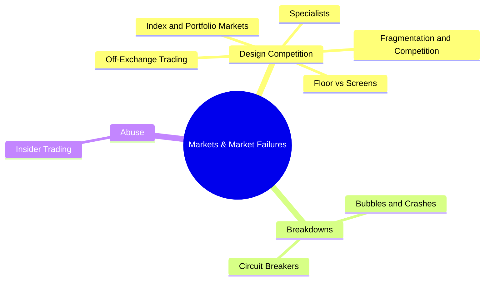
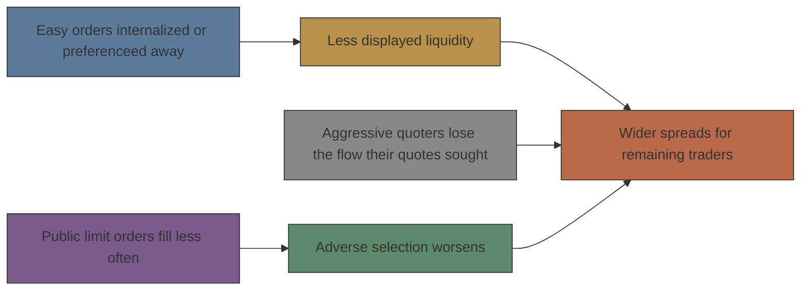
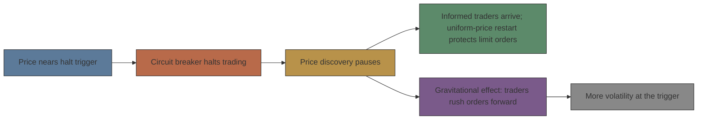

# Module 06: Markets & Market Failures

Est. study time: 1.5h
Language: en
Description: How market designs compete and then break down — index markets, specialists, off-exchange trading, fragmentation, floor vs screens, bubbles, circuit breakers, and insider trading (Harris ch. 23–29).

## Knowledge Map

---

## Learning Objectives

- Describe index and portfolio markets: index products, weighting schemes, program trades, and why index markets trade cheaply and liquidly
- Explain what specialists must do, what privileges they receive, and why liquidity provision is a public good
- Trace how internalization, preferencing, and crossing drain displayed markets, and identify who wins and who loses
- Explain the order flow externality, what markets compete for, and how floor and automated trading differ on informational liquidity
- Analyze bubbles, crashes, and circuit breakers, and separate informed trading from insider trading, legal from illegal

---

## Real-World Example

In October 1989 the New York Stock Exchange launched the Exchange Stock Portfolio (ESP): a single $6 million package that traded the whole S&P 500 at once, with five investment banks obliged to quote firm prices. It looked like the future of block index trading. Twenty-five months later it was dead — 269 trades in total, fewer than 5 of them genuine agency trades. Meanwhile the same portfolio traded in huge volume in Chicago futures. The ESP dealers sat away from where S&P 500 risk was actually being discovered and had to quote firm prices for $6 million, while Chicago floor traders quoted firm markets for no size at all.

> **Think**: Why did a well-capitalized exchange product die while an identical portfolio thrived in a futures pit?
>
> *Answer: Information. Index risk was discovered in the CME futures pit, so index traders traded there and the ESP never attracted order flow. This is the order flow externality in action — liquidity attracts liquidity — and it shows that a market design fails if it opens in the wrong place, not merely if its rules are bad.*

---

## Core Content

### Section 1: Index and portfolio markets

Index trading is "one of the most important financial innovations of the twentieth century." Index products — index futures, index options, and index fund shares — now trade a nominal dollar value that exceeds trading in the underlying stocks themselves. A price index is just a number built from component prices; the two construction styles differ on what dominates:

| Index type | Proportional to | Dominant stocks | Examples |
|---|---|---|---|
| Price-weighted | Sum of component prices | Highest-*price* shares | DJIA, Nikkei 225 |
| Value-weighted (cap-weighted) | Total capital value of components | Largest *companies* | S&P 500 (most indexes) |

An index divisor keeps the index continuous when components change or a stock splits. **Tracking error** is "the difference between the portfolio return and the corresponding dividend-adjusted index return." Value-weighted replication is trivial: hold each stock in proportion to its market cap and rebalance only when the component list changes.

Three reasons index markets are cheap and liquid: few traders have valuable insight into the *whole market*, so dealers face little informed-trading loss; everyone trades the same products, so quotes stay tight; and one basket trade replaces hundreds of component trades. That last point matters for institutions: a **program trade** is the simultaneous submission of at least 15 coordinated transactions totaling at least $1 million — about 27% of NYSE volume. Package dealers quote firm prices for entire portfolios, typically vs end-of-day value (bid "closing value − 15¢/share," ask "+ 20¢/share"), and reveal the security list only after the close to block manipulation. This firm bid/offer market is the **block index trading** market.

One caution: index markets *lead* the cash index, because index traders need only price index risk while component-stock traders must also price firm-specific risk. That is why index futures are sometimes called "the tail that wags the dog."

> **Think**: Index funds slightly underperform their benchmark yet routinely beat about three-quarters of active managers. Is that luck?
>
> *Answer: No — it is zero-sum accounting. Active managers turn over more than 100% per year and charge 1–3% in fees; index funds turn over 0–10% and charge under 15 basis points. "They lose because they consistently buy and sell." Only about a quarter of mutual funds beat the market in a given quarter, so beating three-quarters of them is arithmetic, not magic.*

> **Cloze**: "The simultaneous submission of at least 15 coordinated transactions totaling at least $1 million is a {program trade}; these are about 27% of NYSE volume."
>
> *Answer: program trade*

### Section 2: Specialists — the traders of last resort

A **specialist** is an exchange-designated member who "must continuously quote two-sided markets so that markets always exist in their specialties," keeps markets "orderly," and keeps prices from "jumping too quickly." The economics: exchanges believe continuous orderly markets build investor confidence, which wins listings and fees. Because the liquidity specialists supply is a **public good** — everyone benefits whether or not they pay — competitive markets under-provide it, which is why the role exists at all.

| Role | What the specialist does | Paid how |
|---|---|---|
| Dealer | Trades own account, heavily regulated | Dealer profits at the post |
| Broker | Works system orders, serves as oral bulletin board | Commissions (e.g., NYSE limit orders held >5 minutes) |
| Exchange official | Runs the opening auction, enforces rules | No direct pay — part of the privilege deal |

Their duties split two ways. **Affirmative obligations**: ensure a reasonable market always exists, quote two-sided markets with meaningful spreads when no one else will, and supply **price continuity** — "prices move smoothly, without jumping too much." Specialists are *traders of last resort*, but they are NOT required to quote firm size for big blocks or to prop up falling values. **Negative obligations**: public order precedence, price priority, and the **public liquidity preservation principle** — specialists must not fill standing public limit orders for their own account, so they trade only with incoming marketable orders unless they improve the price.

The pay comes as privileges: seeing all system order flow first, deciding *after* others decide, setting the public quote, **stopped stock** (a guaranteed later execution that hands the specialist a look-back timing option), and control of the opening auction. Who pays for stopped stock? Not the stopped clients — subsequent traders who fill orders the specialist declines, and public limit order traders whose would-be fills get stopped away.

Concentration tells the story: NYSE specialist firms fell from 230 in 1933 to 59 in 1983 to **8 by the end of 2001**, with 5 firms doing 95% of dollar volume. Incumbency feeds on the order flow externality — more order flow brings more knowledge, which brings more effectiveness, which brings more order flow — so head-to-head contests became, in the book's words, "virtually impossible." When the tick shrank from 1/8 to 1/16 (1997) to a penny (2000), specialist participation rates *and* profitability both rose, because stepping in front of the book costs only the minimum increment.

> **Think**: If specialists provide such valuable liquidity, why does the book call their role a wealth transfer?
>
> *Answer: Beneficiaries and benefactors differ. Small uninformed market-order traders get price improvement, but public limit order traders are stepped in front of — their fills become specialist profits. The liquidity is real, but it is paid for by a different group than the one that enjoys it, so regulation becomes a lobbying contest.*

> **2026 reality check — the specialist title is history.** The NYSE "Hybrid Market" (launched 2005–06) converted specialists into **Designated Market Makers** and pushed almost all volume into electronic matching; today the floor still exists but handles a sliver of trades, and most opening auctions are fully electronic. Read this section as *how Harris' design worked and what institutions derived from it*: affirmative/negative obligations survive as auction rules, the public liquidity preservation principle survives as trade-ahead rules, and "trader of last resort" survives in DMM obligations. The economics — public-good liquidity, privileges in exchange for duties, regulatory lobbying — are still live everywhere a venue must promise a market.

### Section 3: Internalization, preferencing, and crossing

Three practices move trades **away from organized markets**, and all three reduce order transparency:

- **Internalization** — dealers fill their own clients' orders themselves.
- **Preferencing** — brokers route clients' marketable orders to dealers in exchange for *payments for order flow* (and limit orders to ECNs that pay *liquidity fees*).
- **Crossing** — brokers arrange trades among their own clients.

**Best execution** means brokers "ensure that their clients' orders fill quickly at the best available prices"; for marketable orders the standard is the **NBBO** — the best bid or offer quoted anywhere. The central argument is perfect competition: wholesale dealers compete for broker order flow, brokers compete for retail order flow, and the excess profits get competed away into inducements. So if regulators demand higher execution quality, payments for order flow fall and commissions rise by the same amount — net transaction costs for small market orders do not depend on how best execution is defined.

Who actually loses? The causal chain:

Small uninformed market-order traders come out *ahead* — low commissions plus price improvement. Public limit order traders and everyone trading at displayed prices come out behind: their orders fill less often, and the quotes left on screen must cover the informed and large traders the firm quotes still attract. Even with identical information and sizes, diverting orders from those who price aggressively raises spreads.

> **2026 reality check — this fight is current events.** Harris' three practices scaled into today's structure: wholesale internalizers fill most retail equity flow; broker-dealers route through **maker-taker** exchanges that pay liquidity providers and charge takers (Reg NMS's collateral, not in the book); dark pools/ATSs under Reg ATS now carry roughly 40% of U.S. equity volume away from displayed books. The governance fight stayed hot — SEC order-competition proposals (2022), and the 2021 GameStop episode was, at core, a dispute over payment for order flow and internalized retail flow. Mechanics in this section are exactly what's being legislated.

> **Predict**: A regulator bans payments for order flow. Brokers must now route every order to the best-priced venue. What happens to small traders' total cost — spread plus commission?
>
> *Answer: Roughly nothing. Under competition the payment simply becomes a visible commission: payments fall and commissions rise by the same amount. What changes is the hidden side — displayed spreads should narrow, and limit order traders should do better, because aggressive quoters finally get the flow their quotes were meant to attract.*

> **Think**: Internalization gives small clients price improvement and their brokers low commissions. So it must be good for traders — who pays for it?
>
> *Answer: The traders left behind. When easy orders bypass the book, public limit orders fill less often, adverse selection on the remaining fills worsens, and the quotes still on screen must cover the informed and large traders — so spreads widen for everyone who trades at displayed prices. Small market-order traders gain, limit order traders and displayed-price traders pay: total buy-side transaction costs rise.*

### Section 4: Why markets consolidate and fragment

A **fragmented market** is one where "people can trade essentially the same thing in different market centers"; a **consolidated market** has all traders in one center. Two competitions pull opposite ways:

| Question | Wants consolidation | Wants fragmentation |
|---|---|---|
| Traders compete for | The best price (all flow in one book) | — |
| Market centers compete for | — | Low-cost, best services for each clientele |
| Design analogy | RISC: simple structure, all flow | CISC: complex service to diverse traders |
| Slogan | "United we stand" | "Strength through diversity" |

The consolidation engine is the **order flow externality**, a *network externality*: "the value of a system to a user increases as more people use the system." Trades are easiest in liquid markets, so traders gravitate to the most liquid, and each joiner adds liquidity that attracts more — markets "naturally consolidate" with no regulatory help, producing **winner-take-all** systems and massive entry barriers. Innovations die on this externality: Optimark's Cray-matched preference profiles won acclaim but no order flow, closed its US equities segment in September 2000, and ran an accumulated deficit of **$406 million** through September 2001. The lesson: the externality "may let an incumbent market survive even if another market structure could provide better service."

Why then does anything fragment? Five trader differences: unequal sizes (big traders fear front-running), asymmetric information (informed traders want anonymity, uninformed want to be skimmed cheaply), unequal patience (impatient pay for immediacy, patient supply limit orders), unequal access, and unequal creditworthiness. Fragmentation is *not* fatal if information flows freely among segments and traders can route or arbitrage — "if an order cannot move to its best market, arbitrageurs will move the best market to the order." The real casualties of unregulated competition are the public goods: time-precedence enforcement (rivals defect on tick size — the race to the bottom before decimalization) and regulatory services like surveillance, which no single market can charge its own traders for.

> **Think**: Why does the order flow externality create an entry barrier even for a genuinely better exchange?
>
> *Answer: Liquidity is the product. A newcomer with better rules but no traders offers empty markets, so nobody comes — the classic network effect, the same reason a new social network fails against an entrenched one. Traders must be paid (via price improvement or services) to overcome the switching cost.*

> **Predict**: Suppose a rival market matches the incumbent's prices but is faster. Order flow still does not move. Why — and what would?
>
> *Answer: Because prices alone are not the product; liquidity and counterparties are, and the incumbent's book is where the resting orders live. Flow moves only when the outsider compensates for the externality — through price improvement, free liquidity, or by integrating with the incumbent the way ECNs did inside Nasdaq (they could bypass Nasdaq's weak externality but not the NYSE's strong one).*

### Section 5: Floor versus automated trading

Both systems are **order-driven auctions with similar matching rules**; the difference is technology — "traders arrange trades by personally exchanging information among themselves" versus "computers arrange the trades." Head-to-head evidence is mixed and confounded (Paris Bourse 1989 pulled French stocks from London, but France also repealed a stamp tax; ISE took 16% of US equity option trading in its listed issues within 18 months of its 2000 launch).

| Dimension | Floor (oral auction) | Automated (screen) |
|---|---|---|
| Fairness | Depends on skill and honesty; documented scandals | Rules applied exactly; flawless in-system audit trail |
| Fair access | Floor traders see and react first (data <2 sec, routing <5 sec) | Equal for all connected traders |
| Unique strength | **Informational liquidity**: counterparty screening, credible size signals, brokers' knowledge of latent traders | Scalable capacity; no fast-market breakdown |
| Speed | Fast at negotiating size verbally | Completes trades faster (no manual recording) |
| Cost | Expensive real estate, labor-intensive "will always be" | Off-the-shelf system ≈ $5 million to buy and set up |

**Informational liquidity** is the floor's unique advantage: the floor is where you screen counterparties (avoid the well-informed and the price-discriminating large trader), signal size credibly through reputation ("no more size," then returning costs credibility — no screen equivalent), and reach brokers who know which latent traders have not submitted orders yet. Screens answer with messaging systems and undisclosed-size limit orders, but they cannot replicate reputation. Screens win on speed, cost, audit trails, and small active flow; oral auctions win where traders must exchange information about each other.

> **2026 reality check — the debate is settled in practice, not in theory.** The NYSE floor still physically exists but carries a sliver of volume; equity markets (including NYSE) run essentially electronic, and COVID-era remote trading finished the job of demoting the floor. Yet *informational liquidity migrated, it didn't die*: screen traders now do counterparty screening in data, signal size through iceberg orders and negotiated risk prices, and exchange information in chat forums, voice lines, and broker networks — the same three functions Harris attributed to the floor, in new clothes. Learn the floor as the clearest illustration of why those functions exist at all.

> **Think**: A screen trader says, "Floors are unfair — my rules are identical to everyone else's." What does the book answer?
>
> *Answer: It depends which fairness. Screens deliver operational fairness (rules uniformly applied, no cheating) and the better audit trail. But fair access — an equal chance at opportunities — favors the floor, where traders see unreported information and react in under two seconds. Both meanings are legitimate; they cut in opposite directions.*

> **Cloze**: "The floor's edge — screening counterparties, signaling size credibly, and knowing latent traders — is its {informational liquidity}, which screens cannot replicate."
>
> *Answer: informational liquidity*

> **Spot the Mistake**: "The NYSE kept its trading floor for decades, which proves floor technology beats automated systems."
>
> *What's wrong?*
>
> *Answer: The reverse inference is forbidden by the order flow externality — big floor markets survive because liquidity attracts liquidity, not because their technology is superior. And floors genuinely beat screens where traders must exchange information about each other, while screens beat floors on cost, speed, and audit trails. Neither structure dominates.*

### Section 6: Bubbles, crashes, and circuit breakers

A **bubble** is when "prices rise to levels that are substantially above fundamental values"; a **crash** is when "prices fall very quickly." Typical dynamics: over-optimists buy on real good news, momentum traders chase neighbors' gains, order anticipators buy ahead of expected buyers, and a *price accelerator* kicks in — rising prices transfer wealth from pessimists to optimists, who buy more, while shorts cover on margin calls. Value traders see the overpricing but "can't or won't" sell enough — trading against the majority "requires great courage." Then a trigger arrives, momentum buyers lose interest, margin calls and stop-losses pile on, and the crash happens. Panic can undershoot value, producing a **dead cat bounce** on the rebound.

Most crashes are *corrections*, not failures: prices rebound little afterward, because "the bad fundamental news merely triggers the crash. The true causes … lie in the bubble that preceded it."

**October 1987** is the centerpiece. The Dow had risen 44% from the start of the year to its August 25 high, then fell **−23% on Monday, October 19** — the largest one-day percentage loss — for a peak-to-trough total of −36%. It still ended the year *up* 2%. The amplifier was **portfolio insurance**: "a dynamic trading strategy that portfolio managers use to replicate the combined returns of a portfolio plus a put option." Scale of the problem:

- Pre-crash US market cap ≈ $2 trillion; institutions held ~50%; ~10% of institutional funds were insured → **~$100 billion under portfolio insurance**.
- Typical delta ~0.4 → each 1% market drop forced sales of 0.4% of $100 billion = $400 million ≈ **10 million shares** at ~$40 average price, against a daily volume of 160 million shares.
- Futures led stocks down, and the two disconnected: S&P 500 futures traded at a **more than 10% discount** to the cash index before the close, because index arbitrageurs could not get fast stock executions (SuperDot printers fell more than an hour behind, and some Nasdaq dealers took their phones off the hook).

**Worked example.** 0.4 × 1% × $100 billion = $400 million of forced sales ÷ $40 average price = **10 million shares** in one day — over 6% of normal volume, from one strategy alone.

**Partial example — your turn.** Same setup, but the drop is 2.5%. How many shares must be sold? (0.4 × 2.5% × $100B = $1 billion ÷ $40 = **25 million shares**. The share count scales linearly with the drop — that is what made the strategy destabilizing.)

**Independent.** The average share price is $80 instead of $40, and nothing else changes. Compute the forced sales for a 1% drop, then judge: does a smaller share count make the strategy safer? (Do the arithmetic yourself, then check the logic — with uncertainty about *how much* insurance existed overall, buyers withdrew preemptively, so expectations alone could drive the market down.)

**Circuit breakers** are "trading rules that limit trading activity": trading halts, price limits, transaction taxes, margin requirements, position limits, and collars. NYSE Rule 80B halts trading after DJIA moves of 10% (Level 1), 20% (Level 2), or 30% (Level 3, close for the day); the original post-1987 trigger of 12% was never hit until the rule was replaced. Their mechanism runs both ways:

Halts definitely slow *fundamental* price adjustment — prices are less informative while closed — but their effect on transitory volatility is theoretically **indeterminate**: they restrain both the volatility-causers (uninformed traders, anticipators, bluffers) and the volatility-tamers (informed traders, dealers, arbitrageurs), and empirical studies are inconclusive because extreme events are too rare. Regulation itself has a logic: after a crash, regulators adopt *something* (credit if no crash follows, blame if they did nothing) but keep it *mild* (severe rules risk blame for causing damage) — that is why the original 12% threshold was near-meaningless. Rule 80A's ±~2% collar, which restricted index arbitrageurs far more than any halt, is best read as regulatory capture: in November 1997, 470 of 1,366 NYSE members were full-time specialists versus 20 members doing 95% of program trades.

> **2026 reality check — halts evolved.** The **May 6, 2010 Flash Crash** (DJIA −9% intraday in minutes, aided by electronic market makers pulling quotes) is Harris' indeterminacy argument made real: it produced the **Limit Up–Limit Down (LULD)** band system (2012), which halts a stock for five minutes when the price leaves a ±5–10% band — per-stock and time-of-day scaled, replacing the market-wide DJIA-percentage thinking for individual names. Market-wide Rule 80B halts still stand. The textbook debates in this section (does halting stabilize? who rushes orders forward?) are the ones regulators re-litigated in 2010 and again during the 2021 meme-stock surges.

> **Think**: If a crash corrects earlier mispricing, is it a "market failure"?
>
> *Answer: Usually not. "Most crashes … represent corrections to previous pricing errors rather than market failures" — and if they were failures, prices would bounce fully afterward, but they rebound little. The 1929 panic sellers were "lucky" (prices kept falling); 1987 holders recovered fast.*

> **Predict**: Traders learn that a 10% DJIA drop will halt trading for an hour. What do they do in the minutes *before* the trigger — and what does that do to volatility?
>
> *Answer: They rush orders forward to execute before being trapped — the gravitational effect. That pulls liquidity away from the calm just before the trigger and piles it into the approach, so volatility rises as the trigger nears. It is the mechanism by which halts can add the very volatility they were meant to damp.*

### Section 7: Insider trading — informed vs insider, legal vs illegal

**Inside information** is "material information about the value of a security that is not available to public traders," and **material information** is "information that would cause prices to change if it were widely known." Inside information keeps its status however many people it passes through; it dies only when released publicly. **Insider trading** is trading on such information — the SEC's version adds "in breach of a fiduciary duty or other relationship of trust and confidence," covering tipping, tippee trading, and misappropriation.

| Trader | Basis of trade | Example | Legal? |
|---|---|---|---|
| Informed | Own analysis of *public* data | Analyst's private valuation from filings | Yes — informed, not insider |
| Insider (legal) | Material info *after* disclosure, a trading window, or a prearranged program | Executive buying after earnings release | Yes |
| Insider (illegal) | Material nonpublic info by virtue of position | Officer buying before an acquisition announcement | No |
| Tippee / misappropriator | Info passed on or stolen from employer/client | Winans' column leaked before publication | No |

The **misappropriation doctrine** is what convicted columnist R. Foster Winans: he leaked his "Heard on the Street" column to Kidder Peabody brokers for **$600,000** in trading profits while being paid **$31,000** to write it — convicted on 59 counts, 18 months in prison. His duty ran to his employer, not the companies he wrote about. Earlier, Chiarella, a printer who deduced takeovers from blanked documents and made ~$30,000, was acquitted by the Supreme Court in 1980 — the law later changed, and today he would be convicted under misappropriation. Enforcement relies on exchange surveillance flagging large price moves on large volumes with no public news, then cross-referencing who knew against who profited; penalties must be large because detection is unlikely: up to 10 years and $1 million criminal, plus 3× profit civil, plus a SEC bounty of up to 10% of the civil penalty. Insiders must report trades within 10 days and disgorge **short-swing profits** — positions opened *and* closed within six months.

Why restrict at all? Three reasons: fairness (markets should reward research, not connections), liquidity (insiders are adverse selection against dealers, so banning them narrows spreads and lowers uninformed traders' costs), and corporate control (if insiders profit from secrecy, they hoard information, directors know less, and management front-runs its own firm's deals). The counterarguments: insider trading pushes prices toward value sooner, enforcement is nearly impossible against confederates, and Manne argued it functions as entrepreneurial compensation. The live question is not whether to ban it but how much to spend enforcing it.

> **Think**: An analyst derives a bold private view of a stock using only public filings and trades on it. Insider trading?
>
> *Answer: No. "Informed traders" act on their own analysis — using public data to reach a private conclusion is exactly what analysts are supposed to do. Insider trading requires material nonpublic information obtained by virtue of position or relationship.*

> **Cloze**: "Trading on information taken from an employer, client, or publication is punished under the {misappropriation} doctrine — the theory that convicted Winans."
>
> *Answer: misappropriation*

> **Spot the Mistake**: "Insider trading is always illegal, everywhere."
>
> *What's wrong?*
>
> *Answer: Three counts. Legal channels exist — trades after public disclosure, corporate trading windows, and prearranged trading programs (a US safe harbor that need not even be disclosed). Informed trading on your own analysis of public data is not insider trading at all. And while most countries ban it on the books, only the US, Canada, and GB regularly and seriously enforce — while tipping and misappropriation stay illegal even for tippees who never owed anyone a duty.*

---

### Why This Matters

Every design in this module is one side of a trade-off: liquidity vs informativeness, consolidation vs service diversity, execution quality vs commission transparency, continuity vs informed trading. Markets fail in patterned ways — orders bypass the venues that promised liquidity, innovations die to network effects, halts trade volatility for delayed price discovery, and inside information tests whether prices or relationships earn you money. Learn to spot which trade-off is being over-weighted and you can predict the failure before it hits the news.

---

## Key Takeaways

- Index markets are cheap and liquid because few people can outguess the whole market, everyone trades the same products, and one basket replaces hundreds of trades — index futures lead cash stocks
- Specialists must supply liquidity when no one else will (affirmative) and must not trade ahead of the public (negative); their pay comes as privileges, and concentration went from 230 firms in 1933 to 8 in 2001
- Internalization and preferencing give small market-order traders low commissions but drain displayed liquidity, widen spreads for everyone left, and harm public limit order traders
- The order flow externality makes markets winner-take-all: liquidity attracts liquidity, so incumbents survive even when a rival design could serve traders better (Optimark lost $406 million)
- Floors win on informational liquidity, screens win on cost, speed, and audit trails — and neither proves superiority, because surviving an externality is not the same as being better
- Most crashes correct earlier bubbles rather than causing new failures; circuit breakers slow price discovery and may add volatility before the trigger; insider trading is defined by information and relationship, not by intuition about fairness

---

## Common Misconception

**"Circuit breakers always stabilize markets."** Wrong. Halts and limits definitely slow *fundamental* price adjustment — prices are less informative while trading is closed — but their effect on transitory volatility is theoretically indeterminate, because they restrain the volatility-causers (uninformed traders, anticipators, bluffers) and the volatility-tamers (informed traders, dealers, arbitrageurs) alike. Worse, the **gravitational effect** pulls orders forward before a predicted halt, adding volatility right at the trigger, and empirical studies remain inconclusive because extreme events are too rare to measure. Halts make extreme moves *orderly*; they do not stop the bubble that causes the crash.

---

## Spot the Mistake

"Iomega traded at $55⅛ in early 1996 with a P/E near 1,000 on 1995 earnings — and at its peak its market value exceeded 10% of IBM's. Clearly the market knew something: a great company was a great investment."

*Answer: A great company is a great investment only at the right price — "the most common mistake is mistaking a great company for a great investment." Best-year earnings per share were only $1.26 split-adjusted, so the price already discounted decades of perfection. Market cap above 10% of IBM's was the bubble talking, not information; the Nasdaq's later 5132.52 peak and long decline show what happens when price runs far beyond fundamental value.*

---

## Feynman Explain

(Explain to a friend who has never traded: why do we need specialists and exchanges at all if computers could just match orders — and what would we lose if everything moved off the floor? Cover public goods, informational liquidity, and the order flow externality. No jargon until they ask.)

---

## Reframe

(Pause. Judge: Should insider trading be legal? Harris lays out both sides — narrower spreads and honest pay on one hand, hoarded information and unfair edges on the other — and notes only a few countries enforce seriously. Pick a side, then argue the strongest point against your own position in 5 sentences.)

---

## Drill

Run: `learn.sh quiz market-microstructure 06-markets-and-failures`
Run: `learn.sh cloze market-microstructure 06-markets-and-failures`
