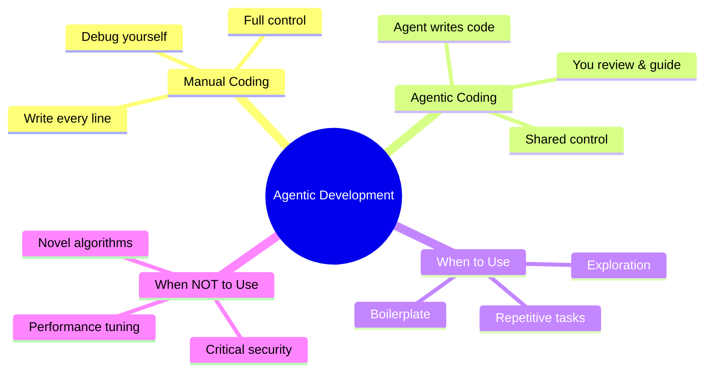

# Module 01: What is Agentic Development?

## Learning Objectives

By the end of this module, you will be able to:

- Define agentic development and how it differs from traditional coding
- Identify scenarios where agents add value vs where manual coding wins
- Adopt the right mental model for working with AI agents

---

## 1. The Big Idea

Imagine you're building a house.

**Traditional coding** = You lay every brick yourself. You know exactly where each brick goes. Slow, but precise.

**Agentic development** = You're the architect. You draw the plans, describe what you want, and a team of skilled workers (agents) builds it. You inspect, approve, and redirect.

> **Think**: What's the biggest risk when workers build without your oversight?

The risk is they build the wrong thing. That's why agentic development isn't "AI does everything." It's "AI does the labor, you provide the judgment."

> **Predict**: If you give an agent vague instructions like "make this page look nice," what do you think will happen?

The agent will make arbitrary design choices that may not match your vision. Vague input → unpredictable output.

---

## 2. Manual vs Agentic — A Comparison

| Aspect | Manual Coding | Agentic Coding |
|--------|--------------|----------------|
| **Speed** | Slower (you type everything) | Faster (agent generates, you review) |
| **Control** | 100% yours | Shared — you guide, agent executes |
| **Understanding** | You know every line | You must read and verify agent output |
| **Best for** | Novel logic, critical paths | Boilerplate, exploration, repetition |
| **Risk** | Human error, fatigue | Agent hallucination, misinterpretation |
| **Cost** | Your time | Tokens (money per API call) |

> **Think**: If agentic coding is faster, why doesn't everyone use it for everything?

Because speed isn't everything. Some code needs your full attention — security-critical paths, performance hotspots, novel algorithms. The agent might produce something that *works* but isn't *optimal* or *safe*.

> **Predict**: What happens if you ask an agent to "optimize this function" without specifying what "optimize" means?

The agent might optimize for speed when you wanted readability, or vice versa. Ambiguous goals → ambiguous results.

---

## 3. When Agents Shine

Agents excel at tasks that are:

1. **Repetitive** — Writing similar CRUD endpoints, test cases, boilerplate
2. **Well-defined** — "Create a React component with these props" is clear; "make it elegant" is not
3. **Exploratory** — "What's the best way to structure this?" — agent explores options
4. **Documentation** — Writing docs, README, comments
5. **Refactoring** — Moving code, renaming, restructuring (with tests to verify)

**Real example:** You need 15 API endpoints with similar patterns. Manual = 2 hours of typing. Agentic = 5 minutes describing the pattern, 10 minutes reviewing output.

---

## 4. When Manual Wins

Stick to manual coding when:

1. **Novel algorithms** — No one has solved this exact problem before
2. **Security-critical** — Authentication, encryption, input validation
3. **Performance-tuned** — Every nanosecond matters
4. **You need to learn** — If you don't understand it, don't delegate it

> **Think**: What's the danger of delegating code you don't understand?

You become a "rubber stamp" — approving code you can't maintain. When it breaks at 3 AM, you're the one debugging code you never read.

---

## 5. The Mental Model

Think of your agent as a **junior developer with superpowers**:

- ⚡ **Fast** — Can write 500 lines in seconds
- 📚 **Knowledgeable** — Knows every framework, every pattern
- 🤖 **Tireless** — Works 24/7 without breaks
- ⚠️ **But** — Doesn't understand your business context
- ⚠️ **And** — Can hallucinate (confidently produce wrong code)

Your job is the **senior developer**:

- 🎯 Define what needs to be built
- 🔍 Review what the agent produces
- 🔄 Redirect when it goes off track
- ✅ Verify with tests and checks

**The golden rule:** Never approve what you don't understand.

---

## 6. Common Misconceptions

### Misconception 1: "Agentic = AI does everything"

**Reality:** AI does the labor, you provide the direction. It's collaboration, not replacement.

### Misconception 2: "Agent output is always correct"

**Reality:** Agents hallucinate. They produce code that compiles but might be wrong, insecure, or inefficient. Always review.

### Misconception 3: "I don't need to understand the code anymore"

**Reality:** You're still responsible. If you can't explain it, you can't maintain it.

> **Spot the Mistake**: A developer uses an agent to generate a database query. The agent produces code that works but has an N+1 performance problem. The developer deploys without review. What went wrong?

**Answer:** The developer trusted speed over understanding. The agent optimized for "working code" not "performant code." The developer should have reviewed for performance patterns.

> **Think**: How could the developer have caught this before deployment?

By reviewing the query for performance patterns (N+1, missing indexes, full table scans) or running a load test before deploying.

---

## 7. The opencode Difference

Not all agents are equal. opencode is a harness — it's the system that controls how the agent works.

Think of it this way:

- **Model** = The brain (GPT-4, Claude, Gemini)
- **Harness** = The body (tools, permissions, workflows, memory)

The same brain in a bad harness performs poorly. A good harness makes even average models effective.

| Tool | Harness Approach |
|------|-----------------|
| ChatGPT | General assistant, no code context |
| GitHub Copilot | Inline suggestions, limited agency |
| Cursor | IDE-integrated, some autonomy |
| **opencode** | Full agency, structured workflows, memory, permissions |

opencode gives agents:
- **Memory** — Remembers your project across sessions
- **Tools** — Read, write, edit, search, run commands
- **Permissions** — Controls what agents can and cannot do
- **Skills** — Reusable workflows for common tasks

---

## 8. Key Takeaways

1. **Agentic development = collaboration**, not replacement
2. **You're the architect**, agent is the builder
3. **Agents excel at repetitive, well-defined tasks**
4. **Manual coding wins for novel, critical, or educational tasks**
5. **opencode is the harness** that makes agents effective
6. **Never approve what you don't understand**

---

## Feynman Challenge

Explain to a junior developer: "When should we use an agent, and when should we code manually?" Use a real example from a recent project. If you can't explain it simply, you don't understand it yet.
