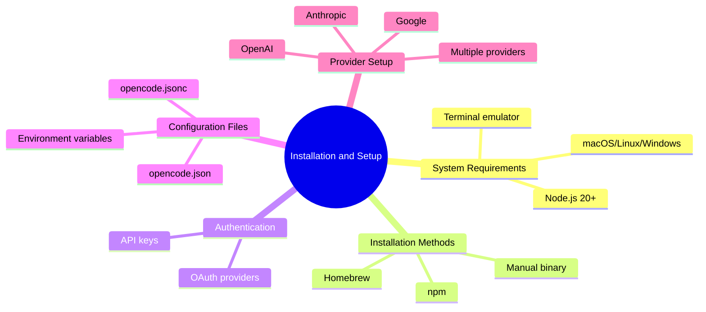

# Module 02: Installation and Setup



## Learning Objectives

- Install opencode using your preferred method
- Configure opencode.json for your workflow
- Set up API keys for one or more LLM providers
- Understand environment variables and their precedence

## System Requirements

Before installing opencode, verify your system meets these requirements:

| Requirement | Minimum | Recommended |
|-------------|---------|-------------|
| **Node.js** | 20.x | Latest LTS |
| **Operating System** | macOS 12+, Ubuntu 20+, Windows 10+ | Latest stable |
| **RAM** | 4 GB | 8 GB+ |
| **Disk Space** | 500 MB | 2 GB+ (models cache) |
| **Terminal** | Any POSIX shell | iTerm2, Alacritty, kitty |

> **Think**: Why does opencode require Node.js but not Python? What does this tell you about its architecture?

## Installation

### Method 1: npm (Recommended)

The simplest installation path for most developers:

```bash
npm install -g opencode
```

Verify installation:

```bash
opencode --version
# opencode 1.x.x
```

### Method 2: Homebrew (macOS/Linux)

```bash
brew install opencode
```

### Method 3: Manual Binary

Download the latest release for your platform from GitHub:

```bash
# Linux x64
curl -L https://github.com/opencode-ai/opencode/releases/latest/download/opencode-linux-x64 -o opencode
chmod +x opencode
sudo mv opencode /usr/local/bin/
```

### Method 4: From Source

For contributors or those wanting the latest features:

```bash
git clone https://github.com/opencode-ai/opencode.git
cd opencode
npm install
npm run build
npm link
```

| Method | Pros | Cons |
|--------|------|------|
| **npm** | Simple, auto-updates | Requires Node.js |
| **Homebrew** | System-integrated | Slower release cycle |
| **Manual** | No dependencies | Manual updates |
| **Source** | Latest features | Build complexity |

> **Predict**: After running `opencode` for the first time, what do you think happens if no API keys are configured?

## First Run

Launch opencode from your project directory:

```bash
cd your-project
opencode
```

On first run, opencode:

1. Creates `.opencode/` directory in your project root
2. Detects your git repository
3. Scans for existing configuration files
4. Prompts for provider authentication (if not already configured)

The interface opens in your terminal — full-screen, keyboard-driven.

### Authentication Flow

If no API keys are found, opencode prompts:

```
Select a provider to authenticate:
1. Anthropic (recommended)
2. OpenAI
3. Google
4. Skip for now
```

Selecting a provider opens your browser for OAuth authentication. The token is stored securely in your system keychain.

> **Think**: Why does opencode prefer OAuth over manual API key entry? What are the trade-offs?

## Configuration Files

opencode uses a layered configuration system. Files are merged in priority order:

| Priority | File | Purpose |
|----------|------|---------|
| 1 (highest) | `~/.config/opencode/opencode.json` | Global defaults |
| 2 | `opencode.json` in project root | Project-specific |
| 3 | `.opencode/opencode.json` | Project-local (gitignored) |
| 4 (lowest) | Built-in defaults | opencode's defaults |

### Basic Configuration

Create `opencode.json` in your project root:

```json
{
  "$schema": "https://opencode.ai/config.schema.json",
  "model": "anthropic/claude-sonnet-4-20250514",
  "default_agent": "build"
}
```

### Configuration with Multiple Providers

```json
{
  "$schema": "https://opencode.ai/config.schema.json",
  "model": "anthropic/claude-sonnet-4-20250514",
  "provider": {
    "anthropic": {
      "api_key": "env:ANTHROPIC_API_KEY"
    },
    "openai": {
      "api_key": "env:OPENAI_API_KEY"
    }
  },
  "agent": {
    "build": {
      "model": "anthropic/claude-sonnet-4-20250514"
    },
    "plan": {
      "model": "openai/gpt-4o"
    }
  }
}
```

> **Spot the Mistake**: A developer sets `"model": "claude-sonnet-4-20250514"` without the provider prefix. What happens?

**Answer:** opencode cannot resolve the model. The correct format is `"provider/model"` — e.g., `"anthropic/claude-sonnet-4-20250514"`. The provider prefix tells opencode which API endpoint to use.

## Environment Variables

opencode reads configuration from environment variables. These override file-based config:

| Variable | Purpose | Example |
|----------|---------|---------|
| `ANTHROPIC_API_KEY` | Anthropic authentication | `sk-ant-...` |
| `OPENAI_API_KEY` | OpenAI authentication | `sk-...` |
| `GOOGLE_API_KEY` | Google AI authentication | `AIza...` |
| `OPENCODE_CONFIG` | Custom config file path | `/path/to/config.json` |
| `OPENCODE_CONFIG_DIR` | Custom config directory | `/path/to/.opencode/` |
| `OPENCODE_DISABLE_PROJECT_CONFIG` | Disable project-level config | `true` |

### Precedence Rule

Environment variables always win. If `opencode.json` sets `model: "openai/gpt-4o"` but you run:

```bash
OPENCODE_MODEL=anthropic/claude-sonnet-4-20250514 opencode
```

The Anthropic model is used for that session.

> **Think**: When would you want environment variables to override project config? When would you want the opposite?

## Provider Configuration

### Anthropic (Default)

```json
{
  "provider": {
    "anthropic": {
      "api_key": "env:ANTHROPIC_API_KEY"
    }
  }
}
```

Or via environment variable:

```bash
export ANTHROPIC_API_KEY=sk-ant-your-key-here
```

### OpenAI

```json
{
  "provider": {
    "openai": {
      "api_key": "env:OPENAI_API_KEY"
    }
  }
}
```

### Google

```json
{
  "provider": {
    "google": {
      "api_key": "env:GOOGLE_API_KEY"
    }
  }
}
```

### Multiple Providers

Use different providers for different agents:

```json
{
  "agent": {
    "build": {
      "model": "anthropic/claude-sonnet-4-20250514"
    },
    "plan": {
      "model": "openai/gpt-4o"
    },
    "explore": {
      "model": "google/gemini-2.5-flash"
    }
  }
}
```

This lets you optimize cost and capability per task.

## Basic Customization

### Change Default Model

```json
{
  "model": "anthropic/claude-sonnet-4-20250514"
}
```

### Enable Auto-Compact

When context window fills, automatically summarize and continue:

```json
{
  "compaction": {
    "auto": true
  }
}
```

### Set Project Instructions

Add persistent instructions for all sessions in this project:

```json
{
  "instructions": [
    "CONVENTIONS.md",
    "https://example.com/team-guidelines.md"
  ]
}
```

### Configure Permissions

Restrict what agents can do:

```json
{
  "permission": {
    "bash": {
      "rm -rf *": "deny",
      "git *": "allow",
      "*": "ask"
    }
  }
}
```

> **Think**: Why might a team want `"rm -rf *": "deny"` in their project config but `"git *": "allow"`?

## Verification Checklist

After installation and configuration, verify everything works:

```bash
# 1. Check installation
opencode --version

# 2. Check configuration
opencode config show

# 3. Test provider connection
opencode provider test anthropic

# 4. Run in your project
cd your-project
opencode
```

If any step fails, check:

- API keys are valid and have credits
- Network can reach provider endpoints
- Configuration JSON is valid (no trailing commas)

## Feynman Challenge

Explain to a junior developer:

1. Why opencode needs API keys (not a local model)
2. How configuration files are layered and merged
3. When to use environment variables vs. config files
4. Why you might use different models for different agents

If you get stuck, re-read the relevant section. The goal is fluent explanation, not memorization.

## Summary

- Install via npm, Homebrew, manual binary, or from source
- Configuration layers: global → project → project-local → defaults
- Provider setup requires API keys (OAuth or environment variables)
- Environment variables override config files
- Basic customization: model, compaction, instructions, permissions
