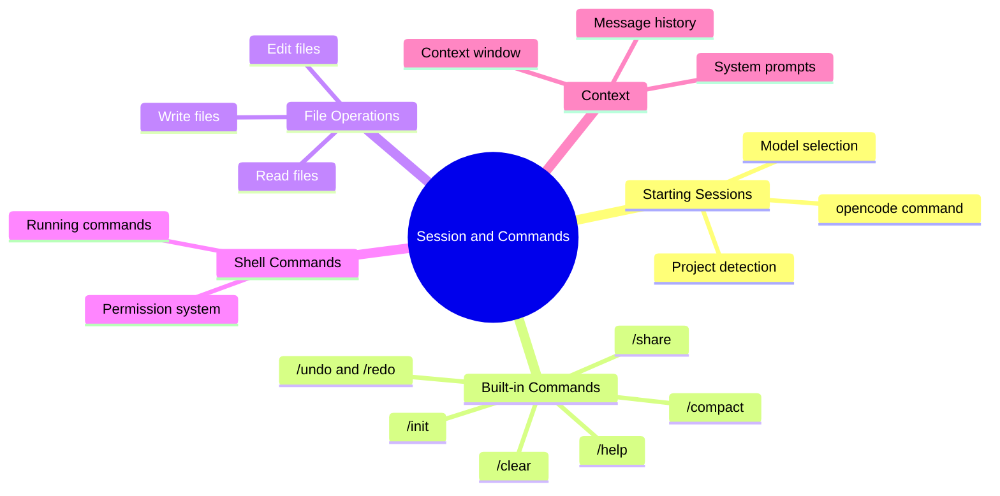

# Module 03: Session and Commands



## Learning Objectives

- Start and manage opencode sessions
- Use built-in commands to control your workflow
- Perform file operations through the agent
- Run shell commands with proper permission handling

## Starting a Session

Navigate to your project directory and launch opencode:

```bash
cd your-project
opencode
```

opencode automatically:

1. Detects your git repository
2. Loads project configuration
3. Assembles system context (instructions, skills, MCP tools)
4. Opens the terminal interface

### Session Interface

The interface shows:

- **Input area**: Type your message at the bottom
- **Message history**: Previous exchanges scroll above
- **Status bar**: Current model, token usage, agent mode

Type your message and press Enter to send. The agent processes your request and responds.

> **Think**: What information does opencode gather before your first message is even sent?

## Built-in Commands

Commands start with `/` and control opencode's behavior. They are not sent to the LLM.

### /init

Initialize project conventions:

```
/init
```

Creates `.opencode/CONVENTIONS.md` with your project's coding standards. The agent analyzes your codebase and generates initial conventions.

### /undo and /redo

Revert or re-apply changes:

```
/undo        # Revert last file changes
/redo        # Re-apply reverted changes
```

opencode tracks file modifications. `/undo` restores files to their state before the agent's last edit. `/redo` reverses the undo.

### /share

Share your session:

```
/share       # Generate shareable URL
/share --public  # Make URL publicly accessible
```

Creates a web view of your session that others can read. Useful for code reviews or getting help.

### /help

Display available commands:

```
/help
```

Shows all commands with descriptions.

### /clear

Clear the conversation history:

```
/clear
```

Starts a fresh conversation while keeping the session open. Useful when context gets cluttered.

### /compact

Summarize and compress conversation history:

```
/compact
```

When the context window fills, `/compact` summarizes older messages. This frees space while preserving key information.

> **Predict**: What happens to your ability to reference specific code details after running `/compact`?

## File Operations

The agent can read, write, and edit files in your project.

### Reading Files

Ask the agent to examine code:

```
Show me the main function in src/index.ts
What does the config file contain?
Read the test file for the auth module
```

The agent uses the `read` tool to access file contents. It can read multiple files in parallel for efficiency.

### Writing Files

Request new files:

```
Create a new utility function for date formatting
Write a test file for the auth module
```

The agent uses the `write` tool. It will show you the file content before writing, asking for confirmation.

### Editing Files

Request targeted changes:

```
Fix the typo in line 42 of src/utils.ts
Add error handling to the fetch function
Rename the variable 'data' to 'response' in the API module
```

The agent uses the `edit` tool for precise modifications. It shows the before/after diff for your review.

> **Think**: Why does opencode ask for confirmation before writing files, but not before reading them?

## Shell Commands

The agent can execute shell commands when needed.

### Running Commands

Request shell operations:

```
Run the tests
Build the project
Check git status
Install the dependencies
```

The agent uses the `shell` tool. Commands are displayed before execution.

### Permission System

Not all commands run automatically. opencode's permission system evaluates each request:

| Action | Default | Configurable |
|--------|---------|--------------|
| `git status` | Allow | Yes |
| `npm test` | Allow | Yes |
| `rm -rf` | Deny | Yes |
| `sudo *` | Ask | Yes |

When a command requires permission, opencode prompts:

```
Agent wants to run: rm -rf node_modules
Allow? (y/n/always)
```

- **y**: Allow this once
- **n**: Deny this request
- **always**: Allow this command pattern permanently

### Configuration

Configure permissions in `opencode.json`:

```json
{
  "permission": {
    "bash": {
      "git *": "allow",
      "npm test": "allow",
      "rm -rf *": "deny",
      "*": "ask"
    }
  }
}
```

> **Spot the Mistake**: A developer sets `"bash": "allow"` to avoid permission prompts. What risk does this introduce?

**Answer**: Setting bash to blanket allow means the agent can run any command without approval, including destructive operations like `rm -rf /` or `git push --force`. Always use pattern-specific permissions.

## Context Management

Each message you send becomes part of the session's context. The agent sees:

1. **System prompt**: Project instructions, skills, MCP tools
2. **Conversation history**: All previous messages and responses
3. **File contents**: Files the agent has read
4. **Tool outputs**: Results of shell commands, searches, etc.

### Context Window

LLMs have limited context windows. As conversations grow, older messages may be:

- **Summarized**: Key points preserved, details lost
- **Compacted**: Automatic summarization when window fills
- **Pruned**: Oldest messages removed if compacting isn't enough

### Best Practices

| Practice | Why |
|----------|-----|
| Start new sessions for unrelated tasks | Keeps context focused |
| Use `/clear` when switching topics | Prevents confusion |
| Use `/compact` before long sessions | Preserves context budget |
| Reference specific files by path | Reduces ambiguity |

> **Think**: How does context management differ between a chatbot conversation and an agentic coding session?

## Session Persistence

Sessions are stored in SQLite database:

- **Session history**: All messages and responses
- **File snapshots**: Before/after states of edited files
- **Token usage**: Cost tracking per session
- **Metadata**: Timestamps, model used, agent mode

### Resuming Sessions

```bash
opencode                  # Start new session
opencode --resume         # Resume last session
opencode --session <id>   # Resume specific session
```

### Session Listing

```
/sessions                 # List recent sessions
```

Shows session IDs, titles, dates, and costs.

## Practical Example

Here's a typical workflow:

```
User: Read src/auth.ts and explain how authentication works

Agent: [reads file, analyzes code]
Authentication uses JWT tokens. The flow is:
1. User submits credentials to /api/login
2. Server validates against database
3. JWT token generated with 24h expiry
4. Token sent in Authorization header for subsequent requests

User: Add rate limiting to the login endpoint

Agent: [shows proposed changes]
I'll add rate limiting using express-rate-limit. Here's the diff:
- Import rateLimit middleware
- Apply 5 attempts per 15 minutes to /api/login
- Return 429 Too Many Requests when exceeded

User: Do it

Agent: [writes file]
Done. Rate limiting added to src/auth.ts.

User: Run the tests

Agent: [runs npm test]
All 23 tests pass. Rate limiting doesn't break existing auth flows.
```

## Feynman Challenge

Explain to a colleague:

1. How to start a session and what happens behind the scenes
2. The difference between `/clear` and `/compact`
3. Why the permission system matters for shell commands
4. How context accumulates and why management matters

If you stumble, revisit the relevant section.

## Summary

- Start sessions with `opencode` from your project directory
- Commands (`/init`, `/undo`, `/redo`, `/share`, `/help`, `/clear`, `/compact`) control behavior
- File operations: read (no confirmation), write/edit (confirmation required)
- Shell commands subject to permission system
- Context accumulates — manage with `/clear` and `/compact`
- Sessions persist in SQLite, resumable with `--resume`
