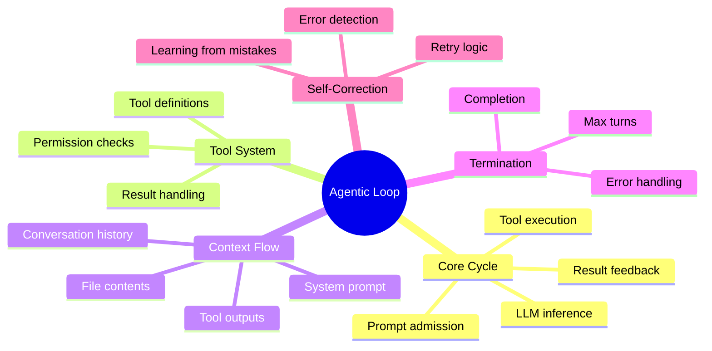
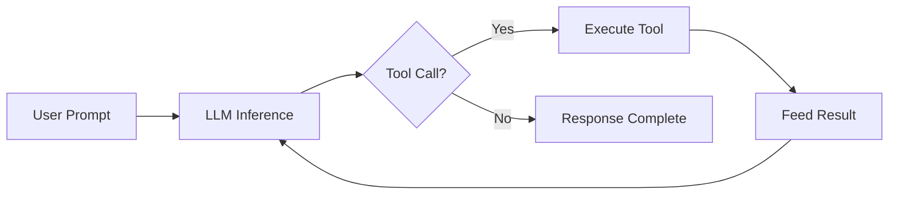

# Module 04: Agentic Loop and Workflow



## Learning Objectives

- Understand the agentic loop execution cycle
- Trace how a prompt becomes tool calls and results
- Recognize when and why the loop continues or stops
- Identify self-correction patterns in practice

## The Agentic Loop

opencode operates in a loop. Each iteration:

1. **Prompt admission**: You send a message
2. **LLM inference**: The model processes context and decides
3. **Tool execution**: If the model wants to act, tools run
4. **Result feedback**: Tool outputs feed back to the model
5. **Continuation check**: Does the model need another turn?



This loop continues until the model produces a final response without tool calls, or hits a termination condition.

> **Think**: Why doesn't the LLM just generate all the code in one response? What advantage does the loop provide?

## Prompt Admission

When you type a message, opencode:

1. Validates input
2. Persists to SQLite (durable inbox)
3. Promotes to visible message
4. Triggers the provider turn

The message becomes part of the permanent session history. Even if the loop fails midway, your prompt is never lost.

## LLM Inference

The model receives:

| Component | Purpose |
|-----------|---------|
| **System prompt** | Project instructions, skills, MCP tools |
| **Conversation history** | All previous messages and responses |
| **Tool definitions** | Available tools with schemas |
| **Current prompt** | Your latest message |

The model decides: respond directly, or call a tool?

### Decision Process

```
Model analyzes context →
  If question can be answered from knowledge: respond
  If code needs to be read: call read tool
  If code needs to be changed: call edit/write tool
  If command needs to run: call shell tool
  If information needs lookup: call websearch tool
```

The model never "guesses" file contents — it reads them. This grounding in reality prevents hallucination.

> **Think**: How does the model decide between reading a file and writing it? What signals inform this decision?

## Tool Execution

When the model calls a tool:

1. **Parse**: Extract tool name and arguments
2. **Permission check**: Evaluate against ruleset
3. **Execute**: Run the tool implementation
4. **Capture**: Record output or error
5. **Return**: Feed result back to model

### Tool Call Example

```
User: "What's in src/auth.ts?"

Model: [tool_call: read, path: "src/auth.ts"]

opencode:
  1. Permission check: read = allow ✓
  2. Execute: read file contents
  3. Return: file content to model

Model: [generates explanation based on actual file contents]
```

### Parallel Execution

opencode can execute multiple independent tools simultaneously:

```
User: "Compare the error handling in src/api.ts and src/db.ts"

Model: [tool_call: read, path: "src/api.ts"]
       [tool_call: read, path: "src/db.ts"]

opencode:
  1. Both reads are independent
  2. Execute in parallel
  3. Return both results

Model: [compares actual contents of both files]
```

This dramatically speeds up tasks that touch multiple files.

> **Predict**: What would happen if the model tried to write to two files that depend on each other? Would parallel execution be safe?

## Result Feedback

Tool outputs become part of the conversation history. The model sees:

```
User: "Fix the bug in auth.ts"

Model: [tool_call: read, path: "src/auth.ts"]
Assistant: [read result: file contents with bug on line 42]

Model: [tool_call: edit, path: "src/auth.ts", old: "...", new: "..."]
Assistant: [edit result: file modified successfully]

Model: "Fixed the bug. The issue was..."
```

Each tool result informs the next decision. The model builds understanding incrementally.

## Termination Conditions

The loop stops when:

| Condition | What Happens |
|-----------|--------------|
| **No tool calls** | Model produces final response |
| **Max turns reached** | Loop forced to stop (configurable) |
| **User interrupt** | Ctrl+C stops execution |
| **Error** | Tool fails, model may retry or give up |
| **Permission denied** | Tool blocked, model may try alternative |

### Max Turns

Configure the maximum number of provider turns per prompt:

```json
{
  "agent": {
    "build": {
      "steps": 20
    }
  }
}
```

Default varies by agent. Build agent gets more turns; plan agent gets fewer.

> **Think**: Why would you want to limit max turns? What happens if an agent gets stuck in a loop?

## Self-Correction

The agentic loop enables self-correction. When a tool fails:

1. Model receives error message
2. Model analyzes what went wrong
3. Model tries a different approach
4. Loop continues until success or max turns

### Example: Self-Correction in Action

```
User: "Run the tests"

Model: [tool_call: shell, command: "npm test"]
Assistant: [error: "jest: command not found"]

Model: [tool_call: shell, command: "npm install"]
Assistant: [dependencies installed]

Model: [tool_call: shell, command: "npm test"]
Assistant: [tests pass]

Model: "Tests pass. I had to install dependencies first."
```

The model detected the error, diagnosed the cause, fixed it, and retried — all without human intervention.

### Error Recovery Patterns

| Error Type | Model Response |
|------------|----------------|
| **File not found** | Search for file, ask user, or create it |
| **Permission denied** | Try alternative approach or ask user |
| **Command failed** | Read error, fix issue, retry |
| **Network error** | Retry or use cached data |
| **Parse error** | Re-read file, fix syntax, retry |

> **Spot the Mistake**: An agent runs `rm -rf node_modules` and gets "Permission denied". It retries the same command 5 times. What's wrong?

**Answer**: The agent isn't learning from the error. A smarter approach: check if the directory exists, try `sudo`, or ask the user for help. Retrying the same failed command wastes context budget.

## Context Accumulation

Each loop iteration adds to context:

```
Turn 1: User prompt + Model response
Turn 2: Tool call + Tool result + Model response
Turn 3: Tool call + Tool result + Model response
...
```

Context grows linearly with loop iterations. This is why:

- Complex tasks may trigger `/compact`
- Long sessions benefit from focused, single-topic prompts
- The model must balance thoroughness with context efficiency

### Context Budget

The model has a finite context window. As the loop runs:

| Phase | Context Usage |
|-------|---------------|
| **Start** | System prompt + first prompt |
| **Mid-loop** | Added tool calls and results |
| **Late loop** | May approach window limit |
| **Compact** | Summarized to free space |

## Practical Example: Full Loop Trace

```
User: "Add input validation to the user registration endpoint"

Loop iteration 1:
  Model: [read: src/routes/auth/register.ts]
  Result: [file contents]

Loop iteration 2:
  Model: [read: src/utils/validation.ts]
  Result: [existing validation utilities]

Loop iteration 3:
  Model: [edit: src/routes/auth/register.ts]
         Add email/password validation using existing utilities
  Result: [file modified]

Loop iteration 4:
  Model: [shell: npm test]
  Result: [all tests pass]

Loop iteration 5:
  Model: "Added input validation using existing utilities.
          Email format and password strength are now validated
          before user creation. All tests pass."
```

Five iterations, four tool calls, one complete feature.

## Feynman Challenge

Explain to a colleague:

1. The five steps of the agentic loop
2. Why tool results feed back to the model
3. How self-correction works when tools fail
4. Why context accumulates and why it matters
5. When the loop terminates and why

## Summary

- The loop: prompt → LLM → tool calls → results → continuation
- Tools execute with permission checks and return results
- Self-correction enables recovery from errors
- Context grows with each iteration — manage with `/compact`
- Loop terminates on: no tool calls, max turns, user interrupt, or error
