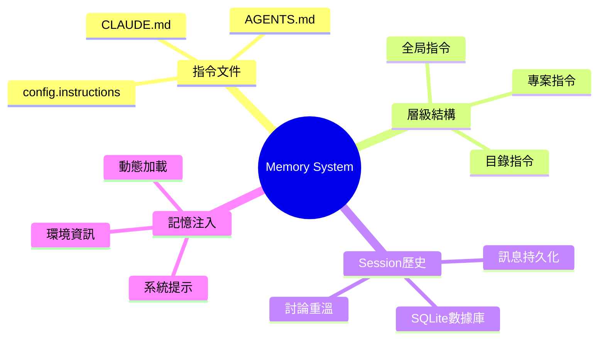
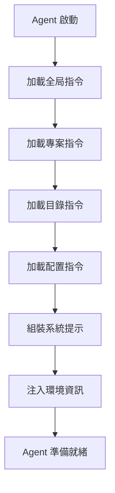

# Module 05: Memory System



## Learning Objectives

- 理解 opencode 記憶系統嘅架構
- 掌握指令文件嘅層級同優先級
- 學識點樣用 AGENTS.md 同 CLAUDE.md 控制 agent 行為
- 了解 Session 歷史嘅運作方式
- 識別記憶注入嘅流程

## 01 — 指令文件層級

Agent 每次啟動都會加載指令文件。呢啲文件定義 agent 嘅行為規則、偏好同專案知識。

### 指令文件類型

| 類型 | 文件 | 用途 |
|------|------|------|
| **專案指令** | `AGENTS.md` 或 `CLAUDE.md` | 專案特定行為規則 |
| **配置指令** | `config.instructions` 指定嘅文件 | 自定義指令文件 |
| **目錄指令** | 子目錄中嘅 `AGENTS.md` | 局部行為規則 |

### 優先級順序

```
AGENTS.md（存在時優先）
    ↓ 如果不存在
CLAUDE.md（備選）
    ↓ 如果不存在
config.instructions（配置指定）
```

> **Think**: 如果你同時有 `AGENTS.md` 同 `CLAUDE.md`，邊個會被使用？點解要支持兩個文件名？

因為 opencode 兼容 Claude Code 嘅 `CLAUDE.md`，同時提供自己嘅 `AGENTS.md`。當兩者都存在時，`AGENTS.md` 優先。

## 02 — AGENTS.md 嘅用法

`AGENTS.md` 係 opencode 最主要嘅指令文件。你喺專案根目錄創建佢，agent 每次啟動都會讀取。

### 基本格式

```markdown
# 專案名稱

## 編碼風格
- 使用 TypeScript strict mode
- 所有函數需要返回類型標註
- 命名用 camelCase

## 測試要求
- 每個新功能需要對應測試
- 測試文件放喺 __tests__/ 目錄

## 禁止操作
- 唔好修改 package.json 嘅版本號
- 唔好刪除 .env 文件
```

### 全局指令

你可以喺 `~/.config/opencode/AGENTS.md` 設定全局指令，對所有專案生效：

```
~/.config/opencode/AGENTS.md  ← 全局（所有專案）
~/my-project/AGENTS.md         ← 專案級
~/my-project/packages/foo/AGENTS.md  ← 目錄級
```

全局指令適用於個人偏好（例如 coding style、常用工具），專案指令適用於團隊規範。

## 03 — 記憶注入流程

Agent 啟動時，系統會按以下流程注入記憶：



### 系統提示內容

系統提示包含多個部分：

| 部分 | 內容 |
|------|------|
| **環境資訊** | 工作目錄、git 狀態、平台、日期 |
| **指令文件** | AGENTS.md / CLAUDE.md 內容 |
| **MCP 指令** | MCP 伺服器提供嘅指令 |
| **Skills** | 可用技能列表 |

> **Think**: 點解環境資訊（工作目錄、git 狀態）要注入系統提示？如果冇注入會點？

因為 agent 需要知道「我喺邊度」「我喺咩狀態」先可以做出正確決策。冇環境資訊，agent 就好似一個失憶嘅人——知道所有嘢但唔知自己喺邊。

> **Predict**: 如果你喺 `/home/user/project-a` 開 session，然後切換到 `/home/user/project-b` 嘅文件，agent 會唔會自動加載 project-b 嘅 AGENTS.md？

答案：唔會。Session 啟動時加載嘅指令文件係基於啟動目錄。要加載新專案嘅指令，需要開新 session。

## 04 — Session 歷史

opencode 嘅 session 歷史存儲喺 SQLite 數據庫，唔係跨 session 嘅記憶文件。

### Session 歷史 vs 跨 Session 記憶

| 特性 | Session 歷史 | 跨 Session 記憶 |
|------|-------------|-----------------|
| **範圍** | 單個 session | 所有 session |
| **存儲** | SQLite 數據庫 | 文件系統 |
| **自動** | 自動保存 | 需要手動維護 |
| **用途** | 討論重溫 | 長期偏好/知識 |

### 討論重溫

你可以喺新 session 中重溫之前嘅討論：

- Session 歷史持久化喺數據庫
- 每個 session 有獨立標題
- 可以搜尋歷史 session
- Session 可以 fork（分支）

> **Spot the Mistake:**
> 小明想喺 opencode 中保存「我偏好用 2 spaces 縮排」呢個偏好，佢喺 session 入面話俾 agent 聽，然後結束 session。下次新 session 佢要重新話一次。點解？
>
> **答案：** opencode 冇跨 session 記憶文件。Session 歷史只喺該 session 內有效。要保存偏好，應該寫入 `AGENTS.md`。

## 05 — 動態指令加載

當你讀文件時，opencode 會自動加載該文件附近嘅指令文件。

### 目錄遍歷

```
~/project/src/utils/helpers.ts  ← 讀呢個文件
    ↓ 自動查找
~/project/src/utils/AGENTS.md   ← 如果存在
~/project/src/AGENTS.md         ← 如果存在
~/project/AGENTS.md             ← 如果存在
```

呢個機制確保 agent 喺處理特定目錄嘅文件時，自動獲得該目錄嘅行為規則。

### 實際例子

假設你嘅專案結構：

```
my-project/
├── AGENTS.md              ← 全專案規則
├── src/
│   ├── AGENTS.md          ← src 目錄特定規則
│   └── utils/
│       └── helpers.ts     ← 讀呢個文件時加載以上兩層
```

當 agent 讀 `helpers.ts` 時，佢會同時加載兩層 `AGENTS.md`，自動獲得專案同目錄嘅行為規則。

> **Predict**: 如果 `~/project/src/AGENTS.md` 規定「所有函數用 camelCase」，而 `~/project/AGENTS.md` 規定「所有函數用 snake_case」，當 agent 讀 `src/utils/helpers.ts` 時，佢會用邊個風格？

答案：兩者都會加載，但後加載嘅（目錄級）會覆蓋先加載嘅（專案級）。所以用 camelCase。

## 06 — 記憶系統嘅限制

### opencode vs Claude Code 嘅差異

| 特性 | Claude Code | opencode |
|------|------------|---------|
| **跨 Session 記憶** | 有（記憶文件） | 冇 |
| **記憶文件** | CLAUDE.md 五層 | AGENTS.md 三層 |
| **Session 歷史** | 有限 | SQLite 完整保存 |
| **記憶搜索** | 有 | 冇 |

### 應對策略

因為 opencode 冇跨 session 記憶，你需要：

1. **用 `AGENTS.md` 保存重要規則**：編碼風格、團隊規範、禁止操作
2. **用 `config.instructions` 加載額外指令**：指定自定義指令文件路徑
3. **善用 Session 歷史**：搜尋之前嘅討論，快速恢復上下文

## Feynman Challenge

想像你要教一個完全唔知道 opencode 嘅人點樣設定記憶系統。你需要解釋：

1. 點解需要指令文件？
2. AGENTS.md 同 CLAUDE.md 有咩分別？
3. 點解 opencode 冇跨 session 記憶？呢個設計有咩好處同壞處？

用最簡單嘅語言解釋，唔好用技術術語。

## Summary

- opencode 嘅記憶系統基於指令文件（AGENTS.md / CLAUDE.md）
- 指令文件有層級結構：全局 → 專案 → 目錄
- `AGENTS.md` 優先於 `CLAUDE.md`（兼容 Claude Code）
- Session 歷史存儲喺 SQLite，但冇跨 session 記憶
- 記憶注入喺 agent 啟動時自動進行
- 動態加載確保 agent 獲得知識同上下文
