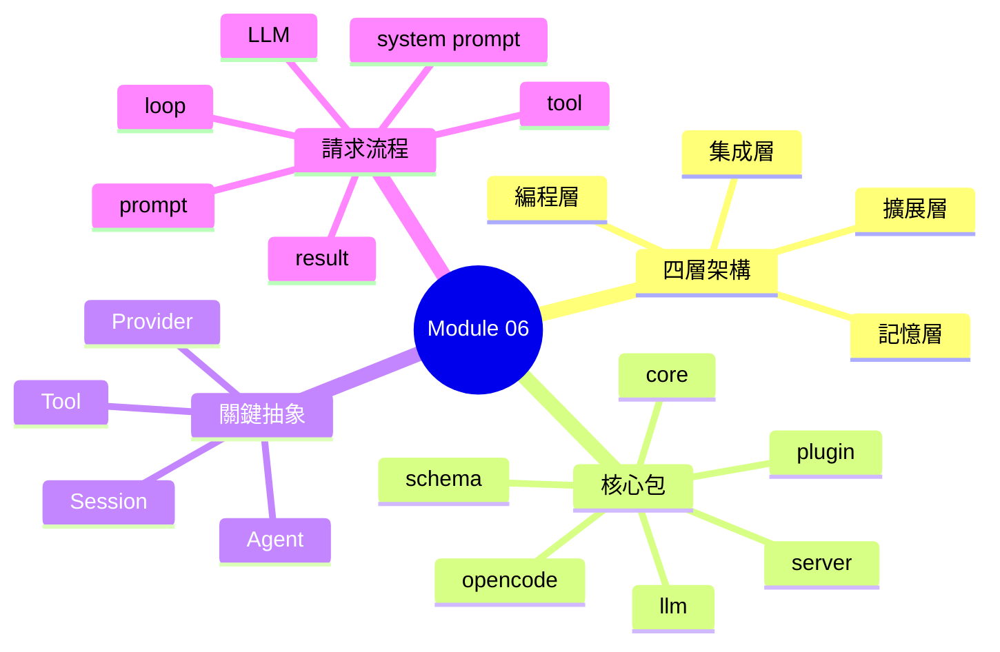
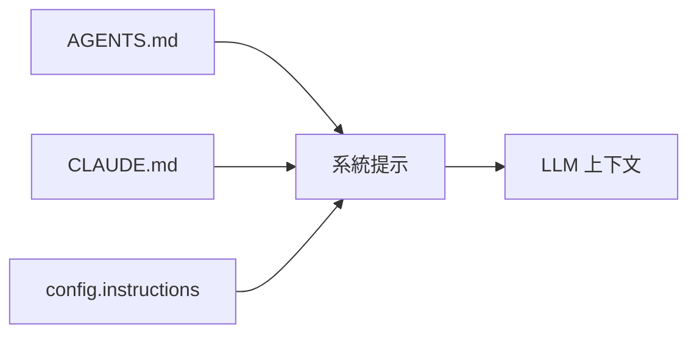
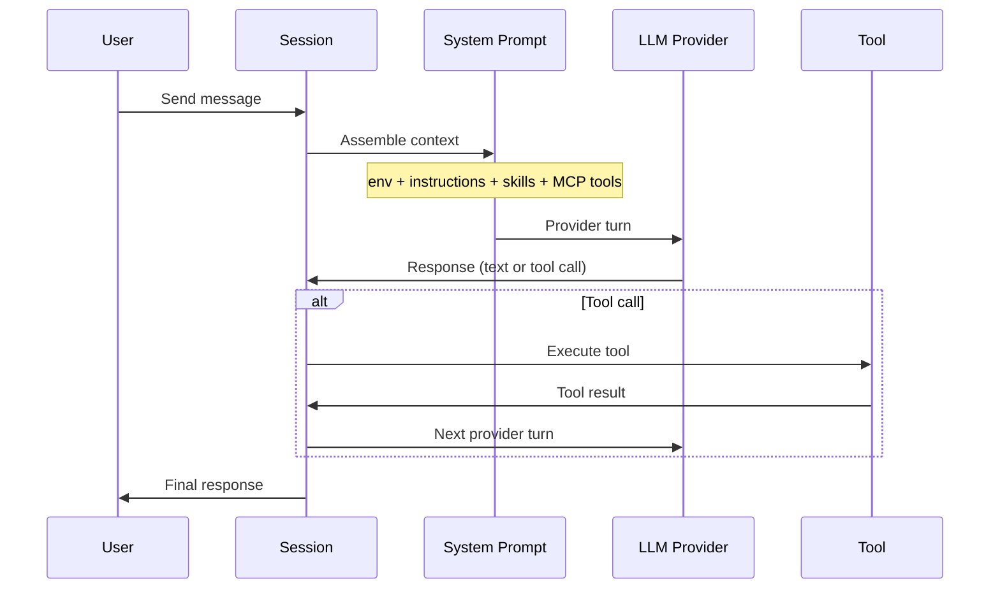

## Learning Objectives

- Describe the four-layer architecture model
- Identify core packages and their responsibilities
- Explain the request flow from user prompt to tool execution
- Understand how the memory layer works in practice

---

## What is opencode's Architecture?

opencode is built on a modular, layered architecture. Understanding this structure helps you know where to look when you need to customize or debug.

> **Think**: Why does layered architecture matter for an AI coding assistant? What problems does it solve?

The architecture follows the **four-layer model**: Memory → Extension → Integration → Programming. Each layer has a specific responsibility and can be configured independently.

---

## The Four-Layer Model

### Layer 1: 記憶層 (Memory Layer)

Handles instructions and project knowledge. This is where AGENTS.md, CLAUDE.md, and config instructions live.

**Key files**:
- `AGENTS.md` — primary instructions
- `CLAUDE.md` — compatibility with Claude Code
- `config.instructions` — additional instruction files/URLs

**How it works**: Files are loaded at startup and injected into the system prompt. When reading files outside the project root, opencode traverses parent directories to find nearby instruction files.

### Layer 2: 擴展層 (Extension Layer)

Customizes agent behavior through Skills, Hooks, Plugins, and Custom Tools.

| Component | What it does |
|-----------|-------------|
| **Skills** | Contextual instructions loaded on-demand via the `skill` tool |
| **Hooks/Events** | JavaScript callbacks on tool.execute, session events |
| **Plugins** | Full extensions with new tools, providers, system context |
| **Custom Tools** | User-defined tools in `.opencode/tools/` |

**Key insight**: Extensions are orthogonal — you can use Skills without Plugins, Hooks without Skills.

### Layer 3: 集成層 (Integration Layer)

Connects to external services: MCP servers, headless mode, CI/CD.

**MCP integration**:
- Local servers via stdio transport
- Remote servers via StreamableHTTP/SSE
- OAuth authentication support
- Tool discovery and hot-reload

**Headless mode**: Run opencode in CI/CD pipelines with `-p` flag.

### Layer 4: 編程層 (Programming Layer)

The Agent SDK for building on top of opencode. Use this to create custom applications that embed opencode's capabilities.

---

## Core Packages

opencode is a monorepo with 32 packages. Here are the core ones:

| Package | Purpose |
|---------|---------|
| `core` | Domain types, database, config schemas, Effect utilities |
| `schema` | Public API schemas (Agent, Session, Model, Provider) |
| `opencode` | Main application: agents, tools, providers, sessions |
| `llm` | LLM streaming abstraction, protocol adapters |
| `plugin` | Plugin system (v1 hooks, v2 Effect/Promise APIs) |
| `server` | HTTP server (HttpApi handlers, middleware) |
| `client` | Generated HTTP clients |
| `tui` | Terminal UI (Ink/React) |

> **Think**: If you wanted to add a new tool to opencode, which package would you modify?

---

## Key Abstractions

### Agent

An Agent is an execution role that defines tool access and behavior. Each agent has:
- A set of allowed/denied tools
- A system prompt (optional)
- Permission rules
- Model configuration

**Built-in agents**: build (default), plan (read-only), general (subagent), explore (code search).

### Tool

A Tool is an executable function the agent can invoke. Tools have:
- Parameters (validated via Effect Schema)
- An execute function
- Permission requirements

**Built-in tools**: shell, read, write, edit, glob, grep, task, webfetch, websearch.

### Session

A Session is a conversation thread with persistent state. It tracks:
- Message history (SQLite)
- Token usage and cost
- Agent and model configuration
- Permission rules

### Provider

A Provider is an LLM service integration. Providers handle:
- Authentication (API keys, OAuth)
- Request formatting
- Streaming responses
- Model resolution

---

## Request Flow

Here's what happens when you type a message:

**Step by step**:

1. **Prompt admission**: Your message is added to session history
2. **System prompt assembly**: Environment, instructions, skills, MCP tools are combined
3. **Provider turn**: The LLM processes the full context and generates a response
4. **Tool execution**: If the LLM requests a tool call, opencode executes it
5. **Result feedback**: Tool results are added to context
6. **Continuation**: The loop repeats until the LLM produces a text-only response

> **Predict**: What happens to the context window as the Agentic Loop iterates?

---

## Memory Layer Deep Dive

The memory layer is more than just files. It includes:

**Static instructions**: Loaded at startup from AGENTS.md, CLAUDE.md, config.instructions.

**Dynamic instructions**: When reading files outside the project root, opencode traverses parent directories to find nearby instruction files. This means you can have project-specific instructions that travel with your code.

**Session history**: Stored in SQLite, persists across sessions. You can resume previous conversations.

**Context management**: The system prompt includes an `<env>` block with working directory, git status, platform, and date. This environmental context helps the LLM understand your setup.

---

## Extension Layer Overview

The extension layer is where customization happens:

**Skills**: Markdown files with YAML frontmatter that provide contextual instructions. Loaded on-demand via the `skill` tool. Skills are discovered from `.claude/skills/`, `.agents/skills/`, `.opencode/`, and config paths.

**Hooks/Events**: JavaScript callbacks that fire on tool execution, session events, and permission checks. Use for auditing, auto-formatting, or security checks.

**Plugins**: Full extensions that can add new tools, modify providers, and transform system context. Loaded from `.opencode/plugins/` or npm packages.

**Custom Tools**: User-defined tools in `.opencode/tools/` that extend agent capabilities without full plugin overhead.

---

> **Spot the Mistake**: A developer says: "opencode is a monolithic application — all functionality lives in a single package." What's wrong with this statement?

---

## Feynman Challenge

Without looking at this lesson, explain the four-layer architecture to a colleague. What does each layer handle? How do they interact? What would break if you removed one layer?

---

## Summary

- **Four layers**: Memory → Extension → Integration → Programming
- **Core packages**: core, schema, opencode, llm, plugin, server
- **Key abstractions**: Agent, Tool, Session, Provider
- **Request flow**: prompt → system prompt → LLM → tool → result → loop
- **Memory layer**: Static instructions + dynamic loading + session history
- **Extension layer**: Skills, Hooks, Plugins, Custom Tools
