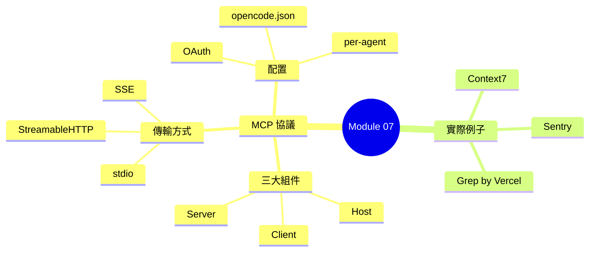
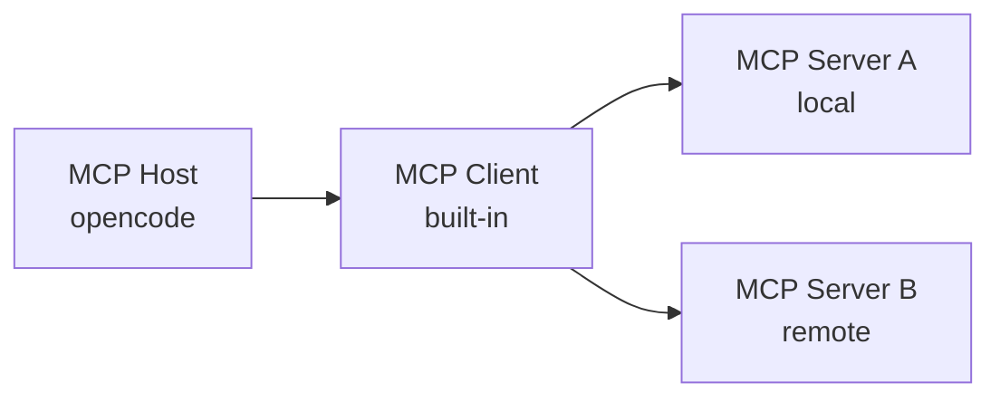

## Learning Objectives

- Explain what MCP is and why it exists
- Identify the three components of MCP (Host, Client, Server)
- Distinguish between Local and Remote MCP servers
- Configure MCP servers in opencode.json
- Understand tool naming conventions and context impact

---

## What is MCP?

MCP stands for **Model Context Protocol**. It's an open standard that allows AI agents to connect to external tools and services through a unified protocol.

> **Think**: Before MCP, how would you add a new tool to an AI agent? What problems did that approach have?

Think of MCP like USB for AI tools. Instead of building custom integrations for every service, you use one standard protocol. Any MCP-compatible server works with any MCP-compatible host.

---

## The Three Components

### MCP Host

The AI application that initiates the connection. In our case, **opencode** is the MCP Host. It discovers and connects to MCP servers.

### MCP Client

The protocol handler inside the host. It manages the connection, handles authentication, and routes requests. opencode has a built-in MCP client.

### MCP Server

The external service that provides tools. It exposes a set of tools that the host can discover and invoke.



---

## Local vs Remote MCP

| Aspect | Local MCP | Remote MCP |
|--------|-----------|------------|
| **Transport** | stdio | StreamableHTTP, SSE |
| **Runtime** | Runs on your machine | Runs on remote server |
| **Auth** | Usually none | OAuth |
| **Use case** | File system, git, local DBs | Sentry, GitHub, cloud APIs |
| **Config** | `command` + `args` | `url` |

**Local MCP example**: A file system tool that runs as a child process, communicating via stdin/stdout.

**Remote MCP example**: Sentry's error tracking service, accessed via HTTPS with OAuth authentication.

> **Predict**: If you have a local database and a cloud monitoring service, which transport would each use?

---

## Configuration

MCP servers are configured in `opencode.json`:

```json
{
  "mcp": {
    "sentry": {
      "type": "remote",
      "url": "https://mcp.sentry.dev/sse",
      "enabled": true
    },
    "filesystem": {
      "type": "local",
      "command": "npx",
      "args": ["-y", "@modelcontextprotocol/server-filesystem", "/path/to/dir"],
      "enabled": true
    }
  }
}
```

**Key fields**:
- `type`: `"local"` or `"remote"`
- `command` + `args`: For local servers (the command to run)
- `url`: For remote servers (the endpoint URL)
- `enabled`: Whether to connect on startup
- `tools`: Per-tool enable/disable (optional)

---

## Tool Naming

MCP tools are automatically namespaced to avoid collisions:

```
{serverName}_{toolName}
```

**Example**: If you have a Sentry MCP server with a `search_issues` tool, it becomes `sentry_search_issues` in opencode.

This means you can have multiple MCP servers with tools that have the same name without conflicts.

---

## Context Impact

Every MCP tool's description is injected into the system prompt. This has a practical implication:

> **Think**: What happens if you connect 20 MCP servers, each with 10 tools?

More tools = more context consumed. If you're hitting context limits, consider:
- Disabling unused MCP servers
- Using per-agent configuration to enable tools only where needed
- Choosing MCP servers with focused tool sets

---

## Per-Agent Configuration

You can enable/disable MCP tools per agent:

```json
{
  "agent": {
    "debug-agent": {
      "tools": {
        "sentry_*": true
      }
    },
    "build": {
      "tools": {
        "sentry_*": false
      }
    }
  }
}
```

This way, only the `debug-agent` has access to Sentry tools, keeping the build agent's context lean.

---

## Real-World Examples

| MCP Server | Type | What it does |
|-----------|------|-------------|
| **Sentry** | Remote | Search errors, view stack traces, manage issues |
| **Context7** | Remote | Fetch up-to-date library documentation |
| **Grep by Vercel** | Remote | Search code across popular repositories |
| **Filesystem** | Local | Read/write files outside the workspace |
| **GitHub** | Remote | Manage PRs, issues, and repos |

---

## Checking MCP Status

Use `opencode mcp list` to see all configured MCP servers and their connection status:

```
sentry     connected    https://mcp.sentry.dev/sse
filesystem connected    npx -y @modelcontextprotocol/server-filesystem
github     needs_auth   https://api.github.com/mcp
```

Status values: `connected`, `disabled`, `failed`, `needs_auth`.

---

> **Spot the Mistake**: A developer configures 15 MCP servers for their project. They wonder why their context window fills up so quickly and the agent starts giving irrelevant responses. What went wrong?

---

## Feynman Challenge

A teammate asks: "Why can't we just use HTTP APIs directly instead of MCP?" Explain the benefits of a standardized protocol versus ad-hoc integrations.

---

## Summary

- **MCP** = Model Context Protocol, an open standard for AI tool integration
- **Three components**: Host (opencode), Client (built-in), Server (external service)
- **Local** uses stdio; **Remote** uses HTTP with OAuth
- **Tool naming**: `{serverName}_{toolName}` prevents collisions
- **Context impact**: Each tool description consumes context window
- **Per-agent config**: Enable tools only where needed
