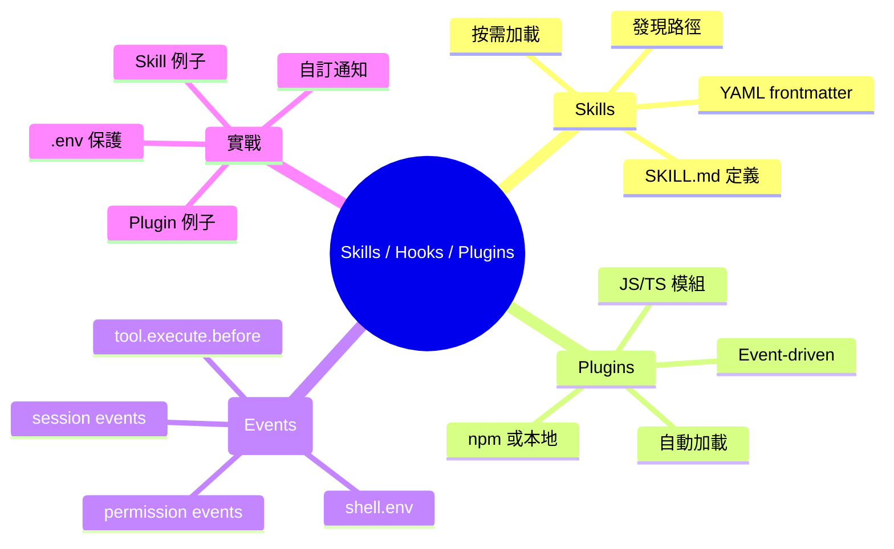

## Learning Objectives

- 區分 Skills、Plugins 同 Hooks 嘅定位
- 寫一個基本嘅 SKILL.md
- 理解 Plugin 嘅 event-driven 架構
- 識得用 Plugins 做基本嘅自動化

---

## 1. 三大擴展機制

opencode 嘅擴展層有三個主要機制：

| 機制 | 用途 | 寫法 | 載入方式 |
|------|------|------|----------|
| **Skills** | 可重用嘅指令集 | Markdown | 按需（skill tool） |
| **Plugins** | 程式化嘅行為擴展 | JS/TS 模組 | 自動（啟動時） |
| **Hooks** | Plugin 入面嘅事件處理 | Event callbacks | 自動（事件觸發） |

> **Think**：如果我想 agent 每次用 shell 前自動 escape 命令，應該用 Skill 定 Plugin？

答案：Plugin — 因為需要攔截 tool execution event。Skill 係畀 agent 讀嘅指令，唔可以攔截事件。

---

## 2. Skills — 按需加載嘅指令

### 佢係咩？

Skills 係 Markdown 文件，畀 agent 按需讀取。好似一本手冊 — agent 覺得需要先去搵。

### SKILL.md 格式

```markdown
---
name: git-release
description: Create consistent releases and changelogs
license: MIT
---

## What I do
- Draft release notes from merged PRs
- Propose a version bump
- Provide a copy-pasteable `gh release create` command

## When to use me
Use this when you are preparing a tagged release.
```

### Frontmatter 規則

| 欄位 | 必須 | 規則 |
|------|------|------|
| `name` | ✅ | 小寫英文、數字、單 hyphen，1-64 字元 |
| `description` | ✅ | 1-1024 字元 |
| `license` | ❌ | 自由 |
| `metadata` | ❌ | string-to-string map |

### 發現路徑

opencode 按以下順序搜索 Skills：

```
.opencode/skills/<name>/SKILL.md     ← 項目級
~/.config/opencode/skills/<name>/SKILL.md  ← 全局級
.claude/skills/<name>/SKILL.md       ← Claude 兼容
.agents/skills/<name>/SKILL.md       ← Agent 兼容
```

項目級會從當前目錄向上搜索到 git worktree。

### 點用？

Agent 睇到可用 skills 列表（喺 `skill` tool description 入面）。需要嘅時候 call：

```
skill({ name: "git-release" })
```

> **Spot the Mistake**：你寫咗 `Skill.md`，但 agent 永遠搵唔到。咩問題？

答案：檔名必須係 `SKILL.md`（全大寫）。寫 `Skill.md` 或 `skill.md` 都唔得。

### 權限控制

```json
{
  "permission": {
    "skill": {
      "*": "allow",
      "internal-*": "deny",
      "experimental-*": "ask"
    }
  }
}
```

- `allow` — 即刻加載
- `deny` — 隱藏，agent 睇唔到
- `ask` — 用之前問用戶

---

## 3. Plugins — 程式化擴展

### 佢係咩？

Plugins 係 JS/TS 模組，喺 opencode 啟動時自動加載，可以 hook 入各種事件。

### 載入方式

**本地**：放 `.opencode/plugins/` 或 `~/.config/opencode/plugins/`

**npm**：
```json
{
  "plugin": [
    "opencode-helicone-session",
    "@my-org/custom-plugin"
  ]
}
```

npm plugins 用 Bun 自動安裝，cache 喺 `~/.cache/opencode/node_modules/`。

### 基本結構

```typescript
// .opencode/plugins/my-plugin.ts
import type { Plugin } from "@opencode-ai/plugin"

export const MyPlugin: Plugin = async ({ project, client, $, directory, worktree }) => {
  console.log("Plugin initialized!")

  return {
    // Hook implementations
  }
}
```

Plugin function 收到嘅 context：

| 參數 | 用途 |
|------|------|
| `project` | 當前項目資訊 |
| `directory` | 工作目錄 |
| `worktree` | Git worktree 路徑 |
| `client` | opencode SDK client |
| `$` | Bun shell API |

### 載入順序

1. 全局 config（`~/.config/opencode/opencode.json`）
2. 項目 config（`opencode.json`）
3. 全局 plugin 目錄（`~/.config/opencode/plugins/`）
4. 項目 plugin 目錄（`.opencode/plugins/`）

同名同版本嘅 npm package 只載入一次。本地同 npm 同名會分別載入。

> **Predict**：你喺 `.opencode/plugins/` 放咗 `test.js`，又喺 `opencode.json` 加咗同一個 npm package。啟動後會載入幾多次？

答案：兩次 — 本地 plugin 同 npm plugin 係分開載入，即使同名都會各載入一次。

---

## 4. Hooks — 事件驅動自動化

Hooks 係 Plugins 入面嘅事件處理函數。每個 Plugin 返回一個對象，key 係 event name。

### 常用 Events

| Event | 觸發時機 | 常見用途 |
|-------|---------|---------|
| `tool.execute.before` | Tool 執行前 | 安全檢查、參數修改 |
| `tool.execute.after` | Tool 執行後 | 日誌、通知 |
| `session.created` | Session 建立 | 初始化 |
| `session.idle` | Session 閒置 | 通知 |
| `session.compacted` | Context 壓縮後 | 狀態追蹤 |
| `permission.asked` | 權限請求 | 自動審批/拒絕 |
| `shell.env` | Shell 執行前 | 注入環境變數 |
| `file.edited` | 檔案編輯後 | 格式化、linting |

### 例子：.env 保護

```typescript
export const EnvProtection: Plugin = async () => {
  return {
    "tool.execute.before": async (input, output) => {
      if (input.tool === "read" && output.args.filePath.includes(".env")) {
        throw new Error("Do not read .env files")
      }
    },
  }
}
```

### 例子：注入環境變數

```typescript
export const InjectEnv: Plugin = async () => {
  return {
    "shell.env": async (input, output) => {
      output.env.MY_API_KEY = "secret"
      output.env.PROJECT_ROOT = input.cwd
    },
  }
}
```

### 例子：自訂通知

```typescript
export const Notify: Plugin = async ({ $ }) => {
  return {
    "session.idle": async () => {
      await $`osascript -e 'display notification "Done!" with title "opencode"'`
    },
  }
}
```

> **Think**：`tool.execute.before` 可以 modify 參數。咁喺 `output.args` 改咗 command，agent 會唔會知道？

答案：唔會。Plugin 喺 tool 執行前改咗參數，agent 睇到嘅係修改後嘅結果。好似 middleware — 攔截請求，改咗再放行。

---

## 5. 自訂 Tools（進階）

Plugins 可以加自訂 tools：

```typescript
import { type Plugin, tool } from "@opencode-ai/plugin"

export const CustomTools: Plugin = async (ctx) => {
  return {
    tool: {
      mytool: tool({
        description: "This is a custom tool",
        args: {
          foo: tool.schema.string(),
        },
        async execute(args, context) {
          return `Hello ${args.foo} from ${context.directory}`
        },
      }),
    },
  }
}
```

如果同名，plugin tool 覆蓋 built-in tool。

---

## 6. 三者點配合

```
Plugin (自動加載)
├── Hook: tool.execute.before → 攔截事件
├── Hook: session.idle → 發通知
└── Tool: mytool → 加自訂工具

Skill (按需加載)
└── SKILL.md → agent 讀取指令
```

| 場景 | 用咩 |
|------|------|
| Agent 需要特定領域知識 | Skill |
| 每次 tool call 前做安全檢查 | Plugin + Hook |
| 加一個新 tool | Plugin + Tool |
| 注入環境變數 | Plugin + Hook |
| 自動格式化 code | Plugin + Hook |

---

## Feynman Challenge

1. 用一個比喻解釋 Skill 同 Plugin 嘅分別
2. 講一個你會用 Plugin hook 嘅實際場景
3. 點解 Skills 用按需加載而唔係自動加載？

---

## Summary

| 概念 | 要點 |
|------|------|
| **Skills** | Markdown 文件，按需加載，SKILL.md 全大寫 |
| **Plugins** | JS/TS 模組，自動加載，event-driven |
| **Hooks** | Plugin 入面嘅事件處理函數 |
| **Events** | tool.execute、session、permission、shell.env 等 |
| **自訂 Tools** | Plugin 可以加新 tools，覆蓋 built-in |
| **發現路徑** | .opencode → ~/.config → .claude → .agents |
