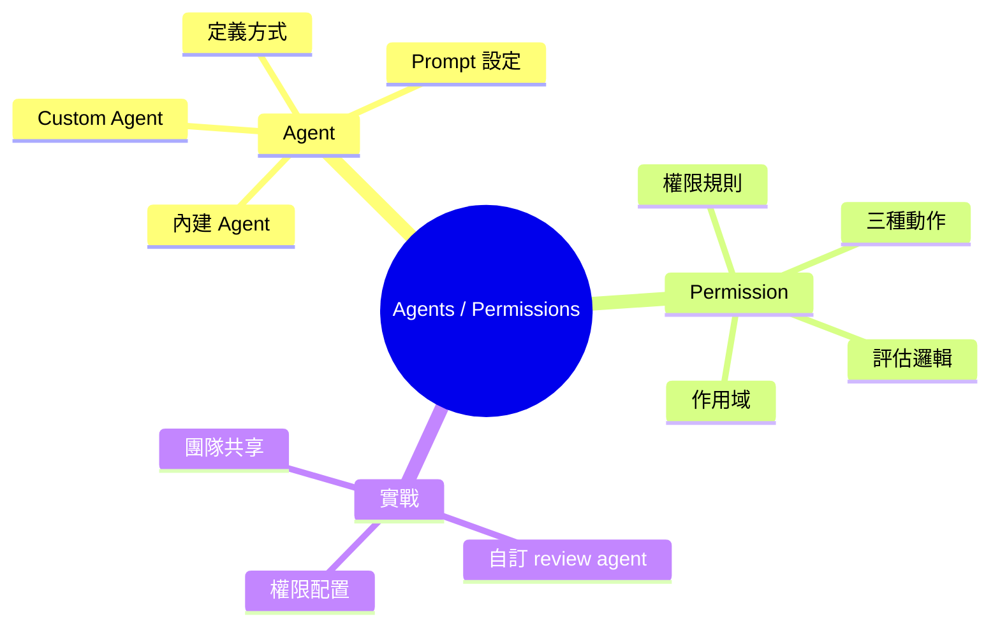
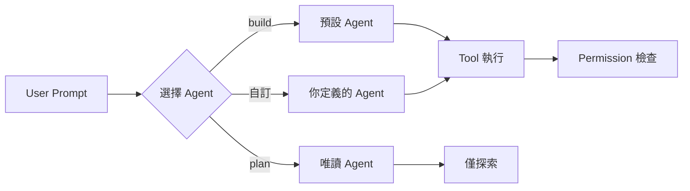
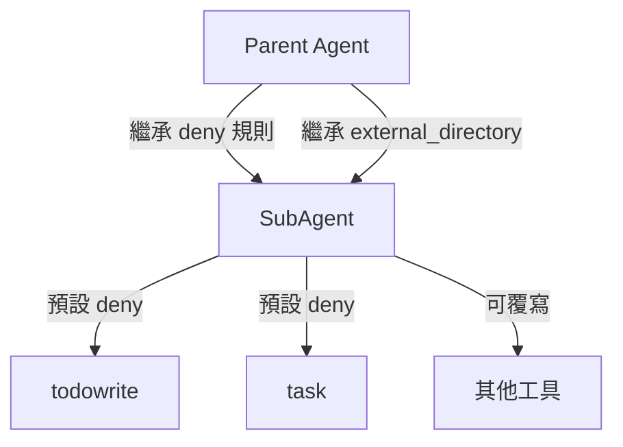

## Learning Objectives

完成本課後，你將能夠：

1. 區分 opencode 的七個內建 Agent 及其職責
2. 透過 opencode.json 和 .md 檔案建立自訂 Agent
3. 理解 Permission 系統的評估邏輯和規則結構
4. 為 Agent 設定合適的權限規則

---

## 1. Agent 是什麼

Agent 是 opencode 的執行角色。每個 Agent 有不同的工具存取權限、系統提示、和行為模式。

> **Think**：如果 Agent 是員工，那 Permission 就是他們的權限卡。前台員工不能進機房，工程師不能動財務系統。

**心智模型**：Agent 定義「能做什麼」，Permission 定義「能對什麼做」。



---

## 2. 內建 Agent

opencode 有七個內建 Agent：

| Agent | 模式 | 用途 | 特殊權限 |
|-------|------|------|----------|
| **build** | primary | 預設。所有工具都可用 | question/plan_enter allow |
| **plan** | primary | 唯讀規劃。不能編輯或執行 | edit deny（除 .opencode/plans/`\*.md`） |
| **general** | subagent | 研究和多步驟任務 | todowrite deny |
| **explore** | subagent | 快速程式碼探索 | deny-all except grep/glob/read/bash |
| **compaction** | primary, hidden | Context 壓縮 | deny-all（僅系統用） |
| > **Think**：plan Agent 為什麼要 deny edit？因為規劃階段不需要改檔案，而且這防止 Agent 過早進入實作。

**Tab 鍵切換 Agent**：在對話中按 Tab 可以在 primary Agent 之間切換。`@mention` 可以調用 subagent。

**系統提示差異**：每個 Agent 使用不同的 prompt 檔案。explore 使用 `prompt/explore.txt`，專門設計為快速探索而非修改。

---

## 3. Custom Agent

你可以透過兩種方式建立自訂 Agent：

### 方法一：opencode.json

```jsonc
{
  "agent": {
    "code-reviewer": {
      "description": "程式碼審查 Agent",
      "model": "anthropic/claude-sonnet-4-20250514",
      "mode": "subagent",
      "temperature": 0.2,
      "prompt": "你是一個專業的程式碼審查者。專注於安全性、效能、和可維護性。",
      "permission": {
        "read": "allow",
        "edit": "deny",
        "bash": "deny"
      }
    }
  }
}
```

**重要欄位**：

| 欄位 | 說明 |
|------|------|
| `description` | Agent 的用途描述（影響 UI 顯示） |
| `mode` | `subagent`（@mention 調用）、`primary`（Tab 切換）、`all`（兩者皆可） |
| `model` | 指定 LLM（可選，預設用全域 model） |
| `temperature` | 溫度參數（可選） |
| `prompt` | 系統提示文字或檔案路徑 |
| `permission` | 權限規則（與頂層 permission 格式相同） |
| `steps` | 最大 LLM 回合數（可選） |

### 方法二：.md 檔案

在 `.opencode/agents/` 目錄下建立 Markdown 檔案：

```markdown
---
description: "安全審查 Agent"
mode: subagent
model: anthropic/claude-sonnet-4-20250514
temperature: 0.1
permission:
  read: allow
  edit: deny
  bash: deny
---

你是一個安全審查專家。專注於：
1. SQL 注入風險
2. XSS 漏洞
3. 權限提升
4. 敏感資料洩露

對每個問題給出具體的修復建議。
```

Frontmatter 欄位與 JSON 配置相同。Body 內容成為 Agent 的 `prompt`。

**優勢**：.md 檔案可以用 `@mention` 快速調用，而且更容易版本控制。

> **Spot the Mistake**：以下配置有什麼問題？
> ```jsonc
> {
>   "agent": {
>     "my-agent": {
>       "mode": "primary",
>       "permission": { "edit": "deny" }
>     }
>   }
> }
> ```
> **答**：如果 mode 是 `primary` 但 deny edit，那這個 Agent 無法改任何檔案。使用者按 Tab 切換到它後會卡住。Primary Agent 通常需要寫入權限。

---

## 4. Permission 系統

Permission 規則結構：

```typescript
{
  permission: string,  // 工具名稱或 "*" 通配符
  pattern: string,     // 資源模式（檔案路徑、shell 指令等）
  action: "allow" | "deny" | "ask"
}
```

### 三種動作

| 動作 | 行為 |
|------|------|
| `allow` | 自動執行，不詢問 |
| `deny` | 阻止執行，工具對 LLM 隱藏 |
| `ask` | 詢問使用者確認 |

### 評估邏輯

```typescript
// 權限評估（簡化版）
function evaluate(permission, pattern, ...rulesets) {
  return rulesets.flat().findLast(
    rule => match(permission, rule.permission) &&
            match(pattern, rule.pattern)
  ) ?? { action: "ask" }  // 預設 ask
}
```

**最後匹配原則**：多條規則時，最後匹配的生效。這類似 CSS 的 specificity。

**合併順序**：
1. 硬編碼預設值
2. 全域 `permission` 配置
3. Agent 專屬 `permission` 配置

### 常見 Permission 鍵

| 鍵 | 控制什麼 |
|---|---------|
| `read` | 讀取檔案 |
| `edit` | 編輯檔案 |
| `bash` | 執行 shell 指令 |
| `glob` | 檔案搜尋 |
| `grep` | 內容搜尋 |
| `webfetch` | 抓取網頁 |
| `websearch` | 網路搜尋 |
| `task` | 調用 subagent |
| `external_directory` | 存取工作區外目錄 |

> **Think**：為什麼 `ask` 是預設值？因為 opencode 的安全哲學是「不確定就問」。寧可多問一次，也不要誤刪檔案。

---

## 5. Pattern 模式

Permission 規則支援通配符：

```jsonc
{
  "permission": {
    // 所有讀取都允許
    "read": "allow",
    
    // 特定檔案要詢問
    "read": { "*.env": "ask", "*.env.*": "ask" },
    
    // Bash 指令分級控制
    "bash": {
      "git *": "allow",
      "npm test": "allow",
      "rm *": "deny",
      "*": "ask"
    },
    
    // 外部目錄
    "external_directory": {
      "/tmp/*": "allow",
      "*": "ask"
    }
  }
}
```

**子 Agent 權限繼承**：



SubAgent 自動繼承 parent 的 deny 規則和 external_directory 規則。但 todowrite 和 task 預設 deny（除非 Agent 明確 allow）。

---

## 6. Agent 配置最佳實踐

### 為不同任務設計 Agent

| 任務 | Agent 配置 | 原因 |
|------|-----------|------|
| 程式碼審查 | read allow, edit deny | 只看不改 |
| 安全掃描 | read allow, edit/bash deny | 只分析 |
| 快速原型 | 全 allow | 最大自由度 |
| 團隊新人 | read allow, edit/bash ask | 學習 + 安全 |

### 模型選擇

不同 Agent 可以用不同模型：

```jsonc
{
  "agent": {
    "planner": {
      "model": "anthropic/claude-opus-4-20250514",  // 規劃用強模型
      "mode": "primary"
    },
    "implementer": {
      "model": "anthropic/claude-sonnet-4-20250514",  // 實作用快速模型
      "mode": "primary"
    },
    "reviewer": {
      "model": "anthropic/claude-opus-4-20250514",  // 審查用強模型
      "mode": "subagent"
    }
  }
}
```

> **Predict**：如果 planner 用 Opus，implementer 用 Sonnet，這個工作流有什麼好處和風險？
> **答**：好處是規劃品質高、實作速度快。風險是規劃和實作的能力落差，可能導致 plan 很詳細但 implementation 做不到。

---

## 7. 實際場景：程式碼審查工作流

**需求**：建立一個專用的程式碼審查 Agent，只能讀不能寫。

```jsonc
// opencode.json
{
  "agent": {
    "reviewer": {
      "description": "審查最近的程式碼變更",
      "mode": "subagent",
      "model": "anthropic/claude-opus-4-20250514",
      "temperature": 0.1,
      "prompt": "你是資深工程師。審查重點：\n1. 安全漏洞\n2. 效能問題\n3. 可讀性\n4. 測試覆蓋\n\n對每個問題給出嚴重等級（Critical/Major/Minor）。",
      "permission": {
        "read": "allow",
        "glob": "allow",
        "grep": "allow",
        "edit": "deny",
        "bash": "deny",
        "webfetch": "deny"
      }
    }
  }
}
```

**使用方式**：

```
> 執行 `@reviewer` 然後貼上你的程式碼變更
```

Agent 會自動使用 Opus 模型、限制溫度 0.1、拒絕所有寫入操作。

---

## 8. Permission 與安全

### 安全等級

| 等級 | 配置 | 適用場景 |
|------|------|----------|
| 高度限制 | read allow, everything else deny | 生產環境、敏感資料 |
| 中度限制 | read/edit allow, bash ask | 一般開發 |
| 低度限制 | 全 allow | 個人專案、原型開發 |

### 團隊配置建議

```jsonc
{
  "permission": {
    // 團隊共用：安全第一
    "read": "allow",
    "edit": { "*.env": "ask", "*.env.*": "ask" },
    "bash": {
      "git status": "allow",
      "git diff": "allow",
      "git add": "ask",
      "git commit": "ask",
      "git push": "ask",
      "rm *": "deny",
      "*": "ask"
    }
  }
}
```

---

## 9. 常見錯誤

### Agent 配置錯誤

1. **Mode 與 Permission 衝突**：primary Agent deny edit → 使用者切換後無法操作
2. **Prompt 檔案路徑錯誤**：Agent 找不到 prompt 檔案 → 無系統提示
3. **模型 ID 錯誤**：指定不存在的模型 → 啟動失敗

### Permission 配置錯誤

1. **規則順序錯誤**：deny 寫在前面，allow 寫在後面 → deny 生效
2. **Pattern 過寬**：`"bash": "allow"` → Agent 可執行任何指令
3. **遺漏 ask**：所有操作都 allow → 失去安全緩衝

> **Spot the Mistake**：以下配置有什麼安全風險？
> ```jsonc
> {
>   "permission": {
>     "bash": "allow",
>     "edit": "allow"
>   }
> }
> ```
> **答**：Agent 可以執行任何 shell 指令（包括 `rm -rf /`）和編輯任何檔案。沒有 ask 確認，也沒有 pattern 限制。這是「全開放」配置，只適合完全信任的環境。

---

## 10. 驗證你的理解

**Feynman 挑戰**：向一個不熟悉 opencode 的工程師解釋：

1. Agent 和 Permission 的關係
2. 為什麼需要 Custom Agent
3. Permission 規則的合併順序

如果解釋不清楚，重新閱讀對應章節。

---

## Summary

| 概念 | 說明 |
|------|------|
| **Agent** | 執行角色，定義工具存取和行為 |
| **Permission** | 權限規則，控制工具能對什麼做 |
| **內建 Agent** | build/plan/general/explore 等七個 |
| **Custom Agent** | opencode.json 或 .md 檔案定義 |
| **三種動作** | allow（自動）、deny（阻斷）、ask（詢問） |
| **最後匹配** | 多規則時最後匹配的生效 |
| **合併順序** | 預設 → 全域 → Agent 專屬 |
| **SubAgent 繼承** | 繼承 parent deny + external_directory |

---

**下一課**：安全和 Guardrails — 深入探討 opencode 的安全機制和最佳實踐。
