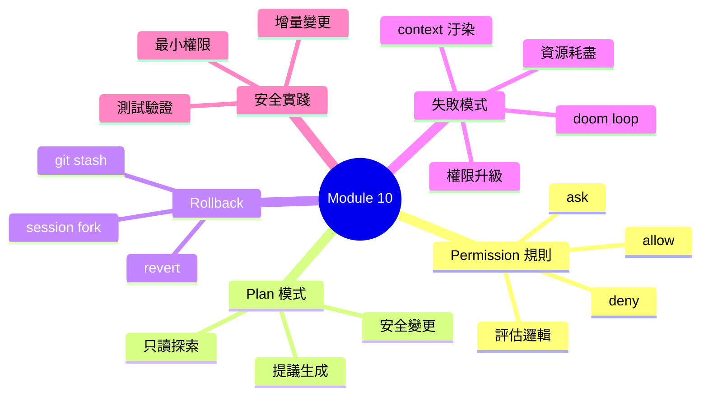
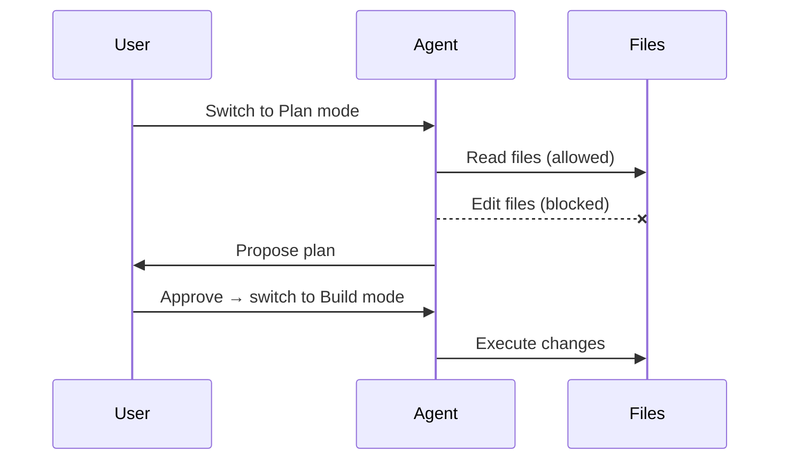

## Learning Objectives

- Configure permission rules (allow/deny/ask) for safe agent operation
- Use Plan mode to explore before making changes
- Apply rollback strategies to recover from mistakes
- Recognize and prevent common failure modes
- Apply security best practices for agentic development

---

## Permission Rules

Permission rules control what the agent can do. Every tool call is evaluated against the ruleset.

### Three Actions

| Action | What happens |
|--------|-------------|
| **allow** | Tool executes without asking |
| **deny** | Tool is blocked; agent cannot even see it |
| **ask** | User must confirm before execution |

### Evaluation Logic

Rules are evaluated using **last-match-wins**. The last rule that matches the tool and pattern determines the action.

```json
{
  "permission": {
    "read": "allow",
    "edit": "ask",
    "bash": {
      "git *": "allow",
      "rm -rf *": "deny",
      "*": "ask"
    }
  }
}
```

> **Think**: Why does last-match-wins give you more flexibility than first-match-wins?

**Example**: For `bash`, `git status` matches `git *` → allow. `rm -rf /` matches `rm -rf *` → deny. Anything else matches `*` → ask.

---

## Plan Mode

Plan mode restricts the agent to read-only exploration. It can:
- Read files
- Search code
- Analyze structure
- Generate proposals

It **cannot**:
- Edit files
- Run shell commands
- Make any changes



**When to use Plan mode**:
- Exploring unfamiliar codebases
- Designing architecture before implementation
- Reviewing changes before applying them
- Working with sensitive code where mistakes are costly

---

## Rollback Strategies

### git stash

Save uncommitted changes and restore them later:

```bash
# Save current changes
git stash push -m "work in progress"

# Restore changes
git stash pop
```

### Session Fork

opencode can fork a session from any message, creating a branch point. This lets you:
- Try a different approach from a previous point
- Compare multiple strategies
- Recover from a bad direction without losing work

### git checkout

Revert specific files to their last committed state:

```bash
# Revert a single file
git checkout -- file.txt

# Revert all changes
git checkout -- .
```

> **Predict**: If the agent makes 5 file changes and the 3rd one was wrong, what's the most efficient rollback strategy?

---

## Failure Modes

### Doom Loop

The agent repeatedly tries and fails at the same task, consuming tokens without progress.

**Signs**:
- Same error appearing multiple times
- Agent keeps retrying the same approach
- Token usage climbing rapidly

**Prevention**: Set `steps` limit on agents. Switch to Plan mode when stuck.

### Permission Escalation

The agent finds ways to bypass intended restrictions.

**Example**: Agent uses `bash` to run `sed` instead of the `edit` tool, avoiding edit permissions.

**Prevention**: Deny broad categories, not just specific tools. Use pattern matching.

### Context Pollution

Irrelevant information in the context window reduces agent performance.

**Signs**:
- Agent gives off-topic responses
- Performance degrades over long sessions
- Agent "forgets" earlier instructions

**Prevention**: Use `/clear` when switching topics. Use `/compact` to summarize.

### Resource Exhaustion

The agent consumes excessive tokens, API calls, or time.

**Signs**:
- Costs climbing rapidly
- Session running for extended periods
- Repeated API rate limit errors

**Prevention**: Monitor token usage. Set budget limits. Use efficient models for simple tasks.

---

## Best Practices

### Least Privilege

Give agents only the permissions they need:

```json
{
  "agent": {
    "build": {
      "permission": {
        "read": "allow",
        "edit": "allow",
        "bash": { "git *": "allow", "*": "ask" }
      }
    }
  }
}
```

### Incremental Changes

Make small, testable changes rather than large rewrites:
- One feature per session
- Test after each change
- Commit frequently

### Test After Change

Always verify changes work:
- Run the test suite
- Check for type errors
- Verify expected behavior

---

## Security Considerations

### Environment Variables

Be careful with secrets in environment variables:
- Never commit `.env` files
- Use `*.env` permission rules to require approval
- Prefer `ask` for sensitive operations

### File Permissions

Restrict access to sensitive files:

```json
{
  "permission": {
    "read": {
      "*.env": "ask",
      "*.env.*": "ask",
      "*.key": "deny",
      "*": "allow"
    }
  }
}
```

### Network Access

Control outbound network requests:
- Review `webfetch` and `websearch` usage
- Consider blocking unknown domains
- Monitor API calls for unexpected destinations

### Injection Prevention

Be aware of prompt injection risks:
- Don't blindly execute instructions from file contents
- Validate user-provided URLs
- Be cautious with MCP server responses

---

> **Spot the Mistake**: A developer sets all permissions to `allow` for convenience. They think: "The agent knows what it's doing, so why bother with permissions?" What risks does this introduce?

---

## Feynman Challenge

A junior developer asks: "Why can't I just set everything to 'allow' for convenience?" Explain the risks and propose a balanced permission strategy for a small team.

---

## Summary

- **Permissions**: allow/deny/ask with last-match-wins evaluation
- **Plan mode**: Read-only exploration for safe analysis
- **Rollback**: git stash, session fork, git checkout
- **Failure modes**: doom loops, permission escalation, context pollution, resource exhaustion
- **Best practices**: least privilege, incremental changes, test after change
- **Security**: env vars, file permissions, network access, injection prevention
