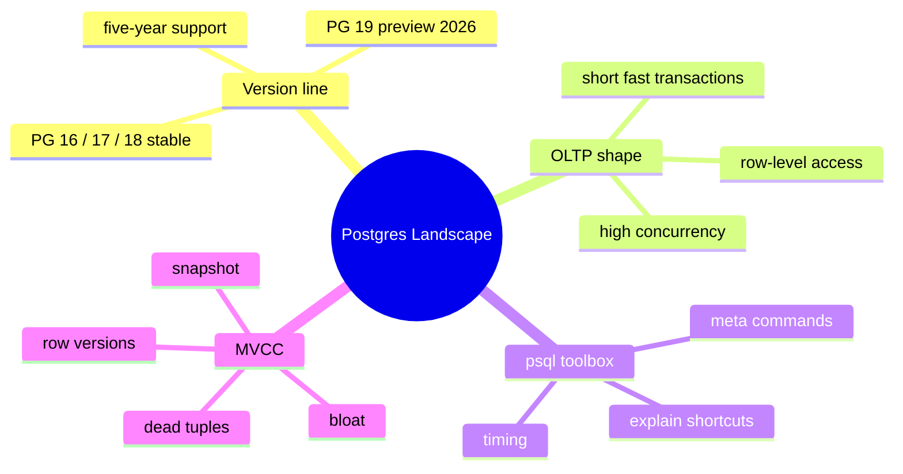
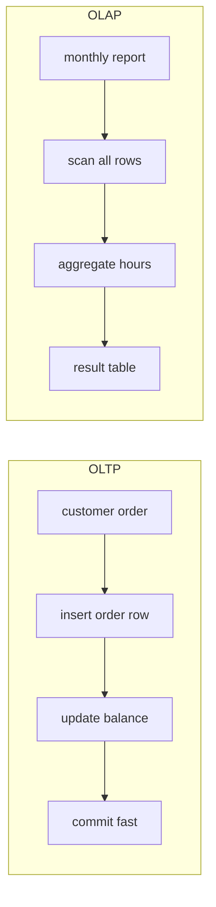
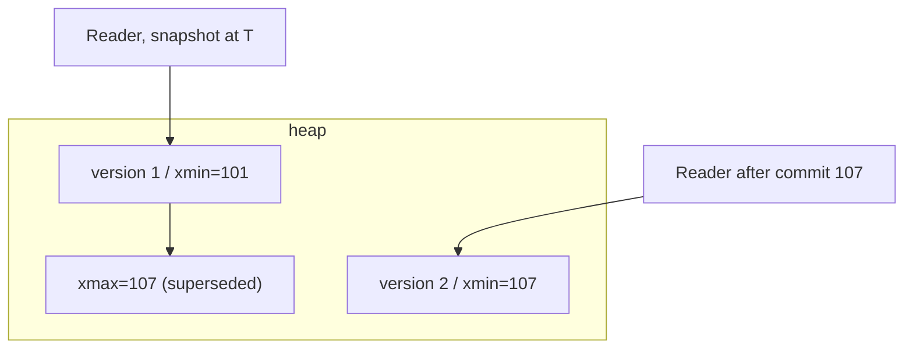

# Module 01: Postgres Landscape: OLTP, MVCC, and the psql Workbench

Est. study time: 1.2h
Language: en
Description: The Postgres land: version line, OLTP workload shape, psql toolbox, and the MVCC mental model every query decision hangs on.

## Knowledge Map

---

## Learning Objectives (maps to course CILOs)
- Place Postgres 16/17/18/19 in time and know what "latest" means on real instances — CILO 2
- Recognize an OLTP workload and why row-level, concurrency-safe design dominates it — CILO 5
- Use psql efficiently to inspect schema, indexes, and query plans — CILO 3
- Explain MVCC in one picture: row versions, snapshots, dead tuples — CILO 5

---

## Real-World Example

Your team runs a payments service on Postgres 13. A colleague posts a migration PR that says "Oracle MERGE syntax", and your DBA keeps answering "slow query?" emails with the same three words: "check your indexes." Meanwhile a blog tells you Postgres 18 ships UUIDv7 and a general-purpose MERGE. Nothing feels connected: which SQL should you write, which version features can you actually use, and why do indexes keep coming up?

The thread holding all of it together: every Postgres SQL and performance decision runs through one stupid-simple storage model — MVCC — and one query pipeline. This course builds from that core upward: modern SQL (modules 2-9), then performance and indexes (modules 10-15), then the newest version features (modules 16-17).

> **Think**: Why can't you just write the newest syntax and expect it to work everywhere?
>
> *Answer: Your database version decides which SQL exists. MERGE is PG15+; JSONB is PG9.4+. Cloud providers pin versions, and old instances are common. "Latest" features are only real when your server actually runs that version.*

---

## Core Content

### Postgres Version Line: What "Latest" Means

Postgres releases one major version per year, roughly every September. Each major version is supported for **five years** from release.

| Version | Released | Status (Aug 2026) | Why it matters |
|---|---|---|---|
| 16 | Sep 2023 | old stable | first widely-adopted MERGE path |
| 17 | Sep 2024 | stable | incremental sorts, EXPLAIN memory |
| 18 | Sep 2025 | current stable | UUIDv7/v8, core MERGE, faster sorts |
| 19 | ~Sep/Oct 2026 | beta now, GA soon | REPACK, ON CONFLICT DO SELECT, GROUP BY ALL |

Two traps: (1) your managed cloud may run an older major — check `SELECT version()`, not the product marketing. (2) Minor releases (18.3, 18.4) are security/bug fixes, not new features; plan upgrades around majors.

> **Think**: You saw "PostgreSQL 19" on a blog and want MERGE's new features today. Why wait?
>
> *Answer: 19 is beta — catalog, SQL, and defaults can still change before GA. Never build production on pre-release behavior. For OLTP, 18 is the safe "latest".*

> **Cloze**: "Postgres does a major release roughly every {September}, and each major is supported for {five} years."
>
> *Answer: September; five*

### OLTP: The Workload This Course Targets

**OLTP** (Online Transaction Processing) is the opposite of analytics. Typical OLTP traits:

- **Short, frequent transactions** — microseconds-to-milliseconds, thousands per second
- **High concurrency** — many sessions writing at once
- **Row-level access** — fetch/update a few rows by key, not scan millions
- **Consistency required** — one customer's order must be all-or-nothing
- **Writes are heavy** — UPDATE/DELETE/INSERT, not just SELECT

OLAP (analytics/reporting) inverts all of that: long scans, few users, bulk reads. This course optimizes for OLTP; rules that hold for index design and vacuum come directly from that choice.

> **Predict**: Which workload will fight you harder over dead rows and index bloat?
>
> *Answer: OLTP. Every UPDATE creates a new row version, so write-happy OLTP generates dead rows constantly — that is what autovacuum and index maintenance exist for.*

### psql: Your Inspection Toolbox

`psql` is Postgres' built-in client. Meta-commands are your fastest inspection path:

- `\dt` — list tables; `\d table` — describe columns, constraints, indexes
- `\di` — list indexes; `\di+` — with size and table names
- `\timing on` — show per-query wall time
- `\x` — expanded output (one field per line) for wide rows
- `EXPLAIN (ANALYZE, BUFFERS) your_query` — the plan (module 10)
- `\l` databases; `\conninfo` — current connection details

Pro tip: `\d number` is your fastest "what indexes exist here?" answer. Most slow-query mysteries start with "the index the WHERE clause needs doesn't exist."

> **Cloze**: "The command `{ \d } tablename` shows a table's columns, constraints, and indexes."
>
> *Answer: \d*

### MVCC In One Picture

Postgres storage = **MVCC** (Multi-Version Concurrency Control). The core idea: a table row is not edited in place; every INSERT or UPDATE creates a **new row version** (a "tuple"). Old versions are kept so concurrent readers can still see a consistent snapshot. Writes never block readers; readers never block writers.

Mechanics (simplified):

- each row version carries hidden columns `xmin` (creating transaction) and `xmax` (marking transaction, if any)
- a reader takes a **snapshot** at statement/transaction start and only sees row versions whose `xmin` committed before the snapshot
- an UPDATE = insert new version + mark `xmax` on the old one
- versions no reader can ever see are **dead tuples**; **VACUUM** removes them

Why you must know this for OLTP:

1. **Bloat** — if vacuum lags, dead versions pile up; tables read slower, indexes bloat.
2. **Indexes** — an index has no xmin/xmax, so after ANY change the planner must check the heap to tell if an entry is live; this is why "index-only scans" are special (module 12).
3. **HOT updates** — updating a row may reuse its own page if the indexed columns are unchanged; keeping indexed-column updates out of hot paths keeps writes cheap (module 11).

> **Think**: Two transactions: A updates a balance, commits. B started before A committed and reads the same row. What does B see?
>
> *Answer: The old balance (version 1). B's snapshot predates A's commit, so B is safe from seeing a mid-air change — reads never block on that write.*

> **Spot the Mistake**: Novice: "If a big UPDATE rewrites a million rows, I should just skip VACUUM — the old data gets overwritten anyway, no waste."
>
> What's wrong?
>
> *Answer: MVPCC keeps the old versions until vacuum removes them. The big UPDATE leaves ~1M dead tuples plus rewrites the index. Skipping vacuum = table and indexes keep old entries, disk and read time grow, and autovacuum will run anyway — just later and heavier.*

---

### Why This Matters

Every downstream module leans on this foundation. Reading EXPLAIN (module 10) is pointless without knowing scans follow MVCC-heap order. B-tree design (modules 11-12) exists to skip heap reads by locality. Understanding dead tuples and bloat (module 15) is required before you trust your indexes. And version-aware SQL (modules 16-17) only works when you know which major your instance runs. Get the base wrong and every "optimization" later is guesswork.

---

## Key Takeaways
- OLTP = short, concurrent, row-level, write-heavy transactions; course optimizes for it
- Postgres ships a major release yearly, supported five years; "latest" is only real on your server
- psql meta-commands (`\d`, `\di`, `\timing`, `EXPLAIN ANALYZE`) are the inspection layer
- MVCC = new row versions on write, snapshots for readers, dead tuples for vacuum
- Writes don't block reads in Postgres — and dead rows are the price you pay

---

## Common Misconception

**"Total rows define query speed."** After MVCC, total rows matter far less than: how many rows must be scanned, whether the scan is sequential or indexed, and how many are dead. A 10M-row table with a perfect covering index beats a 100k-row table with no index for a keyed read. Rows ≠ cost; access path = cost.

---

## Spot the Mistake

Your bug ticket says: "Query took 30s. Index exists on `orders(customer_id)`." You don't check `version()` and start recommending PG18 features to a server on PG15.

What's wrong?

*Answer: You must confirm the actual server major before recommending features; also an existing index does not mean the planner used it (or that it fits the query). Fix order: `SELECT version();` → `\d orders` → `EXPLAIN (ANALYZE, BUFFERS)` before touching SQL.*

---

## Feynman Explain
(Teach "how Postgres stores a customer's row when it changes" to a child. Explain that a change makes a *copy*, the old one stays for anyone still looking, and a cleaner (vacuum) sweeps copies nobody can see anymore. No jargon: use "copy", "sweeper", "someone still looking.")

---

## Reframe
(Pause. Judge *MVCC as a tradeoff*. Reads never block writes — great. But you pay with extra storage, vacuum machinery, and index complexity. When does that trade break? Think: write-heavy tables where every column is indexed — each update forces multiple index writes. Is MVCC still worth it? What's the alternative you'd give up?)

---

## Drill
Take the quiz. MCQs test different angles — recall, application, scenario.

Run: `learn.sh quiz postgres-sql 01-postgres-landscape`