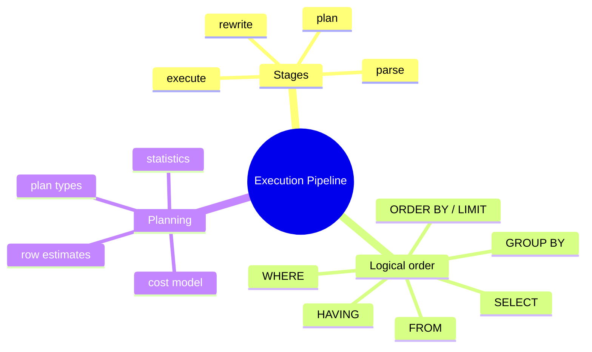
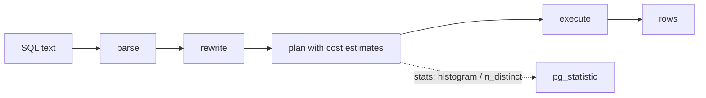

# Module 02: Query Execution Pipeline — From Text to Result

Est. study time: 1.1h
Language: en
Description: What Postgres does with your SQL before it returns rows, and why the planner's row estimate decides your query's fate.

## Knowledge Map



---

## Learning Objectives (maps to course CILOs)
- Trace a query through parse → rewrite → plan → execute — CILO 3
- Reconcile SQL's logical clause order with physical execution order — CILO 1
- Explain why a wrong row estimate produces a bad execution plan — CILO 3

---

## Real-World Example

Your dashboard query joins `orders` to `customers` on `customer_id`. It used to return in 40ms. This month it takes 4s. Nothing in the SQL changed — the same statement, the same indexes. What changed?

What changed is what the **planner believed**. The planner doesn't know the truth about your data; it knows *statistics*: how many rows per table, how many distinct values in `customer_id`, how the values correlate. It multiplies estimates to choose a join strategy. When the estimates were right, it picked a nested loop (fast). When they drifted — a new customer segment, a skewed distribution — it picked something else. Same SQL, different plan, 100x slower.

The pipeline is the map to that failure: parse → rewrite → plan → execute. Estimate errors enter at *plan*. Fixing them means fixing what the planner knows (module 15), or giving it an index that makes the safe plan cheaper (modules 11-14).

> **Think**: You ran the same SQL and got the same rows. Why is 100x variability possible?
>
> *Answer: Because execution time follows the *plan*, and the plan is recomputed from statistics each time unless the statement is prepared. Data drift changes estimates, estimates change plans.*

---

## Core Content

### Stage 1-2: Parse and Rewrite

**Parse** — tokenize and check the SQL grammar. A bad statement fails here with a syntax error. Parse alone is trivial cost; it never reads tables.

**Rewrite** — Postgres rewrites the query tree *before* planning. Key rewriters that shape every OLTP query:

- **Subquery flattening** — many `IN (SELECT ...)` and derived tables are turned into joins (when safe)
- **View expansion** — views are inlined; what you wrote is not necessarily what runs
- **Rule system** — `CREATE RULE` rewrites (rarely used today)

Rule of thumb: what the planner actually plans is the *rewritten* query, not your text. That's why a `VIEW` isn't a performance barrier — and why reading `EXPLAIN` shows joins you never typed.

> **Cloze**: "Before planning, Postgres {rewrites} the query tree — inlining views, flattening subqueries — so the planned query may not match what you typed."
>
> *Answer: rewrites*

### Stage 3: Plan — Where Speed Is Decided

The planner turns the rewritten tree into a **plan tree**: a tree of nodes, each with an execution method and a **cost**. Two facts you must internalize:

1. **Costs come from estimates.** Estimates come from `pg_statistic` — histograms, distinct-count, null-fraction, correlation — gathered by `ANALYZE`. Costs are not measured; they are *predicted*.
2. **The cheapest estimate wins, but only as well as its numbers.** The planner has no crystal ball. Garbage estimates → garbage plan, even with perfect indexes.

Planning happens on every fresh execution. `PREPARE`/server-side prepared statements cache the plan keyed by the parameter types, which is exactly why prepared OLTP hot paths avoid replanning each call.



> **Think**: Should you add an index to make the *intended* plan cheap, or fix the estimate so the planner *chooses* it?
>
> *Answer: Usually both, but speech order matters. A wrong estimate can make the planner ignore your perfect index (it believes another plan is cheaper). Fix estimates first, then index — or at least check both when plans go sideways.*

> **Predict**: A query joins two tables, each correctly estimated at 1,000 rows. Planner picks nested loop, returns in 1ms. You add 100x more rows to one table without re-running ANALYZE. What happens to the plan?
>
> *Answer: The planner still believes 1,000 rows, so it keeps the nested-loop plan that now costs seconds — the classic stale-statistics slow query.*

### Stage 4: Execute

Execute walks the plan from leaves (table scans) up to the root, streaming rows between nodes ("pull" model — every node pulls from its children). Key properties:

- **Row streaming** — joins and scans pipeline; no materialization unless the plan demands it (sort, hash)
- **Node types** mirror the operator: Seq Scan, Index Scan, Hash Join, Nested Loop, Sort, Aggregate, Limit
- `LIMIT` can stop the whole tree early — a tiny clause that can amputate enormous work

### SQL Logical Order vs Physical Order

SQL's **logical** clause order (what the language semantics require) is NOT the physical order of execution. Logical order:

```text
1. FROM (and JOINs, LATERAL)
2. WHERE
3. GROUP BY
4. HAVING
5. SELECT (expressions, window functions)
6. DISTINCT / ORDER BY
7. LIMIT / OFFSET
```

Physical order is the *planner's* anyway — it may filter early, reorder joins, push conditions into subplans. Two consequences for how you write SQL:

- `WHERE` on a joined column in one table can be applied as a filter on that table's scan — so "filter early" usually happens automatically; your job is giving it the indexes to do so
- `ORDER BY` is not free: if a sorted index can satisfy it, the planner skips an explicit Sort node — modules 11-12 rely on this

> **Think**: Why can't you use a window function or alias from the SELECT list in a WHERE clause, even though WHERE comes "later" conceptually? And why is "WHERE comes before SELECT" the right mental model?
>
> *Answer: WHERE runs on raw rows *before* SELECT-level expressions and window functions are computed, so they don't exist yet — WHERE can only reference source columns. Aliasing `WHERE x > 0` from `SELECT a+1 AS x` fails for exactly this reason.*

> **Spot the Mistake**: Novice optimizes "ORDER BY created_at DESC LIMIT 10" with a trigger that re-sorts the whole table on every write.
>
> What's wrong?
>
> *Answer: Wrong fix. The correct one is an index on (created_at DESC), letting the planner read those 10 rows in order and stop after 10 — no sort node, no trigger. The trigger re-sorts millions of rows per write for a 10-row read.*

---

### Why This Matters

Every module that follows is an exercise in shaping this pipeline. Row estimation and index-aware access (10-15) exist because the planner *predicts* rather than measures. Rewrites explain why "my VIEW should cache results" is wrong and why `EXPLAIN` shows joins you didn't write. And knowing logical vs physical order keeps you from writing SQL the pipeline will silently rearrange.

---

## Key Takeaways
- Pipeline: parse → rewrite → plan → execute; plan decides speed
- The planner works from statistics, not measured reality — estimates decide plans
- Views are inlined at rewrite; `EXPLAIN` shows the real, rewritten query
- SQL logical clause order ≠ physical execution order (which the planner owns)
- A sorted index can remove the Sort node; `LIMIT` can stop execution early

---

## Common Misconception

**"Prepared statements are universally slower because they guess the plan."** Reality: generic plans are *reused* and often *better* for hot OLTP paths, since planning is skipped. The pathological case is a few parameter values with wildly different row counts (one matches 1 row, another 1M). Postgres keeps using the generic plan via `plan_cache_mode = auto` — you still win by saving per-call planning cost.

---

## Spot the Mistake

You're told: "Query is slow because it uses a subquery. Views and subqueries are always slower — rewrite it as a temp table."

What's wrong?

*Answer: No such blanket rule. Prepare it inline → flatten to a join, and a temp table adds materialization + an extra scan. Measure with EXPLAIN first; the subquery is rarely the true cost driver.*

---

## Feynman Explain
(Teach a child: "A postman deciding which route to take." Say a boss (Postgres) plans a route from a map of the city (statistics). If the map is wrong — a bridge is actually closed — the postman takes a long way even though the mailbox was around the corner. Same trip request, much longer trip. That's why keeping the map fresh matters.)

---

## Reframe
(Pause. Judge *the plan-as-prediction model*. Cost-based planning is robust because it generalizes — you don't tell Postgres how to run each query. But it is brittle to statistics quality. When does relying on the planner break? Huge skew, correlated columns, tiny tables where seq scan is fine, giant tables where an index misses. Is the estimate-driven approach the right trade, or should Postgres auto-tune harder? Form your view.)

---

## Drill
Take the quiz. MCQs test different angles — recall, application, scenario.

Run: `learn.sh quiz postgres-sql 02-query-execution-pipeline`