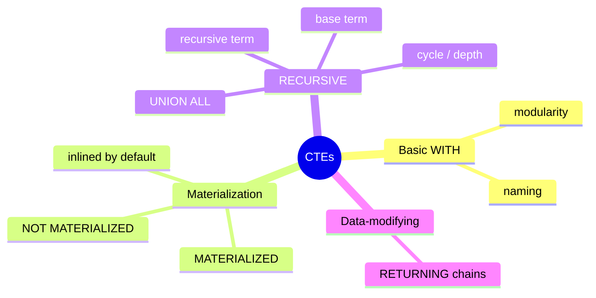

# Module 03: CTEs and Recursion — WITH Done Well

Est. study time: 1.1h
Language: en
Description: Common table expressions, when Postgres inlines them vs materializes them, and recursive queries for hierarchies, forests, and walks.

## Knowledge Map



---

## Learning Objectives (maps to course CILOs)
- Use WITH / RECURSIVE to express complex multistep queries — CILO 1
- Decide when a CTE should be inlined vs materialized — CILO 1, 3
- Write recursive queries for trees and walks with cycle protection — CILO 1

---

## Real-World Example

You maintain a product catalog. Categories form a tree: `categories(id, parent_id)`. Someone asks: "how many products sit under category 417, including every descendant at any depth?"

Naive attempt — manually nested self-join:

```sql
SELECT count(*) FROM products
WHERE category_id IN (
  SELECT id FROM categories WHERE parent_id = 417
    OR parent_id IN (SELECT id FROM categories WHERE parent_id = 417)
);
```

Breaks the moment the tree is 4 levels deep. A recursive CTE solves it in one query and stays correct for any depth:

```sql
WITH RECURSIVE subtree AS (
  SELECT id FROM categories WHERE id = 417
  UNION ALL
  SELECT c.id FROM categories c JOIN subtree s ON c.parent_id = s.id
)
SELECT count(*) FROM products WHERE category_id IN (SELECT id FROM subtree);
```

The recursive term re-runs, following one level per iteration, until nothing new joins. This is second nature once you see the two terms clearly.

> **Think**: Recursion pulls the work into the database. Why is that preferable to doing the same loop in application code?
>
> *Answer: One round trip, one snapshot consistent with the caller's transaction, and the database can index and parallelize the joins. App-side loops send many round trips and can see inconsistent data between queries.*

---

## Core Content

### CTEs: what WITH gives you

`WITH name AS (query) SELECT ...` names a subquery you can reference from the main query *and* from other CTEs in the same statement. It is almost entirely sugar — the planner can inline CTEs exactly like subqueries — but for humans it beats deep nesting.

```sql
WITH recent AS (SELECT * FROM orders WHERE created_at > now() - interval '7 days')
SELECT customer_id, sum(total) FROM recent GROUP BY customer_id;
```

Why valuable: re-readability, step-by-step building, and referencing the same named stage in two places without duplicating text.

### Inlining vs materialization — the PG12+ rule

Since PostgreSQL 12 the default changed: **the planner is free to inline a CTE** (treat it as a subquery, no separate materialization) **unless**:

- the CTE is recursive — recursion requires materialization
- the CTE is referenced more than once — inlining duplicates work, so materialize is usually better, but not guaranteed
- the CTE contains a data-modifying statement — must be materialized (side effects run once)
- you force it with `MATERIALIZED`

Keywords (PG12+) force the behavior:

```sql
WITH x AS MATERIALIZED (SELECT ...)      -- always compute once, keep a temp result
WITH x AS NOT MATERIALIZED (SELECT ...)  -- always inline, never store a result
```

When does it matter? If a CTE is referenced once, inlining is usually a win — the planner can push conditions from the outer query *into* the CTE. If it is referenced multiple times, materializing can save recomputation, but `MATERIALIZED` also prevents condition pushdown, so measure.

> **Cloze**: "Since PostgreSQL 12, a simple CTE referenced exactly once is normally {inlined}; force a separate materialized result with the {MATERIALIZED} keyword."
>
> *Answer: inlined; MATERIALIZED*

> **Predict**: A CTE computes a big join, and the outer query filters it on one column with a `= 5` condition. If the CTE is inlined, what changes inside the plan?
>
> *Answer: The condition can be pushed down into the CTE's scans, so the join may never touch the other 99% of rows. With MATERIALIZED, the full join runs once into a temp result, then filters — often slower.*

### RECURSIVE: structure

`WITH RECURSIVE name AS (base UNION ALL recursive)`.

- **base term** — runs first, seeds the result
- **recursive term** — joins the running result (`name`) back to source tables; repeats until it yields zero rows
- terminator: the immutable base or the reaching of a `LIMIT`; the recursion usually ends when the recursive join produces nothing

Classic shapes: tree traversal (categories, org charts), graph walks, running series (generate dates), path strings.

Depth control and cycle protection (PG14+):

```sql
WITH RECURSIVE search(parent, child, depth) AS (
  SELECT parent, child, 0 FROM edges WHERE parent = 1
  UNION ALL
  SELECT e.parent, e.child, s.depth + 1
  FROM edges e JOIN search s ON e.parent = s.child
)
SEARCH DEPTH FIRST BY child SET ordcol
CYCLE child SET is_cycle USING pathcol;
```

`SEARCH DEPTH FIRST` creates a stable traversal order; `CYCLE` detects when a row is revisited and stops infinite loops — essential on cyclic data like referral graphs.

> **Think**: What goes wrong on cyclic data without a CYCLE clause?
>
> *Answer: The recursive term keeps re-following the same edges forever, recursing until Postgres hits work_mem or the stack limit — effectively an infinite loop. CYCLE records visited keys and cuts the re-visit.*

> **Spot the Mistake**: Novice replaces UNION ALL with UNION to dedupe the recursive join and prevent cycles.
>
> What's wrong?
>
> *Answer: UNION dedupes but still re-scans every edge — a cyclic graph can still loop forever (new duplicates keep arriving). It also adds sort/dedup cost on every iteration. Use CYCLE, which tracks visited values and tree-prunes.*

### Data-modifying CTEs

A CTE in a `WITH` can run INSERT / UPDATE / DELETE / MERGE, sharing its `RETURNING` rows with the next CTE or the main query. This is a favorite for multi-table order processing:

```sql
WITH ins AS (
  INSERT INTO orders(customer_id, total) VALUES (1, 99.5) RETURNING id
)
INSERT INTO order_items(order_id, product_id) SELECT id, 55 FROM ins;
```

Rules: the whole statement is one transaction, all effects committed or rolled back together; data-modifying CTEs are always materialized (they must run exactly once).

---

### Discipline Rules (the anti-footguns)

1. **Not a cache** — a plain CTE is not a materialized view; it reruns per statement. Persist reuse with a real materialized view (module 06/15).
2. **Inlining means the query is text** — a CTE referenced once behaves like an inline subquery; an EXPLAIN will show the pushes, so don't assume a "pretty" WITH means a stored intermediate.
3. **Recursion has a depth ceiling** — controlled by work_mem and stack limits; very deep trees (10k+) may need iterative app-side walking instead.

---

## Key Takeaways
- `WITH` names subqueries; almost always sugar, but great for structure
- PG12+: CTEs referenced once are inlined by default; use MATERIALIZED / NOT MATERIALIZED to override
- Inlining enables condition pushdown; materialization avoids recomputation — measure before forcing
- `WITH RECURSIVE name AS (base UNION ALL recursive_term)` traverses trees and graphs
- PG14+ `CYCLE` + `SEARCH` clauses protect cyclic data and fix traversal order
- Data-modifying CTEs run once, atomically with the statement, and chain via RETURNING

---

## Common Misconception

**"A CTE is automatically executed once and its result is reused for performance."** Wrong. Reuse only happens when the planner chooses materialization (multiple references or forced MATERIALIZED). A single-use CTE is typically inlined — that's a *feature* (pushdown), not a bug. If you want stored reuse across statements, use a materialized view.

---

## Spot the Mistake

```sql
WITH all_orders AS MATERIALIZED (SELECT ... huge join ...)
SELECT count(*) FROM all_orders;  -- used once
```

What's wrong?

*Answer: MATERIALIZED here hurts. The CTE is used once and heavily filtered nowhere — materializing writes a huge temp result for no benefit, and blocks any condition pushdown. Drop the MATERIALIZED keyword and let the planner inline.*

---

## Feynman Explain
(Teach a child: "Categories are like a family tree. To find everything under grandma, you need grandma's children, then their children, and so on. A recursive query does this automatically — 'show me this one, then whoever belongs to it, then whoever belongs to THOSE' — repeating the rule until nobody new shows up.")

---

## Reframe
(Decide: are CTEs overused? Their readability wins come at the price of letting developers hide expensive joins behind a name — and inlining can surprise. Does the SQL industry over-rely on WITH when views, materialized views, or app-side languages would be clearer? Consider when a function or a view is the better seam. Form your opinion.)

---

## Drill
Run: `learn.sh quiz postgres-sql 03-ctes-and-recursion`