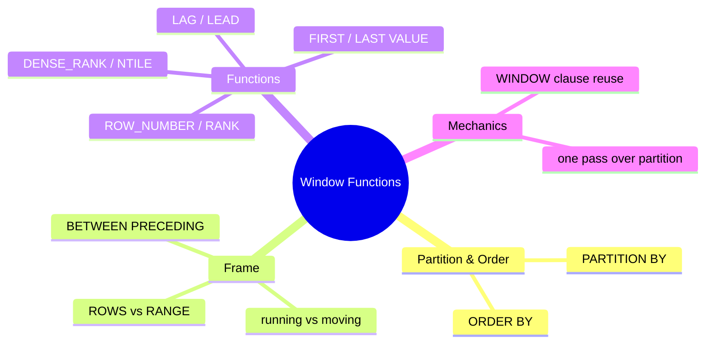

# Module 04: Window Functions — Rank, Run, Slide

Est. study time: 1.1h
Language: en
Description: Ranking, running totals, moving windows in one SELECT — without self-joins.

## Knowledge Map



---

## Learning Objectives (maps to course CILOs)
- Write ranking and offset window functions for OLTP reporting — CILO 1
- Control window frames (ROWS/RANGE) for running totals and moving averages — CILO 1
- Recognize window-function plan nodes and their cost in EXPLAIN — CILO 3

---

## Real-World Example

You track a customer's spending by order. Two classic questions:

- "rank my customers by spend" — `RANK() OVER (ORDER BY total_spend DESC)`
- "the running total of my orders this year" — `SUM(total) OVER (ORDER BY created_at)`

Before window functions these needed self-joins susceptible to duplicate rows, or app-side loops. Windows compute an aggregate over a *related group of rows* while still emitting one row per input row.

```sql
SELECT customer_id, created_at, total,
       sum(total) OVER (PARTITION BY customer_id ORDER BY created_at) AS running_total
FROM orders;
```

Each row keeps its own `total`, plus the sum of everything up to and including itself in this customer's partition, in date order. That asymmetry — you SEE each row but AGGREGATE a window — is the whole idea.

> **Think**: How is this different from `GROUP BY customer_id`?
>
> *Answer: GROUP BY collapses to one row per group; window functions keep every row and compute the group value alongside it. That is why windows cannot mix with ordinary aggregates in the same SELECT without grouping first.*

---

## Core Content

### Anatomy of a window call

Every window function call is: `FN(args) OVER (PARTITION BY cols ORDER BY cols frame)`.

- `PARTITION BY` — split rows into independent groups; empty means one partition (whole result)
- `ORDER BY` — orders the rows *within* each partition; determines what "previous" and "next" mean
- `frame` — which subset of ordered rows the function sees (default RANGE UNBOUNDED PRECEDING to CURRENT ROW)

### Ranking trio

| Function | Behavior | Ties |
|---|---|---|
| `ROW_NUMBER()` | sequential 1,2,3… | arbitrary order among ties |
| `RANK()` | ties share rank, next jumps (1,1,3) | gaps |
| `DENSE_RANK()` | ties share rank, next continues (1,1,2) | no gaps |

Pick: `ROW_NUMBER` for stable row IDs in pagination; `RANK`/`DENSE_RANK` when ties must be handled — race results, leaderboards, price buckets. `NTILE(n)` splits a partition into n equal clubs.

> **Think**: A leaderboard shows (John, Sue) tied at rank 2, then Ana. If you see rank 4 next, which function was used?
>
> *Answer: RANK — gaps after ties (1,2,2,4). DENSE_RANK would show 3.*

### Offset and window access functions

`LAG(col, offset, default)` — value from `offset` rows before; `LEAD` looks ahead. Classic: "orders vs previous order" or month-over-month:

```sql
SELECT created_at, total,
       total - lag(total) OVER (ORDER BY created_at) AS delta
FROM orders;
```

`FIRST_VALUE`, `LAST_VALUE`, `NTH_VALUE` reach inside the window; note LAST_VALUE depends on the frame, so a running-sum frame may surprise (fix with explicit frame to UNBOUNDED FOLLOWING).

> **Cloze**: "{LAG} looks at a row earlier in the window; {LEAD} looks ahead. Both accept an offset and a default."
>
> *Answer: LAG; LEAD*

### Frames: ROWS vs RANGE, running vs moving

The frame picks rows relative to the current one. `BETWEEN x PRECEDING AND y FOLLOWING`:

```sql
-- running total (default): everything up to current in partition order
sum(total) OVER (ORDER BY created_at)

-- 30-day moving average
avg(total) OVER (ORDER BY created_at ROWS BETWEEN 29 PRECEDING AND CURRENT ROW)

-- centered window
sum(total) OVER (ORDER BY created_at ROWS BETWEEN 3 PRECEDING AND 3 FOLLOWING)
```

GOTCHA: the default frame is `RANGE BETWEEN UNBOUNDED PRECEDING AND CURRENT ROW` — with ties in the ORDER BY, RANGE includes ALL tied rows. `ROWS` is row-exact. Choose deliberately.

> **Predict**: `sum(x) OVER (ORDER BY t)` with t values 1,1,2. What does the third row compute when ties are present?
>
> *Answer: With RANGE default frame and cumulative ORDER BY t, the row where t=2 sums rows 1,1,2 plus any other t=2 rows (3 + this row). Ties can double-count — a classic surprise vs the ROWS equivalent.*

### WINDOW clause: DRY for repeated frames

Name a frame once and reuse:

```sql
SELECT customer_id, total,
       rank()      OVER w,
       sum(total)  OVER w,
       lag(total)  OVER w
FROM orders
WINDOW w AS (PARTITION BY customer_id ORDER BY created_at);
```

Mechanical win plus clarity; also lets you build on existing definitions (`w2 AS (w ROWS BETWEEN 1 PRECEDING AND CURRENT ROW)`).

### In EXPLAIN

Window functions appear as an explicit `WindowAgg` plan node — one pass over the partition's ordering, typically requiring a Sort of the partition key. Cost drivers: the sort, plus any per-row expression work. Seeing `WindowAgg` + `Sort (customers) (actual ...)` is normal; blowup usually comes from missing `PARTITION BY` index matching (module 12).

---

### Rules to remember

1. Windows cannot be reused inside the same SELECT as a bare aggregate unless the query groups first
2. Frame default is RANGE; switch to ROWS when row-precision matters (ties)
3. `LAG`/`LEAD` default is 1 row; supply the fallback default to avoid NULLs at boundaries
4. A window's `ORDER BY` is not the query's `ORDER BY`; enforce final output order separately

---

## Key Takeaways
- Windows keep every row while aggregating a related set — unlike GROUP BY
- ROW_NUMBER / RANK / DENSE_RANK cover ranking needs (ties decide which)
- LAG/LEAD read neighbors; frame ROWS controls moving sums and averages
- Default frame is RANGE up to current row — surprises with duplicate keys
- WINDOW clause reuses one frame definition for many calls
- WindowAgg node = sort by partition key + pass; index can remove the sort

---

## Common Misconception

**"Adding ORDER BY inside OVER makes the whole query slow because it sorts the entire table."** Reality: the sort is scoped to the window's needs, and only the sort key matters — a matching index on `(partition, order)` can satisfy it without a Sort node. And the heavy sort happens once, then all window functions of that partition reuse it.

---

## Spot the Mistake

```sql
SELECT ..., total - lag(total) OVER (ORDER BY created_at) AS delta
FROM orders
WHERE delta > 10;
```

What's wrong?

*Answer: WHERE cannot reference a window alias — windows run after WHERE. Either wrap in a subquery (or CTE) and filter outside, or recompute the expression.*

---

## Feynman Explain
(Teach a child: "Imagine a teacher listing exam scores. The teacher looks down the list and, next to each name, writes the running total of scores so far — but keeps every name on the list. Ranking is the teacher saying 'this score is the 3rd best so far.' A window is a little pair of scissors over the sorted list, showing only the rows we are allowed to look at while we do that math.")

---

## Reframe
(Decide: window functions make trailing aggregates trivial, but their frame semantics are subtle enough to trip experts. Where does SQL pay for conciseness? Is the RANGE-by-default choice the right call, or would ROWS have been safer? Consider how JSONB aggregation functions (module 06) compete with windows for array-building work. Form your opinion.)

---

## Drill
Run: `learn.sh quiz postgres-sql 04-window-functions`