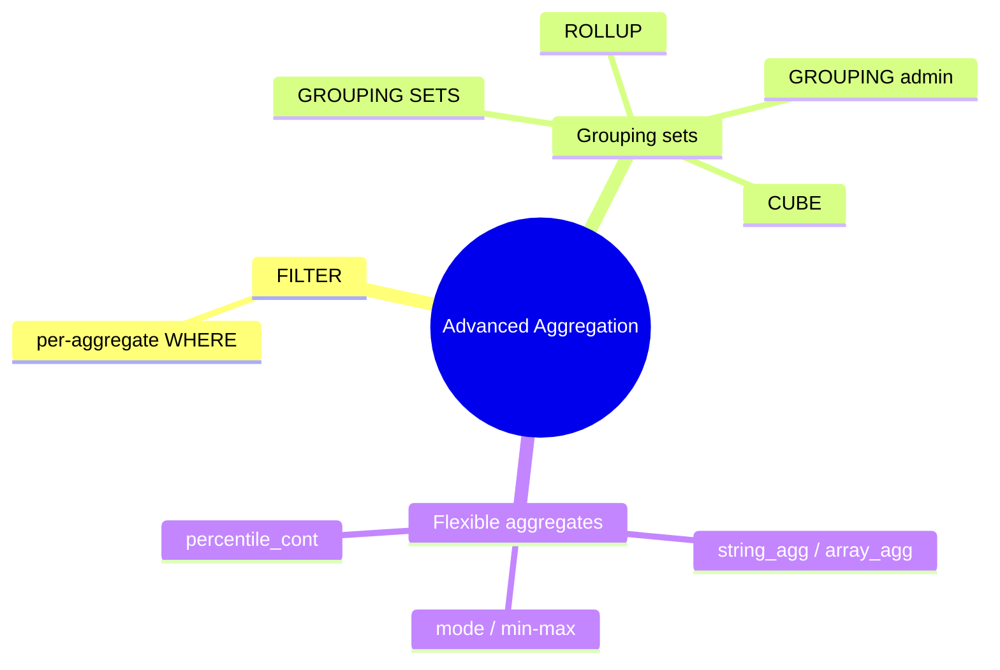

# Module 05: Advanced Aggregation — Filters, Sets, Cubes

Est. study time: 1.1h
Language: en
Description: FILTER clauses, GROUPING SETS / ROLLUP / CUBE, and the aggregates that build strings, arrays, and percentiles.

## Knowledge Map



---

## Learning Objectives (maps to course CILOs)
- Write FILTER aggregates to compute several sub-totals in one pass — CILO 1
- Use GROUPING SETS / ROLLUP / CUBE for multi-level reporting — CILO 1
- Distinguish which aggregate the planner materializes vs pushes down — CILO 3

---

## Real-World Example

Monthly sales report. You need per-region totals, per-product totals, hidden across 8 regions x 20 products, plus a company grand total. Naive approach: run multiple queries and merge in app code — N round trips, inconsistent snapshots.

`GROUPING SETS` says it in one query: one pass, one transaction, labeled rows.

```sql
SELECT region, product, sum(amount)
FROM sales
GROUP BY GROUPING SETS ((region), (product), ());
```

The `()` clause means "grand total". ROLLUP gives you the classic drill-down:

```sql
SELECT region, product, sum(amount) FROM sales
GROUP BY ROLLUP (region, product);
```

— subtotal per region, subtotal per product inside region, overall total, in one result set, `NULL` marking the "total" rows.

> **Think**: The grouped rows use NULL for the rolled-up dimension. How do you tell a real NULL value from a subtotal marker?
>
> *Answer: `GROUPING(col)` returns 1 when that column is part of the rolled-up (absent) group, 0 otherwise — use it to label subtotal rows without ambiguity.*

---

## Core Content

### FILTER: one aggregate, many criteria

`FILTER (WHERE cond)` puts a WHERE onto a single aggregate call, so one SELECT computes several aggregates under different conditions in one scan:

```sql
SELECT customer_id,
       sum(amount)                          AS all_orders,
       sum(amount) FILTER (WHERE status='paid') AS paid,
       count(*) FILTER (WHERE status='open')    AS open
FROM orders
GROUP BY customer_id;
```

No CASE inside the aggregate needed; FILTER is clearer and the planner folds it into the same aggregation pass.

> **Cloze**: "To count only open invoices in the same query that counts all invoices, use `count() {FILTER} (WHERE status = 'open')`."
>
> *Answer: FILTER*

### GROUPING SETS, ROLLUP, CUBE

- `GROUP BY GROUPING SETS ((a,b),(a),())` — explicit clubs
- `ROLLUP (a,b)` — a+b, then a, then grand total (a well-known drill-down)
- `CUBE (a,b)` — every combination of dimensions: a, b, a+b, grand total

Pick ROLLUP for hierarchy-style totals, CUBE for full cross-tab, GROUPING SETS for arbitrary mixes. The planner materializes these as grouped streams — usually one aggregation pass with combination keys, so "more grouping dimensions" does not launch N queries.

> **Think**: CUBE(a,b) generates how many grouping levels vs ROLLUP(a,b)?
>
> *Answer: CUBE: 4 total combinations including the grand total. ROLLUP: 3, following the column order. NULLs mark the collapsed dimension in both.*

### Admin: GROUPING()

`GROUPING(col)` = 1 if the row's `col` is a subtotal placeholder (rolled up), 0 if real. Example labeling:

```sql
SELECT region, product, sum(amount),
       CASE WHEN GROUPING(region)=1 THEN 'REGION TOTAL'
            WHEN GROUPING(product)=1 THEN 'PRODUCT TOTAL'
            ELSE 'detail' END AS level_plain
FROM sales
GROUP BY ROLLUP (region, product);
```

Standard pattern for reporting columns named "All regions" instead of NULL.

> **Predict**: `GROUP BY ROLLUP (region, product)` with a row that has region='EU', product=NULL. GROUPING(product)=?
>
> *Answer: 1 — the product slot is a rolled-up subtotal marker, not a real NULL product. GROUPING disambiguates.*

### Aggregates that build richer outputs

- `string_agg(x, ',')` — join values into CSV-ish strings
- `array_agg(x ORDER BY t)` — build an array (with ordering!)
- `percentile_cont(0.5) WITHIN GROUP (ORDER BY x)` — median/quantiles (continuous, interpolates)
- `mode() WITHIN GROUP (ORDER BY x)` — most common value

`WITHIN GROUP` variants are ordered-set aggregates: they need the sort and read the whole partition — the sort cost shows in EXPLAIN as a Sort feeding the Aggregate.

> **Spot the Mistake**:
> `SELECT sum(amount) FILTER (WHERE region='EU') FROM sales WHERE region='AP';`
>
> What's wrong?
>
> *Answer: The outer WHERE already removed AP rows; only EU rows reach the aggregate, so FILTER is pointless here. FILTER earns its keep when rows for DIFFERENT aggregates must coexist in the same scan — put the filter on the aggregate, not the query.*

---

## Key Takeaways
- FILTER attaches a per-aggregate condition, enabling many sub-totals in one pass
- GROUPING SETS / ROLLUP / CUBE flatten multi-level reporting into one query
- GROUPING() distinguishes real NULL from subtotal markers
- string_agg / array_agg / percentile_cont / mode build rich outputs inside GROUP BY
- ordered-set aggregates (percentile) add a Sort; watch it in EXPLAIN

---

## Common Misconception

**"GROUP BY ROLLUP needs a subquery and a UNION to get the totals."** Wrong in one belief: since Postgres 9.5 GROUPING SETS and friends are native — totals, subtotals, and detail come from ONE GROUP BY node. No UNION, one snapshot.

---

## Spot the Mistake

```sql
SELECT group_id, percentile_cont(0.5) WITHIN GROUP (ORDER BY x)
FROM samples GROUP BY group_id;
```

Seen in EXPLAIN: an extra Sort under Aggregate. The developer says "GROUP BY already sorts". What's wrong?

*Answer: GROUP BY does NOT guarantee sort order, and percentile_cont needs its own WITHIN GROUP ordering — the planner adds an explicit Sort for the quantile computation. Keep an index on (group_id, x) so that Sort disappears.*

---

## Feynman Explain
(Teach a child: "Aggregation is like a class petting zoo. GROUPING SETS asks 'how many paws per animal type? how many tails per color? total animals?' all with the same counting sheet. FILTER is a rule like 'only count cats when they are purring.' percentile says 'find the middle in the sorted line.'")

---

## Reframe
(Decide: GROUPING SETS vs several app-side queries. The trade of a wide flattened result (thousands of stub rows) vs imperative loops. Where is a single big aggregation query better, where is it a trap (giant intermediate, unclear stub labeling)? Should reporting queries stay in SQL or move to a warehouse tier? Form your opinion.)

---

## Drill
Run: `learn.sh quiz postgres-sql 05-advanced-aggregation`