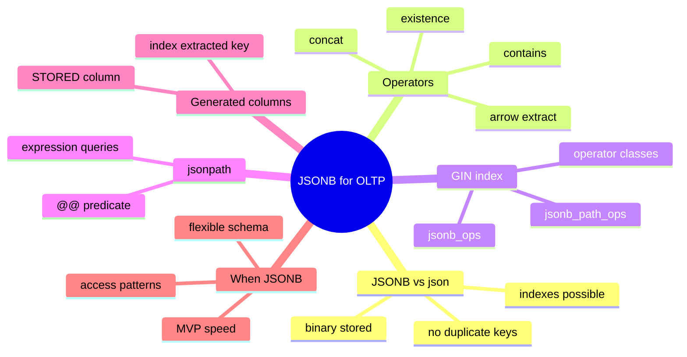
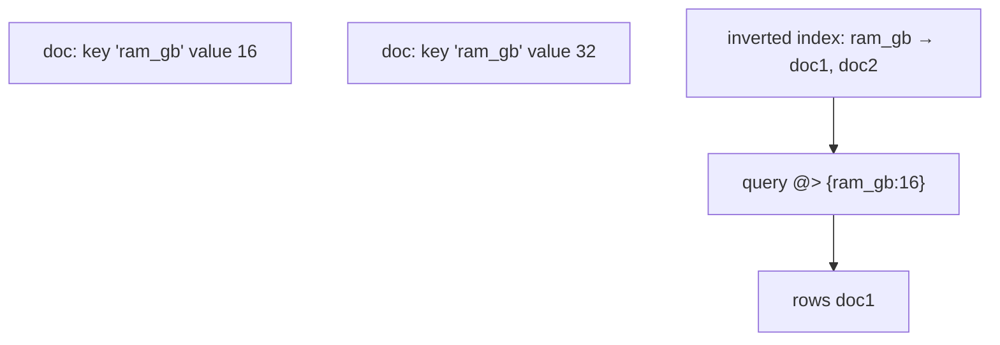
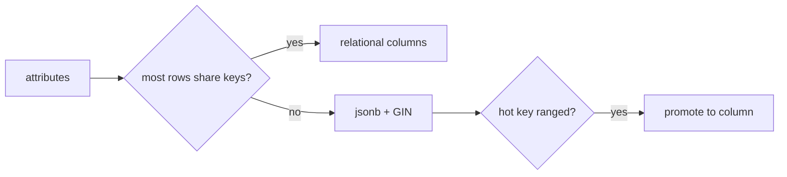

# Module 06: JSONB for OLTP: Query and Index It

Est. study time: 1.4h
Language: en
Description: JSONB for OLTP: the operators that matter, GIN indexing, jsonpath, generated columns, and when a document column beats a relational table.

## Knowledge Map



---

## Learning Objectives (maps to course CILOs)
- Query JSONB with the arrow, contains, and existence operators without casting — CILO 1
- Index JSONB lookups with the right GIN operator class — CILO 4
- Filter rows with `jsonpath` `@@` and `@?` expressions — CILO 1
- Extract hot keys into generated columns so indexes scan normally — CILO 4
- Decide when JSONB beats a relational table, and when it loses — CILO 4

---

## Real-World Example

Your checkout service stores product attributes in a JSONB column. One product is a t-shirt (color, size), another is a laptop (ram_gb, storage). A product manager asks: how fast can you answer "all laptops under $900 with a thunderbolt port" and "all products that have the color blue"? You reach for `->>` on JSONB — and the query runs a full scan every time, slowing as the catalog grows.

The gap: JSONB stores the data, but it stays fast only when the index and the query operators line up. That alignment — not the column itself — is the whole module.

> **Think**: Why can't a plain B-tree index serve `WHERE attrs ->> 'price' = '899'` well?
>
> *Answer: A B-tree needs the value to be a real column. With JSONB the key lives inside one opaque document, so the planner cannot range-scan it; without a GIN index, every row must be decoded to check the predicate.*

---

## Core Content

### JSONB vs json

Postgres has `json` and `jsonb` types. `json` stores the exact text you gave it; `jsonb` parses, deduplicates keys, sorts them, and stores a binary tree. Always use `jsonb` when you are going to query inside the column:

- `jsonb` supports indexes; `json` does not.
- `jsonb` removes duplicate keys (keeps the last); `json` keeps text verbatim.
- `jsonb` preserves the input order of arrays, but key order is not preserved.

Conversion is usually free for inserts: `col_jsonb::jsonb`.

> **Cloze**: "For querying inside a document, use the {jsonb} type, because it is the only one that supports {indexes}(GIN) and deduplicates keys."
>
> *Answer: jsonb; indexes*

### The Operators That Matter

On a `jsonb` column `attrs`, the four operators you will use daily:

| Operator | Meaning | Example | Returns |
|---|---|---|---|
| `->` | get value, keep type | `attrs -> 'price'` | jsonb (or jsonb null) |
| `->>` | get value as text | `attrs ->> 'price'` | text |
| `#>` | path, keep type | `attrs #> '{a, b}'` | jsonb |
| `#>>` | path as text | `attrs #>> '{a, 0}'` | text |
| `@>` | left contains right | `attrs @> '{"ram_gb": 16}'` | bool |
| `?` | key exists | `attrs ? 'thunderbolt'` | bool |
| `?|` | any of keys exist | `attrs ?\| array['a','b']` | bool |
| `?&` | all keys exist | `attrs ?& array['a','b']` | bool |
| `\|\|` | merge documents | `attrs \|\| '{"in_stock": true}'` | jsonb |

Two confirmation patterns appear constantly:

```sql
-- key exists AND its value equals
SELECT * FROM products
WHERE attrs ? 'thunderbolt' AND attrs ->> 'ram_gb' = '16';

-- nested containment: exact structure must match
SELECT * FROM products
WHERE attrs @> '{"specs": {"ram_gb": 16}}';
```

> **Think**: `attrs @> '{"color": "blue"}'` matches a laptop whose specs live under a nested key correctly — but would it match `specs.color`? 
>
> *Answer: No. `@>` is strict containment — the target structure must appear exactly, with keys nested the same way. Nesting differences are a classic silent miss.*

> **Spot the Mistake**: Novice: "I compared with `=` on `attrs ->> 'price'` and got '9' not matching 9 — JSONB is broken."
>
> *Answer: `->>` returns text, so `'9' = '9'` in string rules, but `'9' = 9` would break without one side cast. Always cast: `(attrs ->> 'price')::numeric = 9`.*

### GIN Index on jsonb

A GIN (Generalized Inverted) index inverts each document: it lists, per key and per value, which rows contain it. Postgres ships two operator classes:

| Class | Indexes | Supports | Notes |
|---|---|---|---|
| `jsonb_ops` (default) | keys + values + key/value pairs | `?` `?|` `?&` `@>` `@@` `@?` | larger; check `?` works |
| `jsonb_path_ops` | whole paths only | `@>` `@@` `@?` | ~40% smaller, faster `@>`; no `?` |

```sql
CREATE INDEX products_attrs_gin ON products USING gin (attrs);            -- jsonb_ops
CREATE INDEX products_attrs_path ON products USING gin (attrs jsonb_path_ops); -- containment
```

The `@>` containment query earlier benefits from either class; the `? 'thunderbolt'` existence check requires the default `jsonb_ops` class.



> **Predict**: A query filters `attrs ->> 'price' < '100'`. Will the GIN index help?
>
> *Answer: No. GIN is good at membership and containment, not range comparisons. A range filter needs to find the small set of rows whose price is low — GIN can't produce that ordering. Use an extracted numeric column with a normal B-tree index instead.*

### jsonpath: `@@` and `@?`

`jsonpath` (PG12+) is a query language inside the engine: `attrs @@ '$.price < 100'` means "docs where the price path is less than 100". Key differences:

- `@@` — predicate returns true/false, usable in WHERE and indexable by GIN
- `@?` — "does any item match the pattern", returns true if any element matches

```sql
-- range-like predicates on paths (numeric compare, no text cast needed)
SELECT id, attrs ->> 'price' AS price
FROM products
WHERE attrs @@ '$.price < 100 AND $.in_stock == true';

-- check whether any element of an array path matches
SELECT id FROM products
WHERE attrs @? '$.colors[*] ? (@ == "blue")';
```

The `? (@ == ...)` filter clause inside jsonpath is where it gets expressive: `$.specs ? (@.ram_gb >= 16)`.

> **Predict**: Which of `@@` and `@?` fits "an array of screenshots, at least one is marked primary"?
>
> *Answer: `@?`, because you need "any element matches", not an all-document predicate. `@@` would require the whole document to satisfy the path expression.*

### Generated Columns for Hot Keys

A JSONB extract on every query is waste when one key is hot. Two options:

- **STORED generated column** (PG12+): materialized on write, can be indexed with a normal B-tree. Includes the column `INCLUDE` in an index to get index-only scans.
- **VIRTUAL generated column** — default behavior in PG18+, computed on read, no stored copy.

```sql
ALTER TABLE products
  ADD COLUMN price_num numeric GENERATED ALWAYS AS ((attrs ->> 'price')::numeric) STORED;

CREATE INDEX idx_products_price ON products (price_num);
```

Now `WHERE price_num BETWEEN 90 AND 120` is a plain B-tree range scan; stats (histograms on price_num) feed the planner too. This is the most common JSONB-vs-relational bridge: keep documents for flexibility, promote the hot key to a real column.

> **Think**: Why does promoting one key to a column help the planner beyond the index?
>
> *Answer: Three wins — B-tree range scan instead of decode-every-row, `ANALYZE` builds a histogram the planner can estimate from, and a covering index can serve the value without touching the heap.*

### When JSONB Over Relational

JSONB wins for: rapidly changing schema, sparse attributes (most rows missing most keys), nested data you read as a blob, MVP delivery speed. It costs: no per-key type safety, no foreign keys inside documents, weak integrity, and query code that is harder for tools to reason about.



Use relational columns when keys are stable, typed, and joined or filtered; use JSONB for the tail of flexible attributes and for storing API payloads you forward unchanged.

---

## Key Takeaways
- `jsonb` is the queryable type; `json` is raw text with no index support
- `->` keeps jsonb, `->>` gives text; cast text values for numeric compares
- GIN with `jsonb_ops` supports existence `?`; `jsonb_path_ops` is smaller but drops `?`
- `@@` is a boolean path predicate; `@?` asks "does any element match"
- Promote hot JSONB keys to generated columns for B-tree range scans and statistics

---

## Common Misconception

**"A GIN index makes every JSONB query fast."** GIN only accelerates membership, containment, and jsonpath predicates — `@>`, `?`, `@@`, `@?`. Not ordering, not grouping, not joins on extracted values. Range filters and `ORDER BY` still need real columns. Check the plan: GIN appears as a `Bitmap Index Scan`, and the operator has to be one GIN supports.

---

## Spot the Mistake

Your ticket: `SELECT ... WHERE attrs @> '{"price": 100}'` returns nothing, even though one row shows `"price": 100` in `attrs`. You added a GIN index and it still misses.

What's wrong?

*Answer: `@>` needs exact structure — the document has `{"price": 100}` nested under `{"bundle": {...}}`, so the flat test fails. Either index `jsonb_path_ops` and test the real path, or use `attrs @@ '$.price == 100'`. Verify with a plain `attrs` dump before building indexes.*

---

## Feynman Explain
(Explain JSONB indexing like a library's back-of-book index: you don't read every book to find "ram_gb: 16" — a reverse index lists word → books, so lookup is instant. Containment is like "this recipe contains exactly eggs and milk"; existence is just "the word eggs appears". No jargon.)

---

## Reframe
(Pause. Judge *GIN vs extracting columns*. GIN keeps code one place but is weak for ranges. Extracting columns is fast and typed but duplicates the schema — every changed JSONB key needs a migration. When does extraction stop paying? Think: 20 hot keys, each needing its own column + index + stats. Is JSONB still saving you anything, or did you rebuild the relational model by hand? What would you keep instead?)

---

## Drill
Take the quiz. MCQs test different angles — recall, application, scenario.

Run: `learn.sh quiz postgres-sql 06-jsonb-for-oltp`