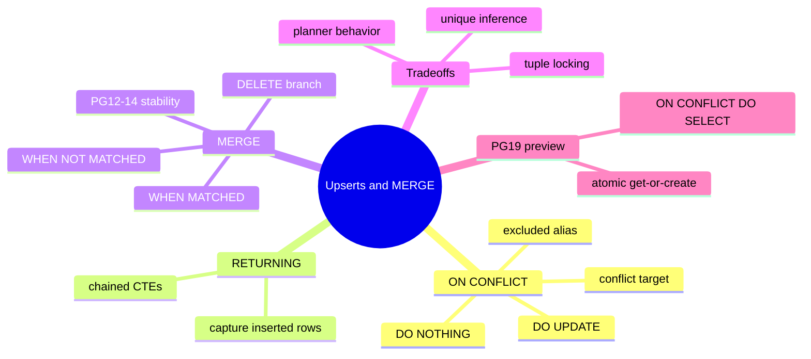
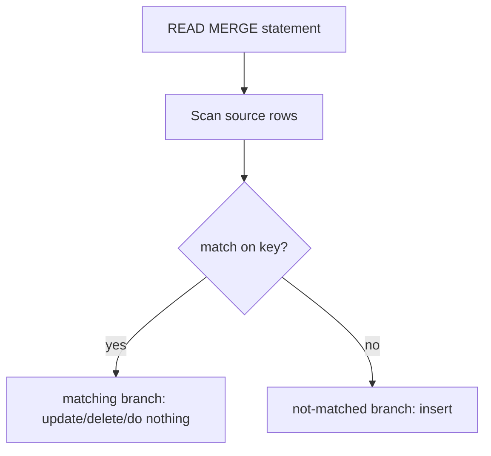

# Module 07: Upserts: ON CONFLICT and MERGE (PG15-18)

Est. study time: 1.5h
Language: en
Description: Upserts done right: ON CONFLICT, the MERGE statement across PG15-18, RETURNING, and the tradeoffs between them — plus a PG19 preview of atomic get-or-create.

## Knowledge Map



---

## Learning Objectives (maps to course CILOs)
- Write idempotent `INSERT ... ON CONFLICT` upserts with graceful conflict targets — CILO 2
- Use `RETURNING` to capture affected rows and chain data-modifying CTEs — CILO 1
- Build row synchronization with `MERGE` across insert, update, and delete branches — CILO 2
- Compare `ON CONFLICT` vs `MERGE`: locking, inference, and planner semantics — CILO 2
- Describe the `ON CONFLICT DO SELECT` get-or-create pattern in PG19 — CILO 2

---

## Real-World Example

A nightly import ingests 1M Shopify orders. Half already exist; the other half must insert. Your first attempt deletes the whole table and re-inserts — every night the storefront sees a gap, and order IDs reset. You switch to "check-then-insert" in an app loop, and now a race condition double-inserts when two workers run the import at once.

The fix is a single atomic statement: let the database decide insert-vs-update under a lock, so concurrent workers cannot double-create and downtime disappears.

> **Think**: Why is "SELECT then INSERT" in application code a race condition, and what makes `ON CONFLICT` safe?
>
> *Answer: Between your SELECT and INSERT another session can insert the same key; ON CONFLICT moves the decision into one guarded statement, where the unique index arbitrates under the row lock.*

---

## Core Content

### INSERT ... ON CONFLICT

The workhorse upsert: try to insert; if a **unique or exclusion constraint** would be violated, act on the existing row instead.

```sql
INSERT INTO products (sku, price, updated_at)
VALUES ('TS-100', 19.99, now())
ON CONFLICT (sku) DO UPDATE
SET price = excluded.price,
    updated_at = excluded.updated_at;
```

Key facts:

- The conflict target `(sku)` names the unique column or constraint; omit it to catch any violation, but then `DO UPDATE` is not allowed.
- `excluded` is the alias for the row that *would* have been inserted — the new values.
- You cannot update the target column itself (`SET sku = excluded.sku` is an error).
- `ON CONFLICT DO NOTHING` is the "insert if absent, else ignore" variant — ideal for logs and counters.

```sql
INSERT INTO events (id, payload) VALUES (gen_random_uuid(), $1)
ON CONFLICT DO NOTHING;
```

> **Cloze**: "In `ON CONFLICT DO UPDATE`, the alias `{excluded}` refers to the row that would have been inserted, and the conflict column itself cannot be {updated}."
>
> *Answer: excluded; updated*

> **Think**: What happens if a unique index does not exist on the conflict target column when you run the query?
>
> *Answer: The statement errors — E.g. \"there is no unique or exclusion constraint matching the ON CONFLICT specification\". You must name a real constraint. This is why the target is usually the primary key or an explicit unique index.*

### RETURNING: Capture What Changed

`RETURNING` gives back the row actually written — the inserted row on the insert path, the updated row on the update path. This is how you do an atomic "get or create": one round trip, no interim read.

```sql
INSERT INTO accounts (email, balance) VALUES ('a@x.com', 0)
ON CONFLICT (email) DO UPDATE SET email = accounts.email
RETURNING id;
```

Data-modifying CTEs chain on this: insert a parent, return its id, insert children under it — all in one statement and one transaction.

```sql
WITH inv AS (
  INSERT INTO invoices (customer_id, total) VALUES (42, 100)
  ON CONFLICT DO NOTHING
  RETURNING id
)
INSERT INTO invoice_lines (invoice_id, qty)
SELECT id, 3 FROM inv RETURNING *;
```

> **Predict**: After an `ON CONFLICT DO NOTHING`, does `RETURNING` return a row when the conflict fired?
>
> *Answer: No. `RETURNING` returns the rows actually inserted. If the conflict path ignored the row, nothing is returned — a clean signal for \"already exists\", usable in logic gates inside a CTE chain.*

### The MERGE Statement (PG15+, hardened in 17-18)

`MERGE` is the general row-sync statement with three branches. PG15 shipped source-row semantics; FROM PG17 it gained `RETURNING`, and in PG18 the core implementation was rewritten (replacing an earlier page-insert approach).

```sql
MERGE INTO products p
USING staging s ON p.sku = s.sku
WHEN MATCHED AND s.action = 'update' THEN
  UPDATE SET price = s.price, updated_at = now()
WHEN MATCHED AND s.action = 'delete' THEN
  DELETE
WHEN NOT MATCHED THEN
  INSERT (sku, price) VALUES (s.sku, s.price);
```

- `USING` source can be a table, view, or subquery.
- Branches run `WHEN MATCHED` / `WHEN NOT MATCHED`, optional extra boolean conditions, `THEN UPDATE|DELETE|INSERT|DO NOTHING`.
- The merge key needs a unique constraint on the source join column too, or PG will lock entire partitions — this is the classic POST-18 fix buffer trap.



> **Predict**: For a pure "insert new, overwrite existing" workload, which is shorter to write and which is more flexible?
>
> *Answer: `ON CONFLICT DO UPDATE` is shorter; `MERGE` handles delete-on-no-match plus separate insert and update logic in one statement. Match is flexible, upsert is compact.*

### MERGE vs ON CONFLICT: The Tradeoffs

| Aspect | ON CONFLICT | MERGE |
|---|---|---|
| Locking | locks only the conflicting target row | source-compatible locking; can lock more rows |
| Unique inference | must name a real constraint, planner uses it | join on any expressible condition; still needs strong uniqueness for safety |
| Branches | insert or update only | insert, update, delete, do nothing |
| RETURNING | since 9.5 | since PG17 |
| SOURCE matching | single inserted row vs the table | full source join, subqueries, transforms |
| Read-only source | no | merges propagate row locks even without writes (TOCTOU check) |

Rule of thumb: a simple "insert else update this one row" is `ON CONFLICT`. You need `MERGE` when the source is a join whose outcome depends on more than key presence — e.g. dimensions, SCD-2 checks, or delete-on-absence.

> **Spot the Mistake**: Novice: "MERGE is just a newer synonym for upsert — I'll rewrite every upsert as MERGE."
>
> *Answer: The two lock and plan differently. MERGE takes both source and target into account under one snapshot and can lock rows it does not change; simple per-row idempotency wants ON CONFLICT. Rewriting every upsert as MERGE risks extra lock contention, not fewer surprises.*

### PG19 Preview: ON CONFLICT DO SELECT

Postgres 19 adds `INSERT ... ON CONFLICT DO SELECT` — the atomic **get-or-create** that returns the existing row without writing a dead version. It is roughly 4x faster than the classic no-op `DO UPDATE` trick (which writes a row and needs vacuum to clean it later).

```sql
INSERT INTO sessions (token, user_id)
VALUES ($1, $2)
ON CONFLICT (token) DO SELECT * FROM sessions WHERE token = $1;
```

> **Think**: Why is `DO SELECT` better than `DO UPDATE ... RETURNING` for get-or-create?
>
> *Answer: DO UPDATE writes a new row version even when nothing changed, creating a dead tuple for vacuum. DO SELECT returns the existing row untouched — fewer writes, less bloat, and the atomicity of an upsert with none of the side effects.*

---

## Key Takeaways
- `ON CONFLICT` turns a possibly-violating insert into an atomic insert-or-update-or-ignore
- `excluded` is the would-be inserted row; the conflict column cannot be updated
- `RETURNING` captures the row actually written and powers get-or-create and CTE chaining
- `MERGE` handles insert/update/delete/do-nothing with a join source; lock scope is wider than upsert
- PG19 `DO SELECT` is the fast atomic get-or-create — read, don't write dead copies

---

## Common Misconception

**"ON CONFLICT needs no unique constraint as long as the column is a primary key."** Any unique or exclusion constraint qualifies — primary key works, but so do `UNIQUE` columns and `EXCLUDE` (e.g. overlapping ranges). And without a constraint there, the statement fails at runtime, not silently. The constraint IS the arbitration mechanism; never "upsert" against a column with no uniqueness.

---

## Spot the Mistake

Your retry loop: every failed upsert makes the app sleep 100ms and re-run the whole 10-INSERT batch. Reviewers say that's "fine" and add more retries.

What's wrong?

*Answer: An upsert is already single-statement atomic and conflict-safe; retrying the batch because one conflict fired multiplies the writes and re-locks rows. Instead run per-row upserts (or one MERGE) and let the conflict logic absorb duplicates; keep retries only for genuine deadlocks or serialization failures with a rubber-band backoff.*

---

## Feynman Explain
(Explain "upsert exists once you name the no-dup rule" to a checkout clerk. A register scans a barcode; if the item is already on the receipt it updates the count, otherwise it adds a line. "Excluded" is like the barcode just scanned, different from the line already printed. No jargon.)

---

## Reframe
(Pause. Judge *MERGE's source locking*. The statement is powerful, but it locks every source row that matches — even branches that `DO NOTHING`. For a hot dimension table, is MERGE worth the lock breadth over two tiny statements? Think: four million source rows each night, 90% unchanged. Would you prefer MERGE or a filtered upsert? Why?)

---

## Drill
Take the quiz. MCQs test different angles — recall, application, scenario.

Run: `learn.sh quiz postgres-sql 07-upserts-merge`