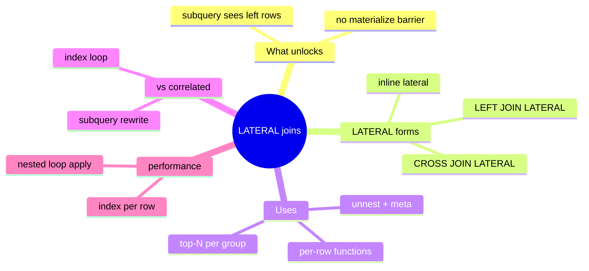
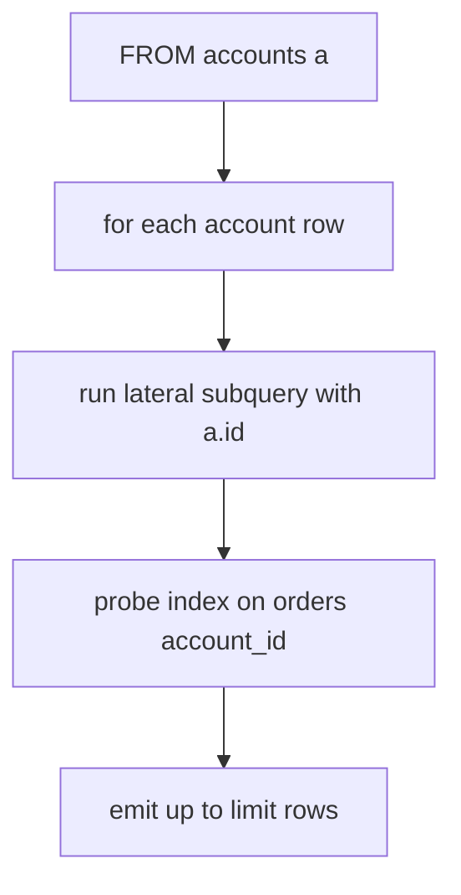
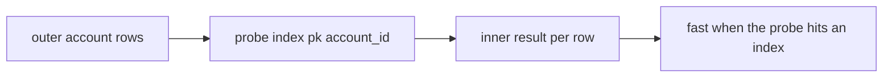

# Module 08: LATERAL: Row-by-Row Subqueries and Correlated Setups

Est. study time: 1.3h
Language: en
Description: LATERAL: row-by-row subqueries that reference earlier FROM items, correlated setups, unnest, and per-row function evaluation.

## Knowledge Map



---

## Learning Objectives (maps to course CILOs)
- Write `LATERAL` subqueries that reference earlier items in the same FROM list — CILO 1
- Distinguish `LATERAL` from a plain subquery and from a correlated subquery — CILO 1
- Build top-N-per-group and row-spreading queries with `CROSS JOIN LATERAL unnest` — CILO 1
- Explain why `LATERAL` is a forced nested-loop, and how indexes make it fast — CILO 3
- Combine `LEFT JOIN LATERAL` with an `ON true` default for missing rows — CILO 1

---

## Real-World Example

Your support dashboard shows, for every account, the latest 5 orders — the classic "top-N per group". You write one query with `ROW_NUMBER()` over each account... but the result is thousands of window rows you then have to re-group and slice, and with 10k accounts the window sort eats the fast path.

The smarter route: walk the accounts, and for *each* account run a tiny indexed "last 5 orders" lookup. `LATERAL` is exactly that — a subquery that can see the current row of the table to its left and runs once per row.

> **Think**: An ordinary `LEFT JOIN (SELECT ... ) x ON ...` subquery cannot see the outer table. What does LATERAL add to the FROM clause?
>
> *Answer: It lets the subquery reference earlier FROM items by name, turning what looks like a static derived table into a per-row probe. Without LATERAL the derived table is computed independently, once.*

---

## Core Content

### What LATERAL Unlocks

`LATERAL` makes the subquery (or function) on its right depend on rows on its left. Postgres evaluates it as a **nested loop**: for each incoming row, run the lateral expr.

```sql
SELECT a.name, r.*
FROM accounts a
CROSS JOIN LATERAL (
  SELECT order_date, total
  FROM orders o
  WHERE o.account_id = a.id
  ORDER BY o.order_date DESC
  LIMIT 5
) r;
```

Semantics: `a` is the outer row; the subquery sees `a.id`. Result: one output row per (account, returned order) pair — exactly 5 latest per account (or fewer if short).

> **Cloze**: "In a LATERAL subquery, the inner query can reference the {outer} row of the FROM item to its {left}, so Postgres runs it once {per} outer row."
>
> *Answer: outer; left; per*

> **Think**: Why must there be an item to the *left* that the lateral references? 
>
> *Answer: A LATERAL subquery with no outer reference degrades to a plain derived table — fine, but you get no benefit. The pattern only pays when the inner query filters by `outer.id` and an index serves that lookup.*

### LATERAL vs Plain Subquery vs Correlated

| Form | Inner query sees outer? | Runs |
|---|---|---|
| Derived table `FROM (SELECT ...) x` | no | once, materialized/decided by planner |
| `WHERE ... IN (SELECT ...)` correlated | sometimes, via subplan | once per row (via subplan) |
| `CROSS JOIN LATERAL ( ... )` | yes, by design | once per row, in a nested loop |
| `LEFT JOIN LATERAL ( ... ) ON true` | yes | per row, keeps unmatched with NULLs |

The planner may rewrite ordinary subqueries as joins or keep subplans; LATERAL makes the nested-loop shape explicit and forces per-row evaluation — which is right when the inner lookup is cheap and indexed.



> **Predict**: Will `LEFT JOIN LATERAL (...) ON true` change the number of outer rows?
>
> *Answer: No — LEFT keeps every outer row; if the lateral returns nothing, the join emits the outer row with NULLs for the lateral columns. ON true is required to force an unconditional left join.*

### Top-N per Group, Cleanly

This is LATERAL's marquee win. The inner query orders by date and takes a small `LIMIT`, ideally served by an index on `(account_id, order_date DESC)`:

```sql
SELECT a.name, r.order_date, r.total
FROM accounts a
LEFT JOIN LATERAL (
  SELECT order_date, total
  FROM orders o
  WHERE o.account_id = a.id
  ORDER BY order_date DESC
  LIMIT 3
) r ON true
ORDER BY a.name;
```

Compare to a window `ROW_NUMBER()` partitioned by account: the window version must sort ALL orders of every account to assign numbers and then filter; LATERAL stops after 3 per account via index order.

> **Think**: When is the window version actually fine, despite the sort?
>
> *Answer: When virtually every account has few orders, so the sort is small, or when you also need all rows (not just top-N). Ranking gives every row a rank; LATERAL with LIMIT is a cutoff.*

### unnest and Row Spreading

`LATERAL` pairs naturally with `unnest` to spread array/jsonb elements into rows — and to compute per-element metadata with the parent row in scope:

```sql
SELECT u.id, e.*
FROM users u,
     LATERAL unnest(u.tags) WITH ORDINALITY AS e(tag, n)
ORDER BY u.id, e.n;

SELECT o.id, d.price
FROM orders o,
     LATERAL jsonb_array_elements(o.items) AS d
WHERE d.price > 50;
```

`WITH ORDINALITY` appends a position column so you can reconstruct order — a JSONB/array-to-rows pattern that ordinary joins cannot express without unnesting to a derived table first.

> **Cloze**: "`unnest` inside a LATERAL join spreads array elements into {rows}; adding `WITH ORDINALITY` adds a {position} column."
>
> *Answer: rows; position*

### Per-Row Function Calls

LATERAL also injects per-row scalars from heavier functions without duplicating calls in SELECT and GROUP BY:

```sql
SELECT a.id, r.geo
FROM placements a
LEFT JOIN LATERAL geo_lookup(a.lat, a.lng) AS r(geo) ON true;
```

The function is evaluated once per outer row, and its result is available for later expressions and even WHERE-level reuse via the join alias.

> **Predict**: If the lateral function returns zero rows for some placements, what do you see with LEFT JOIN LATERAL vs CROSS JOIN LATERAL?
>
> *Answer: LEFT keeps the placement row with NULL geo; CROSS drops it entirely. Choose LEFT when missing results should be visible as NULL, CROSS when they are unwanted noise.*

### Performance: Forced Nested-Loop Apply

LATERAL runs an inner probe per outer row — an **apply**. Cost = outer_rows x inner_cost. Two hard rules:

1. The inner query MUST be index-backed: `(account_id, order_date)` etc. Without an index, every row scans the whole inner table → O(outer × inner).
2. Outer selectivity matters: fetch 10 accounts → 10 cheap probes; fetch 1M accounts → 1M probes, each still small if indexed.



> **Spot the Mistake**: Novice: "I rewrote the top-N with LATERAL and it got slower — LATERAL is broken."
>
> *Answer: The lateral probe has no index on (account_id, order_date): each of the 10k accounts triggered a full scan of the orders table. Fix is the composite index, not abandoning LATERAL. Measure with EXPLAIN: if you see Seq Scan inside the loop, the index is missing.*

---

## Key Takeaways
- LATERAL lets an inner query reference the outer row to its left → per-row evaluation
- It is the clean way to do top-N-per-group with a LIMIT probe
- `CROSS JOIN LATERAL` drops non-matching rows; `LEFT JOIN LATERAL ... ON true` keeps them NULL
- `unnest ... WITH ORDINALITY` spreads arrays with positional order — great for jsonb-heavy rows
- Never LATERAL without an index on the inner probe column path

---

## Common Misconception

**"LATERAL is magically faster than a subquery."** It is not a speed-up on its own; it *forces* a nested loop. Fast LATERAL requires the inner probe to hit an index. Against large unindexed inner tables it can be far slower than a hash-based approach the planner picks on its own. Judge by the plan, not by syntax.

---

## Spot the Mistake

A dev converts every `ORDER BY ... LIMIT` subquery to LATERAL, then complains a 5M-order table makes the whole report hang.

What's wrong?

*Answer: inner probe has no useful index; each LATERAL iteration full-scans. Add `(account_id, order_date DESC)` composite index, confirm Bitmap or Index Scan per iteration in EXPLAIN. Only then judge whether LATERAL was the right shape; without the index any form loses.*

---

## Feynman Explain
(Explain top-N-per-group to a shopkeeper. One list = every customer; for each customer on the list, ask a clerk "show our most recent 3 sales to them" — the clerk checks a card that lists that customer's sales in newest-first (that is the index). Doing it for every customer is LATERAL. No jargon.)

---

## Reframe
(Pause. Judge *forced nested loop*. LATERAL is explicit about being O(outer × inner). The planner may have found a smarter global plan (hash join + window) with better big-Oh for large datasets. When does explicitness beat planner flexibility? Think: 10 accounts vs 10 million, indexed vs not. Would you ever prefer LATERAL over a window query, and when exactly?)

---

## Drill
Take the quiz. MCQs test different angles — recall, application, scenario.

Run: `learn.sh quiz postgres-sql 08-lateral`