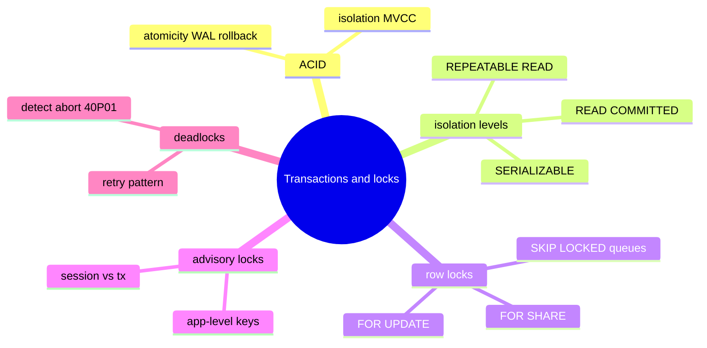

# Module 09: Transactions, Locking, and Concurrency for OLTP

Est. study time: 1.3h
Language: en
Description: Transactions, isolation levels, MVCC visibility, row locks, SKIP LOCKED job queues, advisory locks, deadlocks and retry.

## Knowledge Map



---

## Learning Objectives (maps to course CILOs)
- Explain where each ACID property comes from in Postgres (WAL, MVCC, constraints) — CILO 5
- Distinguish per-statement snapshots (READ COMMITTED) from per-transaction snapshots (REPEATABLE READ) and SSI (SERIALIZABLE) — CILO 5
- Predict who blocks whom: plain SELECT vs FOR UPDATE vs writes under MVCC — CILO 5
- Build a safe claim-a-row job queue with `FOR UPDATE SKIP LOCKED` — CILO 5
- Choose row locks versus advisory locks for the job at hand — CILO 5
- Handle deadlock and serialization failures with a correct retry pattern — CILO 5

---

## Real-World Example

Two worker processes run your overnight billing job. Both fling the same query to pick pending invoices. Without locks both grab invoice 42, crunch it, and you bill the customer twice. Later, two admins update the same account row at once and one session dies with `ERROR: deadlock detected`.

Both bugs trace to the same missing skill: knowing *who waits for whom*, and when the database aborts you for safety. This module builds that mental model.

> **Think**: `SELECT` never blocks `UPDATE`, and `UPDATE` never blocks `SELECT`. How can that be true when rows are locked?
>
> *Answer: Write locks exist, but readers do not read the live row — they read their snapshot. A reader never needs the lock, because it works from an older copy (the MVCC version) that the writer cannot change.*

---

## Core Content

### Where ACID Comes From

| Property | Postgres mechanism |
|---|---|
| **Atomicity** | Changes heap + WAL records. Crash → replay WAL forward, or UNDO hot-backward on abort. All or nothing per transaction |
| **Consistency** | Your code + constraints (CHECK, FK, UNIQUE). DB does not invent it |
| **Isolation** | MVCC snapshots + row locks |
| **Durability** | `fsync` of WAL before COMMIT replies (configurable via `synchronous_commit`) |

"Consistency" is the one you provide: no isolation level fixes violations your app wrote. Confusingly, SQL calls *consistency* "the C in ACID has nothing for the DB to enforce by itself".

> **Think**: If a transaction aborts, how does Postgres make sure readers never saw its half-written rows?
>
> *Answer: A new row version carries xmin = the aborted transaction id, so negative snapshots (which must not include aborted txs) simply treat it as invisible. Aborted rows are dead on arrival and VACUUM reclaims them.*

### Isolation Levels

`SHOW default_transaction_isolation;` → `read committed` is the default.

| Level | Snapshot scope | Extra promise |
|---|---|---|
| READ COMMITTED | New snapshot each statement | Sees latest committed rows per statement |
| REPEATABLE READ | One snapshot for whole tx | Same rows viewed the whole tx; but two concurrent txs may still create false conflict on first-writer-wins |
| SERIALIZABLE | One snapshot + SSI | Aborts one of two truly racing txs with `40001` so the outcome equals some serial order |

READ UNCOMMITTED exists only for SQL-standard syntax; in Postgres it behaves exactly like READ COMMITTED.

> **Think**: A long-running TX in READ COMMITTED does `SELECT balance` three times. Another TX commits a raise in between. Do the three SELECTs agree?
>
> *Answer: No — each statement takes a fresh snapshot, so you may collect three different balances. Only REPEATABLE READ guarantees one stable view for the whole transaction (at the cost of first-writer-wins aborts).*

### Row Locks: Locking Reads

`SELECT ... FOR UPDATE` and its weaker siblings lock the returned rows, holding until COMMIT/ROLLBACK:

| Lock type | Blocks | Typical use |
|---|---|---|
| FOR KEY SHARE | KEY UPDATE/DELETE | FK checks |
| FOR SHARE | UPDATE/DELETE | read-then-write guard |
| FOR NO KEY UPDATE | UPDATE, non-key | counters |
| FOR UPDATE | all writes | claim / strict guard |

Other transactions trying the same rows then *wait*, unless they say otherwise (NOWAIT, SKIP LOCKED).

```sql
BEGIN;
SELECT * FROM accounts WHERE id = 42 FOR UPDATE;  -- admins serialize here
UPDATE accounts SET balance = balance - 100 WHERE id = 42;
COMMIT;
```

> **Think**: Why is a lock-then-update in one TRANSACTION required, and not just `UPDATE ... RETURNING`?
>
> *Answer: Two layers. (1) UPDATE alone is safe only if your read truly is the write. (2) If you must read some rows, decide, then write a *different* set of rows, the decision must hold? — get a REPEATABLE READ snapshot. For "read rows, later write *those* rows", a locking read in one transaction is the standard move.*

### SKIP LOCKED: Job Queues That Work

The fair poll pattern: several workers, each wants a *different* unclaimed row, none should block on the others.

```sql
-- called by every worker, autocommit
UPDATE jobs SET status = 'running', worker = pg_backend_pid()
WHERE id = (
  SELECT id FROM jobs
  WHERE status = 'pending'
  ORDER BY priority DESC, id
  LIMIT 1
  FOR UPDATE SKIP LOCKED
)
RETURNING *;
```

Workers that `SELECT ... FOR UPDATE SKIP LOCKED` step over rows another worker just locked, instead of queueing behind them. Combined with a single `UPDATE` that claims by id, the queue stays correct: no two workers ever pick the same row.

> **Think**: Without SKIP LOCKED, what happens when 4 workers poll and 1 job is free?
>
> *Answer: All 4 line up on the same row: the first wins, the other 3 wait, then loop again — the queue degrades to a convoy under load. SKIP LOCKED makes the losers skip and go look for other rows.*

> **Predict**: Worker A locks the only free job (id 7) with `FOR UPDATE SKIP LOCKED` and is now doing slow work. Worker B polls with the same `SKIP LOCKED` query and its `LIMIT 1` has nothing left to claim. Predict: does B block until A finishes, or return zero rows?
>
> *Answer: B returns zero rows immediately. SKIP LOCKED skips locked rows rather than waiting on them, so B's LIMIT 1 finds no free row and ends empty. B then retries on its own schedule.*

> **Cloze**: The transaction-scoped advisory lock that auto-releases at COMMIT/ROLLBACK is `pg_advisory_{xact_lock}`.

### Advisory Locks

Database locks keyed by *your* arbitrary numbers, not by rows:

| Function | Scope | Released |
|---|---|---|
| `pg_advisory_lock(k)` | session | explicit `pg_advisory_unlock` / disconnect |
| `pg_advisory_xact_lock(k)` | transaction | automatically at COMMIT/ROLLBACK |

Great for "only one instance may run migrations", "serialize cache warm", or "two app servers share a physical resource". Keys: a `bigint` or two `int`s, or a `text` hashed to a key.

> **Think**: Table locks are row-level-queue purgatory; advisory locks are the one lock two apps can use without touching a table row. When would you prefer advisory over a row lock?
>
> *Answer: When the "resource" is not a row — a file, a run, a distributed id range. Row locks cannot represent those, and adding a fake "lock rows" table invites its own hot-spot.*

### Deadlocks: Detect, Then Retry

Cycle of waits → Postgres detects it within `deadlock_timeout` (1 s) → aborts one victim with `SQLSTATE 40P01` (`deadlock_detected`). Also watch for `40001` (serialization_failure) from SERIALIZABLE or REPEATABLE READ first-writer-wins.

Correct app pattern:

```sql
-- pseudo-SQL in the app layer
RETRY_LIMIT = 3
while tries < RETRY_LIMIT:
    BEGIN
        ... work ...
        COMMIT
        break
    EXCEPTION WHEN deadlock_detected OR serialization_failure:
        ROLLBACK            -- many drivers do this implicitly
        tries += 1
        sleep(random 5..50ms)   -- stagger, don't collide again
```

Never retry only one statement — *the whole transaction* must replay from its first statement.

> **Think**: Why must the retried unit be the whole transaction, and not the failing UPDATE?
>
> *Answer: After an abort the transaction is gone. Partial statements do not exist; replaying one UPDATE without the earlier reads re-runs against a fresh world and can corrupt the logic the transaction guarded.*

### Lock Utility

- `lock_timeout`: abort after N ms waiting on a lock.
- `pg_locks` view: inspect who holds what, who waits on whom.
- `pg_blocking_pids()`: called on any pid, returns the pids its session waits on — the "who is blocking me" query.

> **Think**: You see a stuck session in `pg_stat_activity` and `wait_event='transactionid'`. How do you find its blocker?
>
> *Answer: `SELECT pg_blocking_pids(<pid>);` — wall-clock-parse the pids back into queries from pg_stat_activity, then decide to wait or cancel one.*

---

## Spot the Mistake

A new team member writes the worker-claim query:

```sql
-- their version — claimed to be race-free
SELECT id FROM jobs
WHERE status = 'pending'
ORDER BY priority DESC
LIMIT 1
FOR UPDATE;
```

They argue "FOR UPDATE serializes the claim, so no two workers get the same job." Find the flaw.

*Answer: FOR UPDATE makes losers WAIT, not fail — three idle workers pile single-file behind the first and the queue convoys. Worse, nothing checks the row is still `pending` at update time, so a re-poll of the same id can update a row that was already claimed. Correct form is `FOR UPDATE SKIP LOCKED` inside a claim UPDATE keyed by the id, as shown above.*

---

## Key Takeaways (5)
1. Isolation comes from MVCC snapshots, not from blocking reads: readers never wait on writers.
2. READ COMMITTED = one snapshot per statement; REPEATABLE READ = one per transaction; SERIALIZABLE adds SSI conflict aborts.
3. `FOR UPDATE` locks selected rows until commit; add `SKIP LOCKED` to claim distinct rows in a job queue.
4. Advisory locks (`pg_advisory_xact_lock`) coordinate app-level resources that are not rows.
5. On `40P01`/`40001`, retry the *whole transaction* with a small random backoff; cap attempts.

## Common Misconception

"UPDATE rewrites the row in place, so the old value disappears" is false. Postgres writes a *new* version next to the old one; the old version stays visible to concurrent readers' snapshots and is reclaimed only later by VACUUM. This is why heavy update workloads bloat tables — dead versions do not vanish at COMMIT.

## Feynman Explain

Explain to a colleague in two sentences: "Why doesn't our serialized billing double-charge a customer under READ COMMITTED?" — then come back here.

*Target: A SELECT reading the invoice while a second tx updates the same invoice still reads its own snapshot, while the UPDATE path waits on the row lock, so the second biller never sees the version it was about to overwrite.*

## Reframe

Argument: "SERIALIZABLE makes every anomaly impossible, so why use READ COMMITTED at all?" Counter: SERIALIZABLE pairs each race with possible `40001` aborts you must retry, the snapshot pins rows and can bloat, and job-queue (SKIP LOCKED) and last-write-wins workloads are *defined* by wanting concurrency — forcing them serial won, damaging throughput for a guarantee they do not need. Prefer the weakest level that still prevents your actual bugs; lock-order disciplines usually fix more than isolation upgrades.

## Drill

Apply: (1) FOR EACH of "read latest committed value", "whole-tx consistency", "claim one free job", name level and locking clause. (2) Run: `learn.sh quiz postgres-sql 09-transactions-locking`.