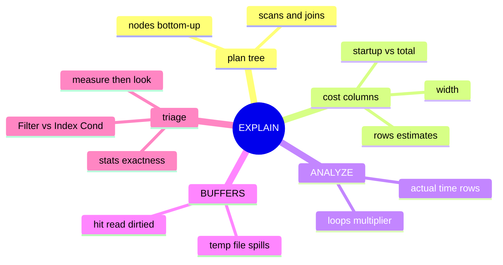

# Module 10: Reading EXPLAIN ANALYZE

Est. study time: 1.3h
Language: en
Description: Reading EXPLAIN output: plan tree, cost vs actual, ANALYZE, BUFFERS, PG17 MEMORY/SERIALIZE options, and a five-step slow-query triage.

## Knowledge Map



---

## Learning Objectives (maps to course CILOs)
- Read a planning tree bottom-up and name each node type — CILO 3
- Interpret cost estimates versus measured reality (startup, total, rows, width) — CILO 3
- Use `EXPLAIN (ANALYZE, BUFFERS)` to separate real I/O issues from bad estimates — CILO 3
- Use PG17 `EXPLAIN (MEMORY)`/`(SERIALIZE)` reporting options — CILO 2
- Spot a `Filter` (no index benefit) versus an `Index Cond` (index was used) — CILO 3
- Run a five-step triage on any slow query — CILO 3

---

## Real-World Example

A dashboard query joins orders to accounts and filters by `order_date`, returns in 8 seconds. A colleague says "we have an index on order_date, why is it slow?" You run `EXPLAIN (ANALYZE, BUFFERS)` and the answer is three lines: the planner chose a Seq Scan, the filter sits under `Filter:` (not `Index Cond:`), and 60,000 buffers were read.

EXPLAIN is the only tool that shows *what the planner chose and why*. This module teaches you to read it like a map.

> **Think**: EXPLAIN (without ANALYZE) never runs your query. So its `rows` number is...?
>
> *Answer: A planner estimate derived from pg_statistic histograms and assumptions. It can be far off reality when stats are stale or columns are correlated. Only EXPLAIN ANALYZE shows measured values.*

---

## Core Content

### The Plan Tree: Read Bottom-Up

Every query becomes a tree of nodes. Data flows upward from leaves (scans) to the top node. Read the output from the deepest, most-indented node upward.

```text
Hash Join  (cost=65.00..1200.30)
  Hash Cond: (o.account_id = a.id)
  -> Seq Scan on orders o
  -> Hash
     -> Seq Scan on accounts a
```

Reading order: accounts is fully read to build a hash; orders is streamed; each order probes the hash. The planner chose the join order too — inner smaller side usually.

### Scan Nodes

| Node | What it means | Change to get it |
|---|---|---|
| Seq Scan | whole table scanned, page by page | small table, or no usable index |
| Index Scan | walk index, fetch each matching heap row | index on the filter column(s) |
| Index Only Scan | index has every needed column, heap skipped | add `INCLUDE` columns |
| Bitmap Index Scan + Bitmap Heap Scan | index produces a page bitmap, pages fetched once in bulk | wide row spreads: many rows per page |
| Tid Scan / Foreign Scan | by ctid; remote/serverless reads | niche |

> **Think**: Bitmap scans sort work by heap page — so what problem do they avoid that a plain Index Scan would hit?
>
> *Answer: A plain Index Scan re-visits the same heap page many times when many index entries point into it. The bitmap deduplicates page fetches: each page is read once, in order, avoiding random I/O.*

### Join Nodes

| Node | Mechanism | Good when |
|---|---|---|
| Nested Loop | per outer row probe inner (index that) | one side tiny |
| Hash Join | build hash of inner, probe with outer | both sides big, no index needed |
| Merge Join | both sides sorted, walk in lockstep | pre-sorted input (index order) |

> **Think**: A Hash Join on two big unindexed tables can be the RIGHT plan. When would you force it anyway?
>
> *Answer: Hash Join needs no index and streams once per side; forcing an index via hints (pg_plan_advice, PG19) is wrong when the hash is already near-optimal and cheap — tuning joins starts with estimates, not fashion.*

> **Cloze**: The index-produces-a-page-bitmap pair is `{Bitmap}` Index Scan + Bitmap Heap Scan.

### Cost Columns (ESTIMATES)

`(cost=startup..total rows=N width=W)`

- **startup**: work before the node emits its first row (build hash, sort prefix).
- **total**: work to produce all rows. Includes children.
- **rows**: estimated rows OUT of the node — this drives the rest of the plan.
- **width**: estimated bytes per output row.

Nothing here is measured. It comes from M labels + pg_statistic. The single most common cause of bad plans is rows being wrong — bad estimate cascades into the wrong join or the wrong scan.

### ANALYZE: Reality

`EXPLAIN ANALYZE` runs the query and prints per node: `actual time`, `actual rows`, `loops`.

```text
Hash Join (cost=... rows=5000) (actual time=123.4..124.1 rows=4,999 loops=1)
```

Compare `rows=` (estimate) to `actual rows=` — a big gap means the planner mis-estimated. The first value real surprise to newcomers:

> **Think**: The printed actual time is a PER-LOOP average, not the total. A node with `loops=10` showed `actual time=0.5..0.7`. What is the real wall-clock contribution?
>
> *Answer: Multiply by loops: roughly 5..7 ms — the number with `loops=1`. Reading "time per loop" instead of "total" is the classic EXPLAIN misread that makes people hunt a phantom.*

### BUFFERS: Where the I/O Really Goes

`EXPLAIN (ANALYZE, BUFFERS)` adds per-node:

- `shared hit`: page found in shared buffers (fast).
- `shared read`: page read from disk (slow, the real bill).
- `shared dirtied/written`: pages you made dirty / wrote back.
- `temp read/written`: context — a Sort or Hash spilled to disk (`work_mem` too small).

If `shared hit` dominates, you are I/O-cache-bound and adding an index may change nothing; if `shared read` dominates, each read is a disk seek.

### PG17 Reporting Options

- `EXPLAIN (MEMORY)` adds per-node optimizer memory accounting (yes/no + used + available) — tells you whether the planner trimmed the plan for fear of memory.
- `EXPLAIN (SERIALIZE)` shows the cost of serializing rows to the client.
- Combine: `EXPLAIN (ANALYZE, BUFFERS, MEMORY)`.

> **Think**: When is MEMORY output diagnostic gold?
>
> *Answer: When a plan looks oddly subdivided — many small Hash/Sort nodes instead of one big one. The optimizer flattened it to fit the planner's memory budget; MEMORY shows exactly how close to the cap it walked.*

### The Five-Step Triage

For any slow query:

1. **Measure** — `EXPLAIN (ANALYZE, BUFFERS)` on the real data.
2. **Find the hot node** — the one with the largest `actual time` at `loops=1`, or the deepest Seq Scan.
3. **Separate Filter vs Index Cond** — a condition under `Filter:` was not pushed to an index; under `Index Cond:` it was. A Seq Scan *with* a Filter on an indexed column means the planner did not believe the index helps.
4. **Fix the reason** — stale stats → `ANALYZE`; correlated columns → extended statistics; missing/weak index → add or reorder one; spill → raise `work_mem` for that query only.
5. **Re-measure** — same step 1, compare. Never trust gut feel two runs apart: query again after a `CHECKPOINT` or on a cold cache to get stable numbers.

> **Predict**: You see `Filter: (order_date >= ...)` AND an index exists on order_date, yet a Seq Scan. Predict what step 4 will reveal.
>
> *Answer: Either the planner's row estimate is low because stats are stale (run ANALYZE), or the query matches a huge fraction of the table so the planner (correctly) prefers seq over random index probes — then "fixing" it means lowering the fraction matched, not forcing the index.*

---

## Spot the Mistake

A teammate "optimizes" a slow report and then reports success:

```text
$a before:  Seq Scan on orders  (actual time=8.2s..8.2s)
$a after:   Index Scan using idx_orders_status  (actual time=0.9s..0.9s)
```

Their conclusion: "the index worked, everything is fixed." What is still unverified?

*Answer: They compared different queries on different tables under different cache states and ignored the estimate gap. Correctly done: same query, EXPLAIN (ANALYZE, BUFFERS) before and after, on a cold-ish cache, checking BOTH the hot node AND that rows-estimate versus actual still agree — an estimate gap now will resurface as a wrong join plan later.*

---

## Key Takeaways (5)
1. Read plans bottom-up; the planner chose EVERY node, and its choice flowed from estimates.
2. `cost`, `rows`, `width` are estimates; only ANALYZE prints reality.
3. Actual times are per-loop averages — multiply by `loops`.
4. `Filter:` means "not index-assisted"; `Index Cond:` means "index was used".
5. Triage in order: measure → find hot node → Filter vs Cond → fix estimates/index → re-measure.

## Common Misconception

"EXPLAIN ANALYZE is free" is false. It executes the query, so `EXPLAIN ANALYZE UPDATE ...` actually updates, and heavy reads run to completion (LIMIT queries stop early). For prod caution, add `EXPLAIN (ANALYZE, BUFFERS)` on a read replica or inside a rolled-back transaction.

## Feynman Explain

Explain to a junior: "Why is there a `rows` number, and why does ANALYZE print a second one?"

*Target: planner works blind from statistics (rows), ANALYZE runs the query and measures (actual rows). If they disagree a lot, trust the measurement and fix whatever made the estimate wrong.*

## Reframe

Argument: "I just add indexes until it is fast; who needs EXPLAIN?" Counter: indexes fix ONE symptom (bad scans); wrong join strategy, spills, and write amplification are invisible without reading plans. The planner makes decisions a human cannot see — the only way to second-guess, or to know an index is dead weight, is reading its reasoning.

## Drill

Scenario: order search shows Seq Scan + Filter on `status`, table 40M rows, status has 3 values. Run triage steps 1-4 and predict why the planner ignores the index. Then run: `learn.sh quiz postgres-sql 10-explain-analyze`.