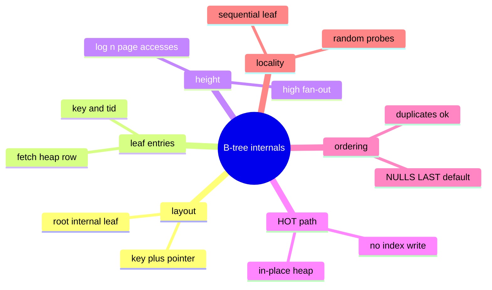

# Module 11: B-tree Index Internals

Est. study time: 1.2h
Language: en
Description: Physical B-tree layout: pages, keys, TIDs, fan-out, height, heap fetch, HOT updates, NULL ordering, fillfactor.

## Knowledge Map

---

## Learning Objectives (maps to course CILOs)
- Describe the physical layout: root / internal / leaf pages holding keys and pointers — CILO 4
- Derive index height from fan-out and row count, and why billion-row lookups read ~4 pages — CILO 4
- Explain why the heap row, not the index, owns MVCC metadata — CILO 4
- Explain HOT updates and how they avoid index write amplification — CILO 4
- State default NULL ordering and unique-index NULL handling — CILO 4
- Reason about random heap fetches defeating an index — CILO 4

---

## Real-World Example

`SELECT order_id, total FROM orders WHERE order_id = 738291` on a 90-million-row table returns in ~0.2 ms. The table is 12 GB, so a scan would take seconds. Under the hood the lookup touches about four 8 KB pages of a B-tree. Understanding the B-tree makes that four-page walk — and when it is *not* enough — obvious.

> **Think**: A binary search tree of 1 billion keys needs ~30 probes. Postgres uses far fewer page reads. What trick shrinks 30 to ~4?
>
> *Answer: Fan-out. Each 8 KB index page holds on the order of a few hundred (key → child-pointer) pairs, so the base of the log is hundreds, not 2. Height = few pages above the leaf, roughly constant 3-4 for any realistic table.*

---

## Core Content

### Layout: Pages of (Key, Pointer) Pairs

A B-tree is a balanced tree of 8 KB "index pages". Three kinds:

- **Root** — top page.
- **Internal** — pairs of (boundary key, child block) guiding the search down.
- **Leaf** — the bottom layer: ordered **key → TID** entries (heap block number + offset). Leaf pages are linked left to right for ordered scans.

`oid2name` not needed: any index `\d idx` shows `btree`. To inspect pages: `pageinspect` (superuser) — exact but rarely necessary.

> **Think**: Leaf pages hold keys; the heap holds the actual row. So an Index Scan does TWO reads per match — what are they?
>
> *Answer: Leaf page read for the key+TID, then the heap page read for the row. Both can be cached, but a scattered hit list means random heap page reads.*

### Index vs Heap: Who Owns What

| Storage | Holds |
|---|---|
| Index page | key columns + TID (+ padding/pointers in internal pages) |
| Heap row | full row columns + MVCC header: xmin, xmax, cmin/cmax, infomask bits |

The index does not store MVCC fields. So visibility checks happen at the heap row — an index probe can find 10 TIDs that turn out to be mostly dead versions, and each requires a heap visit to decide.

> **Think**: An index on an UPDATE-heavy table shows many "dead index entries". Where do they come from?
>
> *Answer: Every non-HOT update inserts a new index entry (new heap TID) and leaves the old entry pointing at the dead version. VACUUM reclaims both the dead heap and index entries. Without vacuum, index bloat grows with update rate.*

### HOT Updates: Skip the Index Write

If an UPDATE changes **no indexed column** and the new version fits in the same page, Postgres uses **HOT** (Heap-Only Tuple): the new version stays in the same heap block, appended to an inline "HOT chain"; no new index entry is made at all. Index traversal just follows the chain.

Consequence: update-heavy workloads become far cheaper than naive "every update touches N indexes". To keep HOT working, leave per-page headroom: `FILLFACTOR` (default 100; 70-90 for hot-update tables) keeps the chain from ballooning across pages.

> **Think**: When does HOT break, forcing a new index entry?
>
> *Answer: When an indexed column is part of the SET (so the key changes), or when the page has no free space for the new version. Then the update does a plain new-TID insert and the index pays.*

### Duplicates and TIDs

Keys are NOT unique in a plain index: duplicate keys are ordered by TID, so the btree remains sorted. Equality returns a run of matching TIDs, then a heap visit per TID. The cost of "15 matches left" is less the index than the 15 heap page fetches.

> **Predict**: An equality query returns 2,000 rows out of a 40M-row table, uniformly scattered. The btree itself obeys a 200-key fan-out. Predict the dominant cost of the plan.
>
> *Answer: 2,000 random heap page reads (plus the short leaf-page walk). That is why the planner pre-aggregates into a Bitmap Heap Scan when the matches spread across many pages — it reads each needed page once.*

### Ordering: NULLs and Defaults

- ASC btree default: `NULLS LAST, DESC default: NULLS FIRST`.
- A btree defines a total order, so `EXPLAIN` shows Index Scan for `ORDER BY` too (despite NULLs), using backward leaf traversal as needed.
- Unique btree: NULLs are **distinct** by default — unlimited NULL rows pass UNIQUE. `UNIQUE NULLS NOT DISTINCT` (PG15+... actually PG15 introduced NULLS NOT DISTINCT) collapses them.

> **Think**: Your report sorts a column ASC and you want NULLs first. What do you write so the index can still serve the sort?
>
> *Answer: `ORDER BY col ASC NULLS FIRST` — matching the index's explicit `NULLS FIRST` clause. If the index and query disagree on NULL placement, the sort cannot use it.*

### Locality and the Index-or-scan Decision

Indexes win on **selectivity**: few matches, avoiding most of the table. They lose when probing many scattered pages or when the match covers most of the table (discriminating low). Factors:

- Point lookup: index does ~4 page reads. Blazing.
- Range/equality matching 40% of rows: random probes ≈ expensive; planner prefers Seq Scan.
- Index Only Scan removes heap visits but still reads leaf pages sequentially.

The ratio that matters: estimated matching rows × heap-page fetch cost vs full scan cost. The planner evaluates exactly that; your job is to keep its estimate accurate (stats) and the matches selective.

> **Think**: Why does `fillfactor < 100` also protect indexes on hot tables, not just heaps?
>
> *Answer: Space in the heap page lets HOT chains stay in-place; less page-extension work for the same-index-page pointer. Practically: fillfactor trades a small storage cost for faster frequent updates — net win on OLTP hot tables.*

> **Cloze**: To keep HOT chains on one page, set `{fillfactor}` below 100 on the hot table.

---

## Spot the Mistake

A colleague tunes an orders table and adds an index on `(status)`. `status` has 4 distinct values; queries filter `status = 'shipped'` on 33% of 40M rows. They report the index "is being ignored". Find the flaw in their expectation.

*Answer: The index is not broken — a 33% match across scattered rows makes random heap fetches costlier than a Seq Scan, so the planner (correctly) declines it. The fix is not to force the index but to reduce the matched fraction: a partial index for the hot subset, or filter combinations that collapse to a smaller result before navigation.*

---

## Key Takeaways (5)
1. A btree index is pages of (key→pointer) with O(small) height thanks to high fan-out.
2. Leaf entries are key+TID; the heap row alone carries MVCC metadata.
3. HOT updates skip index writes when no indexed column changes and room exists.
4. Default ASC order is NULLS LAST; unique indexes treat NULLs as distinct.
5. Index value = selectivity; scattered random heap fetches can make a scan cheaper.

## Common Misconception

"An index makes every query touching that column faster." False — an index whose matches cover most rows loses to a Seq Scan, and an index designed for the wrong column order is pure write overhead. Read the plan; a `Filter:` that ignores your index is the planner's honest verdict.

## Feynman Explain

Explain: "Why does fetching 15 rows via an index sometimes cost more than scanning 40 million?"

*Target: the index narrows WHICH heap pages to fetch but not HOW many; 15 scattered single-row reads can exceed one sequential pass if the match ratio is high. Selectivity decides, and the plan reflects it.*

## Reframe

Argument: "All my queries are point lookups — why not index every column?" Counter: point lookups also demand writes stay cheap; every extra btree costs on INSERT/UPDATE (non-HOT) and bloats under churn. The B-tree is cheap per page, expensive per index. Index the accesses the workload actually performs; the reframe: index design is a write-cost budget, not a read-speed wish list.

## Drill

Scenario: audit table, 2M rows, 20 columns, updated in place daily. Pick fillfactor and the bare index set for `WHERE entity_id = ? ORDER BY created_at DESC LIMIT 100`. Then run: `learn.sh quiz postgres-sql 11-btree-internals`.