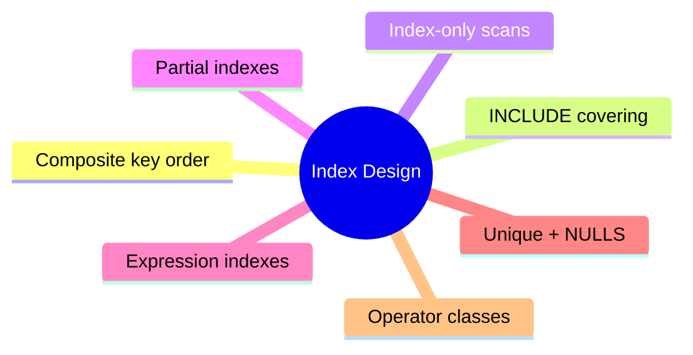

# Module 12: Index Design: Covering, Partial, Expression



## Learning Objectives

- Design composite indexes with the right column order for a query mix
- Use INCLUDE columns to enable index-only scans
- Apply partial and expression indexes to narrow scans and cover functions
- Control uniqueness including NULL handling (NULLS NOT DISTINCT)
- Tune operator classes for sort order and collation

## Real-World Example

Invoice reporting view: `SELECT order_id FROM invoices WHERE customer_id = 42 AND issued BETWEEN '2025-01-01' AND '2025-01-31' ORDER BY issued`. Adding index on `(customer_id, issued)` turns slow 4s scan into 2ms. But adding second index on `(issued, customer_id)` for a different report is wasted space. Design = think in columns of columns, not single columns.

## Composite Index Column Order

B-tree composite lookup needs leading columns to prune. Rule: **equality columns first, then range/order columns**.

Query types:

| Predicate type | Example | Winning index |
|---|---|---|
| equality only | customer_id = 42 | (customer_id) or any single-col |
| equality + range | customer_id = 42 AND issued > d | (customer_id, issued) |
| range on both | amount > 100 AND issued > d | (amount) only useful → pick one |
| order-only | ORDER BY issued | (issued) |

> **Think**: Query filters `a = 1 AND b > 5 AND c = 9`. What column order scans narrowest?
>
> *Answer:* `(a, c, b)` — equality columns (a, c) first (either order), range b last. Range column last; any column after a range is unreachable for pruning.

`(customer_id, issued)` also serves ORDER BY issued within customer — index satisfies both filter and ordering. But `(customer_id, status, issued)` with `WHERE customer_id=42 AND status IN ('a','b') ORDER BY issued` wastes order unless btree is built on issued — range gap breaks continuity.

## INCLUDE for Covering

Index-only scan returns rows straight from index leaf, no heap fetch — needs all requested columns present. `CREATE INDEX ... INCLUDE (col)` adds columns ONLY in leaf, not sorted keys.

```sql
CREATE INDEX idx_cust_include ON orders (customer_id) INCLUDE (status, total);
```

> **Cloze**: `SELECT status, total FROM orders WHERE customer_id = ?` can use an index-{only scan} because INCLUDE loads the payload into index leaves.

> **Predict**: Does adding a column via INCLUDE help sort that column?
>
> *Answer:* No. INCLUDE columns are not keys — they cannot be used for ORDER BY, filtering, or uniqueness. Keys only check the indexed prefix.

Keep INCLUDE small: each column widens leaves → more pages, slower inserts.

## Partial Indexes

Index over subset of rows. `CREATE INDEX idx_open ON invoices (due_date) WHERE status = 'open'`. Benefits: smaller, maintains only matching rows, targeted at hot predicates.

## Spot the Mistake

A colleague adds an index on `(status)` for invoices; `status` has 4 values and `status = 'open'` matches 40% of 40M rows. They report the planner "ignores" their index. Find the flaw.

*Answer: The planner is right — at 40% selectivity the random heap fetches of an index scan beat the sequential scan on cost. Drop the standalone status index; build a partial index on `(due_date) WHERE status = 'open'` so the matched subset is small.*

General rule: never index low-cardinality column alone. Waste.

## Expression Indexes

Index on function or expression. `WHERE upper(email) = 'A@B.COM'` needs `CREATE INDEX ON users (upper(email))`. Planner only uses it when query matches expression textually (must use same expression as written).

```sql
CREATE INDEX idx_orders_ytd ON orders ((created_at >= date_trunc('year', now())));
```

Index on volatile expression invalid; IMMUTABLE functions only allowed.

## Unique Indexes and NULLs

UNIQUE allows multiple NULLs by default (NULL != NULL). Table may hold many `(email=NULL)` rows. To forbid duplicate non-null AND allow one null? Can't directly. But `UNIQUE NULLS NOT DISTINCT`:

```sql
CREATE UNIQUE INDEX uq_email ON users (email) NULLS NOT DISTINCT;
```

This treats all NULLs as equal — at most one NULL row. Use for natural keys where missing value must be unique.

> **Think**: We have `UNIQUE (tenant_id, external_id)`. NULL external_id rows: allowed how many per tenant?
>
> *Answer:* Unlimited — default UNIQUE treats NULLs distinct. Add NULLS NOT DISTINCT if each tenant may have only one row with NULL external_id.

Multi-column UNIQUE where one column NULL: combination considered NULL overall → duplicates allowed. Watch for data traps.

## Operator Classes

Control per-column order and collation inside index. `CREATE INDEX ... ON t (col DESC NULLS FIRST)`, `(col COLLATE "C")`, `(col opclass)` for type-specific behavior. e.g. after defining differences.

Common needs:

- DESC + NULLS LAST for "newest first, oldest nulls last"
- COLLATE "C" for byte-order sort (fast, locale-independent) on short strings

Operator class decides which operators use index: btree default class supports =, <, >, <=, >=. GIN/GiST change the operator menu entirely.

## Key Takeaways

1. Composite index: equality columns before range/order column
2. INCLUDE parked payload in leaves → index-only scans skip heap
3. Partial indexes save space, target hot predicate subsets
4. Expression index must mirror query function textually
5. NULLS NOT DISTINCT enforces singe-NULL uniqueness

## Common Misconception

"Index helps every where clause; add more = safer." Indexes cost write latency + disk; planner picks wrong index on multi-column queries if stats stale. Fewer, wider, query-aligned indexes beat shotgun approach.

## Feynman Explain

Explain an index-only scan: index alone returns all needed columns; planner skip heap fetch; phrase in one sentence.

## Reframe

Critic: "POSTGRES index tuning = voodoo; guessing column order." That dismisses invariants: equality-first rule, INCLUDE, partial-index targeting, planner stats — deterministic when stats accurate.

## Drill

Run: learn.sh quiz postgres-sql 12-index-design