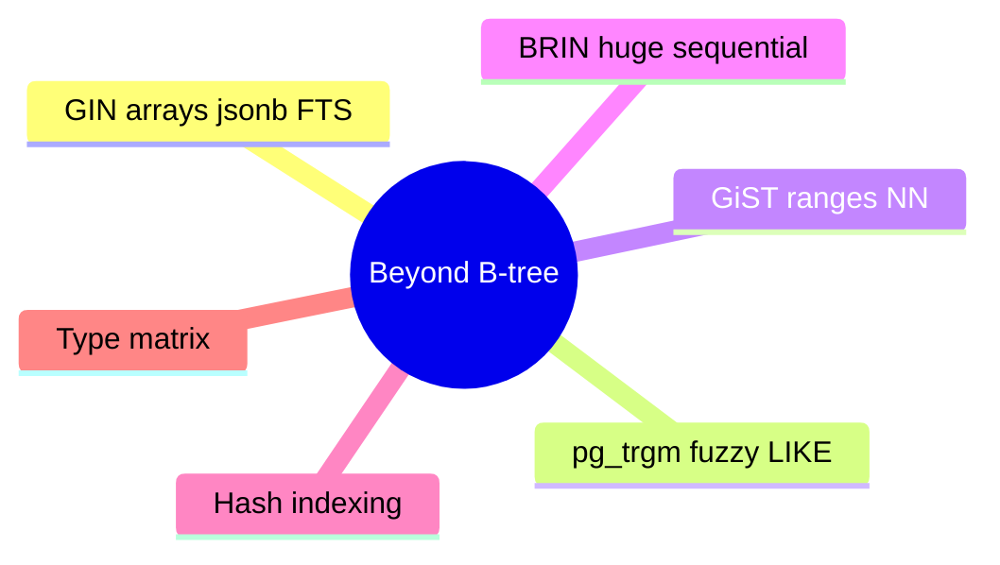

# Module 13: Beyond B-tree: GIN, GiST, BRIN, Hash



## Learning Objectives

- Choose GIN for array membership, jsonb containment, and full-text search
- Use pg_trgm GIN/GiST for fuzzy string match and ILIKE
- Apply GiST for range types and nearest-neighbour ordering
- Apply BRIN for huge sequentially-ordered tables
- Pick the right index type from a workload matrix

## Real-World Example

Inventory table has a `tags text[]` column. Query `WHERE tags @> ARRAY['urgent']` runs a full scan on 20M rows. A GIN index turns it into an index probe, because only GIN understands the "is element contained" operator semantics. B-tree cannot express that operator.

## GIN: Inverted Indexes

GIN = Generalized Inverted Index; maps **element → row** (reverse of b-tree). Built for types whose values expand to multiple keys:

- arrays: `ARRAY['a','b']` indexed per element
- jsonb: each key/path indexed (jsonb_ops default indexes keys; jsonb_path_ops indexes full paths — smaller, but drops `?` key-existence)
- full-text: tsvector per lexeme

```sql
CREATE INDEX idx_tags_gin ON inventory USING gin (tags);
CREATE INDEX idx_doc_gin ON articles USING gin (to_tsvector('english', body));
```

> **Think**: Why is `?` supported by jsonb_ops but NOT jsonb_path_ops?
>
> *Answer:* jsonb_ops stores every key as a posting-entry so key-existence (`?`) can probe it. jsonb_path_ops stores only whole JSONB paths, so it cannot test membership of a lone key without full equals.

GIN slower to build/maintain than b-tree (entry expansion), and querying does a bitmap of posting lists; GIN fast_update=on batches entries.

> **Predict**: Query `WHERE tags @> ARRAY['urgent']` — which index plan node appears?
>
> *Answer:* Bitmap Index Scan on the GIN index, then Bitmap Heap Scan.

## pg_trgm: Fuzzy String Matching

Extension `CREATE EXTENSION pg_trgm;` builds trigram (3-char run) models. Supports `LIKE/ILIKE '%pattern%'` and operators `<%`, `%>`, `<<%`, `%>>`, `<->` similarity distance.

```sql
CREATE INDEX idx_name_trgm ON users USING gin (name gin_trgm_ops);
SELECT * FROM users WHERE name ILIKE '%wagon%';
```

GIN vs GiST for trgm: GIN smaller+fewer false positives for exact substring; GiST supports `<->` nearest-neighbour `ORDER BY name <-> 'wint' LIMIT 10`.

## GiST: Generalized Search Tree

Tree (balanced, not binary) letting type-specific comparisons extend planner operators. Use for:

- range types (int4range, tsrange): containment/overlap `&&`, `@>`, `<<`
- geometric (point, box, polygon): `ORDER BY box <-> p` nearest-neighbour
- exclude constraints: `EXCLUDE USING gist (room WITH =, during WITH &&)` — no double-booking

Printing speed: GiST queries descending by distance index order — efficient KNN.

> **Cloze**: A GiST index supports {nearest-neighbour} ordering (`<->`), returning closest matches first without full sort.

## BRIN: Block Range Index

Summarises ~128 contiguous pages (block range) per entry: min/max of column. Cheap (small disk), fast for huge sorted-ish tables (event logs by timestamp).

```sql
CREATE INDEX idx_logs_brin ON logs USING brin (created_at);
```

Query `WHERE created_at BETWEEN ...` → skips block ranges whose min/max exclude window; reads only matching ranges. Terrible for random-insert/update patterns (every range touched). Choose BRIN for append-only time series.

## Hash Indexes

Equality-only index. Since PG10 crash-safe with WAL logging, faster for pure `=` lookups than b-tree (and smaller). Startup cost: needs CREATE INDEX + ANALYZE bootstrapping; useful niche, rarely beats b-tree in practice.

## Type Selection Matrix

| Workload | Operator | Index |
|---|---|---|
| equality/range/order | =, <, <= | B-tree |
| array element in row | @> array | GIN |
| jsonb containment/paths | @>, @@ | GIN |
| full-text keyword | @@ tsquery | GIN |
| substring/fuzzy | LIKE, ILIKE, % | GIN/GiST trgm |
| range overlap | &&, @> | GiST |
| nearest neighbour | <-> | GiST |
| huge range scan, append-only | >, BETWEEN | BRIN |
| pure equality | = | B-tree (hash niche) |

## Key Takeaways

1. GIN maps element to rows — for expandable types (arrays, jsonb, tsvector)
2. jsonb_ops indexes keys, jsonb_path_ops full paths
3. pg_trgm enables "%pattern%" LIKE via GIN and similarity via GiST
4. GiST does range/containment/nearest-neighbour
5. BRIN suits append-only sequential data

## Common Misconception

"Use GIN everywhere — it's more modern." B-tree still wins for simple equality/range/order; GIN pays build+update cost and only pays off when index semantics (containment, FTS) are needed. Choose the operator, then the type.

## Feynman Explain

Explain in one sentence why B-tree can't serve `tags @> ARRAY['urgent']` but GIN can.

## Reframe

Critic: "Index types are an afterthought; planner picks fine anyway." Not with containment operators: b-tree lacks the operator class entirely, so "planner picks" = sequential scan. Type choice is a hard capability limit.

## Spot the Mistake

A user adds `CREATE INDEX ... USING gin (email)` on an email column to speed `WHERE email = 'x@y.com'` and is surprised the planner uses the old b-tree unique index. Find the error.

*Answer: GIN cannot serve plain equality with btree `=` semantics — email comparisons need the b-tree operator class. GIN exists for expandable elements, not scalars. The b-tree unique index is the right tool.*

## Drill

Run: learn.sh quiz postgres-sql 13-beyond-btree-indexes