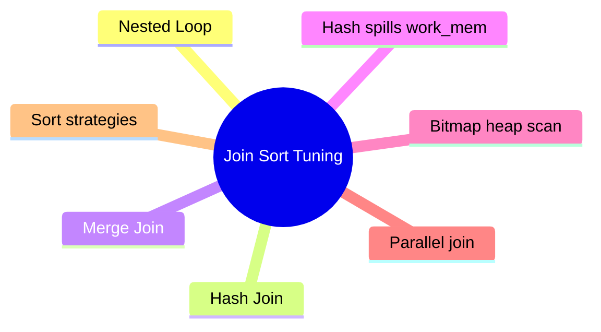

# Module 14: Tuning Joins and Sorts



## Learning Objectives

- Explain when the planner picks nested loop, hash, or merge join
- Diagnose hash spills and tune work_mem
- Recognize bitmap heap scans and their selective small-set use
- Leverage parallelism (PG16 parallel full joins) and incremental sorts
- Tell estimate errors from real problems in plan nodes

## Real-World Example

Two ways to join orders (1M) to customers (100k): `WHERE o.customer_id = c.id AND c.region = 'EU'`. One plan reads all customers, another probes orders by index. Same SQL, different plan — because cost model weighs row estimates per join node. This module makes those plans predictable.

## Join Types

**Nested Loop** (PG default small): for each outer row, probe inner via index. Cost ≈ outer_rows × inner_probe. Best when outer tiny, inner has index. Fallback: unindexed inner = SeqScan per row = disaster.

**Hash Join**: build hash table from smaller input, probe with other. Cost ≈ read both + build hash. No index needed. Choose when join key = and one side small-ish; spills to disk when exceeds work_mem.

**Merge Join**: both inputs pre-sorted on join key, lockstep merge. Needs Sort nodes unless index provides order. Choose when inputs already ordered (indexed) or explicit sort cheap.

> **Think**: Query joins big fact table (2M) to small dim (5k) on an indexed fact column. Which join wins?
>
> *Answer:* Nested Loop — 5k outer rows × index probe on fact hits, no hash build, no sort.

## Join Cost Heuristics

| Outer rows | Inner | Index? | Typical Node |
|---|---|---|---|
| tiny | any | yes on inner | Nested Loop |
| medium | medium | no | Hash Join |
| both sorted | any | yes | Merge Join |

Planner adds per-node switching costs + estimate uncertainty; correct stats matter most.

## Hash Spills and work_mem

Hash Join builds into memory up to work_mem (default 4MB). Overflow → spills batches to temp files (Hash Batches: N). EXPLAIN ANALYZE: `Buffers: temp read=` + `rows=...` high per batch.

```sql
SET work_mem = '128MB';  -- per operation, not per query
```

> **Cloze**: Wrong plans with "temp spilled ... Batches: 16" point at {work_mem} being too low, not at the join itself.

Increases are per operation — a 5-join query may multiply memory; set globally with care.

## Bitmap Heap Scans

For moderate-selectivity filters (2-25%): Bitmap Index Scan builds a page bitmap (dedups overlapping tuples) → Bitmap Heap Scan fetches pages once. Faster than per-row index fetches when matches highly scattered. If selectivity grows further (30%+), seq scan wins.

## Parallelism

PG16+: parallel full joins (hash/nested) — workers can probe in parallel. Control: parallel_setup_cost, parallel_workers. Check `Workers Planned: 4` in plans. For big reporting and scans to many workers. Beware small queries — coordination overhead.

## Sort Strategies

Incremental sort (PG13+) splits input into significant-value groups; uses existing index order + memory cheaper than full sort. Uses when presorted prefix. PG16: enable_presorted_aggregate — sorts only distinct/order-by groups. PG17: more incremental-sort cases. Full Sort still needed for LIMIT k global order — but index on the key removes it.

```sql
SET enable_incremental_sort = off;  -- diagnostic: compare
```

> **Predict**: ORDER BY created_at DESC, id LIMIT 20 with index (created_at DESC, id DESC): what Sort node appears?
>
> *Answer:* None — the index returns rows already ordered; planner reads only 20 entries.

## Estimate Errors vs Real Problems

- Rows mismatch > 10x between actual and estimate → wrong stats (ANALYZE) or wrong assumptions → wrong join choice
- Correct estimates but slow node → real cost (scan/CPU), tune index, not join knobs
- Distinguish: check `actual time` vs `Buffers`; planner cost blindly trusts stats.

## Key Takeaways

1. Nested Loop for small outer + indexed inner; Hash for moderate unindexed; Merge for pre-sorted
2. Hash spills show as `Batches: N` + temp buffers — raise work_mem per op
3. Bitmap scans dedup page reads for scattered mid-selectivity matches
4. PG16 parallelizes full joins; PG13+ incremental sort reuses presorted input
5. Wrong estimates, not wrong engine, cause most crazy plans

## Common Misconception

"Hash join is always fastest." False: for a 20-row outer, nested loop beats building a hash table. Planner picks by estimated cost; hash shines at mid-scales with no index.

## Feynman Explain

Explain why a small-outer query with a big inner index prefers Nested Loop over Hash.

## Reframe

Critic: "Just max work_mem and force hash joins." Memory is shared; a per-op bump times joins plus concurrent sessions can spool the machine. Targeted work_mem for hot queries — not a global max.

## Spot the Mistake

Engineer forces `SET enable_hashjoin = off` on a warehouse query because "hash joins spill too much". After running, the query is slower. Find the flaw.

*Answer: Disabling the join technique fights the planner's cost model instead of fixing the spill. Raise work_mem or prefilter inputs; forcing nested loops over unindexed sides makes rows × rows blow up.*

## Drill

Run: learn.sh quiz postgres-sql 14-tuning-joins-sorts