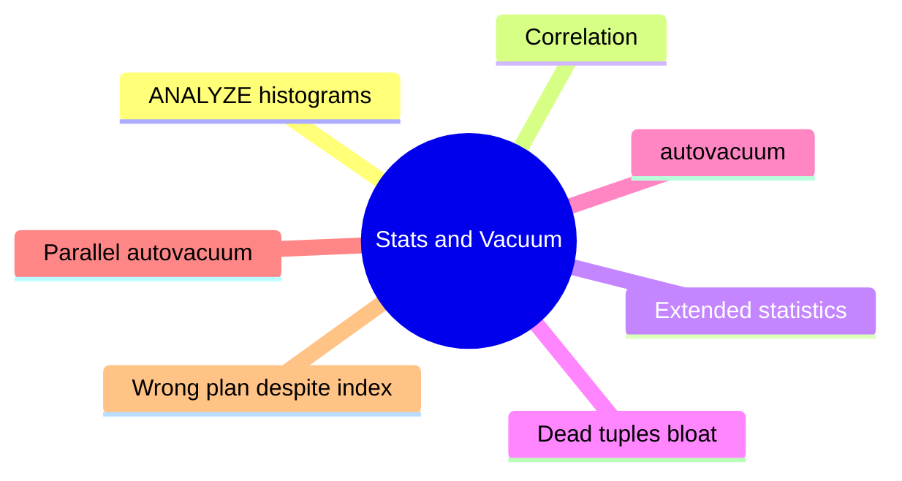

# Module 15: Statistics, Vacuum, and Planner Confidence



## Learning Objectives

- Explain what ANALYZE stores (histograms, nul fract, avg width, distinct)
- Use correlation and extended statistics to fix bad cardinality guesses
- Describe dead tuples, bloat, and HOT vs non-HOT effects
- Configure autovacuum thresholds and tune its behavior
- Diagnose "correct indexes but planner still wrong" cases

## Real-World Example

Query on orders where `WHERE region = 'EU' AND source = 'web'` is planned with a seq scan on 60M rows because the planner assumes `region` and `source` are independent (per-column stats multiply 1/10 × 1/5 = 2% → seq scan chosen as cheaper than fetching 1.2M via index). Reality: EU web orders = 80% of rows. Actual runtime 30s. Extended stats fixes cardinality; lesson: per-column stats lie for correlated columns.

## ANALYZE Storage

`ANALYZE` samples (default 30000 rows, `default_statistics_target`=100 buckets) writing to `pg_statistic`: null_frac, avg_width, n_distinct, histogram_bounds (for range), MCV list (most common values) when skewed. Querying: planner reads reltuples + pg_statistic for each column used.

```sql
ANALYZE orders;                    -- quick sample
ANALYZE (VERBOSE) orders;          -- show estimates
SET default_statistics_target = 200;  -- more buckets, slower analyze
```

> **Think**: Why does a histogram on an interval column with evenly-spread data need no MCV list?
>
> *Answer:* Uniform distribution is well-served by bounds; MCV matters only when common values deviate heavily from the uniform bucketing.

## Correlation

Statistic: physical order of column values vs table order (|corr| 1 = perfectly sorted). Drives planner's estimate of how many pages an index probe touches. High correlation → believes fewer pages → index scans win. Low/zero correlation + wide matches → random fetch cost high → seq scan.

Extends stats (PG10+):

```sql
CREATE STATISTICS s_region_source (dependencies) ON region, source FROM orders;
```

Functional dependencies fix correlated multi-column WHERE overestimates. extensibility: `(ndistinct)` for multi-col distinct, `(mcv)` for most-common combos.

> **Predict**: `CREATE STATISTICS ... (dependencies)` — what does the planner then do better?
>
> *Answer:* It stops multiplying per-column selectivities; joins and scans over correlated columns get realistic row counts.

## Dead Tuples and Bloat

UPDATE/DELETE leaves old row versions dead (xmax visible to snapshot). Unvacuumed, they bloat heap + indexes; queries still scan pages (full) and index entries remain. Counting is linear in dead tuples.

- n_dead_tup / n_live_tup in pg_stat_user_tables
- `SELECT ... n_dead_tup FROM pg_stat_user_tables ORDER BY n_dead_tup DESC LIMIT 10;`
- VACUUM reclaims space; maintain vacuum_cost_limit balancing CPU; per-fillfactor on next insert

HOT updates (no indexed column change + room) avoid new index entry; bloat concentrated in the same page until vacuum.

> **Cloze**: In pg_stat_user_tables, {n_dead_tup} shows the count of old row versions still awaiting vacuum.

## Autovacuum

Default on. Fires when dead tuples ≥ `autovacuum_vacuum_threshold` (default 50) + `autovacuum_vacuum_scale_factor` (0.2) × reltuples. For 10M rows it waits 2M dead before acting → on busy tables lower scale_factor:

```sql
ALTER TABLE orders SET (autovacuum_vacuum_scale_factor = 0.01);
ALTER TABLE orders SET (autovacuum_vacuum_work_mem = ...);
```

PG19: parallel autovacuum — multiple workers against one table on big machines.

## Wrong Plan Despite Indexes

The classic: correct index, correct stats on fine-grained per-column, still wrong: 
1. correlated columns (use extended stats)
2. 1M+ distinct keys and MCV/histogram misses
3. joined filter order: algorithm CBO ignores predicate intersection
4. boolean/index on same low-card -> no gain

Check steps: `EXPLAIN` estimates vs actual; `pg_stats` histogram for col; if correlated → `CREATE STATISTICS`, re-ANALYZE.

## Key Takeaways

1. ANALYZE writes histograms + MCV ± correlation per column
2. Extended stats (dependencies/ndistinct/mcv) fix correlated filters
3. Dead tuples from UPDATE/DELETE need VACUUM; bloat costs reads
4. autovacuum scale_factor default = 20% reltuples; lower for busy tables
5. "Correct index, wrong plan" usually = wrong stats, not wrong index

## Common Misconception

"VACUUM returns disk space to the OS." It reclaims pages for reuse, but without `VACUUM FULL` (or cluster) the file rarely shrinks. Autovacuum by default → bloat in files, monotonic growth possible.

## Feynman Explain

Explain how extended stats (dependencies) undo the seq scan of the EU web orders example in one minute.

## Reframe

Critic: "In Postgres, vacuum is a rounding error — modern hardware forgives bloat." Not true at scan time: full scans still read pages with dead tuples; a 2x-bloated table doubles the seq scan.

## Spot the Mistake

DBA seeing "VACUUM (VERBOSE) ran for 20 minutes" on a busy table complains autovacuum is broken, then drops autovacuum. Find the flaw.

*Answer: Autovacuum correctly responded to a high-dead-tuple table under the default 20% scale factor — the table simply crossed threshold after accumulating activity. Dropping autovacuum guarantees worse bloat. Tune thresholds and run throttled vacuum if it disturbs.*

## Drill

Run: learn.sh quiz postgres-sql 15-statistics-vacuum