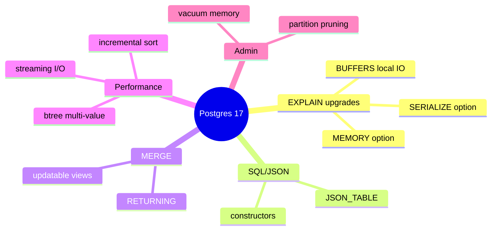

# Module 16: Postgres 17 — the practical upgrades

Est. study time: 1.5h
Language: en

## Knowledge Map



---

## Learning Objectives (maps to course CILOs)
- Use PG17 EXPLAIN reporting options to diagnose big plans and read I/O — serves CILO #4 (read EXPLAIN)
- Write MERGE with RETURNING and JSON_TABLE queries — serves CILO #2 (PG16-18 features)
- Recognise which PG17 performance upgrades affect your OLTP indexes and COPY jobs — serves CILO #5 (MVCC/index choice)

---

## Real-World Example

Your export job that copies 40M rows to a CSV file takes 90 seconds. Your colleague on PG17 says the same job runs in 45. Same hardware. You also have a nightly report that updates a summary table with `MERGE`, and you keep needing a second query afterwards just to read back what changed.

> **Think**: Why would a pure-PG16 improvement copy the same data twice as fast?
>
> *Answer: PG17 added streaming I/O — sequential reads feed rows to the executor without waiting for each block round-trip. Bulk export and scan work that is naturally sequential gets a near-2x speedup with zero query changes.*

---

## Core Content

### Section 1: EXPLAIN reporting upgrades

PG16 EXPLAIN had no way to show how much server memory planning consumed, or how expensive serialising output rows was. PG17 added two options:

```sql
EXPLAIN (MEMORY, VERBOSE) SELECT ...;      -- optimizer memory per plan node
EXPLAIN (SERIALIZE, ANALYZE) SELECT ...;   -- time+memory spent converting rows to output format
```

`EXPLAIN (SERIALIZE)` requires `ANALYZE`. It separates the cost of the query from the cost of shipping rows back to the client. If you see very high serialize time, the bottleneck is output formatting — often a `::jsonb` cast on every row — not the scan or join.

> **Think**: You have a query that returns 2M rows, EXPLAIN ANALYZE shows 1.2s planning plus 3.4s serialise. Where should you look?
>
> *Answer: The 1.2s plan time comes from a huge join search — add missing JOIN filters or use `SET join_collapse_limit`; the 3.4s serialize time means output conversion dominates — consider returning fewer columns or pre-formatting server-side.*

> **Cloze**: "The EXPLAIN option that reports optimizer memory usage per plan node is {MEMORY}."
>
> *Answer: MEMORY*

`EXPLAIN (ANALYZE, BUFFERS)` in PG17 also reports local I/O timing separately: `Local Footprint` lines and per-node `I/O Timings` for local block reads/writes. This matters if you use temp tables or `pg_temp` — you can now see exactly how much of the time is temp-table I/O.

> **Predict**: A query spills to temp files. In PG16 you see `temp read` in BUFFERS but no timing. On PG17, what extra do you see?
>
> *Answer: Per-node local I/O timings — you can measure how many milliseconds of the query the temp spill actually costs, and decide if raising work_mem is worth it.*

### Section 2: SQL/JSON and MERGE

PG17 implemented the `JSON_TABLE` spec — a function you can use in `FROM` that turns a JSON document into a proper relational table of rows and columns, fully typed:

```sql
SELECT e.name, e."dept"
FROM employees,
     JSON_TABLE(employees.profile, '$'
       COLUMNS (name text PATH '$.name',
                dept text PATH '$.department' DEFAULT 'unknown' ON EMPTY)) AS e;
```

Alongside it PG17 shipped SQL/JSON constructor and identity functions: `JSON`, `JSON_OBJECT()`, `JSON_ARRAY()`, `JSON_OBJECTAGG()`, `JSON_ARRAYAGG()`, `JSON_QUERY`, `JSON_VALUE`, `JSON_EXISTS`. This is important because previously the only ways to build JSON out of SQL results were `to_jsonb` and `jsonb_agg`; the new versions are standard SQL you can carry to other databases.

> **Think**: Why does PG17 adding `JSON_TABLE` matter for read-heavy OLTP apps that store hot profile fields as JSONB?
>
> *Answer: You get a standards-based, type-safe way to flatten JSONB into rows inside the query instead of parsing in application code, and the parsed columns can even feed expression indexes for the hot fields.*

MERGE gained two things in PG17:
1. **RETURNING** — you can now return rows written or skipped by a MERGE, which closes the PG15 gap where you needed a separate SELECT after the merge.
2. **Updatable views** — `MERGE INTO` works on a view, which keeps triggers/security logic applied when synchronising external data into a landing view.

```sql
MERGE INTO inventory USING daily_stock s ON inventory.sku = s.sku
WHEN MATCHED THEN UPDATE SET qty = s.qty
WHEN NOT MATCHED THEN INSERT (sku, qty) VALUES (s.sku, s.qty)
RETURNING inventory.sku, inventory.qty;   -- PG17+
```

> **Cloze**: "The new PG17 MERGE clauses are {RETURNING} (return written rows) and support for {updatable views}."
>
> *Answer: RETURNING; updatable views*

> **Spot the Mistake**: "PG17 MERGE RETURNING is the same as INSERT ... ON CONFLICT ... RETURNING — both work everywhere."
> What's wrong?
>
> *Answer: ON CONFLICT's RETURNING has existed since PG9.5 and works on the normal write path; MERGE RETURNING was only added in PG17 and returns the union of actions taken — they are different features and MERGE still has higher locking overhead than ON CONFLICT when you only need key-vs-insert-upsert.*

### Section 3: Under-the-hood performance upgrades

- **Streaming I/O**: sequential scans and COPY read blocks in bulk streams instead of block-at-a-time. Result: ~2x COPY export, big speedups on table scans that were previously I/O bottlenecked. Small OLTP random reads barely change.
- **Btree multi-value search**: an index lookup that walks the btree for equality values can compare several incoming values per node visit. Many-row lookups `WHERE id IN (...)` on an index get faster — you traverse the internal pages fewer times.

> **Think**: Would you expect a single-row `WHERE id = 5` to speed up from multi-value btree search?
>
> *Answer: No. Multi-value search helps when the planner passes several values to the same index probe (IN lists, group joins). Single-value probes touch the same pages as before.*

- **Incremental sort**: PG17 refined it further. If rows arrive partially sorted (e.g. from a matching index prefix or a hash-join probe), incremental sort sorts only the unsorted run and merges, instead of a full re-sort. It was PG13+; PG17 makes more cases pick it and caps its memory.
- **NOT VALID check constraints + partitioning**: previously only not-null constraints were usable for partition pruning (PG16). PG17 lets a NOT VALID check constraint (`CHECK (region IN (...)) NOT VALID`) also prune partitions during planning — you can add the constraint without a long lock and still get pruning.

> **Cloze**: "PG17 lets a {NOT VALID} check constraint be used for partition pruning, avoiding a long write lock."
>
> *Answer: NOT VALID*

- **Vacuum memory management**: VACUUM's memory use is now bounded and tracked per database; runaway vacuum memory (which used to make VACUUM oscillate badly) is replaced by a stable, predictable footprint. `pg_wait_events` view exposes wait-event detail per process.

> **Predict**: Someone argues "PG17 doesn't have any feature I need, I'll stay on PG16 forever." Which PG17 improvements would you cite that need no schema or query changes?
>
> *Answer: Streaming I/O doubles COPY and scan throughput, multi-value btree speeds up IN-list lookups, vacuum is memory-stable, and NOT VALID check constraints can prune partitions. All are free upgrades to existing workloads.*

> **Predict**: An admin adds `CHECK (status IN ('open','closed')) NOT VALID` to a 2TB partitioned table then runs VALIDATE CONSTRAINT expecting it to finish in minutes. What ordering matters?
>
> *Answer: VALIDATE CONSTRAINT still scans the table to prove truth, and that scan takes as long as a full scan takes on 2TB. NOT VALID gives you pruning early and lock-free addition, but validation is a background scan you must budget time for — run it off-peak.*

---

### Why This Matters

Postgres 17 is the flavour you are most likely to be running or about to run. Its upgrades are mostly free — same queries, faster COPY, faster IN-lookups, better EXPLAIN diagnostics. Knowing which features are actually behavioural (MERGE RETURNING, JSON_TABLE) versus automatic (streaming I/O, multi-value search) tells you what to spend upgrade effort on and what arrives silently.

---

## Key Takeaways
- `EXPLAIN (MEMORY)` reports planner memory per node; `(SERIALIZE, ANALYZE)` isolates output-formatting cost.
- `EXPLAIN (ANALYZE, BUFFERS)` on PG17 adds local I/O timings — spills and temp tables become measurable.
- `JSON_TABLE` turns JSON documents into typed relational rows inside `FROM`; the SQL/JSON constructors standardise JSON output.
- MERGE gained RETURNING and updatable views in PG17 — no more post-merge SELECT round trip.
- Streaming I/O and multi-value btree search are automatic speedups; incremental sort and NOT VALID check pruning are planner/administrator leverage.

---

## Common Misconception

"Postgres 17 is incremental — incremental sort is the headline feature." Wrong on both counts. Incremental sort is from PG13; 17 only tunes it. The real PG17 wins are streaming I/O (double COPY speed), JSON_TABLE, and EXPLAIN (MEMORY/SERIALIZE). Upgrading to get 'incremental sort' is upgrading for a feature you already had.

---

## Spot the Mistake

"To get PG17's COPY speedup, I must rewrite my COPY statement with a new option."

What's wrong?

*Answer: Streaming I/O is automatic. You change nothing — the same COPY now streams its reads. The only lever is WHERE/order of the export changing how sequential the access is.*

---

## Feynman Explain
Teach a newcomer: "PG17 makes a copy of a big file run twice as fast without you typing anything new, and it lets you see how much of a slow query was just turning rows into answers. It's like a delivery service that stops opening and closing the box one item at a time, and a receipt that shows how long the wrapping took."

---

## Reframe
Judge: the safest way to pitch PG17 in an OLTP shop is 'free performance + better diagnostics', avoiding hype names. The trade-off: JSON_TABLE and SQL/JSON add surface area to maintain, and rushing an upgrade still risks extension incompatibility. Counterargument to the "upgrade for free wins" position: shared_buffers sizing and I/O pattern still dominate — streaming I/O cannot fix a scan-happy schema. Good schemas get faster; bad schemas get faster at being bad.

---

## Drill
Take the quiz. MCQs test different angles — recall, application, scenario.

Run: `learn.sh quiz postgres-sql 16-postgres-17-features`