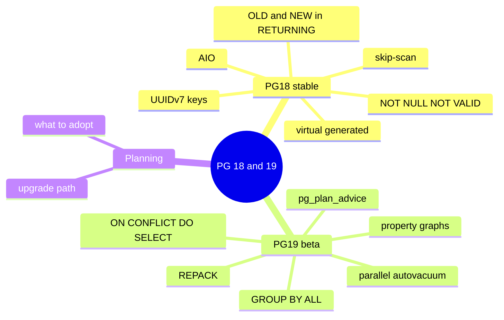

# Module 17: Postgres 18 & 19 — preview and planning

Est. study time: 1.5h
Language: en

## Knowledge Map



---

## Learning Objectives (maps to course CILOs)
- Explain PG18 features that improve OLTP keys and writes (UUIDv7, OLD/NEW, virtual generated columns) — serves CILO #2 (PG16-18 features)
- Identify PG19 headline features (REPACK, ON CONFLICT DO SELECT, GROUP BY ALL) and their use — serves CILO #2
- Judge which preview feature is worth adopting, noting beta vs stable — serves CILO #5 (MVCC/index choice)

---

## Real-World Example

Your app uses UUID primary keys. You discover the index is 3x the size of an integer-keyed table's, and inserts scatter across a random key space, hammering random pages. Meanwhile, your large reference table needs a weekly VACUUM FULL that blocks writes for ten minutes, and every replay of a daily sync into that table first runs `UPDATE` on rows that exist and `INSERT` on the rest.

> **Think**: Random UUIDs cause two separate problems here. Can you name them from earlier modules?
>
> *Answer: Random UUID spreads new keys across index pages, causing random heap writes and index page splits; and they are 16-byte values, so indexes are fatter. VACUUM FULL blocks because it rewrites the table under an exclusive lock; the sync pattern is an upsert fan-out.*

---

## Core Content

### Section 1: PG18 — stable, shippable

**UUIDv7** became the recommended order-preserving key: time-ordered, so new rows append to the end of a B-tree rather than landing at random positions. It keeps index locality (no random page splits, better cache) while still being a UUID. Two helpers arrived with it:

```sql
INSERT INTO t (id) VALUES (uuidv7());      -- time-sortable, 16-byte
SELECT uuid_extract_timestamp(uuidv7());   -- read time back out
```

`uuidv4()` also became a native alias for the old `gen_random_uuid()`. For reports that need insert time, `uuid_extract_timestamp()` reads it straight from the key — no separate `created_at` column needed.

> **Think**: Why does time-ordering reduce page splits, and does it fix random write latency entirely?
>
> *Answer: New keys are roughly monotonic, so new entries land near the current right edge of the index — fewer random index pages touched. It fixes index-write locality, but a hot, single edge of a B-tree can still become a contention point under extreme insert volume — that is usually solved by hashing the first bytes or chunking.*

> **Cloze**: "The UUID version that orders values by time to keep B-tree inserts append-like is {uuidv7}."
>
> *Answer: uuidv7*

**Async I/O (AIO)** — the big PG18 plumbing change. I/O is issued asynchronously so scans and vacuum can have multiple reads in flight, giving 2-3x speedups on scan-heavy and vacuum-heavy workloads on capable hardware. Transparent to queries; you tune nothing except benefiting from it.

**Skip scan** — multicolumn B-tree queries can now skip over leading-column values that don't match, instead of scanning entire ranges. Example: `(region, created_at)` index, query `WHERE created_at > ...` without a region filter will hop over regions rather than read everything — previously this pattern was 'underexploited' and tended to fall back to a scan.

> **Think**: Skip scan sounds like it makes the leading-column requirement obsolete. Is it a replacement for correctly-ordered composite indexes?
>
> *Answer: No. Skip scan is a bounded improvement for missing-prefix lookups — it still reads more than a correctly-ordered index does. Design composite indexes with equality columns first; skip scan is a fallback, not a license to ignore column order.*

**Pg18 also**: virtual generated columns are now the DEFAULT (computed on read, no storage — PG14 had them as STORED-only); `OLD`/`NEW` aliases in RETURNING (`RETURNING OLD.amount`) make trigger-style code easier; `WITHOUT OVERLAPS` temporal constraints enforce non-overlap on time ranges for PK/UNIQUE/FK; a NOT NULL constraint can be added `NOT VALID` then `VALIDATE CONSTRAINT` — taking only `SHARE UPDATE EXCLUSIVE` (no write-blocking); `initdb` now enables data checksums by default (detect corruption on read, tiny overhead).

> **Cloze**: "PG18 allows adding a {NOT NULL} constraint NOT VALID and validating later without a long write lock."
>
> *Answer: NOT NULL*

### Section 2: PG19 — beta highlights

**REPACK / REPACK CONCURRENTLY** — designed to replace VACUUM FULL and CLUSTER. Repacks the table (rewrites rows densely, optionally in index order) so bloat disappears, and the CONCURRENTLY variant does it without blocking heavy writes for the whole run. This matters for the reference-table weekly reorg problem.

> **Think**: Why can REPACK CONCURRENTLY work while VACUUM FULL blocks? What trade-off does concurrent mode pay?
>
> *Answer: It does the work on a shadow copy and only swaps metadata near the end, so long reads/writes continue on the original table. The trade-off: extra disk usage for the copy and more complexity when the swap happens, plus live-update tracking during the run.*

**`INSERT ... ON CONFLICT DO SELECT`** — the atomic get-or-create pattern. When the key exists, it can `DO SELECT ... RETURNING` the existing row instead of performing a no-op update; about 4x faster than the old DO NOTHING / catch-and-retry pattern and no dead tuples from fake updates.

```sql
INSERT INTO accounts (id) VALUES ($1)
ON CONFLICT (id) DO SELECT a.id, a.balance FROM accounts a WHERE a.id = $1;
```

**GROUP BY ALL** — groups by every output column that is not an aggregate — removes the classic "forgot a group-by column" bug by writing the intent once.

**Parallel autovacuum** — a single vacuum can spread multiple tables across workers, tightening the main PG19 auto-maintenance gap.

**pg_plan_advice** — the official plan-hint module. Run `EXPLAIN PLAN_ADVICE` to see suggested hints, then apply them via `SET pg_plan_advice.advice = '...'`; it reports matched / partially matched / not matched so you know if the hint took effect.

**Property graphs (SQL/PGQ)** — match paths in GRAPH via `MATCH` — useful for social, recommendation, and multi-hop relationships without a separate graph database (fixed-depth patterns in beta1).

**Also in PG19**: `COPY ... TO (FORMAT json)` native JSON export; `IGNORE NULLS`/`RESPECT NULLS` for lead/lag/first_value/last_value/nth_value; `UPDATE/DELETE ... FOR PORTION OF` for time-range slicing; JIT off by default; `default_toast_compression = lz4` as default.

> **Cloze**: "The PG19 module that gives official plan hints is {pg_plan_advice} (use EXPLAIN PLAN_ADVICE to generate them)."
>
> *Answer: pg_plan_advice*

> **Spot the Mistake**: "pg_plan_advice's EXPLAIN PLAN_ADVICE is enough — I just paste the advice and it always applies."
> What's wrong?
>
> *Answer: A hint can be inapplicable (missing index, wrong join availability). That is why the module reports matched vs partially matched vs not matched — you must check the feedback line and fix the underlying structure, not assume the hint landed.*

### Section 3: Deciding what to adopt

| Feature | When to adopt | Watch-out |
|---|---|---|
| uuidv7 keys | new tables only; keep old keys readable | existing random UUID columns need a migration to reorder |
| AIO | after upgrading, scan-heavy workloads get it free | needs async-capable I/O paths, may be slower on small tables |
| NOT NULL NOT VALID | adding a NOT NULL to a big table to avoid lock | validation scan still runs |
| OLD/NEW RETURNING | trigger-heavy audit code | changes returned semantics slightly |
| ON CONFLICT DO SELECT | hot 'get-or-create' endpoint | PG19; PG18 users keep DO NOTHING+retry |
| REPACK CONCURRENTLY | bloat-diet on a busy table | extra disk during repack; swap-stage locking |
| GROUP BY ALL | long reports constantly broken by grouping bugs | changes existing behavior only when you opt in |
| property graphs | multi-hop queries | PG19 beta; pattern fixed-depth only |

> **Predict**: A teammate wants to run REPACK CONCURRENTLY every night on a 200GB table. What single constraint in the table makes this plan fail, and what feature from earlier in the course helps?
>
> *Answer: You still need free disk space roughly the table's size on the same tablespace during the repack. Earlier modules' `fillfactor`/index design lessons still apply, but the disk budget is the hard blocker — plan capacity before automating it.*

> **Predict**: A new API endpooint does get-or-create on 50k req/s and currently logs 'no-op update' rows. If you wait for PG19 ON CONFLICT DO SELECT, how does the ending work under the hood differently from now?
>
> *Answer: It reads the existing row straight from the index and returns it without writing a dead tuple, so bloat from repeated upserts disappears and the endpoint becomes roughly 4x cheaper.*

---

### Why This Matters

Between PG18 (stable on most deployments by mid-2026) and PG19 (GA autumn 2026), the choices you make now — key type, generated columns, lock-free constraint additions, bloat remediation — determine the next year of operational friction. Understanding preview features lets you plan schema changes ahead of the release rather than paying through lock-outs later.

---

## Key Takeaways
- PG18: UUIDv7 keeps new-key inserts append-like; AIO speeds scans/vacuum transparently; virtual generated columns are default; NOT NULL NOT VALID avoids write-blocking.
- Skip scan helps missing-leading-prefix btree lookups but is never a substitute for correct column ordering.
- PG19: REPACK CONCURRENTLY replaces VACUUM FULL/CLUSTER; ON CONFLICT DO SELECT cuts dead tuples and is 4x faster for get-or-create.
- GROUP BY ALL kills the forgot-a-column bug; pg_plan_advice applies hints with matched/partial/not-matched feedback.
- Assessment rate: PG18 features are stable and adoptable today; PG19 items are beta and should be rehearsed on dev first.

---

## Common Misconception

"PG18 async I/O means I should redesign my indexes to be more scanny." Wrong — AIO is plumbing. Scans and vacuum get faster; changing your indexing strategy around a beta-era speedup creates speculative complexity. Design indexes for reads and write locality (module 12), and let AIO simply make the scans you already need cheaper.

---

## Spot the Mistake

"New project, let's use uuidv7 for everything including tiny lookup tables."

What's wrong?

*Answer: uuidv7 wins where key ordering and index write locality matter — big, hot PKs. A hundred-row lookup table reading through an index is barely affected, and the 16-byte width still costs. Match the key type to access pattern, not fashion.*

---

## Feynman Explain
Teach a newcomer: "PG18 gives your ids wheels — keys that line up in time so new rows land neatly at the back of the index instead of being stuffed in random drawers. PG19 has a cleaner upender for a messy wardrobe (repack without locking) and an upsert that can just return the sock you already had instead of pretending to fold it."

---

## Reframe
Judge: the safe move is to adopt PG18's non-invasive wins (uuidv7 on new tables, NOT NULL NOT VALID, OLD/NEW in RETURNING) and to trial PG19 features in a staging cluster. Counterargument: skipping PG19 outright for a year is also defensible — parallel autovacuum and REPACK solve real pain, but the beta window is short and your current vacuum tuning may already be fine. The interlock with MVCC bloat (module 15) is the strongest reason to time an upgrade to when bloat is biting.

---

## Drill
Take the quiz. MCQs test different angles — recall, application, scenario.

Run: `learn.sh quiz postgres-sql 17-postgres-18-19-preview`