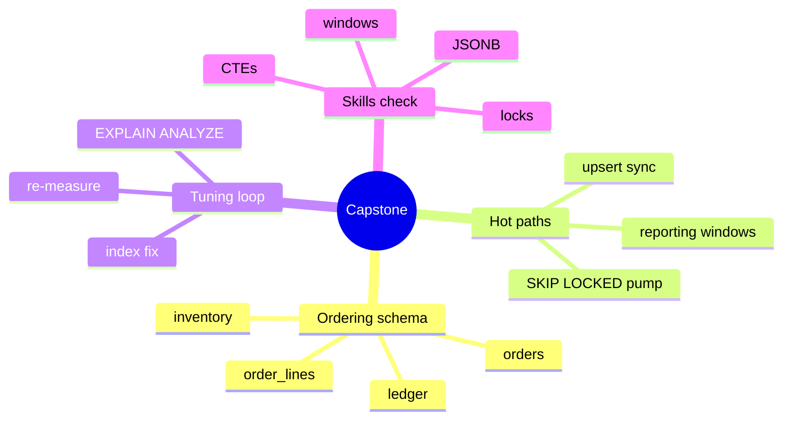

# Module 18: Capstone — orders and ledger app

Est. study time: 1.5h
Language: en

## Knowledge Map



---

## Learning Objectives (maps to course CILOs)
- Design an orders + ledger schema with sensible keys and index hot paths — serves CILO #1 (complex OLTP SQL)
- Write a full reporting SQL mixing CTEs, windows and aggregation — serves CILO #1
- Run an EXPLAIN-driven tuning loop on a failing query end-to-end — serves CILO #4 (EXPLAIN diagnosis)

---

## Real-World Example

You join a team whose order system is living out every module in this course as a bug: a random-UUID order table with a bloated index, a nightly ledger roll-up that times out, a worker pool that double-claims the same job, and a report that returns wrong per-customer totals because a GROUP BY is missing a column.

> **Think**: Which modules' errors are all showing up in one sentence? Match each symptom to the fix you already studied.
>
> *Answer: random UUID keys → module 17 (uuidv7); bloated index → module 15 (HOT/vacuum) and module 11 (fillfactor); timed-out roll-up → module 10 (EXPLAIN) + module 14 (join/sort tuning); double-claimed job → module 09 (SKIP LOCKED); wrong totals → module 05 (grouping) + module 03 (CTEs).*

---

## Core Content

### Section 1: Schema with the lessons baked in

Base tables for a classic order/ledger system:

```sql
CREATE TABLE orders (
  id          uuid PRIMARY KEY DEFAULT uuidv7(),   -- PG18: monotonic inserts
  customer_id uuid NOT NULL
              REFERENCES customers(id),
  status      text NOT NULL DEFAULT 'pending'
              CHECK (status IN ('pending','paid','shipped','cancelled')),
  created_at  timestamptz NOT NULL DEFAULT now()
);
CREATE INDEX orders_customer_created ON orders (customer_id, created_at DESC);

CREATE TABLE order_lines (
  id         bigint GENERATED ALWAYS AS IDENTITY PRIMARY KEY,
  order_id   uuid NOT NULL REFERENCES orders(id),
  sku        text NOT NULL,
  qty        int NOT NULL CHECK (qty > 0),
  unit_price numeric(12,2) NOT NULL
);
CREATE INDEX order_lines_order ON order_lines (order_id);

CREATE TABLE ledger (
  id         bigint GENERATED ALWAYS AS IDENTITY PRIMARY KEY,
  order_id   uuid NOT NULL REFERENCES orders(id),
  kind       text NOT NULL,           -- 'charge' / 'refund'
  amount     numeric(12,2) NOT NULL,
  booked_at  timestamptz NOT NULL DEFAULT now()
);
CREATE INDEX ledger_order ON ledger (order_id);
```

Design notes tying back to earlier modules:
- `uuidv7()` PK keeps inserts append-like (module 17); `identity` columns avoid sequence-managed bookkeeping (module 11).
- Composite `(customer_id, created_at DESC)` covers the two most common lookups: customer's order list, newest first, index-only (module 12).
- Partial index for the worker pool claim path: only 'pending' rows contend (module 12 partial + module 09 SKIP LOCKED).

> **Think**: Why use `bigint identity` for order_lines and ledger but `uuidv7` for orders?
>
> *Answer: Orders live at the edge (client-generated, distributable ids, monotonic — uuidv7). Lines and ledger rows are server-minted, dense, joined-a-lot, and benefit from narrow 8-byte identity keys and cheap index-only counting (module 12).*

### Section 2: The fridge example — reports and hot paths

Order-summary report per customer, mixing windows + FILTER aggregation + a roll-up:

```sql
WITH paid AS (
  SELECT customer_id,
         count(*)                 AS orders_paid,
         sum(amount)              AS revenue,
         count(*) FILTER (WHERE status = 'cancelled') AS cancelled
  FROM orders JOIN ledger ON ledger.order_id = orders.id
  WHERE ledger.kind = 'charge'
  GROUP BY customer_id
)
SELECT customer_id,
       orders_paid,
       revenue,
       cancelled,
       rank() OVER (ORDER BY revenue DESC) AS revenue_rank
FROM paid;
```

Note the `FILTER (WHERE ...)` per-aggregate trick from module 05 and the window ranking from module 04. The `cancelled` count could equally live in a separate aggregate pass; FILTER keeps it one scan.

The worker claim uses SKIP LOCKED from module 09:

```sql
UPDATE orders
SET status = 'processing'
WHERE id = (SELECT id FROM orders
            WHERE status = 'pending'
            ORDER BY created_at
            LIMIT 1
            FOR UPDATE SKIP LOCKED)
RETURNING id;
```

A partial index `(created_at) WHERE status = 'pending'` turns that inner probe into a tiny ordered scan that only touches pending rows.

> **Cloze**: "The claim query uses `FOR UPDATE SKIP {LOCKED}` (module 09) and a partial index `WHERE status = 'pending'` to avoid contending workers."
>
> *Answer: LOCKED*

> **Spot the Mistake**: "I index status alone so the worker query is fast."
> What's wrong?
>
> *Answer: status is near-constant ('paid') — a lone index on it is barely selective and rarely used (module 12). Index the sort/equality columns you actually probe, or use a partial index on pending rows; the planner ignores low-cardinality standalone indexes.*

### Section 3: The tuning loop on one live query

A nightly report aggregates revenue per day per SKU, and on 12M line rows it runs 40s. Loop:

1. **Measure**: `EXPLAIN (ANALYZE, BUFFERS, MEMORY)` — one node dominates actual time; the bottom node shows a `Seq Scan` over all of `order_lines` with `Filter: kind = 'charge'`.
2. **Read**: `Filter:` on the scan means no index was used on that predicate (module 10). Also, the sort for `GROUP BY` shows a standalone `Sort` node — no supporting index.
3. **Fix from evidence**: add composite `(kind, booked_at)` over `ledger` (the scan is on ledger, not order_lines) so the charge rows are the only ones read and the day-order comes from the index; re-run.
4. **Re-measure**: now expect an `Index Scan` or `Index Only Scan` on ledger, the `Sort` node gone (replaced by index order or incremental sort), and total time where the report fits the batch window.

Diagnostic check on the ORDER BY path: if a `Sort` still appears, confirm `enable_incremental_sort` is on (PG13+, improved each release; PG16 added `enable_presorted_aggregate` for presorted-input aggregation) and that the planner is actually seeing the rewritten index order.

> **Predict**: After adding `(kind, booked_at)`, EXPLAIN ANALYZE shows an Index Scan but a new `Sort` for a `DESC` on a different column. What is the planner saying?
>
> *Answer: The query's requested order doesn't match a single index prefix — it needs either DESC on the composite to match, a two-pass sort, or a covering INCLUDE to make the sort cheaper. Re-read the ORDER BY vs index prefix comparison (module 14).*

> **Predict**: The report drops to 4s but the roll-up still writes 1.2M ledger rows every night, and the table has no fillfactor set. Over a year, what shows up on which table?
>
> *Answer: The heap and the ledger_order index bloat from dead tuples (module 15). Set fillfactor ~70-90 on the hot ledger table, keep autovacuum threshold sane (50 + 0.2 x reltuples default), and schedule REPACK CONCURRENTLY (module 17) off-peak instead of VACUUM FULL.*

---

### Why This Matters

Every concept in this course converges on one loop: schema choices determine what indexes can serve; indexes determine what plans the planner can pick; EXPLAIN shows whether the estimates pan out; MVCC and lock behavior determine whether writes stay cheap and workers stay safe. The capstone is about running that loop, not memorising features.

---

## Key Takeaways
- Key choice follows access pattern: uuidv7 at the edge, identity keys for dense server-minted rows, composite indexes over the hot predicates.
- FILTER aggregation and window ranking let one scan answer reports that used to need three scans.
- The claim-worker pattern is UPDATE ... WHERE id = (SELECT ... FOR UPDATE SKIP LOCKED), powered by a partial pending-row index.
- Tuning loop: EXPLAIN ANALYZE + BUFFERS + MEMORY → read the dominant node → fix with evidence → re-measure; never tune blind.
- When stats are stale, the plan lies even with perfect indexes — vacuum/ANALYZE discipline is part of query tuning.

---

## Common Misconception

"I built the perfect composite index, so the query must be fast." The index is necessary but not sufficient: the planner decides from estimates (module 02, module 15). Perfect indexes on a table whose autovacuum is disabled and stats are stale still produce Seq Scans and wrong join orders. Measure, don't assume.

---

## Spot the Mistake

"Two worker pump queries each claim a job: I wrapped claims in a transaction with FOR UPDATE but no SKIP LOCKED. Sometimes a worker hangs."

What's wrong?

*Answer: without SKIP LOCKED, workers queue on the same locked rows; a big pending backlog means each worker waits behind the others and effectively hangs (module 09). SKIP LOCKED plus a per-claim `LIMIT 1` keeps everyone moving.*

---

## Feynman Explain
Teach a newcomer: "An order system is a filing cabinet. Big keys that jump around make you run to far drawers every time (uuidv7 fixes that). If two people reach for the same file, one grabs it and the other opens the next (SKIP LOCKED). And when a report is slow, instead of guessing, pull out the receipt that shows how long every drawer took — fix the slow drawer, not a random one (EXPLAIN)."

---

## Reframe
Judge the loop you now hold: EXPLAIN-driven index design will solve order-system pain predictably, but the loop has assumptions — you need representative data (test on prod-scale samples) and honest measurement (cold cache vs warm). Counterargument: aggressive indexing (many partial/skip-scan/index-only indexes) writes executive costs onto every INSERT; the discipline is to retire indexes that plans no longer use, using pg_stat_user_indexes. Keep the loop, but audit index usage quarterly.

---

## Drill
Take the quiz. MCQs test different angles — recall, application, scenario.

Run: `learn.sh quiz postgres-sql 18-capstone`